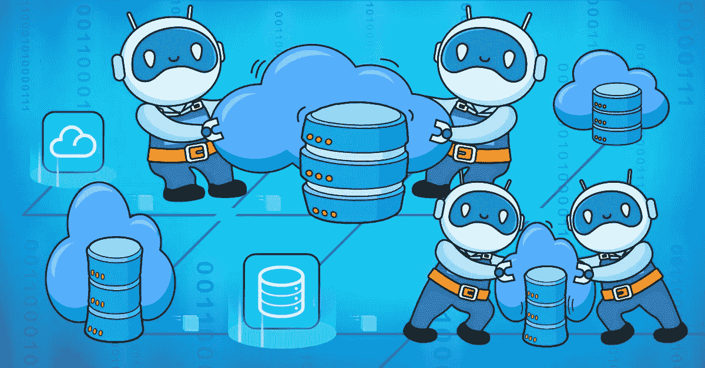
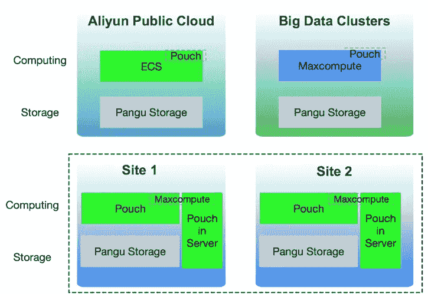
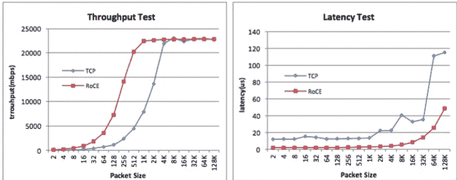

# 拉伸模具:阿里巴巴如何增强数据库灵活性

> 原文：<https://medium.com/hackernoon/stretching-the-mold-how-alibaba-enhances-database-flexibility-78ec97fcfd8a>

## 从混合云灵活性到容器化，支持 11.11 全球购物节需要阿里巴巴数据库团队的不懈创新。

对于阿里巴巴集团来说，准备在一年一度的 11.11 全球购物节期间支持峰值数据流量是一项为期一年的挑战，其核心是对数据库灵活性的需求是一个常年的特征。

作为一个广泛使用的数据存储系统，阿里巴巴的数据库消耗 IO 和 CPU 资源来执行与其 SQL 请求相关的操作，包括物理读取、逻辑读取以及排序和过滤。由于不同服务的 SQL 请求根据它们的执行计划消耗不同的资源，因此对资源规范的需求因服务而异。

To improve overall utilization, Alibaba must abstract resource specifications to enable database instances of different resource demands to better mix and run together on physical machines. Drawing on insights from Alibaba Senior Staff Engineer Chen Changcheng(陈长城), this article explores how the Group has ventured to give its database this all-important flexibility through continuing innovation.

# 实现灵活性的方法

对于阿里巴巴团队来说，技术竞争力取决于将关于资源消耗的想法转化为真正的实践。为此，该公司在 11.11 全球购物节期间努力提高资源灵活性，体现了四个关键理念。

## 公共云标准资源的灵活性

阿里巴巴的一个选择是直接使用阿里云的标准资源来支持推广，然后返还这些资源。虽然这是最直接的方法，但它在业务需求和云资源之间的性能和成本方面存在巨大差距。因为云计算是高度标准化的，这种方法阻止使用定制的机器。

## 协同定位能力

第二种方法涉及现有服务的类别共享协同定位和时间共享协同定位。线下资源用于支持推广，描述类共享共置；线下降级在 11.11 午夜促销开始时进行，之后峰值资源在线返回，描述分时共址。

## 快速上传和下载

快速上传和下载描述了一种方法，该方法涉及在使用云和离线资源时尽可能缩短资源的持有期。

## 碎片资源

在传统思维中，数据库类似于单个大型块，而最后一种方法认为，数据库的单个大型库可以转换为较小的库，然后应用于使用来自其他服务的碎片资源，包括公共云上的资源。

# 对建筑的启示

一般来说，阿里巴巴 11.11 大卖的成本等于持有资源的成本乘以持有周期的时间。缩短持有期的关键是使用相对通用的资源，如云，并通过容器化的方式加快部署；减少离线或仅扩展资源等资源使用的关键是实施将存储和计算分开的体系结构。

为了追求终极灵活性的目标，阿里巴巴的数据库迄今已经历了三个阶段，首先是从混合云灵活性到容器化灵活性，然后是存储和计算分离的灵活性。相应地，其底层架构也经历了从高性能 ECS 混合云模型到容器化混合云模型，最后到存储和计算分离的公共云和离线托管模式的升级。

Evolution of the underlying database architecture

阿里巴巴在增强数据库基础架构方面的趋势是，每年在一个单元上测试一个新的架构，然后在第二年在整个网络中实施。对此的一个类比是挖一个坑，让团队跳进去，然后一起爬出来，再把它填回去。尽管这种方法存在固有的压力，但架构的每一次发展都成功地使协同定位变得更快、更灵活。

# 建立混合云灵活性

在 2015 年之前，阿里巴巴用一种叫做手动灵活性的方法来处理 11.11 销售。这实际上包括临时借用机器进行推广，例如使用云类型的机器，然后再归还给云。2015 年底，阿里巴巴的李锦在一个名为“挑战不可能”的聚会上询问数据库是否可以在 ECS(弹性计算服务)上运行。本着这个主题的精神，天宇和他的同事张睿当场决定尝试这种方法。

由于认为在虚拟机上运行数据库的最大消耗在于 IO 和网络的虚拟化，因此天宇和张需要一种接近机器本身性能并渗透虚拟化的方法。此时，网络用户模式技术 DPDK 相对成熟，但如何使用它来实现高效率，以及是否可以将它卸载到硬件来进行计算的问题提出了另一个问题。文件系统 IO 的用户模式链接采用了英特尔的 SPDK 解决方案，该解决方案仍在接受主要制造商的验证，尚未投入大规模应用。从这些情况开始，该项目被称为高性能 ECS，通过与阿里巴巴的 ECS 团队合作，天宇和张能够实现与本地磁盘相比性能损失不到 10%的最坏情况。

2016 年，高性能 ECS 项目通过了阿里巴巴集团的日常验证，并从 2017 年起为 11.11 销售部署了灵活的云资源。除了创建高性能 ECS 产品，该项目更重要的是构建了网络和文件 IO 的纯用户模式链接技术。这标志着一个技术转折点，并为阿里巴巴后续存储和计算分离的产品的高性能突破奠定了基础。

# 提高资源效率:集装箱化

随着独立服务器能力的提高，阿里巴巴的数据库早在 2011 年就开始使用单机多实例解决方案。这利用了独立资源，通过 Cgroup 和文件系统目录和端口之间的部署隔离来支持单个机器上的多个实例。然而，它也提出了偶尔的内存 OOM、IO 竞争、多租户共址安全问题以及数据库中主机器和备份机器的一致性的问题。

随着独立部署密度的增加，Docker 社区也开始发展起来。尽管 Docker 还不成熟，但它依赖 Cgroups 进行资源隔离，因此无法解决 Cgroup IO 竞争或 OOM 问题，但它确实试图通过资源隔离和名称空间隔离的结合来为资源规范和部署做出新的定义。

鉴于这些发展，阿里巴巴认识到集装箱化的几个优势。首先，容器化提供了标准化的规范、数据库和机器模型解耦，并且不要求活动和备用机器对称，这一起为大规模操作和维护带来了更高的效率。第二，容器化的名称空间隔离带来了协同定位能力，允许统一的资源池。它进一步提供了对不同数据库类型和版本的协同定位的支持，并使 DB 能够拥有与其他类型的应用程序相同的协同定位条件。

2015 年阿里巴巴的数据库开始验证集装箱化技术，到 2016 年它被广泛应用于日常场景。该集团设定了一个目标，即将其电子商务提供商的交易部门完全集装箱化，以支持 2016 年 11.11 销售，这将占总交易量的 30%左右。在成功实现这一点后，阿里巴巴将 2017 年对数据库的目标转向了全网容器化。目前，整个网络的集装箱化率接近 100%。

比提高部署灵活性的效率更重要的是，容器化提供了底层资源之间差异的透明度。在通过自动迁移提高利用率的智能调度开始之前，容器化引入的机器多路复用和多版本协同定位将利用率提高了 10 个百分点，资源池和标准部署模板的统一共同提高了资源交付的效率。

容器化完成了各种底层资源的抽象，规范标准化，镜像部署带来了部署上的便利。基于数据库 PaaS 和统一调度层的合作，数据库趋向于变得越来越灵活；只要一个地方有资源，就适合在里面运行数据库。

# 走向存储和计算分离的架构

尽管高性能 ECS 和集装箱化部署有其优势，但仍存在某些缺点，限制了它们在 11.11 销售中的可靠性。首先，数据库的灵活性需要数据迁移，将数据移动到 ECS 是一项耗时的任务；第二，灵活性的规模非常大，当它超过公共云销售周期时，将导致持有成本增加。

面对对更快、更灵活的需求，阿里巴巴需要考虑对其已经建立的模式进行潜在的调整。随着 2016 年调度的发展，许多人考虑将机器变成无盘，并将存储和计算分开，以提高调度效率。然而，数据库中存储和计算的分离产生了相当大的争议。

对于天宇团队中的许多人来说，数据库的无共享分布式扩展是一个关键问题。许多人想知道存储计算分离是否会将数据库带回到 IOE 时代，或者数据库本身会有这种存储计算分离是否有意义，因为如果 IDC 是一个数据中心，那么应用程序就是一个计算，而数据库就是存储。尽管数据有主副本和备份副本，但存储和计算的分离会将副本数量增加到三份。这就提出了一个问题:池化存储群集容量是否能平衡额外拷贝的成本。

面对这些困境，天宇开始在 11.11 场景中测量存储和计算分离架构的输入和输出。在这种情况下，业务需求将计算能力需求提高了 10 倍，以支持峰值压力。但是，由于磁盘存储的是长期数据，峰值数据量不会大大超过总量。因此，不需要扩展磁盘的容量。

过去，活动和备份体系结构运行在本地磁盘上，在那里无法进行计算，而存储是单独扩展的。11.11 销售指标越高，增加的机器越多，这增加了成本，因为磁盘产生了标准数据库机器的主要成本。在将计算和存储分开的过程中，测量结果显示，在日常压力环境下，成本高于本地磁盘的成本，但当压力增加时，存储和计算分开的模式会增加计算，但不会增加成本。其原因是，当存储群集被池化时，容量和性能都被池化，在这种情况下，IO 的任何高负载实例都被分散，以供整个群集共享。此外，磁盘吞吐量 IOPS 被重复使用，这意味着没有必要扩展性能。鉴于上述情况，这种方法具有显著的成本优势。

传统思维倾向于关注池化存储集群容量的优势，但对于 11.11 销售，阿里巴巴使用更多的性能池来打破独立瓶颈。因此，为了将所有单位的电子商务和存储计算分开，该集团在不同的位置建立了多个活动数据中心，而所有服务的其余部分继续使用本地磁盘作为特定城市内灾难恢复的目标架构。

在推进这一概念的过程中，天宇的团队需要一种方法来判断所提议架构的可行性。数字表明，SSD 磁盘的读写响应时间约为 100–200 毫秒，而 16k 网络传输发生在 10 微秒内。因此，尽管存储-计算分离将网络交互增加了两到三倍，再加上存储软件本身的消耗，仍有可能在 500 微秒内实现读写延迟。在数据库实例压力测试中，团队发现随着并发的增加，存储集群的在线 QPS 水位更大，这证明了性能池打破了单机瓶颈，提高了吞吐量。

2017 年，数据库团队开始验证存储和计算的分离。基于 25G 的 TCP 网络实现了存储和计算分离的部署，并承载了当年 10%的流量。尽管基于分布式存储实现了 700 微秒的响应时间，但团队遇到了内核状态和软件堆栈的高消耗率。出于这个原因，他们的工作目标是 X-DB 上的慢速 IO 优化，特别关注磁盘日志写入的优化，并支持原子写操作来消除双写缓冲区并提高吞吐量。

在此过程中，该团队建立了存储调度系统，并将其作为统一调度的组件，服务于阿里巴巴集团的业务。由于对现有架构的性能不满意，他们随后构建了一些技术，如 X-DB 上的慢速 IO 优化、存储和计算分离的跨网络 IO 路径以及存储资源调度。凭借这些技术，加上阿里巴巴 RDMA 网络架构的开发，数据库团队与阿里巴巴盘古团队联手，在 2017 年下半年致力于端到端的全用户存储-计算分离解决方案。

# 实施完全用户模式 IO 链接存储和计算分离的架构

从数据库软件 X-DB 的 IO 调用开始，数据库团队利用自主开发的用户态文件系统 DBFS 来实现新的架构。盘古是阿里云开发的高可靠、高可用、高性能的分布式文件系统；DBFS 使用盘古的用户模式客户端直接通过 RDMA 网络访问后端盘古分布式文件系统。整个 IO 链接完全绕过了内核堆栈，由于 DBFS 绕过了内核文件系统，它自然会绕过页面缓存。出于这个原因，DBFS 为数据库场景实现了一个更简洁高效的 BufferIO 机制。

因为 IO 是通过网络远程访问的，所以 RDMA 扮演着重要的角色。在下面的图表中，显示了不同数据包大小的 RDMA 和 TCP 网络之间的延迟比较。

除了在延迟上的优势，RDMA 还可以有效控制长尾 IO 的尾部延迟，对于涉及多个 IO 的数据库请求，可以为用户请求提供更高效的响应时间保证。RDMA 技术的应用是大规模数据库存储-计算分离的前提。数据测量表明，DBFS+RDMA 链路的延迟已经达到与 Ext4+本地磁盘相同的水平。

今年，阿里巴巴首次大规模部署 RDMA，天宇形容这给人一种如履薄冰的感觉。经过多次测试和演练，RDMA 的支持监控和运维系统获准建设，使天宇团队能够在不到一分钟的时间内识别服务器网卡或交换机的网络端口故障并触发警报，以快速隔离故障，支持快速切断服务器流量，并支持集群或独立网络从 RDMA 降级切换到 TCP。在直通演练中，DBFS 指出，与 TCP 相比，RDMA 链路的写入延迟降低了 1/2。在全链路压力测试中，基于 RDMA 的技术保证在吞吐量约为 2 GB 的单数据库实例中，磁盘响应时间稳定在 500 微秒左右，没有故障。

为了同时支持 RDMA、EC 压缩、快照和其他功能，盘古对分布式存储进行了广泛的优化，特别是关于写 IO 的优化，以及 RDMA/TCP 切割、故障隔离和其他稳定性相关的工作。作为阿里巴巴存储系统的底盘，其在线服务的规模非常大。

# 电子秤应用面临的挑战

除了上述发展，阿里巴巴在规模应用方面也遇到了一些问题。

首先，对于容器的网络虚拟化来说，Bridge 和 RDMA 自然是不兼容的。这是因为容器使用桥接网络模式来分配 IP，而 RDMA 应用程序使用内核模式。因此，要应用 RDMA，必须使用主机网络模式进行容器化，必须采取主机+ X-DB + DBFS + RDMA +盘古存储等全用户模式链路。

第二，对于公有云环境，阿里巴巴使用 VPC 形成混合云环境，应用通过 VPC 访问数据库，数据库使用 RDMA 的物理 IP 访问盘古和 X-DB 的内部 X-Paxos。这是一个复杂而有效的解决方案，得益于 DBPaaS 管理的快速迭代和集装箱化资源调度的灵活性，以及它们在面对变化时的快速实施和稳步推进。

# 当前展望

在 2018 年初，天宇的团队为今年的 11.11 全球购物节设置了一个支持模式，例如，对于不同位置的活动数据中心，计算被扩展到大数据离线资源。对于单位数据中心，计算扩展到公有云资源，不移动数据进行弹性扩展，快速管理上传下载。今年，DB 致力于完成资源调整，实现电子商务网站架构的存储和计算分离升级，并通过灵活部署 X-DB 远程多副本架构实现销售活动的灵活性。

基于其底层盘古分布式存储，这种灵活性不需要数据迁移，只需要安装磁盘。数据库可以像应用程序一样快速灵活，这样一个集群可以在 10 分钟内完成弹性扩展。同时，在全链路压力测试中，可以对更大的规格进行灵活处理，同时快速给有性能瓶颈的服务施加压力。凭借快速灵活性，为 2018 年 11.11 销售计划的所有数据库站点的容量扩展在三天内完成，这是存储和计算分离架构实现的以前不可能的壮举。

目前，天宇的团队和阿里巴巴正在努力将已经实现的灵活性常规化。通过数据预测，可以自动触发弹性扩展，使集团更进一步，使由单机容量问题引起的故障成为历史。展望未来，阿里巴巴将在智能方向上开发其平台，建立一个强大、快速、灵活的底层架构，为其数据库提供这些可能性。

**(Original article by Chen Changcheng 陈长城)**

# 阿里巴巴科技

关于阿里巴巴最新技术的第一手深度资料→脸书: [**“阿里巴巴科技”**](http://www.facebook.com/AlibabaTechnology) 。推特: [**【阿里巴巴技术】**](https://twitter.com/AliTech2017) 。