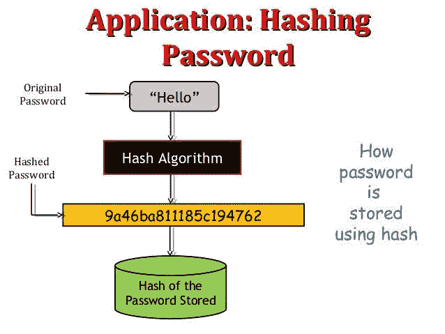
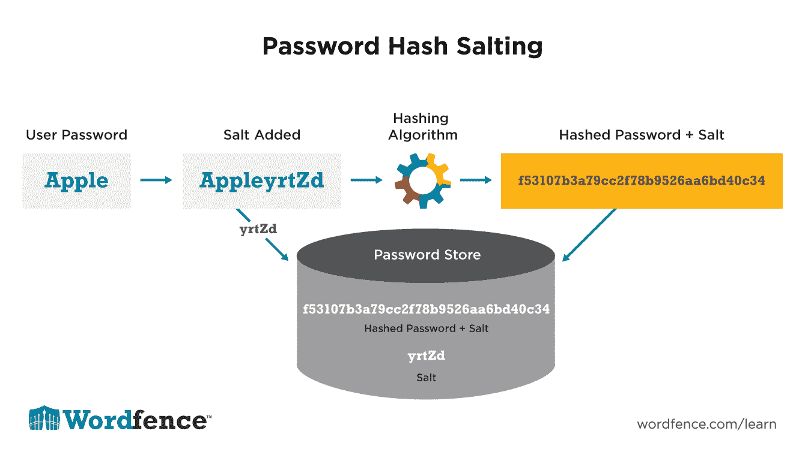
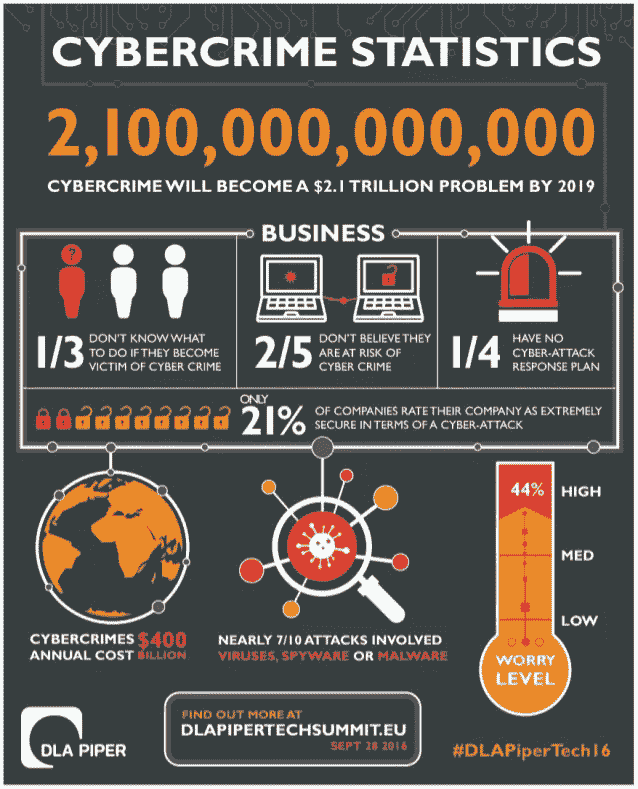
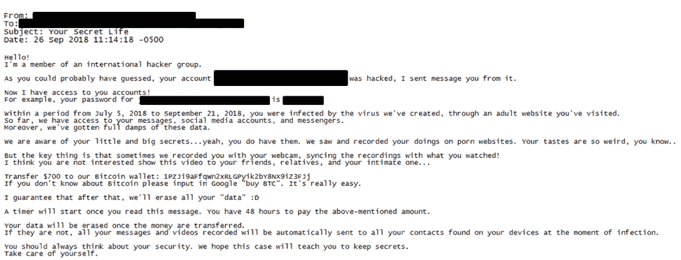

# 强密码生成和黑客攻击:关于保护您的在线数据的提示

> 原文：<https://medium.com/hackernoon/strong-password-dilemma-tips-on-securing-your-data-online-f853784f2bdf>

**2019 年密码问题**

今年早些时候，《连线》杂志发表了一篇文章，标题惊人: [*“黑客正在传播 22 亿条记录。”*](https://www.wired.com/story/collection-leak-usernames-passwords-billions/) 网络安全专家分析了该包裹的内容，发现其中充满了随机的用户名和密码组合，这些组合是从以前多次数据泄露中获得的。这些机密信息存储在名为“集合#1”和“集合# 2–5”的两个包中，包含超过 22 亿个独特的组合。所有这些都在各种黑客论坛上展示和免费提供。

[https://www.pymnts.com/news/security-and-risk/2016/password-hacks-push-big-changes-on-big-tech/](https://www.pymnts.com/news/security-and-risk/2016/password-hacks-push-big-changes-on-big-tech/) image: password-hacking.jpg

几乎不可能估计这次泄漏造成的损失(目前的和即将发生的)，但在本文中，我将解释更广泛的可能结果，并给出一些如何最大限度地提高个人在线安全的提示。

**什么是密码黑客？**

为了理解为什么强密码或好的密码管理器是必要的，有必要看一看密码是如何生成、存储和可能被黑客攻击的。让我们以脸书为例:每当用户注册他们的服务时，他或她提供一个用户名和密码来匹配。假设选择并使用了一个弱密码“test123 ”,该密码将存储在脸书服务器上，并链接到正在讨论的用户名，但它不会(或不应该)以文本格式存储。“test123”密码将经过一个称为哈希的过程，看起来像这样:“cc 03e 747 a 6 afbbcbf 8 be 7668 ACF ebee 5”(MD5 哈希技术)

[https://www.passmoz.com/where-windows-password-stored.html](https://www.passmoz.com/where-windows-password-stored.html) image: password-hash.jpg

哈希是一种单向加密函数。与主要用于安全在线交换信息的加密不同，密码哈希不是为了解密而产生的。这意味着，如果黑客获得了散列数据单元，他或她将无法使用任何解密密钥将散列过程还原为其文本形式。

[https://www.wordfence.com/learn/how-passwords-work-and-cracking-passwords/](https://www.wordfence.com/learn/how-passwords-work-and-cracking-passwords/) image: Hash-plus-Salt.png

此外，通过在散列密码之前将随机数据串应用于密码，可以应用附加的“加盐”过程来加强该功能，使得对其原始形式的反转几乎不可能。

然而，这并不意味着没有解决方法。散列将总是从相同的输入产生相同的值，因此可以成功地应用暴力破解方法。现在，黑客不再为给定的用户名尝试每一种可能的密码组合，而是获取大量泄露的哈希数据库。在那之后，一种算法被启动，为随机密码串产生散列，例如:“teet”被散列并与获得的数据库进行比较——运气不好。然后是“test”，然后是“test111”，过了一段时间后，“test123”被散列，黑客得到警告说有匹配。这取决于使用什么散列和加盐技术，但无论如何，这是一个接近帐户接管的步骤。

英国国家网络安全中心[进行了一项研究](https://www.bbc.com/news/technology-47974583)，揭示密码“123456”被使用超过 2300 万次。其他流行的密码，如“qwerty”或简单的“password ”,也名列前茅。

[https://www.sentinelone.com/blog/7-signs-weak-password/](https://www.sentinelone.com/blog/7-signs-weak-password/) image: hash-top-5-historical-1024x286.png

因此，只需一次就可以获得散列形式的“123456 ”,然后在手边的数据库中搜索，将这个散列与使用相同密码的不同用户联系起来。最大的问题是，许多公司认为散列密码就足够了，所以如果他们的安全系统被攻破——一系列用户名(以原始文本形式存储)、电子邮件和其他敏感数据都与特定的散列值相关联。因此，如果您使用的是弱密码，很可能它的散列形式已经在某个地方泄露了，您就有危险了。

根据 NCSC 的研究，很多人使用同一个密码多次登录，这使得黑客的工作变得更加容易。例如，LinkedIn 在 2012 年泄露了 1.77 亿个用户账户及其密码哈希。知道了注册时使用的电子邮件，黑客就可以在列表中查找使用“qwerty”或“123456”作为密码的用户，然后尝试使用相同的密码来访问有问题的电子邮件。这就是为什么不同的服务不使用相同的密码是至关重要的。Gmail 或 Twitter 可能非常难以入侵，但你注册的在线赌场平台或折扣页面的安全性可能要弱得多，如果它们泄露了你在其他地方使用过的凭据，那么所有其他平台都会自动面临风险。

**潜在危险:两种流行的黑客手段**

网络犯罪和网络安全的历史是一部仍在发展的数字世界的历史。从时间表来看，在世纪之交，网络犯罪出现了大规模增长，大约是在互联网泡沫破灭的时候。销售和金融交易向在线平台的转变发生得如此之快，以至于安全实践被远远抛在了后面。脸书正遭受频繁的数据泄露，泄露了数百万份机密凭据，MySpace 泄露了 1.77 亿份密码，LinkedIn 泄露了 11 亿份印度公民的机密信息，包括地址和照片。

[https://www.slideshare.net/DLAPiper/how-secure-is-your-business-against-cybercrime](https://www.slideshare.net/DLAPiper/how-secure-is-your-business-against-cybercrime)

所有这些信息可以而且将会被用于最流行的黑客手段之一——网络钓鱼。网络钓鱼是一个术语，用来描述黑客试图通过发送欺诈性电子邮件来勒索(通常)一定金额的过程，还记得著名的[尼日利亚王子案](https://en.wikipedia.org/wiki/Advance-fee_scam)吗？然而，这些年来，互联网用户变得越来越聪明，这些天有人很难相信他们收到了一封来自尼日利亚王子的电子邮件，他愿意分享他的财富，只需预付一小笔钱。

不幸的是，黑客正在不断开发新的网络钓鱼方法，他们现在发送的电子邮件非常有说服力。这与社交网络和数据泄露的兴起有很大关系。黑客们不再盲目瞄准，他们现在有足够的信息来构造一封有说服力的信。如果你有一个公开的脸书个人资料，他们可能会看到你去过的学校，地址和电话号码，你去过的地方等等。但是最害怕的是值得信赖的机密信息。如果黑客通过上述方法获得散列密码，并设法将其链接到文本格式，进而链接到您的电子邮件地址，您可能会收到一封非常可信的电子邮件。

[https://www.cisecurity.org/blog/sextortion-hoax-scams-updated-tactics/](https://www.cisecurity.org/blog/sextortion-hoax-scams-updated-tactics/) image: sextortion-email.png

不用说，收到一封带有真实密码的勒索电子邮件是很可怕的，你以前用过这个密码。你可能已经不再使用它了，但是这样的电子邮件听起来确实很有说服力，而且许多用户确实会立即做出反应，汇去所需的金额。最新的趋势是上图所示的色情电子邮件。黑客使用从泄露的数据库中获得的真实用户名和密码，并尽可能对其进行个性化处理，以使您相信其真实性。而在现实中，它可能是由一个弱人工智能算法生成的，并发送给成千上万的用户。

另一种新出现的做法是凭据填充。这一原则简单易行，如果许多在线平台及时投资于网络安全，这是不可能的。以前，黑客会花费数不清的时间强行破解密码，这非常耗时，而且很少能提供足够的信息来弥补这一努力。凭据填充不是蛮力或猜测。这是一个获取大量泄露凭据的数据库，然后前往各种在线平台尝试登录的过程。在去年脸书大规模泄密事件之后，随着本文开头提到的数据包的出现，Gmail 账户登录失败的情况也随之增加。一个安全的假设是，这是由黑客执行凭据填充攻击，检查他们手中的泄露数据的有效性造成的。

**健康密码管理的 6 个技巧**

**1。** **使用强密码。**网民往往会忽略这一点，因为临时用户不知道密码哈希是如何工作的。通过使用“qwerty”，甚至没有人需要破解散列，最流行的密码的散列形式是广泛可用的。然后，用户往往会想到简单的密码，如名字和姓氏以及几个数字。这也是一种不好的做法，因为一旦黑客有了无法识别的散列字符串，他们就会试图通过检查名字和姓氏的散列来重新创建它，例如:“JonDoe”将被散列，然后是“JonDoe00”，然后是“JonDoe01”，等等。如果密码是“J0nD_e1@#/eEa~”，那么黑客将不得不经历数百万次随机密码组合，这实际上需要数千年才能产生相应的哈希值。强密码通常由 12 个或更多的符号长度、大/小写字母、数字和符号组成。

**2。** **不要两次使用同一个密码。**如果你的密码以这样或那样的方式被获取并链接到你在任何平台上泄露的电子邮件地址，那么你可以肯定它会试图访问你的电子邮件，或者用来访问任何其他平台。例如，ArmorGames.com 泄露了电子邮件和密码，可以肯定他们的用户也使用 Steam 或 Humble Bundle。如果你在两个平台上使用了相同的电子邮件和密码，那么帐户被接管是可能的，即使你已经很久没有使用过 ArmorGames，并且已经完全忘记了。

**3。** **在**[**https://haveibeenpwned.com**](https://haveibeenpwned.com)上查看您的电子邮件地址。这是一个巨大的已知漏洞库，在输入你的电子邮件地址后，它会显示你是否与任何漏洞有关。如果有，更改泄露的密码应该是当务之急。

**4。** **使用随机密码生成器。**我用的是强密码生成器 Chrome 扩展。这是一个易于使用的扩展，允许您选择密码的长度，使用小写/大写字母，符号，数字等能力。

**5。** **启用双因素认证(2FA)。这一点非常重要，所有网络安全专业人士都建议这样做。没有人在网上是绝对安全的，你的密码可能会被泄露，这是一个安全的假设，尤其是如果你是一个活跃的在线角色。2FA 是一个相当大的障碍，在破解哈希和/或填充凭据的漫长过程之后，需要访问用户的移动电话以获得第二个认证码。获取手机是一个完全不同的复杂过程，通常会吓退大多数黑客。**

**6。使用密码管理器。显然，你将无法记住大量复杂且不同的密码，将它们存储在你桌面上的文本文档中会破坏整个目的。LastPass 或 Dashlane 等密码管理器将密码散列存储在加密的存储库中，并证明了自己的工作效率。这也增加了舒适感，你只需要记住一个密码，而不是记住或写下许多复杂的密码。有各种各样的密码管理器，最好的建议是自己做研究，使用什么样的加密，密码哈希技术，盐析等等。透明也是有益的，例如， [LastPass 出现了安全漏洞，他们立即通知客户](https://blog.lastpass.com/2015/06/lastpass-security-notice.html/)以避免进一步的损害，并加快了硬件安全模块集成到他们系统中的速度。这就是你在选择一个可靠的网络安全软件提供商时所要寻找的。**

**结论**

网络犯罪是一种通常“发生在别人身上”的现象。但这是一个普遍存在的当代危险，可能会导致各种问题。在某一点上，黑客们能够进入安装在儿童卧室的 Nest Cam 并通过它播放色情内容。由于禁用了双因素身份验证，因此获得了访问权限。Instagram 账户被接管和删除、勒索软件尝试层出不穷，你的身份甚至可以在暗网中被用来购买非法物质。无论如何，安全的密码管理将是保护你的在线隐私的重要一步，这一步从用户采取行动开始。