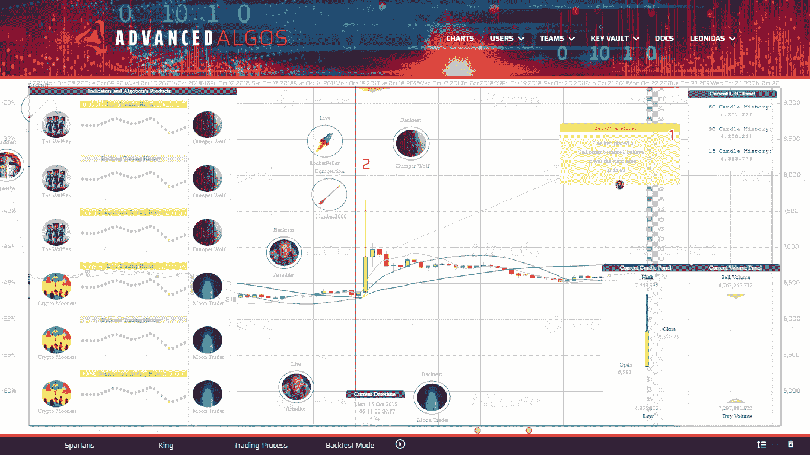
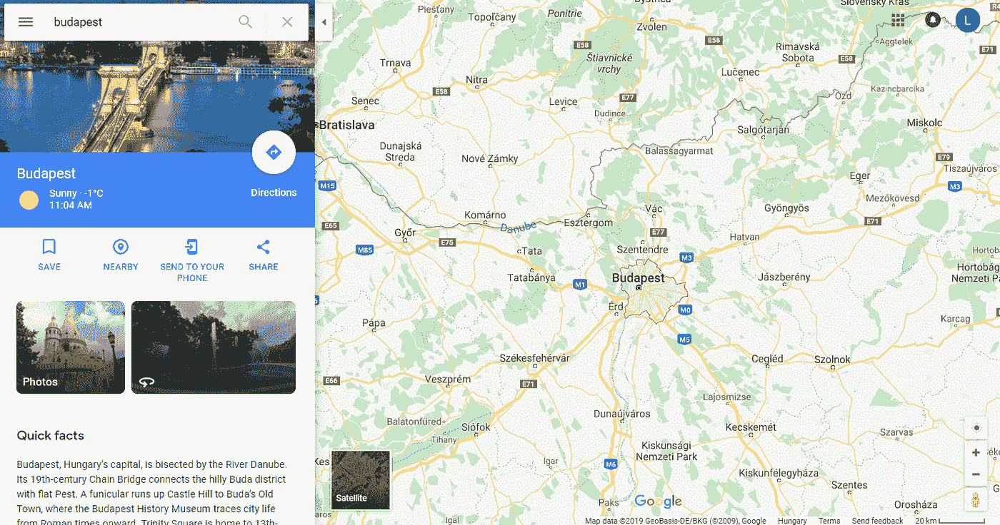
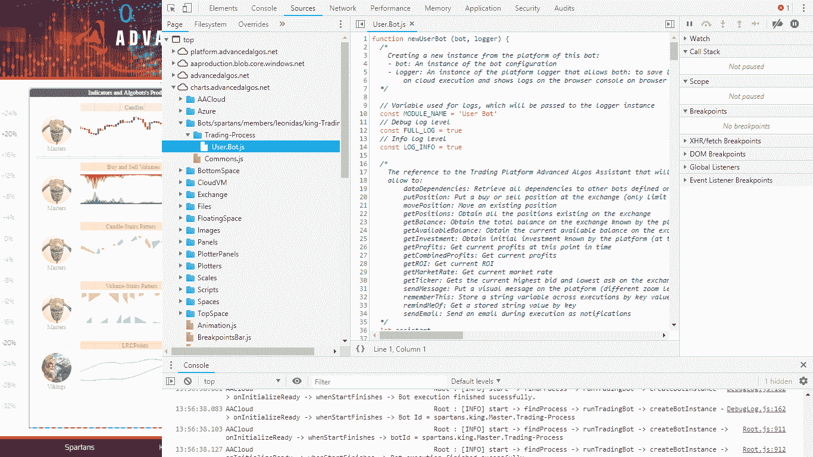
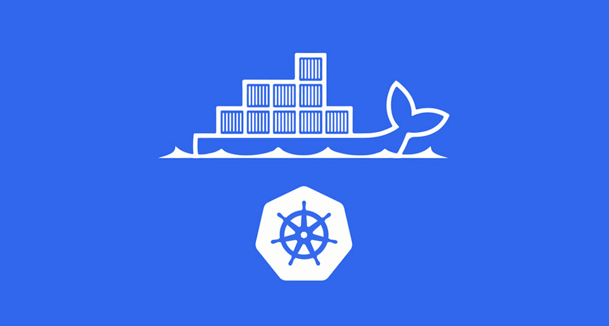
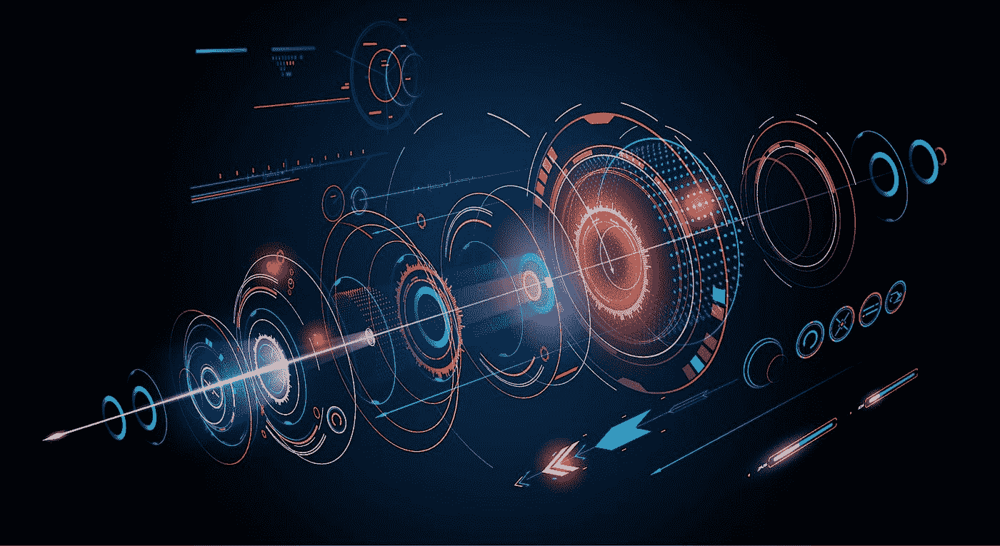
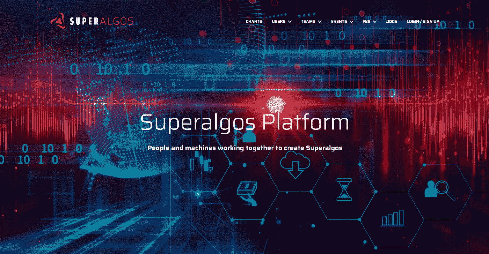
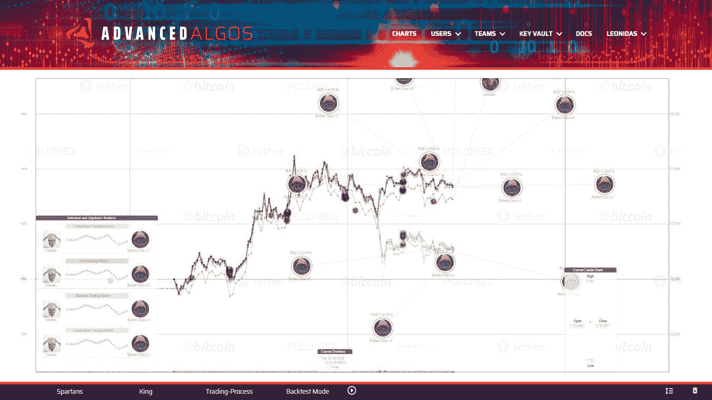
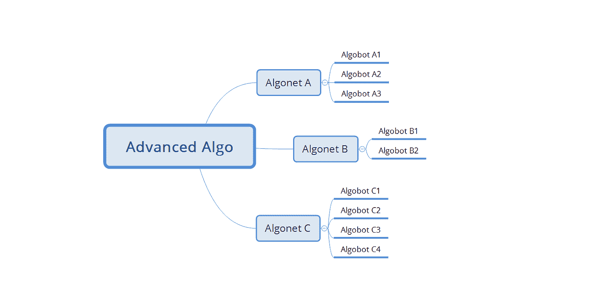
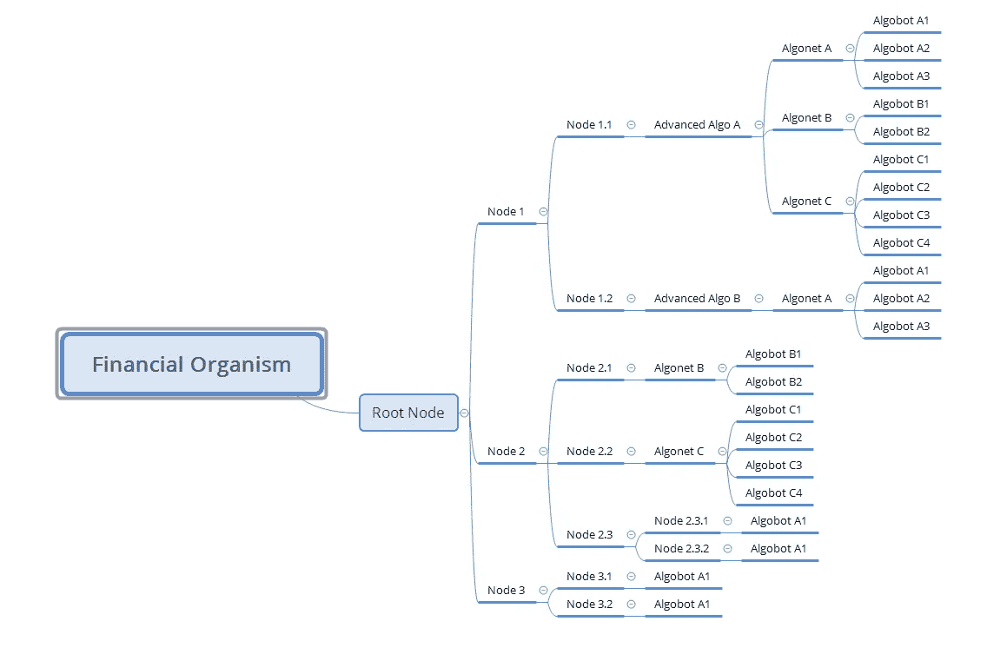

# Superalgos:建立一个贸易超级市场

> 原文：<https://medium.com/hackernoon/superalgos-part-two-building-a-trading-supermind-a47bdc73aed>

*Image © Who is Danny, Shutterstock.*

一个由人类和机器共同思考和工作的超级精灵正在建立，它会尽一切努力最大化群体的集体智慧，从而最大限度地缩短超级怪兽出现的时间。

路易斯·莫利纳&朱利安·莫利纳

*本文是 Superalgos 介绍的第二部分。我们强烈推荐在潜水前阅读* [*第一部分*](/@luisfernandomolina/superalgos-part-one-the-trading-singularity-6f66f419982f) *！*

# 兔子洞

这一切都是从 2017 年仲夏的一天醒来开始的，多瑙河是我第一次认真的交易冒险的背景。

自 2013 年以来，我一直深入比特币，多年来，我一直把交易加密作为一种爱好，没有任何真正的知识。

在完成了我的最新项目后，我发现自己有时间，有一些比特币，也有认真尝试交易的冲动。

那年早些时候，我花了比平时更多的时间做手工交易，自学基础知识。我误以为积累利润很容易。我准备尝试将我想出的原始策略自动化。

我一点也不知道我实际上是在市场有史以来最大的牛市开始时冲浪…

那时候连奶奶都在赚钱！

我花了一些时间查看了一些交易平台和一些开源项目。这一切看起来笨重，过于复杂，或者局限于典型的交易方法。

我有别的想法。

成群结队的游客在布达佩斯漫步。

太阳燃烧了，温柔的春天早已逝去。

清晨清爽的空气透过我卧室的窗户尖叫道…“出去…外面太棒了”。

尽管如此，我知道这种不安不会平息。44 岁时，我花了一生的时间去想象和创造最疯狂的项目，我非常了解这种感觉。

我注定要失败。我必须试一试，否则我会受不了的。

我知道我冒着被卷入一场持续多年的冒险的风险，我会为此付出 100%的努力，24/7，直到我满意为止。思想对强迫症患者有这种影响。

我爬下床，坐在键盘前。

到那天结束时，我已经深陷兔子洞了。坠落。

# 画布应用程序

*Screenshot of the Canvas App*

我曾设想过一个平台，它将提供一个可视化环境，在这个环境中，我能够以一种独特的方式浏览数据。除了典型的烛台图表和指标功能，我想机器人覆盖他们的活动和决策线索，以图形的方式，直接在图表上。

**这样我就可以直观地调试策略了。**

尽管 exchange 提供在线和历史数据，并且因为我希望完全控制可视化功能，所以我知道我需要从 exchange 中提取数据并将其存储在系统中，以便可以以非常特定的方式加载数据。

那时，Poloniex 是最大的加密交易所之一，所以我从他们开始。尽管如此，我从第一天起就知道这个平台将是不可知的。

我花了几个月的时间和许多次迭代来设计一个从 Poloniex 中提取历史数据的过程，以保证——无论过程发生什么——产生的数据集永远是可靠的，没有错误、漏洞或缺失部分。

交易所提供的原始数据代表交易。有了交易，蜡烛线和交易量可以计算出来，还有一系列其他的数据结构，通常被称为指标。

我很早就意识到要管理的数据量相当大。波洛涅克斯的 USDT/BTC 市场在当时有四年的历史，包括超过 3 亿笔交易记录。

即使按蜡烛分组，这也是大量的数据。

在完善提取过程的同时，我也在编写图形环境来绘制数据。我将平台的这一部分称为 *Canvas App* ，因为它使用 HTML5 canvas 对象来呈现图形。

那时我知道我所做的对一个开发者来说太大了。我也知道，建立这样一个仅供我个人使用的平台是荒谬的。

我已经准备好开源了。

我向几个交易者朋友展示了我所拥有的东西，其中一个叫安德烈亚的人最终加入了这个项目。

我还把它拿给了我的兄弟朱利安，他自己也是一名企业家，总是热衷于冒险，是这一系列文章的合著者，他后来也加入了进来。

反馈各不相同。

每个人都有自己的观点。

这让我相信，我不应该把这个平台局限于我个人的喜好，我应该让它尽可能的开放。我知道*和*想如何可视化数据，但我不知道其他人可能想怎么做。

这也意味着该平台需要支持数据集的可视化和导航，而不管数据集是什么，包含什么信息，或者信息是如何绘制的。

嗯，那是一个需要解决的大问题。

**当我不知道数据集将如何构造或者人们将如何在图表上用图形表示它们时，我如何创建一个能够可视化巨大数据集的工具？**

# 谷歌地图

*Google Maps allows navigation of huge datasets in an amazingly intuitive way.*

灵感来自谷歌地图。

它也有许多庞大的数据集，不同层次的不同信息。

该应用程序允许用户只需拖动地图，就可以顺利地从地球的一端导航到另一端。

放大和缩小会动态加载包含更多详细信息的新图层。

它支持多个插件(交通，街景等)，并在同一个界面中运行它们。

它有一个 API，允许在任何网页上嵌入应用程序。

这些都是很棒的功能，我希望它们都在画布应用程序中。

谷歌花了几年时间——以及几次收购——将这款应用发展到今天的样子:最强大的地理空间工具集合之一。

在我的例子中，我必须找出所有数据集中的共同点，以便为用户界面提供一些结构。似乎大多数数据集都是随着时间的推移而组织起来的。

严格来说，这并不是在所有情况下都是正确的，但这是一个足够好的近似值。

所以用户界面需要管理时间的概念，这意味着用户不再像在谷歌地图中那样导航位置，而是在时间中来回导航。

时间将被绘制在 X 轴上——通常是屏幕上最长的轴。

放大和缩小会产生收缩和扩张时间的效果，而不是空间。

Y 轴是用来描绘不同交易所的不同市场的。我希望用户能够轻松浏览并直观地并排比较市场。

由于平台不应该限制用户可视化数据的方式，我引入了*绘图仪*的概念——一段代码，呈现某种类型数据集的图形表示，它独立于 Canvas 应用程序。

从 Canvas App 的角度来看，绘图仪就像一个插件。

人们将能够创建绘图仪来呈现他们自己的数据集。并且，为什么不被其他人在相同类型的数据上使用。

我进行了几次 100%的代码重写，将这一切变为现实。

画布 App v0.1，已勾选。

当然，为了测试所有这些概念，我需要可以在 canvas 应用程序中绘制的适当数据集。原始交易，嗯，平淡无味？

因此，在我开发 Canvas 应用程序的同时，我正在开发最初的几个精细数据集:蜡烛、体积等等…

那是 2017 年 12 月。

五个月的自由落体。

# 核心团队

我和哥哥朱利安的谈话越来越频繁了，他是以前许多企业的合伙人。

我们一直在考虑交易游戏化、机器人专业化、机器人自治和机器人市场的想法。

到 2017 年 12 月，朱利安放下了他正在做的一切，开始全职从事这个项目。

我们花了两个月的时间，重写了六次项目叙述性文档，才理解了本系列文章第一部分中解释的大部分概念。

我们的朋友 Andreja 是瑞士的前对冲基金经理，也是高盛的前专业交易员，他对此非常兴奋，并开始提供有价值的专家反馈。

与此同时，在 2017 年底之前，我去了一趟我的家乡阿根廷科尔多瓦。

像往常一样，我被邀请在聚会上发言，分享我在加密世界的最新冒险。在一次演讲结束十分钟后，有人问我此刻在做什么。

我意识到我以前从未公开讨论过这个项目。

我还没准备好，但我试了一下。最后的 10 分钟对观众来说是最激动人心的。

马蒂亚斯是一家美国汽车制造商的高级开发人员，他有兴趣来找我帮忙这个项目。六个月后，他将辞去工作，全职和我们一起工作。

回到布达佩斯，我向我的朋友丹尼尔·杰弗里斯寻求一些关于交易策略的帮助。他建议实施一个基于 LRC 的简单趋势策略，这是线性回归曲线的缩写。

马蒂亚斯开始开发 LRC 指标及其相应的绘图仪，以及将使用它的交易机器人。

在许多交易平台中，指标是现成的数学函数。在我们的例子中，这不符合我们想要的谷歌地图风格的可视化数据集的方式。

考虑到缩放级别，谷歌地图动态加载用户所在位置的数据。如果用户移动，它将按需下载更多的数据。如果互联网连接缓慢或用户移动过快，最糟糕的情况是用户可能会看到部分地图像素化或信息以不同的缩放间隔出现。这显然是一个非常有效的系统。

在我们的平台中，体验是相似的，只是 Canvas 应用程序仍处于起步阶段，没有消除所有粗糙边缘所需的迭代。

指示器可能需要接近或远离用户在时间线中的位置的数据，甚至可能需要全部数据。

这一事实使得不可能将指示器用作功能，因为不可能以谷歌地图的风格呈现它们。这需要加载大量数据，并实时正确地计算指标。加载数据后，时间线中的每一个微小移动都需要更多的在线计算。

现在，如果你在考虑一个机器人或一个指示器，这听起来可能不是问题。

然而，我们知道我们希望能够在多用户环境中绘制大量数据，同时在屏幕上显示几十个机器人，并仍然享受谷歌地图的导航特性。

这个问题的解决方案是预先计算云中的指标，并输出包含这些计算结果的新数据集。这将允许平台仅加载用户在时间线上的位置周围的小块指标数据。

马蒂亚斯亲身经历了这一点，因为计算线性回归曲线需要分析当前位置以外的信息。

他的第一个实现是通过一个函数，但后来切换到一个过程，将蜡烛作为输入，曲线的数据点作为输出。

到 2018 年 3 月，我们准备开始一些前端工作，所以朱利安邀请了巴里，他是一名平面设计师和前端开发人员，我们在以前的项目中认识他。在探索了一些品牌元素和编码之后，他为他的自由客户关闭了店铺，开始全职和我们一起工作。

安德烈亚终于在 2018 年下半年带着他的朋友尼古拉进入了核心团队——26 岁，是核心团队中最年轻的成员，也很可能是最强的开发人员。

# 金融生物

Four bots competing during the last 7 days of January 2019\. The chart plots in real-time the ROI of each bot.

交易机器人的核心是算法，根据某种策略决定何时买入或何时卖出管理下的资产。进化将是增加他们智力的机制。

在某个时候，我们开始明白，在我们的生态系统中，还有其他种类的计算机程序会从金融生活的范式中受益。

以从交易所提取数据的过程为例。

或消化数据集以产生其他数据集的过程——指标。

他们也应该是金融人吗？

那么用于在图形环境中渲染数据集的绘图仪呢？

成为金融生物将会把进化模型中包含的所有美德传递给这些实体。它们也会随着时间的推移而改进。

请注意，这并不意味着这些实体需要在交易竞争中竞争。他们不交易。但是，他们仍然会在一个市场——数据市场——中竞争提供高质量的服务。

这个内部数据市场是生态系统的基础部分。为什么？因为高质量的数据是交易算法决策过程的一个重要方面。

数据有机体与交易有机体一起进化是很重要的。

因此，我们扩展了进化模型，以包括从交易所等外部来源检索信息的*传感器*、处理传感器(或其他指标)数据以创建更精细数据集的*指标*、在画布上呈现数据集的*绘图员*，以及决定何时买入或卖出的*交易员*。

我们称这些机器人为金融生物。

根据定义，FB 是一种以金融生活为特征的算法，这意味着它们有收入和支出，并需要 ALGO 代币的正余额才能保持活力。保持活动意味着在特定的时间间隔执行，以便算法可以运行并做它被编程要做的任何事情。

之前，我们说过，交易算法参与交易比赛，根据比赛排名获得曝光率，人群可能会选择它们进行繁殖——通过分叉。随后，资产持有人可能会租用它们来代表他们进行交易。

但是其他人呢？

传感器、指示器和绘图仪如何过财务生活？

传感器和指标将出售其数据集的订阅，主要是交易机器人，但也包括其他指标。那将是他们的收入来源。在生态系统——数据市场中，将会出现机器人之间的经济。

市场将决定哪些数据值得花钱购买，因此，只有有用的指标才会存活下来。

绘图仪在屏幕上渲染数据集。社区中的交易者和开发人员可能会选择订阅绘图仪服务，尤其是那些提供卓越视觉体验的服务。

系统中涉及机器人之间价值转移的部分尚未实现。我们非常清楚，建立一个在各方面都行之有效的平衡模式将是一项挑战。目前对这方面的分析还很肤浅，但我们期待着手解决这些问题。

所以，现在所有这些实体都被识别出来了，接下来的问题是:这些 FBs 将运行到哪里？

# 浏览器和云

我一直认为，为了正确调试交易策略，调试工具应该与图形用户界面高度耦合；绘制数据的那个。

对人类来说，识别数据的图形表示模式比识别硬数字模式要容易得多。

调试交易机器人的行为也应该如此。

如果我们直接绘制交易机器人在时间线上所做的一切，包括它为什么这样做的所有相关信息，这将是一个强大的工具，可以在以后确定它为什么没有按照预期行事，或者如何改善当前的行为。

对我来说，从一开始就很清楚，机器人的第一个版本应该能够在浏览器上运行，直接在平台的*画布应用*上运行。此外，虽然没有调试，但运行现场或与其他机器人竞争，他们应该在云上运行。

我花了一段时间——以及一些重写——将这些碎片放在一起，创建了一个软件，它将作为云端机器人的执行环境，我称之为云应用程序，同时，在机器人源代码层面没有任何改变的情况下，也可以在浏览器中运行机器人。

这一目标已于 2018 年年中实现。

从那时起，完全相同的机器人源代码能够在浏览器中以调试模式交易，并在云上以实时、回溯测试或竞争模式执行。

**开发人员现在可以使用浏览器开发工具来调试机器人的代码，同时在 Canvas 应用程序中查看机器人活动的实时绘图。**

这种设置有效地降低了开发者的准入门槛。

没有要安装的环境。

没有设置。

没有配置。

对开发者的机器没有要求。

报名需要一分钟。

注册后，系统会立即向用户提供最新的交易冠军。

**开发者可能在两分钟内就能让一个机器人运行起来。**

当然，所有这些优势都是有代价的。

最主要的原因可能是，为了在浏览器上运行机器人，它们需要用 JavaScript 编写，而 JavaScript 并不是开发交易机器人最流行的语言。

主要交易似乎是合理的。主要是因为在早期阶段，通过一个最低限度的可行产品，我们打算引导社区中愿意尝试、享受乐趣和竞争的业余交易者和开发者。

当然，专业交易者也非常受欢迎。他们也可能会觉得这个提议很有趣。但是我们真的不希望他们把他们的绝密 python 机器人开源。

随着时间的推移，社区将要求支持其他语言，这种需求将推动平台的发展。

同样，我们预见到社区的一部分可能会趋向专业化，不同的兴趣将推动平台向不同的方向发展。

# 助理

因为交易机器人意味着相互竞争，并最终服务于客户，所以出现了几个问题。

我们如何保证公平竞争？

我们如何确保机器人在他们做了什么和取得了什么方面不作弊？

此外，我们如何向未来的客户保证，他们将订阅的资产管理服务拥有他们声称拥有的跟踪记录？

合乎逻辑的做法是禁止交易机器人自行在交易所下单。相反，我们提供一个通用、透明的基础设施来按需完成这项工作。

该平台跟踪机器人在交易所执行的所有操作——通常是购买和出售订单——并监控交易所跟踪已完成的订单——无论是全部还是部分。

我们将平台的这一部分称为助手，因为它帮助交易机器人与交易所进行所有的交互。

助手解决了交易机器人在性能方面作弊的问题。

它是一个助手，在每个交易机器人执行之前，检查交易所的帐户，验证哪些订单已被执行，为资产对中的每个资产保持平衡，保持运行的可用余额——可用资金的余额，即未执行订单中未承诺的资金——并公开交易机器人在决定购买或出售时可以调用的方法。

此外，该助理计算交易机器人的投资回报率，并保存这些信息，供系统的其他部分使用。

助手中包含的功能保证了公平竞争，因为交易机器人无法控制助手的跟踪。这意味着两个或更多的机器人在同一个平台上竞争，遵守同样的规则。

# 可量测性

*Docker + Kubernetes = High Scalability.*

在这个过程中的某个时候，我们得到了一个铁杆交易算法爱好者的反馈:他担心这个平台无法扩展到运行数千个机器人。

他是对的，但同时也是错的。

他是对的，因为在那个阶段，对代码和基础设施的任何审计都不会得出可伸缩的结论。

但他同样错了。

他忽略了关键的一点，即平台本身——像大多数开源项目一样——是会进化的。

他也未能理解，他在那个时间点上所回顾的仅仅是超级 lgo 出现所需要解决的第一批问题的解决方案——从数百个问题中。

**没有时间和脑力解决不了的技术问题。**

关键的一点是，superalgos 将从全球超级市场中脱颖而出。

为了超级 lgo 的出现，无论需要做什么，都将被完成。

马蒂亚斯花了 2018 年最后一个季度在云上容器化执行。

通过这样做，它不仅解决了可伸缩性问题，还解决了隐藏在阁楼中的其他一些问题…

我们如何允许 bot 创建者自己运行 bot？

我们如何限制可访问性，使邪恶的机器人无法干扰其他机器人或搞乱平台本身？

解决方案以 Kubernetes 的形式出现，这是一个开源软件，能够协调 Docker 容器的部署，这些容器正是为解决这些问题而设计的。

也许是为了强调平台也受进化动力学影响的事实，Nikola 宣扬了一种理论，即平台本身应该被视为一种机器人，或者至少是它的一部分，就像助手一样。

# 系统模块

*The system is divided in modules. We expect to build at least 50 modules in the next few years. | Image © D1SK, Shutterstock.*

2018 年下半年，我们致力于解决列表中的一些问题…

如果人群要将自己组织成团队，他们需要注册，管理他们的个人资料，发现现有的团队，申请加入或创建新的团队…

Canvas 应用程序并不适合管理这一切。

我们需要一个基于网络的系统。

我们预计它会相当大，而且它也将受到进化的影响。

再说一次，我们的任务是尽一切努力让超级宇宙出现。如果我们承认没有人有明确的解决方案，我们需要建立灵活的、能够发展的解决方案。

这一推理为我们指明了模块化系统的方向。

最紧迫的是用户模块。一个负责管理与用户相关的一切的软件。它将允许用户发现和搜索其他用户，以及创建和管理用户档案。随着需求的发展，该模块将容易接受更多与用户相关的功能。

这个模块是我自己开发的。

第二个是团队模块，由 Barry 开发。它的范围是与团队相关的一切。它允许用户探索和找到现有的团队，申请成为成员，创建团队，定义管理员，邀请用户加入和管理会员申请。它也准备在这个范围内发展。

交易机器人需要 API 密钥来访问交易所并执行交易。密钥是从交易所获得的，需要导入到我们的系统中，以便在需要时可以使用。

为了解决这一需求，Matias 开发了密钥库模块，该模块负责允许用户管理他们的 exchange API 密钥。这包括定义哪个机器人将使用每个密钥。不用说，所有的密钥处理都必须以安全的方式完成。

我们还需要一个模块来定义和管理竞赛事件，因此 Nikola 开发了事件模块。它允许浏览即将到来的，积极的和过去的比赛事件，以及创建自己的一套规则，奖品和更多的比赛。

我们已经设想了 50 多个模块，每个模块都有特定的职责和范围。

但在构建更多模块之前，我们需要一个能够以协调方式运行这些模块的框架，提供通用导航和其他共享功能。

# 主应用程序

系统模块前端被转换成 NPM JavaScript 库，这些库被列为主应用程序的依赖项，以便在浏览器中只加载一个 web 应用程序。到 2018 年底，该框架已经启动并运行，其中包含第一组模块。

在实现方面，主应用程序是一个 React / Redux 应用程序，它通过 Apollo 访问 GraphQL 后端 API。主应用程序 API 实际上是一个 API 路由器，它将传入的请求转发到每个单独模块的后端。

模块后端由 Node.js / Express 应用程序组成，根据每个开发人员的偏好，可以使用 MongoDB 或 Postgre 数据库。

整合 Canvas 应用程序、Cloud 应用程序和 Master 应用程序是一个重要的里程碑。到那时，我们已经有了所有的初始部分，并准备开始添加更多，同时发展现有的部分。

该系统未经测试，因此处于初级阶段。

代码质量变化很大。

当前对系统中每个部分的代码在进化中存活几率的认识决定了在清理和使代码健壮方面要做多少工作。

随着核心团队的成长，想法开始在更大的人群中讨论，最初的概念集得到了细化和扩展。

# 算法机器人

*ROI of two Algobots as seen on the Canvas App.*

交易算法可能简单，也可能复杂。也许复杂的可以拆成很多更简单的。

什么是最简单的交易算法，相当于生物学中的单细胞生物？

基本的交易算法是执行单一策略的算法。做好一件事的人。在许多情况下，这可能意味着战略是基于一个单一的指标。

我们不需要对它的智能强加任何特定的边界。我们只是假设——像单细胞生物一样——只要它能从周围环境中获取食物，它就能自给自足，靠自己的能力生存。

我们称之为交易智能的最小单位——算法机器人。

# 算法网

*ROI of multiple Algobot clones controlled by a single Algonet. Notice how some of them decided to sell at a different moment, impacting their ROI.*

我们很早就知道，在平台上运行的机器人的交易空间中，算法机器人不会孤单。

让我们进一步分析算法程序…

algobots 的主要组件是什么？

最重要的部分是源代码。之后是配置，它提供了执行时所需的许多细节。第三行:参数；为每次特定执行设置的值。

我将用一个例子来解释这一点:

让我们想象一个叫麦克的机器人。

Mike 的源代码提供了基于前面描述的 LRC 指标决定何时买入何时卖出的逻辑。如果迈克确认了 3 个买入信号，那么他就买入；如果它识别出 2 个卖出信号，那么它就卖出。

本例中的数字 3 和 2 是任意数字。例如，他们可能是 4 岁和 3 岁。

为了澄清配置和参数之间的区别，我们可以在 Mike 的配置文件中找到买卖信号数量的有效范围。例如，这样的范围可以是[2..6]和[3..7].Mike 将在任何特定运行中使用的实际参数或值是在运行之前设置的。这些值可以是前面建议的 3 和 2，或 4 和 3，或配置范围内的任何有效组合。

因为参数可以随意操纵，任何变化都可能影响交易算法的行为，我们称参数为基因。

在上面的例子中，我们会说 Mike 有两个基因，每个基因都有一系列可能的值。这些基因将是*买入信号的数量*和*卖出信号的数量*。

算法网是一种不同的交易机制；更高层次的智慧。

算法网不会自己交易。他们使用 algobot 克隆人来做这项工作。他们动态地创造单个 algobot 的不同克隆体，每个克隆体的基因都有不同的价值。潜在地，algonets 可以部署和基因值组合一样多的 algobot 克隆。

让我们想象一下 Mike Algonet——是的，algo net 仅限于一种类型的 algobot。

Mike Algonet 管理着 100 万美元的资产。

最初，它会部署尽可能多的 Mike Algobot 克隆，每个克隆都有一组独特的基因值。部署完成后，迈克·阿尔戈内特会给每个克隆人分配少量资金进行交易。

我们的进化模型规定，每个克隆人都需要 ALGO 代币才能生存，因此，除了交易资本，每个克隆人还会获得少量的 ALGO……只要能活到在市场上测试他们的基因所需的任何东西！

Mike Algonet 监控每个克隆的性能，并动态地决定哪些克隆应该存活更长时间。那些被喂得更多的是 ALGO。

当迈克·阿尔戈内特发现任何一个克隆体做得不够好时，它就会停止喂养它，被遗弃的克隆体很快就会死去。

一旦 Mike Algonet 确信一个克隆体表现良好，它可能会将更多的资本置于被选中的克隆体的管理之下。

这些是标准的 algonet 机制。

最重要的是，algonets 有自己的源代码，因此开发者可以以他们认为合适的任何方式进行创新。

我们已经编写了一个简单版本的 algonet，并亲身体验了具有不同基因的克隆体如何以不同方式运作，如上图所示。

# 高级算法

*Advanced algos control algonets which in turn control algobots*

现在，想象一个比算法网更高阶的实体。

我们称之为*高级算法*。

高级算法能够部署算法网的克隆。他们可以用不同的参数多次克隆相同的算法网，或者完全克隆不同的算法网，或者两者之间的任意组合。

像算法网一样，高级算法使用资本和 ALGO 来保持算法网工作和存活，并动态地决定如何分配这两种资源以获得最佳的整体性能。

反过来，在高级算法的指导下工作的算法网络仍然控制和操作它们自己的算法程序，如前所述。

与算法网和算法机器人一样，高级算法也有源代码，创作者可以在所有高级算法的标准功能之外进行创新。

先进的 algos-algonet-algobot 结构类似于器官-组织-细胞的生物结构。

在生物生命中，细胞工作以保持自身存活，但也与其他细胞一起工作以形成组织并采用某些高阶功能。多种组织形成器官也会发生类似的情况。尽管器官是由组织构成的，但它们有自己的生命、目的和使命。

在玩了足够长的时间后，下一组问题出现了…

有没有更高阶的实体有明确的目的？

我们会有一个复杂生物有机体的等价物吗？一个包含器官系统，器官，组织和细胞，并为了更高的目的协调它们的实体？

# 金融机构

*A Financial Organism is made out of a hierarchy of nodes in which each node may control advanced algos, algonets or algobots as needed.*

金融有机体是机器人的结构，它们将自己组装成没有强加规则或限制的层级。

在前面描述的高级算法-算法网-算法机器人层级的范例中，交易与否的个人决定取决于每个算法机器人克隆体。如果任何克隆体决定购买，那么它将使用自己的交易资本。

金融有机体(FO)由*节点*组成。

层次结构中的第一个节点由助理调用。

该节点可以依次调用其他节点，如果需要，其他节点可以自己调用其他节点。

所有这些节点都可以自由地克隆算法程序、算法网络或高级算法，并投入运行。

让机器人运行的节点实际上是在模拟助手——记住通常是助手调用机器人。这意味着，当任何一个克隆体希望发出买入或卖出订单时，该命令会被调用节点接收，调用节点可以将该调用作为其自身决策过程的信号。

**换句话说，节点可以使用任何一组交易机器人作为信号。**

一旦一个节点做出买入或卖出的决定，它就通过节点层次结构向上发出买入或卖出订单。订单由上游节点通过自己的逻辑接收和分解。

该过程一直继续到*根节点*。

最终的买卖订单由根节点通过实际的助手下达，助手将订单带到交易所。

# ALGO 矿业公司

支持本文所述概念所需的系统庞大而复杂。

让一小组开发人员开发所有模块似乎不是完成任务的最有效方式。

这也不是最有弹性的方法。

就技术要求而言，该项目的独特之处在于所有模块都有望得到显著改进。此外，到目前为止确定的模块肯定不是超级星系出现所需要的所有模块。

该项目的使命表明我们将“不惜一切代价”，明确暗示我们可能需要做的比我们今天所能想象的更多。

**就像我们期待一个巨大的开发者社区来培育机器人一样，我们也期待社区中相当大的一部分人加入项目的开发团队，帮助构建系统模块。**

ALGO 代币需要在所有 supermind 参与者中发行和分发。

因为进化的关键引擎是竞争，所以很早就决定了 ALGO 总供应量的 25%要留给竞争奖。

ALGO 的 15%将会给建造系统的开发者。

10%会给从事商业发展的人。

50%将用于融资和其他激励措施。

为参赛者预留的奖金池的分配机制从一开始就很明确:竞赛奖金将通过该系统在参赛者之间分配。

预留池还没有被分配，所以不需要建立分配机制。

这就给我们留下了一个问题，即定义在系统开发人员之间分配 15%和在业务开发人员之间分配 10%的机制。

我们反复考虑了几个想法，得出了以下要求:

**开发系统模块的人也要维护系统模块**。

这样做的原因是，对于一个小的核心团队来说，系统会很快变得过于复杂而难以维护。不过，对于大型扩展团队来说，这是可以管理的。事实上，如果开发一个模块的每一方都长期负责维护它的话，它会工作得特别好。

这意味着开发和长期维护都需要激励。

我们找到的解决方案在某种程度上模仿了一种加密挖掘方案。

谁负责一个系统模块，开发它，将其与系统的其余部分集成，并将其推向生产，然后获得一个 *ALGO 矿工* 。

ALGO 矿工不是硬件，而是运行在以太坊区块链上的智能合约。

矿工，也就是采矿的人，每天都会收到一批代币。

每个 ALGO 矿工都有一个预定义的能力。共有 5 个不同的类别，每个类别都有自己的能力，因为并非所有模块都具有相同的重要性、难度或关键程度。

例如，一个 1 类 ALGO 矿工分发 100 万 ALGO。同样的情况也发生在 5 类矿工身上，他们分配了 500 万 ALGO。

这些代币是哪里来的？

对于开发者，从系统开发池中分配总供应量的 15%。

一个类似的采矿计划已经为在商业发展中工作的人建立。在这种情况下，责任不在于开发和维护一个系统模块，而在于开发和维护一个业务领域。

因此，对于商人来说，矿工从商业发展池中获得代币。

ALGO 矿工的分布时间表模拟了比特币挖矿的减半事件，除了不是每 4 年减半，而是每年减半。

在第一年，50%的 ALGO 矿工产能按天分配。

第二年分配的金额是第一年的一半，即总额的 25%。

第三年，前一年的一半，儿子上。

到第五年，超过 98%的容量将被分配。

ALGO 矿商还分发从平台上运行的金融机构收取的 ALGO。

这些费用是财务人员必须支付的费用的一部分。我们称之为*生存时间*费，意思是金融生命购买时间来维持生命。

每天收集生存时间费用并在活跃的矿工中分发。

这是矿工 ALGO 代币的第二个来源。我们预计，在最初几年，这种收入来源很少，但随着时间的推移和采用的增加，它应该会稳步增长，允许矿工在来自分配池的 ALGO 耗尽时获得可观的收入。

这些是我们设计的长期激励团队的机制。这些激励也是进化模型的一部分，在这种情况下，使系统本身能够进化。

# 团队

除了核心团队之外，还有一个更广泛的项目团队来构建系统的各个部分。如前所述，团队成员通过开采 ALGO 代币获得报酬。

要成为团队成员，申请人需要负责一个待开发的软件，或者一个业务开发领域。

项目团队正在组装的拼图块的示例有发行和分发 ALGO 代币所需的以太坊智能合约、ALGO 商店模块、日志模块和金融实体模块。

智能合约仍在测试中，因此挖掘尚未开始。

一旦测试完成，合同将被部署，采矿将开始。

自 2017 年那个清爽的夏日早晨 Superalgos 项目开始以来，已经有一段时间了。

多瑙河有大量的水流下。

核心团队已经为一个伟大的项目奠定了基础，我们准备通过发展和维护剩余系统模块和业务领域的团队来加速这场游戏。

我们鼓励每一个愿意看到我们的愿景实现的人站出来，贡献一些工作，成为团队的一部分。

来把你的大脑塞进有史以来最大的超级市场吧！

简单介绍一下我:我是一名企业家，很久以前就开始了他的职业生涯，设计和构建银行系统。经过多年发展出许多有趣的想法后，我在 2017 年创办了 Superalgos。最后，一生的项目。

*关注 Superalgos 上的* [*推特*](https://twitter.com/superalgos) *或* [*脸书*](https://www.facebook.com/Superalgos-375022859724428)*；或访问我们的* [*电报*](https://t.me/superalgoscommunity) *或我们的* [*网站*](https://superalgos.org/) *。*