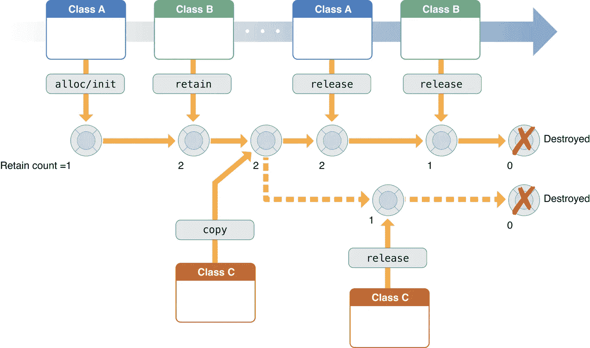

# Swift:通过示例避免内存泄漏

> 原文：<https://medium.com/hackernoon/swift-avoiding-memory-leaks-by-examples-f901883d96e5>



[https://developer.apple.com/library/archive/documentation/Cocoa/Conceptual/MemoryMgmt/Art/memory_management_2x.png](https://developer.apple.com/library/archive/documentation/Cocoa/Conceptual/MemoryMgmt/Art/memory_management_2x.png)

在 Swift 中，自动引用计数(ARC)用于管理 iOS 应用程序中的内存使用。
每次你创建一个类的新实例时，ARC 都会分配一块内存来存储关于它的信息，并且当不再需要这个实例时会自动释放这些内存。
作为开发人员，您不需要为这种管理做任何事情，除了 3 种情况，您需要告诉 ARC 更多关于实例之间关系的信息，以避免“保留循环”。

在本文中，我们将一起了解管理这三种情况的过程，并了解保留周期的真实示例以及如何消除它们。
但是首先，什么是保留周期，为什么我们需要避免它们？

# 保留周期:

Retain Cycle 是这样的情况，当两个对象相互强烈引用并被保留时，使得 ARC 无法从内存中释放这些对象，并导致我们所说的“内存泄漏”。

> 内存泄漏在你的应用程序中是很危险的，因为它们会影响你的应用程序的性能，并可能在应用程序耗尽内存时导致崩溃。

# 导致内存泄漏的三种情况:

## **1-两个类之间的强引用:**

假设我们有两个直接相互引用的类(Author&Book ):

理论上，这应该打印出两个对象都被分配，然后因为它们被设置为 nil 而被取消分配，但是它打印出以下内容:

```
**Author Object was allocated in memory
Book object was allocated in memory**
```

正如你所看到的，这两个对象都没有从内存中释放出来，因为当两个类彼此有强引用时，会出现一个保留循环。

为了解决这个问题，我们可以将其中一个引用声明为弱引用或无主引用，如下所示:

这一次，两个对象都将被释放，控制台将打印以下内容:

```
**Author Object was allocated in memory
Book object was allocated in memory
Author Object was deallocated
Book Object was deallocated**
```

问题得到了解决，当对象被释放时，ARC 能够通过使其中一个引用变弱来清理内存块，但是弱和无主实际上意味着什么呢？根据苹果的文档:

## 弱引用

> 弱引用是一种对它所引用的实例没有很强控制的引用，因此不会阻止 ARC 释放被引用的实例。这种行为可以防止引用成为强引用周期的一部分。通过将`weak`关键字放在属性或变量声明之前来指示弱引用。

## 无主参考文献

> 像弱引用一样，*无主引用*不会牢牢控制它所引用的实例。但是，与弱引用不同，当另一个实例具有相同或更长的生存期时，将使用无主引用。通过将`unowned`关键字放在属性或变量声明之前，可以指示一个无主引用。

## **二级协议关系:**

内存泄漏的另一个原因可能是协议和类之间的紧密联系。在下面的示例中，我们将采用一个真实的场景，其中我们有一个 tabviewcontroller 类和一个 TableViewCell 类，当用户按下 TableViewCell 中的按钮时，它应该将此操作委托给 tabviewcontroller，如下所示:

通常，当我们关闭 TableViewController 时，应该调用 deinit，并且 print 语句应该出现在控制台中，但是在这种情况下，由于 TableViewCellDelegate 和 TableViewController 相互之间有很强的引用，因此它们永远不会从内存中释放。
要解决这个问题，我们可以简单地将 TableViewCell 类调整如下:

这一次关闭 TableViewController 并查看控制台:

```
**TableViewController is deallocated**
```

## 3-闭包的强参考周期:

假设我们有以下视图控制器:

尝试关闭 ViewController，将永远不会执行 deinit 方法。
原因是因为闭包捕获了 ViewController 的强引用。为了解决这个问题，我们需要把自我当作弱者或无主者，如下所示:

这一次当关闭 ViewController 时，控制台将打印:

```
**ClosureViewController was deallocated**
```

# 结论

毫无疑问，ARC 在管理应用程序的内存方面做得非常出色，作为开发人员，我们所要做的就是意识到类之间、类和协议之间以及闭包内部的强引用，在这些情况下声明弱变量或无主变量。

# 关于 ARC 的一些重要参考资料:

*   [苹果的文档。](https://docs.swift.org/swift-book/LanguageGuide/AutomaticReferenceCounting.html)
*   [Raywenderlich](https://www.raywenderlich.com/959-arc-and-memory-management-in-swift) 关于电弧的文章。

# 阅读我之前在 Swift 发表的关于 GCD 的文章:

[](/@BarekJaafar/swift-multi-threading-using-gcd-for-beginners-2581b7aa21cb) [## 初学者使用 GCD 的快速多线程。

### 使用 GCD 优化您的应用程序性能和用户体验。

medium.com](/@BarekJaafar/swift-multi-threading-using-gcd-for-beginners-2581b7aa21cb)