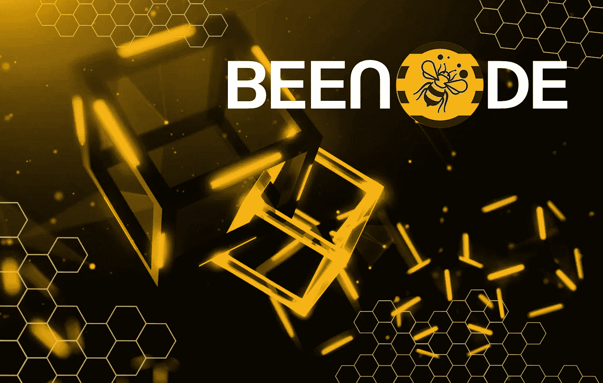

# 共生而非二分法:权力与后采矿

> 原文：<https://medium.com/hackernoon/symbiosis-instead-of-dichotomy-pow-and-pos-mining-228d89d2e1a8>

利益证明(PoS)和工作证明(PoW)是区块链网络中达成共识的两种最流行的协议。PoW 和 PoS 的根本区别在于矿工在哪里获得奖励。这两种协议的任务是相同的:提供网络的安全性和可靠性，但方法仍然不同。

而不是必须选择支持任何协议，想要利用一种协议，却错过另一种协议的好处。在区块链节点中，我们使用两种协议。两种机制的结合:PoS 和 PoW 允许您为网络用户提供两种技术的好处。由于这种共生关系，区块链的工作更加可靠，采矿变得更加随意和有利可图。

**工作协议描述证明**

这两种协议各有优缺点。在对比之前，我们先详细了解一下各自的特点。先说最常见的——工作证明。PoW 是第一个也是最受欢迎的区块链——比特币的基础。

然而，协议工作证明机制并不是加密货币的产物，它最早出现在第一种加密货币之前。Cynthia Yard 和 Moni Naor 在 1993 年提出了这一概念，根据作者的说法，该协议是为了保护系统免受攻击，因为只有在解决了密集的任务之后，才会授予对任何资源的访问权。权力这个词本身是在 1999 年才出现的。

DDoS 攻击。在现代区块链网络中，权力可以被描述为一种竞争:网络给出任务——解决一个复杂的数学问题，矿工们接受解决方案。谁的设备最先找到正确答案，谁就能获得奖励。

在比特币网络中，正如在其他加密货币的网络中一样，PoW 用于生成新的块并确保安全性。搜索区块的过程本身是偶然的:在成千上万的矿工中，任何人都可以在网络中找到一个新的区块，但不仅是他，而是所有其他矿工都根据为搜索所做的努力获得奖励。

**股权证明协议描述**

与 PoW 不同，Stake 的协议证明是一个纯粹的加密货币机制，它是相对较新出现的。PoS 协议是 2011 年在一个专门讨论加密货币的论坛上提出的。2012 年，区块链出现了第一枚使用这种采矿机制的硬币。

在证明工作块是那些设备更强大，更快地解决复杂的数学问题，并在证明股份的最大概率找到一个新的块在那些节点有更大份额的硬币。拥有大量硬币并因此因发现新区块而获得奖励的节点，称为主节点。

PoS 协议的优点是硬币的提取不会消耗巨大的能量资源来提取硬币。挖矿不需要特殊装备，钱包里拥有一定份额的硬币就够了。

**主节点**

总的来说，主节点是一种位置挖掘。这种机制也意味着硬币的所有者在网络中充当安全保障者，但也有几个不同之处。

首先，创建主节点本身需要符合几个条件。在 PoS-mining 奖励可以得到每个硬币所有者。为了创造一个主节点硬币所有者需要一定的，往往是大量的硬币。

第二，主节点不会自己打开新的块，也不会因此获得奖励。主节点服务于区块链参与者，为他们提供各种服务:托管、即时交易、匿名等。对于这些服务，主节点的所有者会收到佣金。

**been ode 区块链为什么结合了 PoW 和 PoS**

尽管这些协议并不相似，而且大多数专家都反对对方，但是 [BeeNode 区块链](https://bitcointalk.org/index.php?topic=5131731.0)的开发人员认为这些协议的组合是确保网络稳定运行的最佳选择。

POS 和 PoW 协议易受 51%攻击。在 PoW 网络中进行这样的攻击，你需要拥有一半以上的计算能力，而在 PoS 网络中进行这样的攻击，你需要购买并在钱包中持有一半以上的硬币。这两种攻击都很难实施，但却是真实的。通过 PoS 和 PoW 的结合，51%的攻击变得几乎不可能，这保护了区块链。

BeeNode 区块链从两种协议中取长补短。由于使用工作证明，攻击网络几乎是不可能的，并且由于电力成本，创造了硬币的附加价值，加密货币的比率正在增长。此外，股权证明协议也有助于提高利率:钱包中存储的硬币越多，打开新街区并获得奖励的机会就越大，因此人们不断努力购买硬币，创造需求，推动利率上升。

这两种协议各有优缺点。然而，这两种机制的结合使得区块链网络几乎不可能出现漏洞，并大大增强了尊严，使得区块链快速、可靠且安全。

要参与社区请加入[不和谐](https://discord.gg/PVdCPRh)或[电报频道](https://t.me/BeeNode)

并关注 Twitter[**@**node _ bee](https://twitter.com/node_bee)