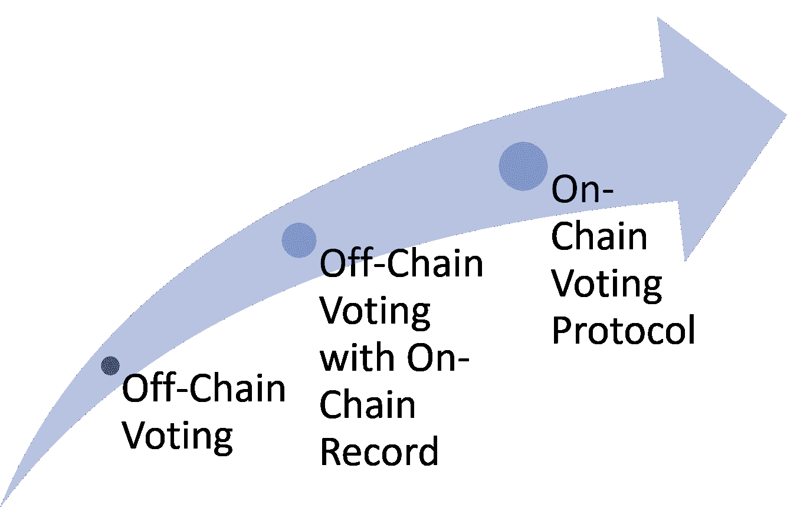
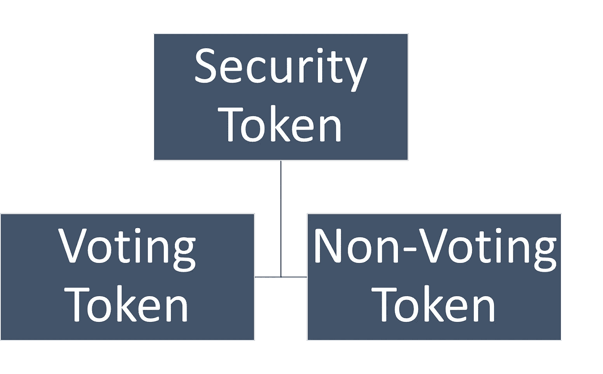
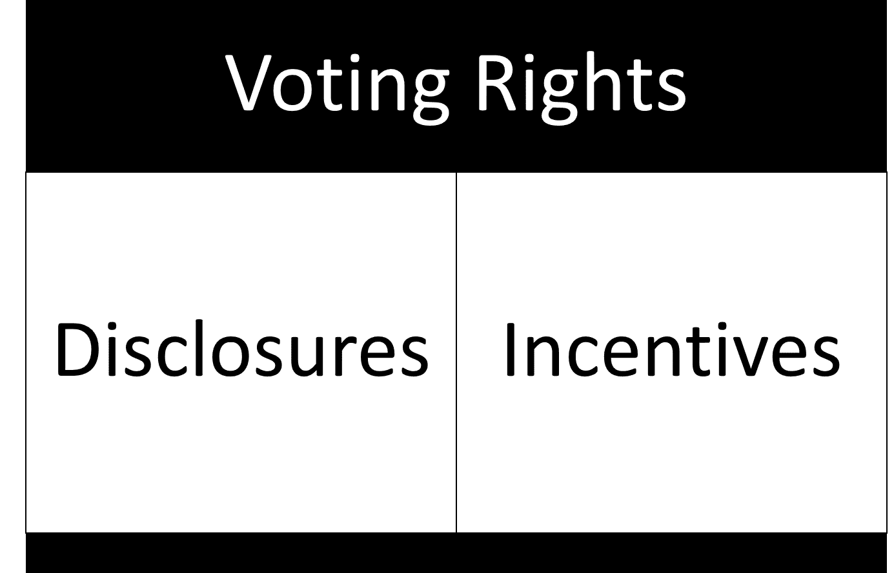

# 迈出安全令牌治理的第一步:扩展具有投票权的安全令牌协议

> 原文：<https://medium.com/hackernoon/taking-the-first-step-in-security-token-governance-extending-security-token-protocols-with-voting-6d8bb6e9f407>

公司治理是上市公司的标志之一，但在初创公司和小型私营公司中，公司治理通常很灵活(甚至不存在)。安全令牌的一个有趣的副作用是，它们给小型私人创业公司带来了许多上市公司或成长型公司的公司治理挑战。任何进行证券代币发行(STO)的公司都可能最终拥有大量投资者，足以让公司治理成为一场噩梦。过去，我写过大量关于安全令牌治理的文章，介绍了几篇关于如何在安全令牌平台中启用这些功能的论文。然而，随着越来越多的 s to 进入市场，我的想法已经从高度理论化的区块链治理协议转移到需要在短期内解决的更加务实的治理挑战，以确保 sto 的长期可行性。在安全令牌的这些治理挑战中，投票权似乎是典型的低挂水果。

# 投票权

传统股票是所有权、现金流和投票权的合法代表。当前一代的安全令牌大多是所有权的令牌化表示。然而，随着 sto 积极上市和交易，对投票和可编程公司治理动态的需求可能会变得越来越重要。通常，投票权将允许令牌持有者参与与加密证券的基础资产相关的重要决策。安全令牌为投票权带来了独特的味道，因为治理决策不仅与底层资产的生命周期相关，还与加密资产本身相关。从这个意义上说，安全令牌中的投票权可以分为两大类:本地资产投票权或加密资产投票权。

# 本地资产投票权

这种类型的投票权包括公司治理决策，这些决策会影响证券令牌的基础资产的表现。本地资产投票权的一些经典例子包括:

公司授予的新董事席位。

基础资产的出售或控制权变更。

股息支付。

筹集机构资本或承担额外债务。

发行新股。

董事薪酬。

· ….

正如上市公司的投票股东或风险后端公司的优先股股东一样，安全令牌持有者应该能够参与与其资产相关的某些治理决策。

# 加密投票权

像加密中的所有东西一样，直到你上链，画面才是完整的😉在投票权的情况下，有一些与加密安全本身相关的具体决定应该服从治理流程。以下是一些基本的例子:

燃烧或铸造新的代币。

在其他交易所上市。

与特定加密协议集成。

支持分散交流。

接受加密安全代码审计。

· ….

# 离线投票与在线投票

在当前版本的安全令牌中，治理决策发生在链外，与加密安全的生命周期没有直接关联。这种模式不太可能长期持续，因为令牌持有者将有权要求参与与其加密资产相关的治理决策。从这个角度来看，我认为安全令牌投票权的演变将有三个主要阶段:

1) **链外投票权:**当前模型，其中治理决策发生在链外，并且与相关的加密安全完全无关。

2) **带链上记录的链外投票:**先前模型的简单演变，其中投票发生在链外，但结果被记录在公共区块链中。

3) **链上投票:**一种链上协议，允许某种类型的令牌持有者参与影响加密安全的链外和链内性能的治理决策。

有一个过渡模型是很好的。不幸的是，安全令牌发展得太快了，我担心我们会在接下来的几个月里从状态 1 过渡到状态 3😉

# 具有投票权的扩展安全令牌协议

投票权可能是安全令牌协议的下一次大迭代。在其最简单的形式中，安全令牌平台可以考虑为特定资产发行两种类型的令牌:投票和非投票。除了投票操作之外，这两种类型的令牌的智能合约可以是相同的。投票协议将接收关于特定分辨率的信息，并将等待令牌持有者的输入。该输入可以是手动的或自动的。

虽然理论上简单，但可编程投票权的实现并不简单，因为它们会受到各种博弈论攻击和令牌持有者操纵。为了缓解这些挑战，有两个关键的安全令牌机制需要与投票权一起构建，甚至在投票权首次实施之前构建。

**披露:**访问经过验证的信息集对于做出与安全令牌相关的智能投票决策至关重要。没有披露协议，很难想象投票权的任何可行的实施。

**投票激励:**激励对于防止投票决策中的不良行为起着重要作用。安全令牌发行缺乏通用的实用令牌，这使得建模激励非常特定于每个 STO。

投票权可能是今年我们将看到的安全令牌的第一个重大创新之一。从安全令牌治理的整个前景来看，用投票权扩展安全令牌协议似乎是最容易解决的事情。当然，将投票权纳入安全令牌将大大有助于在整个生态系统中实现公平。