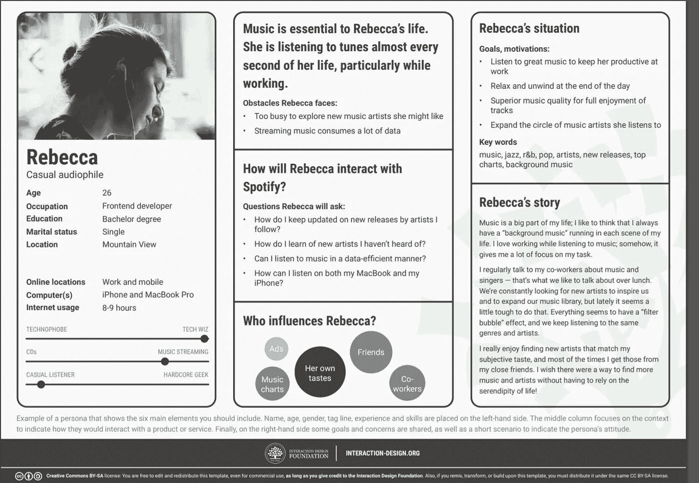

# 教前端工程微型硕士学位的经验——亚马逊之路

> 原文：<https://medium.com/hackernoon/teaching-masters-degree-frontend-engineering-the-amazon-way-733853409b59>

## 根据我在亚马逊担任首席软件工程师的经验，给工程师和企业家设计和教授微型硕士学位的七个建议

我最近在 [IVigo](https://ivigo.es) 和 React 一起设计并教授了一个[前端软件工程](https://ivigo.es/courses/masterclass-full-stack-front-react/)的微型硕士学位。这是一个压倒性的经验，需要大量的准备和执行工作，但也是一个有趣和令人兴奋的挑战。

在[IVigo](https://diariodevigo.com/ivigo-business-school-abre-sus-puertas-el-proximo-viernes-con-una-inauguracion-por-todo-lo-alto/)的官方发布会上，我想分享我的经历，我试图遵循的一些原则，以及我在这个过程中学到的最重要的经验。

Photo by [IVigo](https://ivigo.es)

## 关于 IVigo 和前端工程中的微硕士

IVigo 是位于西班牙加利西亚的一所新的商学院，其重点是“边做边学”的方法。该中心的管理人员熟悉我的职业生涯，并邀请我与他们见面。在谈论了他们的愿景并相互了解之后，他们提出让我教授 25 小时的前端工程微型硕士学位，并有完全的学术自由来准备课程。

[Audience with Spain’s King Felipe VI and Queen Letizia](https://www.instagram.com/p/Bpb2pc7Hgrt/)

## 关于我

我的名字是Á·阿尔瓦罗·雷内塞斯，虽然每个人都知道我是雷内塞斯(或英语世界中的任)，我是一名软件工程师和企业家，目前在爱丁堡工作。在亚马逊，我是人力资源部门两个团队的首席软件工程师。在我的*助手中，我是 [The Medizine](https://themedizine.com) 的联合总监，这是一家关于西班牙和拉丁美洲音乐、时尚和生活方式的参考媒体。*

# 1)克服冒名顶替综合症:你不是唯一的一个

Photo by [rawpixel](https://unsplash.com/@rawpixel?utm_source=medium&utm_medium=referral) on [Unsplash](https://unsplash.com?utm_source=medium&utm_medium=referral)

## *TL；大卫:相信你自己。如果很难，相信那些信任你的人。*

我第一次听说“冒名顶替综合症”是在亚马逊。一位同事这样描述他在公司的头几个月。几个月来听到这个术语如此之多，你意识到这是大多数工程师在加入一家新公司时都会经历的一种非常正常的感觉。

即使这个名字听起来没什么印象，我相信你也感觉到了:

> 冒名顶替综合征(也称为冒名顶替现象、冒名顶替主义、欺诈综合征或冒名顶替体验)是一种心理模式，在这种模式中，一个人怀疑自己的成就，并对被揭露为“骗子”有一种持续的内在恐惧

听起来像是 TEDx *的陈词滥调*，但是以我的经验来看，你最大的障碍是你自己。怀疑自己很正常，尤其是当你沉浸在一个新的环境/行业/业务中的时候；但是如果你想开发你的全部潜力，有那么一个时刻你必须站出来。已经有太多外在的壁垒了，不要再给自己添堵了。

亚马逊的一位同事告诉我，当他怀疑自己的时候，他总是记得一条建议:

> 相信招聘人员

我喜欢这个短语，但尤其是它的含义。概括和解释一下，我更愿意把它表述为:

> 如果你不信任自己，就信任那些信任你的人。

如果你钦佩你的同事/领导/朋友的工作，信任他们的判断，你为什么不相信他们信任你这个事实呢？

当我得到教授硕士学位的机会时，我的第一反应是怀疑我是否有资格这样做。我没有考研，也没有接受过任何正式的教学培训。然后我想:如果我没有该学科的直接经验…我有没有类似的知识可以转移？

在我的例子中，除了我的工作*本身*，我每周花很多时间与非技术同行(例如，设计师、产品/项目/团队经理、利益相关者)讨论前端，并教授同事工程师，从从未使用过 SPAs 的应届毕业生([单页应用](https://en.wikipedia.org/wiki/Single-page_application))到希望过渡到 fullstack 的高级后端工程师。

所有这些对话都教会了我如何谈论前端，并根据受众做出反应:哪些例子和隐喻最有效，哪些是最大的障碍，最常见的错误，以及哪些基础将实现可持续的自主学习曲线。

把表格拿出来，背景最后还是一样的。

# 2)通过承认你所知道的(和你不知道的)来面对失败的恐惧

Photo by [Marcos Luiz Photograph](https://unsplash.com/@marcosjluiz?utm_source=medium&utm_medium=referral) on [Unsplash](https://unsplash.com?utm_source=medium&utm_medium=referral)

## TL/DR:如果你对你所知道的(和不知道的)诚实(尤其是对你自己)，你将会避免妥协的情况。

几乎和冒名顶替综合症一样危险的是对失败的恐惧，尤其是对嘲笑的恐惧。上课前，我被问得最多的问题是:

> 你要给那些可能比你大的专业人士上课…如果他们问你一些你不知道的事情怎么办？

在我看来，如果你对自己的知识坦诚，那就没什么好担心的。这也是我在亚马逊学到的东西。每个人都愿意帮你一把，我在办公室从来没有听到过“那不是我的工作”。但是，几乎更重要的是，如果这个人不熟悉特定的主题，他们会说“我不知道”，然后是“我的理解是[一般性的解释]，但是[姓名]更了解这个主题”。

职业发展的一个非常重要的部分是认识到你知道什么和你不知道什么。如果你诚实，无论别人知道的比你多多少，你都不会有任何不舒服的情况。

回到亚马逊，这是我们大多数人历经艰难才学会的:如果你提出一个想法或计划，准备好证明你所有的主张。举个例子:当捍卫一个解决方案时，人们倾向于它，而不是同样强调它的替代方案。这经常导致伪装成事实的观点(“X 只是比 Y 好”)，或者其他选项没有被探索。当你与这些经验丰富的人共处一室时，很有可能有人会熟悉这个问题并问“为什么？”或者“你研究过 Z 吗？”这很尴尬——这是我的经验之谈。另一方面，如果你对自己的知识或研究范围很诚实(“我没有做过详尽的调查，但我的理解是[…]”)，同样的评论实际上会帮助你形成你的提议。为此，做一点自我批评是有益的:

*   我在哪些领域有更多的知识？我在哪些方面更有效率？他们通常在什么问题上向我寻求帮助？→这些都是你的强项。你有一个*义务*向社区传播你的知识，还有一个义务是你自己继续掌握这些优势。
*   有哪些话题让我感兴趣，但还没有深入了解？在哪些领域，如果没有第二意见，我会不放心做决定？→这些是你最接近的成长领域。你有机会利用它们来增长你的知识。

# 3)从学生开始，“倒着走”

Photo by [Cole Keister](https://unsplash.com/@coleito?utm_source=medium&utm_medium=referral) on [Unsplash](https://unsplash.com?utm_source=medium&utm_medium=referral)

## TL；博士:设身处地为你的学生着想，写下你想要达到的目标。然后，倒着走。

从客户出发，“向后走”是亚马逊产品开发的主要方法论。

这个过程很简单:跳到未来，想象你的新产品、服务或应用已经可用。现在是时候向公众和媒体公布了，回答如下问题:

*   你取得了什么成就？
*   给用户带来了什么价值？
*   哪些方面不完全清楚？
*   项目前景如何？

这个过程的结果是一个名为 PR FAQs 的文档，它实际上是一个包含 FAQ 的新闻稿，包括内部(面向亚马逊的其他部分)和外部(针对客户和媒体)。

这个过程基于同理心，设身处地为消费者着想，寻找解决方案；而不是有一个想法，并试图适应你的用户。

在设计微观硕士学位的内容时，我决定遵循同样的策略:后退一步，首先考虑学生。

我做的第一件事是创建[课程课程表](https://ivigo.es/courses/masterclass-full-stack-front-react/)。即使你头脑中有一个非常清晰的想法，以叙述的形式捕捉它有助于你找到漏洞和需要改进的地方。该文档还将作为内容创建过程中的路线图，以便您可以评估您的进度，避免偏离您的计划。

## 介绍

首先是课程的描述和目标。你要怎么办？课程的价值主张是什么？作为一名学生，你为什么要在这门课程上投入时间和金钱？预期的结果是什么？

> 本大师班的目标是以实用的方式介绍和学习“前端软件工程师”的角色，由于“单页应用程序”(SPA)的普及，以及 React、Angular 或 VUE 等技术，前端软件工程师的重要性和需求在过去几年中一直在增长。由脸书、谷歌或亚马逊等公司开发和/或采用。

## 观众

这门课程的目标受众是谁？哪些人口统计细分市场会有最高的 ROI(投资回报)？

这一部分不是要排除或隔离人们，而是要了解谁是你的潜在用户，以便确定沟通基调和优化内容。

这种策略在 UX 设计中很常见，创建了[用户角色](https://www.interaction-design.org/literature/topics/user-personas)，虚构的个人代表真实的人，他们有背景、品味、技能、生活方式…

Example of user persona — [Interaction Design Foundation](https://www.interaction-design.org/literature/topics/user-personas)

拥有一份目标受众的名单将有助于你制定议程，让你对受众的专业水平做出某些假设。

> 本课程面向任何希望进入 React 前端开发领域并/或在其中立足的程序员或软件工程师。
> 
> ——寻求网络技术额外培训的学生。
> -希望成为 fullstack 的后端开发者。
> -希望实现技术现代化的 Web 开发人员。
> -其他分支机构有编程知识，想转行做软件工程的工程师。
> -寻求巩固知识和完成培训的自学前端开发人员。

## 摘要

现在我们知道了我们想要达到的目标，以及我们的受众是谁，我们可以起草一份议程，也就是我们如何达到目标。

对于这一部分，我问自己“前端工程师每天需要什么？”，并研究了关于前端工程的现有在线课程、视频教程和书籍。

> 始终通过一种实用的方法，我们将重温 HTML 和 CSS 的基础知识(包括 flexbox 和 grid)，我们将学习借助最新的语言规范(ES6、ES7 和 ES8)发挥 JavaScript 的全部潜力。我们还将讨论大规模使用 JavaScript 的问题，以及如何使用 TypeScript 或 Flow 等语言来缓解这些问题。在剩下的课程中，我们将重点关注 React，这是一个由脸书创建的 JavaScript 库，我们将使用它从头开始开发各种应用程序。在这些主题中，我们将探讨一些概念和技术，如 React 路由器的“路由”、SPAs 中的身份验证和授权、React 最终表单的表单、Redux 的“应用状态”、WebSockets 的实时通知以及 API 和数据库的交互。我们还将讨论如何进行有效的“测试”和良好的开发实践，从小型创业公司到亚马逊规模的巨头的必要概念。
> 
> 最后，我们将讨论在生产环境中使用的高级概念(例如，“惰性加载”和“渐进式 Web 应用程序”/PWA，“服务器端渲染”)，尝试各种云提供商(例如 Heroku、AWS、Google Firebase、Digital Ocean)，并使用 React Native 创建原生 iPhone 和 Android 应用程序。

## 先决条件

前提条件是基于对我们的目标受众的假设。传达课程的水平是至关重要的，因为学生可以从从未写过一行代码的人到高级开发人员。

重要的是要记住，在一天结束时，这一部分是一个定位，它将帮助潜在的学生决定他们是否适合这门课程。不要指望你的学生 100%满足这些要求。

> -本课程假设一般的编程技能(数据结构和集合、条件运算符和循环、函数等)。).
> ——虽然我们会重温这些主题，但这门课程假设了 HTML、CSS 和 web 开发的基础知识。
> -虽然不是必需的，但推荐熟悉 JavaScript 并有相关经验。
> -尽管不是必需的，但建议具备面向对象设计(OOP)和函数式编程的知识

## 讲师

这一部分对于硕士*本身*的设计来说并不重要，但对于推销课程来说却是必不可少的——归根结底这一点至关重要。

你是谁？你知道你在说什么吗？你能为学生提供价值吗？是时候推销自己了。

> Á·阿尔瓦罗·雷内塞斯，人称“雷内塞斯”，是一名西班牙软件工程师和企业家，对技术、设计和商业充满热情。Reneses 以软件工程专业第一名的成绩毕业于奥维耶多大学，在美国、意大利和爱尔兰居住过之后，目前居住在爱丁堡(英国)，在亚马逊担任 Fullstack 软件工程师。
> 
> 在美国科技巨头内部，芮妮丝在人才管理组织中充当工程团队领导；在那里，他还担任前端专家，并指导和监督这些领域的其他团队。
> 
> 除了在亚马逊的职位，Reneses 还是 Medizine 的联合总监，这是一份关于音乐、时尚和生活方式的西班牙语参考资料。

# 4)记录约束并划定范围

Photo by [Brad Neathery](https://unsplash.com/@bradneathery?utm_source=medium&utm_medium=referral) on [Unsplash](https://unsplash.com?utm_source=medium&utm_medium=referral)

## TL；大卫:不要仅仅定义你要做什么，还要定义你要做多少。

当规划一个项目时(无论是否是技术性的)，我喜欢开始记录我们面临的所有限制，这将帮助我们划定一个适当的范围，并准备一个现实的计划。

与你的利益相关者一起回顾这份文件也将帮助你避免将来出现问题，比如以“我认为……”开头的短语。

## 限制

明确列出限制会迫使你考虑项目的所有细节。一般来说，三个基本问题是:

*   截止日期是什么时候？你有多少时间？
*   你有什么团队能力？你能指望多少人？
*   你的预算是多少？

就课程而言，除了潜在的后勤限制(设施、硬件、网速等。)，要考虑的主要因素是其持续时间和学生的专业水平:

*   幸运的是，课程的持续时间通常是明确规定的。在我的情况下，微硕士学位持续了 5 天，每天 5 小时:总共 25 小时。请记住，你不仅应该准备足够的内容，你不应该过头，否则你将无法实现你的目标。
*   班级的水平更难预料。你可以提前联系注册学生，获取他们的简历或要求他们完成自我评估，但实际上，在课程开始之前，你无法验证你的假设。

## 范围

在计划一个项目时，确定你要做多少和你想做什么一样重要。

例如，假设我们要实现一个视频上传服务:

*   我们想提供流媒体还是直接下载？
*   我们是否希望像网飞一样对文件进行预处理，生成针对多种设备和编解码器优化的版本？
*   我们是否想像 Twitter 一样拆分上传来缓解网络问题？
*   我们要支持多少用户？几百，几千，几百万…？

范围的大小直接取决于我们所面临的约束:约束越多，我们需要削减或缩小的功能就越多。

在设计课程的时候，我给自己设定了一个非常明确的范围:深入 React 的基础，同时概述更高级的主题，以便学生能够有一个坚实的基础，在此基础上继续自主学习。

有了明确定义的范围，你将能够更好地对内容进行优先排序，将每个项目分类为“必须拥有”或“最好拥有”——类似于[莫斯科方法](https://en.wikipedia.org/wiki/MoSCoW_method)。

# 5)既然你有了计划，那就做好扔掉它的准备

Photo by [Steve Johnson](https://unsplash.com/@steve_j?utm_source=medium&utm_medium=referral) on [Unsplash](https://unsplash.com?utm_source=medium&utm_medium=referral)

## TL；DR:做好一切准备，不断寻求反馈，快速迭代。

迭代是软件开发(例如 [Scrum](https://en.wikipedia.org/wiki/Scrum_(software_development)) )和企业家精神(例如[精益创业](http://theleanstartup.com/principles))的敏捷方法论的核心。

原则很简单:不管你在一个主题上有多少经验或知识，也不管你在项目的规划上投入多少时间:你不会第一次就做对。

总会有一些外部因素决定你计划的成功(或失败)，所以你必须准备好尽快处理这些因素，把问题转化为机遇。

对于微观硕士学位，一个选项本来是准备课程，并以第一次晋升为实验对象，观察什么有效，什么无效，然后为下一次晋升做出调整。

这种方法从长远来看是可行的，但对学生来说是不公平的。相反，我们为什么不减少迭代时间，并在类之间进行更改呢？或者更好的是，为什么不即时调整课程呢？

在课程规划过程中，我准备了一个议程，上面有我想涵盖的主题。每个部分包括:

*   理论(仅在绝对必要时)
*   现场编码(和学生一起做练习)
*   练习
*   练习的解析
*   理论的质疑与深化

每个主题的这种模块化为学生带来了有吸引力的动力，并且在为其他主题改变一些主题时非常灵活，或者改变详细程度(例如，在飞行中决定不做练习以将时间用于另一个主题)。

在最初的演示之后，我最初的计划是从快速回顾 JavaScript、HTML 和 CSS 开始课程。我预计花费不超过 30-45 分钟，假设学生们已经熟悉了 web 开发。然而，我准备了额外的练习和资源以防万一。归根结底，结果是学生们的水平比我预期的要低，但由于分配给 contingenices 的时间和额外的材料，我们能够在这个主题上花两个小时，直到我们有了一个坚实的基础。

第一条建议:跳过内容很容易，但即时创建却不容易。做好各种场景的准备，为暧昧预留时间。就像技术面试一样，很容易把注意力放在更高级的学生/候选人身上，却忘记为相反的情况做准备。

迭代的另一个例子。我最初的想法是在学习 React 的同时，和学生们一起开发一个应用程序——类似于 [Momentum](http://momentumdash.com) 。一旦课程开始，结果证明这并不像我预期的那样好，因为学生没有足够的时间理解我们在做什么，同时复制代码。第二天，我们改变了方法:我创建了一个公共存储库，在那里我发布了我正在开发的代码。因此，学生们有足够的时间集中注意力，在单独的练习中将所学付诸实践。

第二条建议:监控你决策的结果，并不断寻求反馈。不要害怕改变你的计划。

# 6)保持谦逊，赢得尊重和信任

“***** be HUMBLE” — Screenshot from [Kendrick Lamar’s HUMBLE](https://www.youtube.com/watch?v=tvTRZJ-4EyI)

## TL；博士:平等对待你的学生，赢得他们的信任，不要想当然。

尊重和信任不是任何职位的固有属性，而是必须赢得的。事实上，“赢得信任”是亚马逊的 [14 条领导原则](https://www.amazon.jobs/es/principles)之一:

> 领导会用心倾听，坦诚发言，尊重他人。他们口头上自我批评，即使这样做是尴尬或尴尬的。领导者不相信他们或他们团队的体味闻起来像香水。他们将自己和团队与最优秀的人进行比较。

在我看来，传统课堂的概念完全过时了，在传统课堂中，老师脱离现实谈论一个话题，而学生做笔记。此外，在我的学术经历中，我遇到过一些老师(尽管幸运的是不多)，他们在权威中掩盖了自己知识或经验的缺乏。

基于“边做边学”的沉浸式体验，学生可以随时参与和提问，创造了一个更适合学习的环境。此外，它还允许您收集反馈，并根据学员的需求调整课程。

教学的另一个重要方面，尤其是在研究生阶段，是平等对待学生。在软件工程中，有各种各样的技能和专业领域。事实上，你在某一方面拥有更多的知识并不一定意味着你比你的学生更专业。保持谦逊并认识到这一点将有助于你创造一个技能发展的最佳环境。

# 7)最终，你的课程和你的学生一样成功

Photo by [Vasily Koloda](https://unsplash.com/@napr0tiv?utm_source=medium&utm_medium=referral) on [Unsplash](https://unsplash.com?utm_source=medium&utm_medium=referral)

## TL；博士:不要只是教书，尽你所能帮助你的学生在专业上发展，发掘他们的全部潜力。

如今，任何能上网的人都可以免费学习几乎任何科目。这同样适用于前端工程:只需进入[官方 React 教程](https://reactjs.org/tutorial/tutorial.html)并开始开发 spa。

接下来的问题是，你能提供什么样的附加值让人们愿意投入时间和金钱？

你课程的成功是由你学生的成功来衡量的。作为一名讲解员，你的责任不仅限于教学，还包括帮助你的学生专业发展，发掘他们的全部潜力，以及分享你的经验。

这种附加值的一个例子是指导和个性化。有你的学生特别感兴趣的话题吗？你能修改练习使它们更吸引人吗？他们对哪种技术最感兴趣？他们如何在当前的工作中应用这些新知识？为了做到这一点，倾听学生的心声、提出正确的问题并根据他们的需求调整课程是至关重要的。执行现场编码将有助于他们理解所需的心智模型，而单独的练习将暴露出最不清楚的地方。愿意解决任何疑惑，帮助他们润色错误。

想想你自己的经历:在哪些领域找到资源更困难？在我看来，有很多文章都是关于开 SPA 的，但是很少有关于在企业规模上做的挑战。出于这个原因，我试图分享我在该主题中的经验，例如生产环境中最常见的问题是什么，以及如何通过真实的示例和案例研究来减轻这些问题。

此外，每天我都会留出最后 15-30 分钟来谈论学生们最感兴趣的话题。例如，其中一些主题是:

*   软件架构和系统设计。
*   如何扩展 web 应用程序以支持数百万用户。
*   前端工程趋势。
*   大型软件公司的技术面试，包括模拟问题、建议和准备策略。
*   在亚马逊工作和领导工程团队的个人经验和教训。
*   职业发展小贴士。

如果你已经读到这里，我希望你会发现我的文章对你规划课程、面对项目或职业生活的其他方面有用。

*用 React 设计和教授前端工程的微型硕士学位对我来说是一次全新领域——教育——的伟大职业经历。虽然一开始有点不知所措，但这是一个巨大的挑战，我在这一过程中学到了很多，并留下了学生充分利用这一点的印象。不要害怕尝试不同的事情！*

*随时联系我在*[*me @ Reneses . io*](mailto:me@reneses.io)*、LinkedIn(*[*Álvaro Reneses*](https://www.linkedin.com/in/alvaroreneses/)*)或 insta gram(*[*@ Reneses*](https://www.instagram.com/reneses/)*)！❤️*

你有兴趣加入爱丁堡的亚马逊吗？ [*我们总是在招聘*](https://www.amazondc.com/jobs) *！寻求推荐*😏