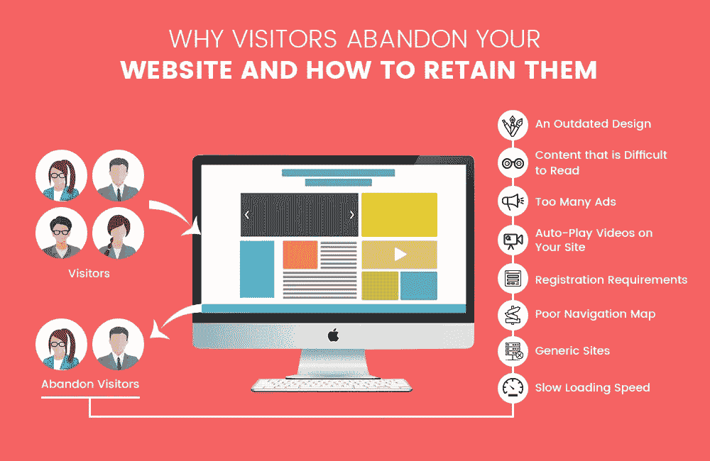
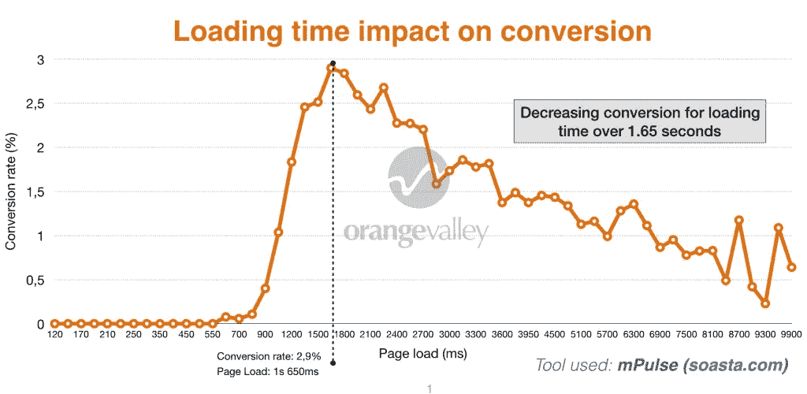
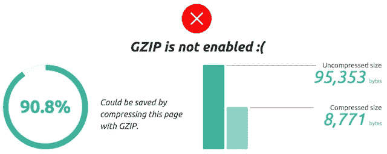

# 留住网站访客的 3 条黄金法则

> 原文：<https://medium.com/hackernoon/the-3-golden-rules-to-retain-your-visitors-on-your-website-6b842da6511c>

吸引访客是一回事，吸引并留住访客是另一回事。他只花了几秒钟就做出了决定。最轻微的挫折都能让他离开你的网站，增加你的跳出率。

后果如何？你的搜索引擎优化将开始下跌，因为搜索引擎分析用户在你的网站上花费的时间，并推断你的内容是没有质量的。

为此，我们将遵守 **3 条基本规则**，让你的访问者在浏览你的网站时有宾至如归的感觉。

# 优化用户体验(UX)

为了抓住访问者的**注意力，他们必须在你的网站上感觉舒服。为此，你网站界面的每一个动作都必须尽可能流畅，以便让他有愉快的体验，并让他有继续消费你的内容的欲望。**

这里有一些提示可以帮助你改善网站的用户体验。

# 不要让你的访客沮丧

用户不喜欢迷失在一个网站上，他的容忍度接近 0。因此，如果他开始寻找太多的信息，或者不明白你的网站是如何工作的，这会让他产生挫败感。正是这种情绪会引发你的访问者离开你的网站的欲望。

# 创建地标

导航必须保持流畅。为此，你的访问者必须尽最大努力完成一个动作。

为了便于导航，你的站点的用户界面(UI) 必须有标记。你的菜单、按钮、图标应该包含熟悉的元素，以免让你的访问者感到困惑。

**例子**:对于一个电子商务网站，人们通常使用购物车图标来表示购物车。大家都习惯了这个。如果你用一个库存类型的图标替换购物车，你的访问者会想知道这个图标的含义，因为它不会出现在通常的地标中。霍普，我们引发了一点挫折。

你可以，你必须在你网站的设计上有所创新，但是记住你不能打扰你的访问者的习惯。

# 避免不触发任何动作的交互

我们仍然经常在一些网站上看到触发鼠标指针通过的动画，但是当你点击它时什么也没有发生。挺好看的，但是没用。再次，一个小剂量的挫折。

# 让你的网站具有可读性

字体的选择是增加内容可读性的基础。糟糕的字体选择会让你的访问者厌倦阅读你的内容。选择无衬线字体，因为它在屏幕上更易读。为每种格式(移动、平板和桌面)选择字体大小。朗读课文，造短句和多段。

# 为移动设备优化您网站的显示

根据 Statista 的数据，超过一半的全球网络流量来自移动设备，这一比例在世界某些地区甚至更高。例如，亚洲超过 65%的网络流量来自移动设备。

此外，谷歌现在使用移动版本来评估你的网站在搜索结果中的排名。这一点必须给予最大的关注。

# 为你的目标优化内容

记住你是为你的目标设计内容，而不是为搜索引擎。你必须为你的 **SEO** 优化它们，但是是你的访问者会消费它们并因此评判它们。

# 你的客户是谁？

你的产品和服务面向谁？如果你不能准确回答这个问题，你就冒着瞄准下一个目标的风险。你将会精疲力尽地制作出几乎没有任何效果的内容。

# 研究你的目标

抓住观众兴趣的唯一方法是考虑他们的需求和目标。为此，有一种基于人物角色的方法可以代表不同客户的典型特征。

人物角色是用来人性化你的目标，更好地了解他们的兴趣。人物角色有精确的身份(名字、年龄、联系方式、性别等)。)、历史、价值观和行为。它也表明了它的动机，它的刹车以及它的专业目标。

创建你的人物角色是一个初步的工作，你可以依赖它来调整你的网站的**设计和你的内容。**

# 减少页面的加载时间

今天冲浪者不能忍受的一件事就是等待。所以，一个 10 秒钟加载的网站，90%的访问者都会跑掉。

此外，加载页面的速度是谷歌的一个重要标准，也是你网站搜索引擎优化的一部分。你想在 10 秒钟内给你网站的第一个访问者留下好印象…但是今天！你只有 3 秒的时间来吸引网民的注意力。导航的速度和准确性将吸引游客。根据一项研究，50%的用户期望页面的即时打开，少于 2 秒。

如果一个成功的设计太慢，加载了一个小工具或偏移，它就不再有吸引力。你的网站需要更快在网页设计过程中优先考虑加载网页的速度，速度是一个主要参数。一个网站将不再可信，如果它需要 5 秒钟来显示页面，用户不会等待！

为了优化你网站的加载速度，有几个技巧。以下是一些例子:

# 缩小图像尺寸

图像通常是页面上占用空间最大的元素，因此对它们进行优化至关重要。

**要缩小自己的尺寸，你可以:**

1.  减少它们的尺寸。
2.  压缩你的图像。
3.  优先考虑 JPG，PNG 和 SVG 格式。
4.  启用浏览器缓存。
5.  浏览器缓存是要在 CMS 上配置的设置。

与 JPG、PNG 和 GIF 相比，我个人更喜欢 SVG。根据 [SitePoint](https://www.sitepoint.com/svg-101-what-is-svg/) 的说法，SVG 使用数字、形状和坐标——而不是像素网格——通过在浏览器中渲染图形，使其独立于分辨率并具有无限的可伸缩性。此外，SVG 格式比其他格式更轻便。你所需要做的就是优化 [SVG 动画](https://www.svgator.com)以获得更快的加载速度。

它可以确保当一个冲浪者来访问你的网站时，他的浏览器将网页数据存储在他的硬盘上。当你的访问者去访问另一个有共同元素的页面时(比如徽标)，那些将会**加载得更快**，因为他的浏览器已经在内存中存储了你的站点的数据。

# 在 web 服务器上使用资源缓存

每当浏览器请求显示一个页面时，web 服务器将通过执行后者的所有代码来生成这个页面。服务器计算页面显示的时间(几毫秒到几秒)会给访问者造成或多或少的延迟。

为了减少生成时间，您必须在您的 **CMS 服务器**上设置一个缓存系统，允许您存储所有已经生成的页面。当将来请求它们时，您的服务器将直接在缓存中显示它们，而不是重新生成它们。

浏览器(客户端)和 CMS(网络服务器端)的缓存是互补的。

# 启用 GZIP 压缩

要查看网页，您的浏览器需要下载大量包含内容信息的文件。这些文件具有一定的权重，需要一些时间来下载。为了加快传输速度，您必须事先在您的服务器上激活这些文件的压缩功能( **GZIP** ),以减轻它们的重量。

# 缩小你的 HTML，CSS 和 Javascript 文件

缩小是一个过程，将减少你的 HTML，CSS 和 Javascript 文件的代码大小。你的页面重量仍然增加了几公斤字节。

# 优先加载页面顶部的内容

这种技术不会减少页面的**加载时间，但会推迟水线以上不可见内容的加载(这条假想线以下的页面内容只有在‘我们正在下降’时才可见)。**

当用户阅读页面顶部的内容时，其他内容会继续加载，无需等待访问者。

# 数字战略——网络开发者

如你所见，T2 有很多技巧可以让你的访客留在你的网站上。你有什么意见要和我们分享吗？发表您对该主题的评论！