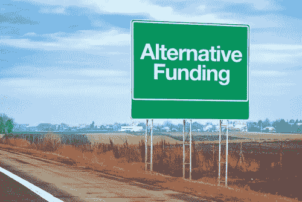
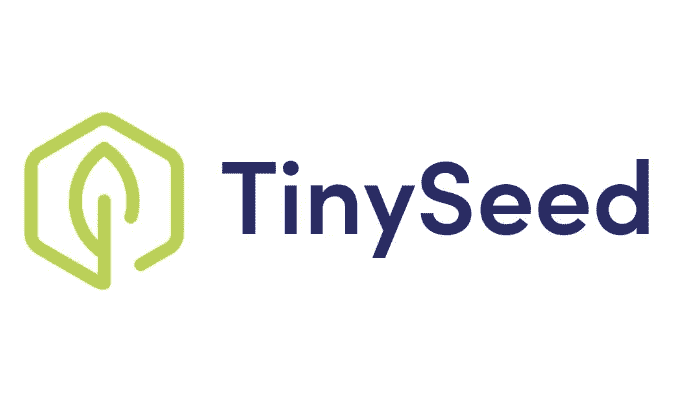
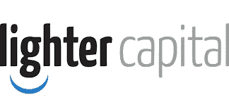
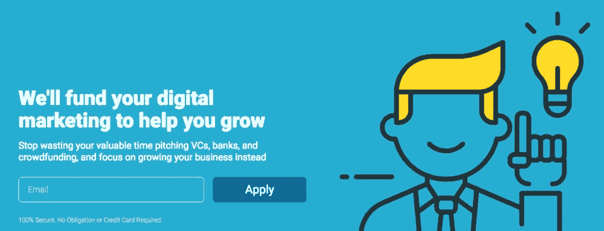

# SaaS 初创企业的五种可选融资方案

> 原文：<https://medium.com/hackernoon/the-alternative-funding-options-for-saas-start-ups-cheat-sheet-1d5c63c3dbcf>

杰夫·罗伯茨

当我们第一次开始建设 Outseta 时，我们直截了当地表示，我们对筹集风险资本不感兴趣——相反，我们计划让[启动业务并保持独立](https://www.outseta.com/posts/saas-start-ups-quest-for-independent-growth)。这并不是说我们对风险投资本身有任何问题，这只是反映出，如果我们认为这对业务不合适，就永远不希望被迫去追求增长。有机增长有很多优势，但还没有被充分讨论。

在过去的 12 个月里，像我们这样的公司可以利用的新融资选择和模式激增。他们中的许多人很有吸引力，以至于他们颠覆了我们自己的内心对话。

这篇文章是写给其他处于早期阶段的 SaaS 公司的，他们同样在考虑这些新形式的资本是否对他们的业务有意义。我已经阅读了突出每只基金的独特属性和它们最适合谁的细则，我将分享我们自己对每种模式对我们自己业务的吸引力的想法。

# Indie.vc (V3)

*   网址:【http://www.indie.vc/ 
*   关键人员:[布莱斯·罗伯茨](https://www.linkedin.com/in/brroberts/)
*   收入要求:后收入，但没有最低要求。
*   股权:是的，但会减少到 Indie.vc 初始股权的 10%。
*   董事会席位:否
*   投资文件:[https://github.com/indievc/terms](https://github.com/indievc/terms)
*   申请截止日期:2019 年 3 月 1 日
*   申请这里:[http://www.indie.vc/apply](http://www.indie.vc/apply)

独立风险投资是这个领域的 OG，并把自己描述为“后收入公司的增长收入”这是该公司的第三只基金，旨在支持创始人走向盈利之路。

# 投资模型

该计划是一个持续 12 个月的加速器，投资金额从 10 万美元到 100 万美元不等——该基金的历史平均水平约为 28.5 万美元。如果你选择出售你的公司，投资文件中会包括分配给基金的预定百分比的所有权。您的公司将在投资完成后 12 至 36 个月开始偿还基金。

通常创始人会支付月收入的 3%-7%，直到他们偿还了 3 倍于投资额的基金。每支付一次，基金的所有权股份就会随着创始人的所有权股份的增加而减少。创始人可以通过这些付款或一次性付款回购高达 90%的基金股权，基金保留最初分配的 10%的股权。

# 他们如何提供帮助

Indie.vc 主要通过让创始人相互接触、为投资组合公司组织季度活动和务虚会来帮助他们。该基金还与每个投资组合公司举行月度会议。

# 评论

Indie.vc 的模式真的很吸引我——他们已经这样做了几次，我怀疑他们已经解决了许多问题。他们模式的简单性也吸引了我——预先确定的企业股权，你需要向基金回报的 3 倍回报，以及你可以赚回基金最初获得的 90%股权的事实。

我甚至喜欢该基金持有剩余股权，这样它们就能长期支持你。他们最初发行的 10%的股权可能会被视为过高，特别是如果他们正在投资的公司在 MRR 已经有 20，000 美元以上，所以这是需要考虑的事情。但是，把你从金钱中获得的公司和人视为长期商业伙伴总是好的。

# 细小的

*   网址:[https://tinyseed.com/](https://tinyseed.com/)
*   关键人员:[罗布·沃林](https://robwalling.com/)，[埃纳尔·沃尔塞特](https://www.vollset.com/)
*   收入要求:没有最低要求
*   股权:是— 8%-15%
*   董事会席位:否
*   投资文件:[https://tinyseed.com/faq/](https://tinyseed.com/faq/)
*   申请截止日期:2019 年 2 月 15 日
*   申请这里:[https://tinyseed.com/apply/](https://tinyseed.com/apply/)

像 Indie.vc 一样，Tinyseed 不仅仅是一个融资模式，而是一个为期 12 个月的加速器计划。该基金专门关注订阅软件公司，并愿意投资预收入公司。

# 投资模型

Tinyseed 为你公司的第一位创始人投资 12 万美元，然后每增加一位创始人投资 2 万美元。该基金在你的企业中持有 8%-15%的永久股权，尽管他们没有董事会席位或任何投票权。

在投入的资金中，一笔总付的款项将用于支付启动费用，剩余部分将在项目持续期间作为工资按月支付给创始人。创始人同意工资上限(基于最近的大城市软件工程师的平均工资)，并可以随着企业的盈利增加他们的工资至该上限。任何超过工资上限的收入都将作为股息支付，根据创始人和基金在公司的持股比例支付给他们。

就何时分红而言，创始人拥有完全的选择权——如果他们愿意将收入再投资到企业中，他们有权这样做。这里的想法是，当创始人选择获得报酬时，基金就会获得报酬。如果公司出售，Tinyseed 将收回最初的投资(减去迄今为止支付的任何股息)，然后根据在企业中的所有权比例分配收益。

# 他们如何提供帮助

Tinyseed 一次投资 10 至 15 家公司，这样投资组合中的公司就可以从相互接触中受益——这包括每周与其他投资组合公司通话。他们还有一个由导师组成的网络，如果你想建立一个早期的 SaaS 公司，这个网络可能是最强大的。导师可在预定的办公时间致电。

# 评论

Tinyseed 对我特别有吸引力，因为它的资金、顾问和它将我们带入的生态系统——tiny seed 资助的公司代表了我们在 Outseta 的确切目标市场。虽然有一些额外的现金投入业务并开始领取一些薪水是不错的，但 16 万美元的总额在 3 名创始人之间分配时不会太多。这可能会让我们每个人每月拿到 3000 美元左右的薪水——这远远不够维持生活——这让该基金的资金成为对单身创始人更具吸引力的选择。

在我看来，顾问是申请该基金的一个重要原因，但他们也可能是最大的变数。投资组合公司实际上与每位顾问有多少互动？这不像兰德·菲什金有时间和 10-15 家公司在搜索引擎优化上合作，也不像希滕·沙阿有时间和每家公司在产品策略上合作。我知道顾问不仅仅是营销网站上的名字，但他们的参与程度肯定是一个公开的问题。对我们来说，生态系统是显而易见的。

值得注意的是，Tinyseed 获得并保持了该列表中任何选项的最大股权，但鉴于他们通常进行早期阶段(风险更高)投资，这一股权似乎是合理的。如果我是一名投资者，这种模式对我来说会非常有吸引力——如果一家公司表现相当好，花 12 万美元购买一家公司 8%-15%的股份可能会被证明是非常有利可图的。我相信这个基金将会看到来自一些优秀公司的大量申请。

作为一名经营者，我喜欢基金在创始人获得报酬时获得报酬的模式——我认为 Tinyseed 抓住了他们投资模式的这一方面。虽然我并不热衷于放弃公司 8%-15%的股权，但根据公司所有权的百分比支付股息对我来说是合乎逻辑的。我对股权感到满意，因为这意味着导师和参与该基金的其他人将长期站在你这边，这是一个非常惊人的好处。

旁注——我们申请的是 Tinyseed。下面是[我们的申请答案](https://docs.google.com/document/d/1OQdBTnGuSyVoZRxf2g1JJTKSTFbQaMPYS_NTDJvFtgw/edit?usp=sharing)。

# 真实资本

*   网址:【https://earnestcapital.com/ T3
*   关键人员:[泰勒·特林加斯](https://tylertringas.com/)，[最可靠的资本](https://www.sureswiftcapital.com/)
*   收入要求:没有最低要求
*   股权:是的，但正在减少。根据违约条款，Earnest 持有少量剩余股份。
*   董事会席位:否——根据要求，Earnest 可以成为无表决权的董事会观察员
*   投资文件:[V1 分享收益协议](https://docs.google.com/document/d/1MoLiH_VnhX-0vfZ1zgMSfpcIt0rdyD9rc27BbypplDI/edit)
*   申请截止日期:2019 年 1 月开始开放申请
*   申请这里:[https://earnestcapital.com/apply/](https://earnestcapital.com/apply/)

Earnest Capital 对“创业者、独立创业者、制造商和真正的企业”进行种子阶段投资。他们的投资模式是为了与那些希望建立可持续盈利企业的创始人保持一致而开发的。

# 投资模型

Earnest 通常在产品推出之后，但在创始人开始全职经营公司之前，对企业进行前期投资。投资模型有两个主要组成部分:

1.  企业会返还一个“回报上限”,其金额是投资于公司金额的 3-5 倍。
2.  在他们的默认条款中，即使在他们的回报上限被偿还后，Earnest 仍将保留一小部分剩余股权——这一金额随着基金的偿还而减少，但永远不会达到 0。这意味着，Earnest 和他们的顾问仍然有动力在回报上限完全支付后继续帮助你发展业务，因为如果销售发生，他们会参与销售。负责人泰勒·特林加斯(Tyler Tringas)表示:“在回报上限得到偿还后，我们可能仍会提供和做没有剩余股份的交易，但这可能需要更高的总回报上限，以弥补剩余股份的不足。”。

Earnest 计算“创始人收入”，即净收入+创始人超过预定阈值的任何金额的工资。与 Tinyseed 类似，这种模式旨在为创始人提供选择，如果他们认为合适，可以继续将利润投资于他们的企业，而且只有在创始人获得报酬时，基金才会支付。

# 他们如何提供帮助

Earnest 还有一个强大的导师网络，他们都投资过 Earnest 的公司。导师制没有课程或规定的结构；认真的公司应该告诉基金他们需要什么，并寻求帮助。所有的指导都是远程处理的。

# 评论

我真的很喜欢关注 Earnest Capital 的故事，以及对他们投资模式的研究。我也喜欢他们所有的顾问都参与到游戏中来——这无疑让我觉得他们会变得平易近人、乐于助人。像 Tinyseed 一样，我喜欢在创始人获得报酬时基金也获得报酬，但如果向基金返还 3 倍而不是 5 倍的投资金额，Earnest 对我更有吸引力。

就像 Tinyseed 一样，我理解这种情况的原因，因为他们正在进行早期阶段的押注，所以这有点像挑你的毒药——更大的回报倍数或更大的股权。但是我不愿意拿太多的钱。承担 20 万美元并需要偿还 100 万美元的想法有点令人生畏。

我们也在考虑申请 Earnest 考虑到即将到来的截止日期，我们优先考虑了 Tinyseed 申请。Earnest 还要求创始人提供一些额外的材料，包括我们尚未拍摄的产品视频概述。敬请关注。

# 打火机资本

*   网址:【https://www.lightercapital.com/ T3
*   关键人员:[BJ·拉克兰](https://www.outseta.com/posts/an-interview-with-bj-lackland-ceo-lighter-capital)
*   收入要求:每月 15，000 美元的经常性收入和 50%以上的毛利率
*   股权:否
*   董事会席位:否
*   在这里申请:[https://www.lightercapital.com/apply/](https://www.lightercapital.com/apply/)

Lighter Capital 向美国的 SaaS、技术服务或数字媒体公司提供“基于收入的融资”。迄今为止，他们已经为 300 多家初创企业提供了资金。

# 投资模型

Lighter Capital 的投资金额为 5 万至 300 万美元，最高可达一家公司的年化营收⅓。所借的钱通常在 3-5 年内偿还，偿还额占你月收入的 2%-8%。通常归还的金额是借款金额的 1.35 倍至 2 倍。

公司不需要盈利才能获得融资，但公司未来应该有明确的盈利途径。资金通常在申请后 4 周内收到，后续融资可在 3-4 个工作日内发放。打火机资本只资助总部设在美国的公司。

# 他们如何提供帮助

打火机不是加速器，也不提供导师网络——相反，它更像是一个真正的融资选择。“坦率地说，除了报告，我们最有帮助的是规划公司的融资，”首席执行官 BJ·拉克兰说。“与风投不同，我们不一定需要知道南卡罗来纳州医疗保健技术领域的最佳销售副总裁候选人。我们知道的是，如果你的收入是 X 百万，并且有这样的消耗率和增长率，你可以从哪些不同的来源获得什么样的资本？无论是天使投资人、风险投资人还是银行，我们可能知道如何向你介绍这些来源。因此，我们可以在战略方面提供帮助，主要是在资本方面。”

# 评论

更少的资本毫无疑问，这些模式中最有吸引力的是，鉴于他们做出融资决策的速度，你只是在寻找融资，而且你只能获得 1.35 倍至 2 倍的借款回报。也就是说，这是有原因的——他们只投资 MRR 资产超过 15，000 美元且财务指标健康的公司，承担的风险要小得多。

Outseta 还没有出现，所以目前这个选项对我们来说是遥不可及的。

# 梅特卡夫基金

*   网址:【https://metcalfe.fund/ T3
*   关键人员:[米奇·凯斯勒](https://www.linkedin.com/in/mitchkessler/)
*   收入要求:每月收入 10，000 美元
*   股权:否
*   董事会席位:否
*   申请截止日期:开放申请
*   申请这里:[https://metcalfe.fund/#signup](https://metcalfe.fund/#signup)

Metcalfe 基金是一种新的融资选择，它“使用实际业务数据而不是信用评分为在线业务提供增长资本。”该公司投资 SaaS、电子商务和其他类型的在线业务。

# 投资模型

在向您的公司提供资金后，Metcalfe 会根据您未来销售额的约定百分比逐步返还给您。还款每天都会发生，每天销售额的一小部分会自动从你的银行账户中扣除——他们将这种投资模式称为结构化未来收入购买，或 SFRP。该公司提供 1 万至 50 万美元的融资，通常在 6 个月内收回，收取 6%-10%的费用(年化 12%-20%)。贷款决定可以在几天内做出。

我问创始人米奇·凯斯勒(Mitch Kessler)在做贷款决定时会考虑哪些因素。“一般来说，我们会评估一家公司的营销成熟度和财务健康状况，”凯斯勒说。“我们可以交叉混合营销和财务指标，如交谈率、CAC、LTV、AOV 和收入预测，以更好地了解他们在营销帮助下的潜在未来收入，以及他们是否能够自己做到这一点，或者他们是否需要我们网络中营销人员的帮助。”

企业必须设在美国，并已开业至少六个月才有资格。

# 他们如何提供帮助

Metcalfe 的融资模式特别关注提供用于数字营销和增长的资金。Metcalfe 本质上是一个由经过审查的营销机构和人才组成的市场，它反过来会将这些营销机构和人才介绍给它提供资金的公司。通过扮演媒人的角色，Metcalfe 寻求为机构提供有钱消费的客户，同时为公司提供预先审查过的营销合作伙伴，这些合作伙伴将尽可能高效地部署所提供的资本。

# 评论

在这份名单上的备选方案中，许多是新的，Metcalfe 是最新的。像更轻的资本一样，这种选择对于还没有达到每月 10，000 美元收入要求的早期公司来说是遥不可及的。对于需要短期资金投入市场营销的企业来说，这是一个具有合理回报条件的强有力的选择。这也是一种与没有内部营销专业知识的更多技术团队很好结合的模式。从一家同时为你和他们信任的代理伙伴牵线搭桥的公司获得融资让人放心。

# 新一代的融资选择就在这里

这份名单上的所有选择都是新的有趣的选择，允许创始人在保持对其业务控制的同时筹集资金——而且似乎每天都有更多的选择进入市场。新一代企业家不再被千篇一律的融资模式束缚，而是认识到，如果你能构想出一种新的融资结构，你就有可能实现它。但更重要的是，似乎有一个新的重点是建立真正的，有利可图的企业。我个人认为，这是一件好事，最终会带来更强大、更持久的企业。

*最初发表于*[*【www.outseta.com】*](https://www.outseta.com/posts/alternative-funding-saas-cheat-sheet)*。*