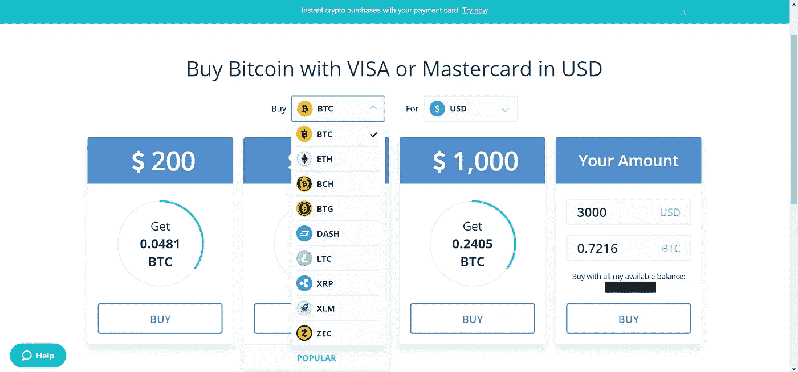
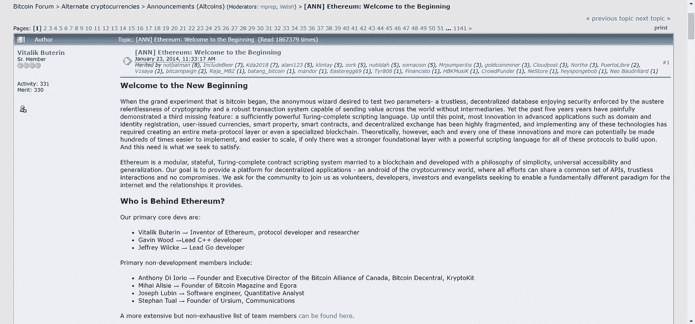

# 投资比特币和加密货币的初学者指南:入门

> 原文：<https://medium.com/hackernoon/the-beginners-guide-to-investing-in-bitcoin-cryptocurrency-getting-started-845958949e13>

## 比特币投资入门并不复杂，尤其是现在是 2019 年

我相信你和很多人一样，通过朋友听说过比特币，或者在互联网上的某个地方看到过它，可能是通过博客或 YouTube 视频。

像大多数人一样，你的第一个问题可能是“我如何进入比特币”或“什么是比特币”。

起初这看起来很吓人，当我买下我的第一个比特币时，我彻夜未眠，因为对这种新的、奇怪的、基于区块链的数字货币感到焦虑。

这种焦虑的一部分是由于太多不同的和分散的信息来源，这让我感到紧张。

我想做的只是购买一些比特币，但现在我注册了多个交易所，并打印出纸质钱包(使用离线打印机)，同时带着焦虑和兴奋的混合情绪颤抖。

我可能不是唯一一个遇到困难的人，因为“如何开始使用比特币”和“我如何购买比特币”是我在网上经常看到的两个问题。

不幸的是，有如此多的信息分散在许多不同的平台上，而事实是，开始其实很简单。

比你想象的简单，尤其是这么多年后的现在 2019 年。

## **比特币投资入门**

要开始投资比特币和其他加密货币，你首先需要注册一个允许你用现金购买加密货币的交易所。交易所基本上是一个在线平台，让任何人都可以买卖比特币以及他们上市的任何其他加密货币。

你可能必须验证你的账户，才能在大多数声誉良好的交易所购买或提取更大量的比特币(或任何其他加密货币)。

[CEX — Choosing a cryptocurrency to invest in](https://cex.io/r/0/up106280379/0/)

你可以从**开始，它让你获得比特币和其他高价值的“蓝筹股”加密货币，如 Ripple (XRP)、以太坊(ETH)和恒星流明(XLM)。**

**验证速度很快，购买/提取限额相当慷慨，验证用户的每日存款限额为 2 万美元，每日提取限额为 5 万美元。**

**一旦你购买了你的比特币(或任何其他选择的加密货币)，你可以把它放在交易所，或者把它转移到你自己的个人钱包里(如果你有钱包的话)。在寻找钱包的同时，你可以把你的硬币放在兑换处。**

## **钱包**

**比特币和其他加密货币是使用钱包“存储”的，钱包意味着你拥有发送到钱包的加密货币。每个钱包都有一个公共地址和一个私钥。**

**您使用公共地址接收资金，使用私有密钥花费资金。**

**好的加密货币钱包包括:**

**[**【Blockchain.com】**](https://www.blockchain.com/)为比特币(BTC)、以太坊(ETH)、比特币现金(BCH)和恒星流明(XLM)**

**[**MyEtherWallet**](https://www.myetherwallet.com/) 兑换以太坊和 ERC-20 代币**

**[**Rippex**](https://rippex.net/) 为 XRP/涟**

****

**Blockchain.com Wallet**

**这就是真正开始的所有需要，你也可以花一些时间使用在线论坛研究其他加密货币。**

## ****如何研究比特币和其他加密货币****

**一旦你买了你的第一个比特币，并为自己搞到了一些“蓝筹”加密货币(市值超过 20 亿美元的加密货币)，你就可以开始研究你选择的加密货币或研究新的加密货币。**

**一个很好的起点是 Bitcointalk，这是一个加密货币开发者和投资者可以聚在一起讨论特定加密货币的论坛。**

**如果你想找到一种加密货币的具体线索，只需在搜索栏中键入加密货币的名称和缩写“ANN”(announcement 的缩写)。**

**例如，你可以输入**“[安]以太坊”。****

**这会引导你一个叫做“[安]以太坊:欢迎开始”的线程。**

**在这篇帖子中，以太坊的创始人 Vitalik Buterin 宣布了以太坊的创建，并提供了其他信息，包括:**

*   **关于以太坊 ICO(初始硬币发行)到众筹以太坊开发的信息**
*   **提供详细信息的白皮书和黄皮书的链接，包括以太坊背后的理念和技术信息。**

****

**Bitcointalk.org — [ANN] Ethereum: Welcome to the Beginning**

****注:**白皮书是一份报告或指南，向读者介绍产品或服务背后的理念，以及它打算如何解决一个复杂的问题。**

**黄皮书是一份包含尚未被正式接受或发表在学术期刊上的研究的文件。**

**我建议阅读每个“公告”帖子开头的信息，这通常会给你提供高质量的信息，例如:**

*   **硬币的总数**
*   **流通中的硬币数量**
*   **采矿信息**
*   **不管有没有预雷**
*   **关于创始人和开发者的信息**
*   **关于奖金的信息(任务一旦完成就奖励你加密货币，例如为网页、线程和博客帖子提供翻译服务)。**
*   **钱包信息**
*   **开发路线图(一个时间表，向您显示预期的开发里程碑以及实现每个目标需要多长时间)**
*   **ICO 或众筹信息**
*   **隔空投送信息(隔空投送是指一种加密货币免费分发给拥有另一种加密货币或特定钱包的人)**
*   **代码信息(如果加密货币是开源的，在大多数情况下应该是开源的)**
*   **联系信息**

**Bitcointalk 也非常适合了解最新的新闻和发展，并能够与其他投资者和开发者交流。**

**这是涉足加密货币领域的好地方。**

## ****最终想法****

**比特币入门不一定要复杂，尤其是在这个时代。**

**我建议从比特币(BTC)作为投资选择开始，让它占你投资组合的 50%左右，然后添加一些“蓝筹”加密货币，如以太坊(ETH)、Ripple (XRP)和 Stellar (XLM)。**

**拥有一个以蓝筹股加密货币为主的投资组合是一个有利可图且相对安全的策略。**

**随着你财富的增长，你可以增加风险更高、市值更低的加密货币，但我相信，从长远来看，蓝筹股投资组合的表现总是会优于风险更高的投资组合。**

**美元成本平均法——每周或每月投资一定数量，当价格下跌时投资更多，当价格上涨时投资少一点——是投资比特币和其他加密货币的另一个伟大策略。**

****注意:**你不必买一整枚比特币来投资，你可以根据你想花多少钱来购买任何金额，例如你可以购买 1 BTC，0.75 BTC，0.5 BTC，0.25 BTC，0.1 BTC 等。大多数加密货币也是如此。**

****TL；博士:****

1.  **[注册加密货币交易所](https://cex.io/r/0/up106280379/0/) : [**CEX**](https://cex.io/r/0/up106280379/0/) 提供多种加密货币，信誉卓著。**
2.  **下载一个钱包: [**区块链**](https://www.blockchain.com/) 对新手来说是个不错的选择， [**Rippex**](https://rippex.net/) 对 XRP/Ripple 来说不错，因为它线下存储 XRP。网站是葡萄牙语，但谷歌应该为你提供翻译，钱包本身是英语。**
3.  **研究新的加密货币，[Bitcointalk.orgT21](https://bitcointalk.org)是一个很好的开始**
4.  **每周/每月保持你的投资或平均成本**

****