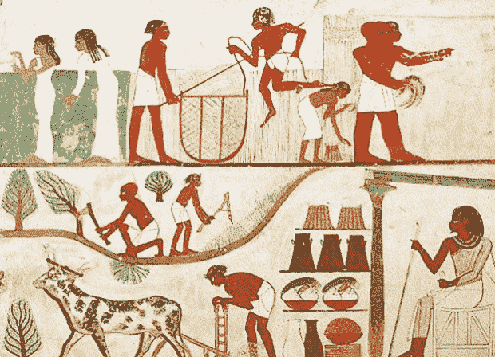

# 脸书时代的结束

> 原文：<https://medium.com/hackernoon/the-beginning-of-the-end-of-the-facebook-era-f5cb03c1c45e>

## 以及社交媒体的分工

我离开脸书已经六个多月了。我放弃的原因主要是因为我觉得没有目标，在无休止的内容中滚动，没有特定的主题或潜在的动机——没有更大的目标来产生意识、传播知识或快乐；甚至社交媒体[打算——或者至少声称——做的社区强化，脸书也没有成功实现。](https://hackernoon.com/tagged/social-media)

从那以后，[我的生活得到了改善，原因有很多](https://twitter.com/sukienniko/status/1086490833392590848)，其中一个重要原因是:意识到向数百名观众发布个人更新的想法令人难以置信的尴尬，并因此减轻了这种尴尬，其中只有几十人(如果真的在乎的话)。

但是，除了我的个人生活水平因我的盛大离开而提高之外，越来越多的人——甚至是意识——认为使用该平台可能弊大于利，因为它会在更广泛的受众中传播，超越通常的仇恨者和反对者。

有大量的证据表明情况确实如此，但是在这一点上结论是明确的:脸书已经变得太大了，以至于它在自己的重量下崩溃了。它承担了太多的角色；功能太多。不仅如此，该公司似乎有兴趣收购任何社交应用，只要它的网络足够大，有朝一日会构成威胁。这让我质疑，这里的动机是什么？脸书的目标真的是将人们联系起来，还是为了保持他们对历史上最大数据量的掌握，以维持他们在行业中的权力和主导地位？——这似乎终究不是一个有益的目标。

从技术的角度来看，这是相当大的成就。但从社会的角度来看，这是令人憎恶的。脸书的权力和支配地位对社会本身是一种威胁，有能力[影响人们的情绪](https://www.forbes.com/sites/gregorymcneal/2014/06/28/facebook-manipulated-user-news-feeds-to-create-emotional-contagion/#27bf6e7339dc)、[威胁民主](https://www.nytimes.com/2018/11/07/technology/facebook-russia-midterms.html)、[侵犯隐私](https://www.theguardian.com/technology/2018/dec/19/facebook-shared-user-data-private-messages-netflix-spotify-amazon-microsoft-sony)，并有可能[加剧暴力冲突](https://www.bloomberg.com/news/features/2017-12-07/how-rodrigo-duterte-turned-facebook-into-a-weapon-with-a-little-help-from-facebook)。

这就是为什么，与其指望脸书变得更负责任，我们不如考虑接受它的衰落是一个无法改变的自然过程。因此，解决方案不是创造一个更负责任的脸书，而是限制一个平台的使命，使其不会变得像脸书一样庞大和难以维护。要做到这一点，我们需要远离通用的社交平台，开始专业化。

## 社交的未来不是万能的

未来的社交平台将会以多种专业化平台的形式出现，每种平台都是围绕特定主题或内容类型为特定受众量身定制的。这就是我所说的，*社交媒体的分工*。不同的平台将服务于不同的用户需求，或者处理特定类型的内容。这并不意味着每个爱好都有一个社区(脸书有高尔夫，脸书有迪斯尼迷，等等)。)，只是说明人们在选择登录特定平台时，心中会有特定的目的(“我想看体育动态”、“我想听新发布的歌曲”等)。一些现有的内容网站和服务正通过添加更多的社交功能来满足这一需求，从而成为分享和讨论特定主题内容的中心。

Division of labor has been crucial for economic growth and prosperity [since ancient times](http://sciencenordic.com/crucial-choice-cultivate-land). In this case, we are not using physical resources, but digital ones, more efficiently.

例如，YoutTube 最近增加了一个内置的私人信息功能。这意味着，要将 YouTube 视频分享给朋友，你不需要将链接复制到脸书信使中；你可以在那里做。同样的道理也适用于音乐领域的 [SoundCloud](https://soundcloud.com/) ，创业领域的 [AngelList](https://angel.co/) 和 [ProductHunt](https://www.producthunt.com/) ，美食领域的 [Yelp](https://www.yelp.com/) ，写作领域的 [Pinterest](https://www.pinterest.com/) ，艺术和手工艺领域的[，职业领域的 Linkedin。所有这些平台的共同点是它们都是社会化的、专业化的。](https://www.pinterest.com/)

## **专业化的好处显而易见**

每个平台在构建时都有一个特定的范围，并定义了它将处理的内容类型，然后可以分配资源以尽可能最好的方式处理这些内容，雇用对这些内容的创建和扩散有着复杂理解的人员，了解围绕这些内容的政策和法规，也许最重要的是，了解保持高标准的趋势和激励因素。此外，这种专业化平台可以通过了解用户的习惯和常见用例，并定制其功能来利用这种行为，从而最大化社区的价值。随着越来越多的基于内容的平台开始针对特定的内容和消费者改进和优化它们的功能，脸书的目的开始变得苍白无力。Reddit 的联合创始人 Alexis Ohanian [似乎同意](https://www.businessinsider.com/reddit-cofounder-alexis-ohanian-says-tech-has-hit-peak-social-2018-12):

> Ohanian 说，人们越来越希望属于一个由志同道合者组成的更小的社区，而不是社交网络。

我们将开始看到更多的平台出现，专门为不同的社区提供不同类型的内容，每个平台都将开始一点一点地蚕食脸书的市场份额，用户群将迁移到更适合他们需求的平台。在未来，我们将会看到专门针对脸书目前服务的每个用例的新平台，甚至更多。

每个伟大的帝国都有衰落的时候。在某一点上，有太多的因素和变量需要调节，其中许多都是相互关联的，并且处于不断的变化中，即使是最先进的人工智能也无法将它们全部协调到一个优化的稳定状态。与其延长这种消亡，不如明智地开始前进，通过唯一合乎逻辑的下一步，即社交平台的分工，修改数字媒体生态系统。

在未来，脸书可能会被视为一个案例——一个网络潜力的范例。但是警告说*仅仅因为它可以，并不意味着它应该。*