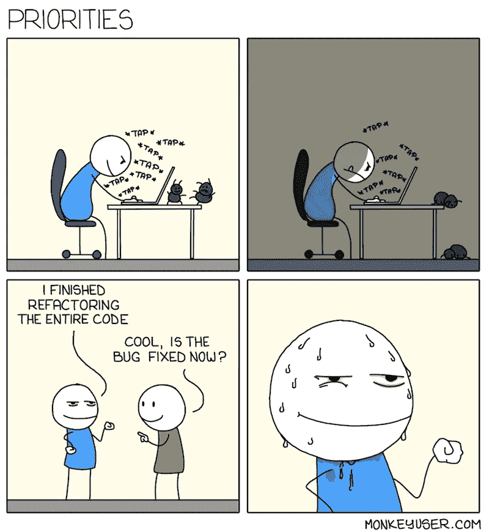

# 大局—协调优先事项

> 原文：<https://medium.com/hackernoon/the-big-picture-and-aligning-priorities-d9bfc97bfb89>

我知道这是直接从*部门开始的，对显而易见的*进行反复强调，但是，是的，大局很重要。不管你在组织中处于什么位置，不管你的工作是什么，不管你的职责是什么，这都很重要。

/via [https://www.monkeyuser.com/2018/priorities/](https://www.monkeyuser.com/2018/priorities/)

从**调整优先级**的角度来思考这个问题。问题是，我们都有自己的优先权。在一个理想的世界中，我们所有的优先事项都和谐一致，并与公司的全球优先事项无缝结合，但是，这不是那个世界。事实是，每个人都离失败只有一步之遥，就像某种失控的瓶子火箭一样。这还是在最好的时候！
提醒你，这正是*而非*拥有全局的好处——毕竟，如果你不知道公司目标(以及部门目标等)是什么。等等。)，你不能因为花了一个月的大部分时间来优化一些已经在允许范围内的小部件而受到责备，对吗？对吗？

这正是处理不一致的优先级的幼稚方法的来源。你可以想象一下——大批微观管理者坚持一切都要按照他们的方式来做，因为，毕竟，他们知道事情的轻重缓急，对吗？
不仅仅是你的经理！我们都有过 [#CowboyDeveloper](https://dieswaytoofast.blogspot.com/2018/03/the-complete-cowboydeveloper.html) 转型为技术领导的经历，他愉快地分配没有背景的任务，同时一直坚持“*不要担心大局——我明白。你只要专注于你的部分*。而且，不知何故，当事情不可避免地出错时，总是你的错，而不是他们的。毕竟#CowboyDevelopers 永远不可能失败，他们只能失败！

不要落入那个陷阱。如果你身居要职，确保每个人都清楚决策的背景。毕竟，需求很少是孤立的，如果你不知道**为什么**你要实现一个特定的特性，你就冒着实际上不能满足客户的风险(*我给了他们想要的，但没有给他们需要的…* )。正如戴明在很久很久以前所说的

> 假设你告诉我，我的工作是洗这张桌子。你给我看肥皂、水和刷子。我还是不知道这是什么工作。我必须知道我洗完桌子后会用来做什么。为什么要洗？这张桌子是用来放食物的吗？如果是的话，现在已经够干净了。如果是用来做手术台，我必须用滚烫的水把桌子洗几遍，上面，下面，还有腿；还有它下面和周围的地板。

所以，是的，如果你希望人们尽最大努力，以最大限度提高生产力的方式解决问题和实施解决方案，简而言之，实际上是进行测试，你必须确保他们在大环境的框架内工作。不要忘记这一点！

1.  [*《工业、政府、教育的新经济学*](https://www.amazon.com/dp/B004ZK8RTM) 》作者 W. Edwards Deming

*(* [*这篇文章也出现在我的博客上*](https://dieswaytoofast.blogspot.com/2019/02/the-big-pictureand-aligning-priorities.html) *)*