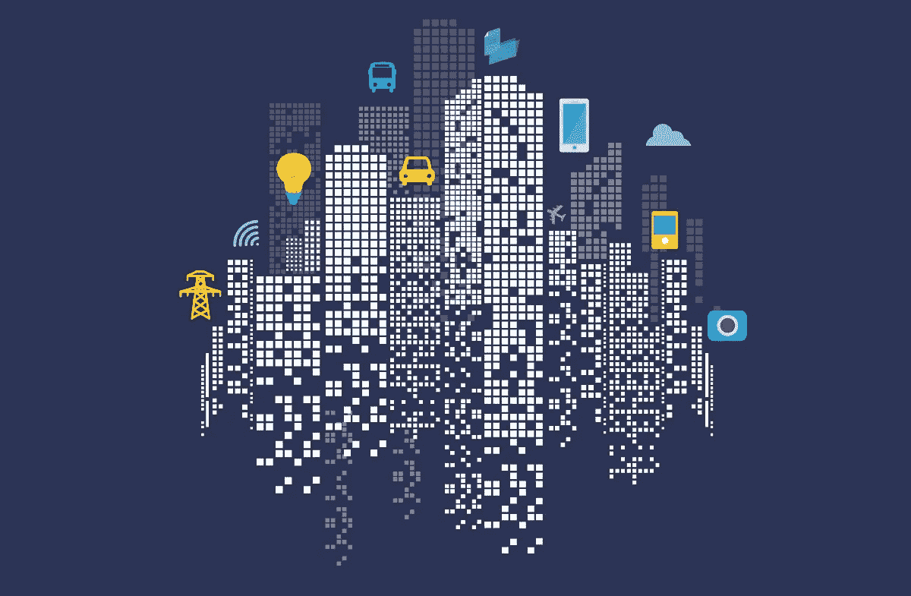

# 一个新领域的诞生——智能城市

> 原文：<https://medium.com/hackernoon/the-birth-of-a-new-niche-smart-cities-7727b62d907e>

到 2050 年，66%的世界居民将居住在城市。快速城市化带来了全球性挑战，如空气污染、电力短缺、清洁饮用水和人口过剩。城市对这些问题的技术解决方案的需求现在[构成了价值 1.5 万亿美元的全球市场](https://www.forbes.com/sites/sarwantsingh/2014/06/19/smart-cities-a-1-5-trillion-market-opportunity/#19adbe0c6053)。

因此，这些未来的智能城市已经成为当今社会不可或缺的一部分。为了实现这一概念的迅速和全面实施，国家和投资者的支持是重要的。因此，在一些国家，智慧城市的创建始于政府本身的数字化。只有到那时，他们才会延长这些计划和举措，以便在生活和社会的其他领域向数字化过渡。

# 城市如何变得更智能？

比尔·盖茨控制的投资集团 [Cascade Investment](https://ciginc.net) 旗下的开发商贝尔蒙特合伙公司(Belmont Partners)收购了亚利桑那州凤凰城以西的一大片土地，用于建设新的“智能”城市贝尔蒙特。据当地新闻门户网站 AZ Central 报道，这位亿万富翁兼微软创始人[向该项目投资了](https://eu.azcentral.com/story/money/real-estate/catherine-reagor/2017/11/08/bill-gates-cascade-invests-belmont-real-estate-development-near-phoenix/842280001/)8000 万美元。

特拉华州有限责任公司被正式列为投资者。80，000 套住房将建在 24，800 英亩的土地上，其中 3，800 英亩将用于工业、零售和办公建筑。几乎同样多的空间将用于公共空间，470 英亩将留给学校。

从一开始，贝尔蒙特将采用最新的技术进步进行设计:高速网络和数据中心、新的生产技术和自动化物流中心将部署在这座未来的城市，无人驾驶汽车将沿着它的道路行驶。此外，在通往贝尔蒙特的路上还将修建一条高速公路(其建设尚未获得融资)，连接内华达州的里诺和墨西哥。

引入电子文档管理是智能城市利基的基本发展领域之一。最近，数字签名的领导者之一 SignRequest 宣布，他们将采用来自 [LTO 网络](https://lto.network)的基于区块链的解决方案来保护在他们的电子签名平台和应用程序上签名的文档。LTO 网络似乎已经在这个领域占据了稳定的位置，客户包括 Merin、CMS、AVR、IBM 和荷兰政府。采用比特币-NG 协议，网络在哈希存储在 LTO 网络之前立即预先批准交易。这种证明存在的方法可以作为处理文档、电子邮件和其他外链数据的解决方案。

传统上，金融和法律部门引入新技术的速度相当缓慢。然而，在数字签名的情况下，相反，他们更快地掌握了这项技术。这一价值数十亿美元的行业以每年 31%的总增长率证明，这项技术仍然可以提供提高效率和促进业务的解决方案。

日本松下正在科罗拉多州丹佛市附近开发“智能城市”的基础设施。这个名为 CityNow 的项目将于 2026 年完工。

在一块 1.6 公里的空地上，已经安装了用于分发免费 Wi-Fi 的设备、LED 路灯、空气污染传感器、太阳能电池板和监控摄像头。一组本地化的电源将允许该地区的基础设施在停电时脱离电网运行 72 小时。松下也在为无人驾驶汽车做准备:2018 年春天，计划将首条无人驾驶公交线路投入服务。

# 美利坚合众国

在美国，许多城市正在参与建设智能基础设施的全球竞争:纽约监控其易着火的建筑，T4 正在安装 7500 个免费互联网的 Wi-Fi 高速(1 Gb / s)接入点，波士顿正在建造太阳能供电的工作台，它将分析空气的成分并为手机充电。然而，芝加哥在这一领域的表现无疑超过了其他美国城市。

在第二个(仅次于纽约)美国经济中心和最大的交通枢纽，这一切都始于 2012 年该市 WindyGrid 平台的推出。它收集了关于芝加哥市的所有信息:从公共汽车时刻表和 911 紧急呼叫统计到建筑物的历史事实。除了组织信息，该项目还通过嵌入街道照明系统的高清摄像机网络跟踪可疑活动。这些信息构成了 Plenario 网站的基础，该网站通过开放访问和地图链接提供这些信息。

其中，芝加哥市政当局想出了一种方法，将公用事业服务电话的数据与安装在垃圾桶里的传感器的读数、水分含量和土壤成分信息，甚至老鼠控制系统联系起来。根据芝加哥市政当局的报告，对抗老鼠扩散的效力增加了 20%。顺便提一下，垃圾桶上的传感器是太阳能的。

2013 年， [UI LABS](https://www.uilabs.org/) 启动了一项开发芝加哥智能基础设施的计划，名为“城市数字化”。它在四个不同的领域发展:“运输”、“能源管理”、“水和卫生”和“基础设施”。后两个国家已经启动了试点项目。其中之一是评估绿色空间减少废水水平的能力。安装在排水系统中的传感器将信息发送到一个基于云的服务器，在那里进行分析，并根据分析结果为城市未来的绿色区域位置提出建议。

第二个试点项目是为城市的地下基础设施开发一个导航平台。在声纳设备的帮助下，先前铺设的水和天然气管道、电力和电信网络以及地铁的虚拟地图被创建出来。它将被用来在修补漏洞和铺设新网络时降低成本。10 月，承诺在“运输”和“能源管理”领域开展新的试点项目。然而，也许整个城市的项目中最有趣和最引人注目的是一系列的东西。

# 大不列颠

英国政府是支持国家数字化发展的先驱之一。

2000 年代末，英国开始利用公开数据。数字化项目的第一步是选举投票的数字化。然后，25 个额外的在线公共服务向全国人民开放。大数据是从 30 个来源积累的，并被合并到可自由访问的公共信息登记册中。这种方法可以节省通信成本，加快数据交换，并有助于识别过去的错误。因此，在 2010 年，有可能将前一年的税收损失“数字化”,数额达 40 亿英镑。这使“税收漏洞”的总额增加到 420 亿英镑。出现这种情况的原因是一些人的纳税申报表丢失了。这里的信息是，随着大数据的使用，此类错误再次发生的可能性降至零。

2017 年初，英国政府[推出了](https://www.gov.uk/government/publications/uk-digital-strategy/uk-digital-strategy)新的数字化发展战略。它强调了 7 个主要领域:数字基础设施、获取每个人的数字数据、通过互联网改善商业条件、帮助企业实现数字化、网络空间的安全性、公共在线服务以及累积数据在经济中的使用。

计划有五个技术中心来支持这些计划。将向公众提供免费的数字技能培训。1730 万英镑将投入机器人和人工智能研究。到 2035 年，政府预计其投资回报将达到 6540 亿英镑。

# 挪威

挪威是首批引入在线纳税申报会计平台的国家之一。

在 SkatteFUNN 计划的框架内，公司的创新活动得到了税收激励的支持。每投资 100 万挪威克朗(约 107，000€)的回报估计为每家公司在获得国家支持后的三年期间每年增加 180 万挪威克朗的价值。国家在创新业务投资中的份额上升到 50%，而剩余的资金来自私人投资者和公司。

2017 年，挪威政府宣布增加 12 亿挪威克朗的创新发展投资。指定用于支出的主要项目是 R & D 基础设施发展、人才支持和吸引最优秀的科学家，以及项目的国际化。

# 丹麦

在丹麦，与政府机构的商业和公共交流几乎普遍被转化为在线形式——高达 98%的查询是通过在线服务进行的。

2001 年，丹麦是世界上第一个引入电子政务战略的国家。

自 2011 年以来，国家的数字发展有了一个统一的战略。人们和企业生活中的“数字自助服务”已经成为一种必然。为了获得公共服务以及与管理机构的所有通信，使用在线服务。这一决定的经济效果是每年节省约 1 . 36 亿美元，可以重新分配给其他项目。它还使用单一的数据目录，一个帐户用于各种服务的授权，以及移动电话上的安全数字签名。在教育领域，正在引入数字考试并采用电子应用程序。

# 新加坡

新加坡正处于积极发展阶段，几乎所有的公共服务都在网上向公众提供。自 1999 年以来，新加坡一直走在创新发展的道路上:制定了保护知识产权、政府部门私有化和创建研究基础设施的新法律。

有 330 万公民使用被称为“新加坡通”的独特数字身份来在线访问政府服务。MyInfo 数字平台用于 17 个不同机构的数据存储和访问:从许可到获得居民身份。SingPass 中的信息安全通过两个级别的验证来提供。聊天机器人在 15 个政府网站上工作，减少了 60%的呼叫中心工作量。移动应用程序向志愿者指出急需帮助的人的位置，并帮助警告警方可疑物体(可能是恐怖分子留下的)。国家还向低收入和老年人提供支持，为他们提供免费互联网接入。

# 成功的秘诀是什么？

当我们比较主要国家在国家管理数字化领域的做法时，一些适合某一系统的重要趋势变得显而易见。

关于一个人的信息，包括健康、收入水平、居住地、技能和其他东西，都被合并到大数据中，其中一些仍然可以公开访问，而其余的则受到可靠的保护和访问权限的限制。数字化数据减少了呼叫中心和当地管理部门的工作量，从而降低了维护成本。X-Road 爱沙尼亚统一数据库联合了 52，000 家企业，并提供了与该国国家机构的 99%的互动。它每年节省 800 年的爱沙尼亚总工作时间。

为了获得公共服务，创建了一个在所有部门(从部委和税务部门到社会保障基金和诊所)运作的单一账户。这减少了开始联系时等待答复的时间，并便利公民获得公共服务。

国家通过降低税收负担和提供减价或免费服务来支持创新。经济增长速度正在加快。Digitalswitzerland 将其工作分为三个领域:吸引全球人才，为数字公司提供帮助，以及为初创公司增强瑞士生态系统。

国家数字战略的目标应该符合国家发展的优先事项。遵守这一规则可以使国家和经济有目的地加速发展。荷兰数字政府的重点领域是反腐败的开放数据和提供优质公共服务的开放政府数据。

新的变革需要不断的评估和调整。这有助于识别错误并及时修复它们。澳大利亚数字健康计划并不急于全面创新。新产品和新想法首先在有限的地区推出，如果它们得到成功应用，这种经验就会在全国推广。

取代技术，结构的相互作用是关注的主要领域。联网、分享知识和做法以及联合活动都有助于提高问题研究的质量，并简化各机构之间的相互理解。爱沙尼亚和英国 TechLink 之间的一个联合项目支持两国创新公司和科学家的互动，组织网络安全、机器人、智能城市发展等方面的信息交流。