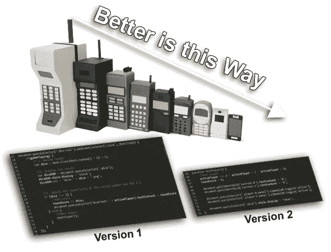

# 编码者的公理

> 原文：<https://medium.com/hackernoon/the-coders-axiom-7881e88d495d>

如果有一种方法可以从等式中去除观点和个人偏好，并明确地确定给定两个竞争的解决方案时哪种代码更好呢？

*   开发人员必须同意的唯一事情是公理本身。在这一点上达成了一致，堆积如山的主观讨论突然变得无关紧要，宝贵的时间被收回了。
*   当我们向一个去中心化的世界前进时，遵从不必要的权威是不必要的。
*   开发人员可以使用扶手来帮助他们在一生中做出无数的决定。挥之不去的不确定感被可喜的信心所取代。

大约 5 年前，我提出了这个想法，从那以后，它经受住了来自不同公司的开发者和架构师的严格审查。当我写下极难批评的原始代码时，我一整天都在无数次地思考这个问题。

没有进一步的拖延，这是…

> 暴露出任何与目标相矛盾的方法，最小文件大小的后编译胜过任何选择。

这句话里有两个相反的东西。

1.  **目标**:当然这可能意味着很多不同的事情。也许您需要添加更多的代码，因为目标需要一定水平的性能、安全性、特性，或者项目必须在截止日期前完成。
2.  **编译后**:因为公理以编译后(或最小化后)的代码为中心，所以它避开了任何关于代码注释、变量命名或语法糖的讨论。编译器可以保持理论性，这提供了相当多的余地。

## 判断预编译代码呢？

如何确定什么代码是更好的“预编译”需要不同的讨论，这是在考虑“后编译”解决方案后做出的判断。话虽如此，但很难说排在之后的**不是首要考虑因素。**

# 依赖怎么办？

不言而喻，依赖关系会扩大编译后代码库的大小。作为一个生活中的总校长，谁愿意去争论依赖比独立好？还记得[左垫溃败](https://qz.com/646467/how-one-programmer-broke-the-internet-by-deleting-a-tiny-piece-of-code/)吗？在一个完美的世界里，没有截止日期，代码库应该独立存在…简约、优雅、一致。

当然**目标**会在某个时候出现，并给项目设定时间限制。这时，就有必要伸手到架子上拉一个依赖项，其中不可避免地包含更多您需要的代码。

## 在平台和它的代码库之间画一条线

实际上，开发人员/团队必须站在他人的肩膀上。然而，在划分代码库和它的基础设施时，还是有余地的。如果我在 AWS 上构建一个项目，这并不意味着在评估某个编译后的解决方案时，必须考虑亚马逊的任何代码。

软件堆栈(即 React、Node、Java、Linux 等)如何？).什么是基础设施/平台，什么是依赖性，这可能是一个争论的问题。然而，一般来说，我认为像 React 和 Typescript 这样的东西是一种依赖，它涉及一个编译例程，并产生一个最终的构建文件(后编译)。Java 和 Node.js 不会出现在构建文件中(忽略 Docker 之类的东西)，所以我不认为这些平台/语言对利用编码者公理的辩论有任何影响。

在许多情况下，当评估两个竞争解决方案时，它们都运行在同一堆栈上，因此考虑平台/基础架构的规模变得无关紧要。

# 性能呢？

我听到的一个常见论点是，一个版本的代码可能更大，但因为它更有效，所以它“更好”。好吧，除非目标是这样！你听过 [**过早优化是万恶之源**](http://wiki.c2.com/?PrematureOptimization) **的口头禅吗？**换句话说，如果一个更小/更简单的替代方案被证明是足够的，就不要花时间(或代码)让事情变得更有效率。

# 抽象还是不抽象

这就是编码者的公理真正发挥作用的地方。我经常看到过度设计的系统，在需求出现之前结构就被抽象了。显然，这不必要地增加了编译后的大小。

当需要时，不寻找重复和抽象的迹象？与过度设计系统相反，欠设计包括复制模式/例程，在编译后增加文件大小。

除非你绝对确定在不久的将来你会需要多次使用功能，否则选择 monolith。随着系统的发展，当需要拆分某些东西时，不要偷懒。这样，你就能不断地为你的瞬时上下文找到最好的(我的意思是错误最少的)代码。

## 巨石柱

亚马逊和网飞[都是作为一个整体开始的，因为那是你刚开始做的事情。**目标**随着流量的增加和功能的增加而改变。](https://smartbear.com/blog/develop/why-you-cant-talk-about-microservices-without-ment/)

以下是亚马逊 AWS 产品管理高级经理 Rob Brigham 在 2015 年的一次会议上所说的话。

> 别误会我的意思。它采用多层架构，这些层中有许多组件。但是它们都紧密地结合在一起，就像一块巨大的石头。现在，很多创业公司，甚至大公司内部的项目，都是这样开始的。他们采取整体先行的方法，因为这样很快，可以快速行动。但是随着时间的推移，随着项目的成熟，随着你在上面添加更多的开发人员，随着它的增长，代码库变得更大，架构变得更复杂，这个庞然大物将会增加你的过程的开销，软件开发生命周期将会开始变慢。

# 少即是多

想反驳奥卡姆剃刀吗？

如果我有一个满足目标的工作解决方案，谁愿意站在“增加更多”的一边，只是为了满足一些正义的原则或遥远的预测？“保持简单，傻傻的”，选择优雅。毕竟，因为没有人[能把任何事情做得完美](https://www.youtube.com/watch?v=S-d64q7Qt5Q&t=2s)，我们做的“它”越少，我们就过得越好。