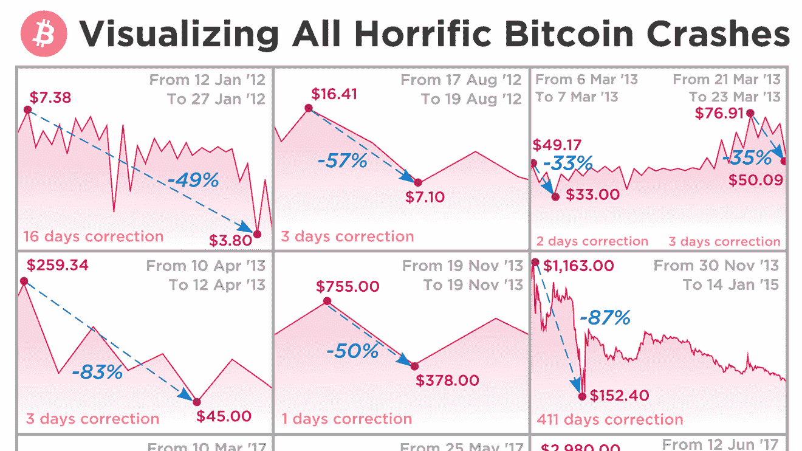
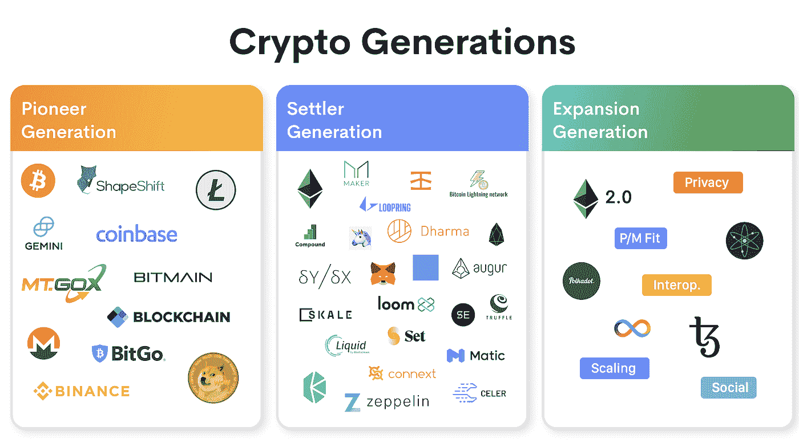

# 加密波:过去、现在和未来

> 原文：<https://medium.com/hackernoon/the-crypto-maze-the-present-future-2111fd948292>

虽然我们这个时代的其他技术都是创新的，但加密是唯一真正具有颠覆性的技术。人工智能，移动，虚拟现实进一步巩固了今天的球员。加密不是您可以在组织/产品中实现的另一个功能。不考虑地点、过去的成就或地位，没有人真正知道会发生什么。这篇文章整合了我的想法，但也是一个打开它进行审视的机会。

# **当下**

首先也是最重要的，区块链是世界各地的人们，当我们不一定信任对方时，他们会就如何协调达成一致。这些协议然后被翻译成代码的形式。我们正处于历史上只有两个有意义的链条可以谈论或推理的时代:比特币和以太坊。为什么是这两个？因为没有哪家连锁店向保护网络的矿工支付超过 1 万美元。比特币支付约 50 万美元，以太坊支付约 5 万美元。

**比特币**已经过了 10 岁生日，这是一个范式转变，因为它是第一个不受任何国家控制的经济体。一项将被历史铭记的成就。比特币创造者必须克服对无币者的怀疑。

**以太坊**诞生约 4 年，由于比特币的僵化和不灵活，催生了一个国家执行机器(智能合约)。由于能够发行定制数字货币，它在 2017 年脱颖而出。具有讽刺意味的是，以太坊必须克服在他们之前的比特币创造者的怀疑。

今天创造的所有技术都没有找到适合互联网应用规模的产品市场，相反，人们在浪潮中变得兴奋和失望。我认为加密有两个阶段，投机阶段和世代阶段。

# **投机浪潮**

我真的相信大多数从事加密的人不理解这些市场的周期性。没有他们，人们就没有什么理由去参与和尝试一项坦率地说还达不到预期的技术。

大多数人，包括我自己，都有非常相似的故事，被暗示是淘金热，然后随着时间的推移留下来学习更多。如果你把它想象成一个漏斗，你就有**投机者- >用户- >建设者(设计师、产品经理、开发者)- >创业者**。随着时间的推移，这个群体迅速减少，但随着人们走到尽头，结果在几十年后开始复合。

waves 的强大力量在于，它影响了大多数人的心理，让他们产生暂时的共同认同(区块链将改变世界)，然后让这些人在炒作结束后重新评估他们的信仰(等等，这项技术到底是关于什么的)。大多数人都活不下来，不过没关系。新的生活方式和塑造世界的方式确实需要几十年的时间。

术语“世代波”指的是技术的状态和利用技术的方式。每一代人都会带来有趣的新想法，更明确的方向和疯狂的价格波动，以吸引和净化数百万人。

# **先锋一代**

我会把第一波浪潮描述为**“先锋一代”**——那些想要用真正的全球点对点现金系统进行交易的人。在此期间，工作证明是一个全新的概念介绍给世界，数字货币交换是一个新的概念，消费者钱包从未被制造过，挖掘是一个非常新的概念。一切都以围绕比特币(支持服务和产品)做事情为中心，规模不是真正的问题，对技术可行性的怀疑可能达到了顶峰。2008 年至 2016 年。

我们现在看到的很多事情都是 2011 年至 2013 年间各种比特币论坛的先驱们想象出来的。那时和现在的唯一区别是我们有技术让很多事情成为现实。一个观察结果是，该领域的许多公司或项目都很难同时涉足这两代人。比特币基地试图通过比特币基地钱包成为移民一代的一员。币安有更好的机会，但不确定他们是否会制造真正分散的产品。这并不是说这些企业不会继续盈利，也不是说它们在当前或下一代技术的创新方面都不领先。

# **定居者一代**

我们目前正处于第二波浪潮中，或者我称之为**“定居一代”**——梦想着如何将世界带入未来的早期企业家和开发者。在这个时间点上，我们正在试验共识算法，我们有更具表现力的平台(以太坊),我们正在开发的产品在其范围内是新颖的和改变游戏规则的。随着我们的目标是缩小理论和现实之间的差距，扩展和监管是我有信心在未来 5 年左右解决的主要问题。Crypto 有许多“部落”，在 2017 年受到主流关注后，作为产业的规模要大得多。怀疑是围绕产品与市场的匹配，而不是技术。**2016–2024。**

我们面临的挑战是如何将这项技术应用于下一代。产品市场适应是 crypto 最困难的阶段之一，因为没有它，我们将无法超越早期采用者。扩展目前有以下方法使技术做好准备(同时找到适合市场的产品):

## **竞争链**

竞争链来解决现有赢家的问题(这里有一个链 X，它比 Z 快 Y 倍，可伸缩性也比 Z 高)。持这种观点的人大多将区块链视为一个代码库，而不是一个活生生的社会实体。到目前为止，我们还没有看到比特币或以太坊在其专业领域被淘汰的迹象。围绕基础层链形成大规模协作的唯一方式似乎是提供一种新的范式。

## **十字链**

跨链生态系统的形成是因为不同系统之间的通信是可能的，并且在基础层级别需要较少的全球协调。Cosmos 和 Polkadot 是赢得这场竞赛的有力竞争者，尽管它们在安全性和治理方面都有各自的权衡。

*为了限制这篇文章的范围，我不会过多地讨论竞争链和跨链实现的问题。*

## **第二层**

第 2 层生态系统变得越来越复杂，工作在更高层完成。比特币在闪电和液体方面有一些活动，但这里的赢家是以太坊。国家频道、等离子体、侧链等等正以超出大多数人意识到的速度出现。

仅仅在 2、3 年前，在区块链上创建图层的想法才被引入。所有第 2 层解决方案的基本思想是，它们在互操作性或安全性(有时两者都有)方面利用基础层链。这是我们目前所知的各种方法:

*   **状态通道**。抵押品被存放到网络中心，双方可以相互交易。有时这些通道被设置为集线器。从路由的角度来看，与不属于网络中心的人进行交易通常很困难。一些实施要求网络中心所有者存放与交易金额一样多的抵押品。适用于游戏、赌博等用例。这不是一个简单的全球支付解决方案(有些人可能不同意)。参见:连接、L4 通用状态通道、闪电、Celer 网络
*   **侧链**。将链从基础层链中完全分离出来，但允许与其互操作，从而扩展生态系统。这些链不继承其基础层链的安全性，尽管可以定期提交检查点以确保在出现任何问题时可以恢复侧链。参见:Skale 实验室
*   **血浆**。类似于侧链，但具有基本层链的完全安全性。任何双花费或 51%攻击都不会导致基础层链中的资金损失。许多人对它持怀疑态度，但是血浆现金和血浆 MVP 现在是活的，许多 UX 问题正在快速解决。主要的不利因素是，除了支付之外，短期内不可能开发出更具表现力的应用。请参阅:自动织机

# **扩张一代**

第三次浪潮将是**“膨胀的一代”**——加密在世界上产生真实的、切实的影响。过去的承诺将以更加实际的方式开始变成现实。规模、隐私和监管将在很大程度上得到解决。我们还将迎来在数字世界中长大的全新一代孩子，他们年满 20 岁，互联网原生货币的概念将是意料之中的事，这并不奇怪。后来者将争先恐后地赶上这一点，但船早就启航了。许多互操作性和扩展重头戏将有机会大放异彩。在这一波技术浪潮中，加密将开始对当权者构成真正的威胁。正是在这里，我们围绕安全和去中心化的讨论将变得更加重要。怀疑主义将围绕这场运动的意识形态而形成，而不是产品与市场的匹配。**2024–2032+。**

在我看来，web3(去中心化的 Twitter/脸书等)的愿景将在这一代出现。将会有更大的市场需要迎合，可扩展的技术，更重要的是:对用户拥有的数据的迫切需求。

# **结束语**

为了将所有这些联系在一起，下面是我对未来的一些预测:

*   在扩张浪潮之前，我们将迎来另一波 1-2 次投机浪潮。每一波投机浪潮都将产生前所未有的 10 倍的高点。
*   规章制度在整个事情的计划中起着次要的作用。crypto 的吸引力在于参与不受监管的金融市场。相反的证据很少。合成资产将成为大赢家。
*   第 1 层链的核心价值主张是速度和可扩展性，与第 2 层扩展解决方案的**扩散相比没有优势。治理和社区可能是价值区分因素，但同样是次要因素。**
*   **扩展**在短期内不是非常重要。找到适合市场的产品。
*   **Polkadot，DFINITY，Cosmos** 等。正在和**以太坊 2.0** 竞争，而不是现在的链。历史上会有一个短暂的时刻，他们有机会让他们所有的技术都井然有序，并且有一个社区(没有金钱的激励)
*   技术问题将是最容易解决的。让人们相信这场运动背后的意识形态是最困难的。我们关于安全性的假设仍然在沙盒中，它们仍然需要在真实世界的攻击中进行测试。