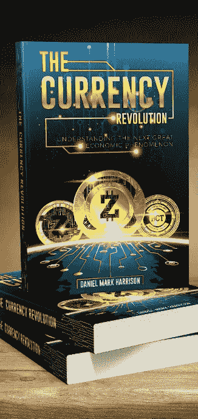

# 货币革命(书)

> 原文：<https://medium.com/hackernoon/the-currency-revolution-book-446968c07629>

## 简介预览

T *何币革命有平装本* [*此处*](http://www.lulu.com/shop/http://www.lulu.com/shop/daniel-mark-harrison/the-currency-revolution/paperback/product-24107726.html) *而 Kindle 版则是* [*此处*](https://www.amazon.com/dp/B07S64X8D4/ref=sr_1_1?qid=1558657858&refinements=p_27%3ADaniel+Mark+Harrison&s=digital-text&sr=1-1&text=Daniel+Mark+Harrison) *。*

## 货币革命简介

在数字货币市场，一旦最理性的投资者和商人克服了对非政府发行的现金产品的最初恐惧，开始真正投资于加密货币，他们往往会被某种意识形态咒语所征服。

就几乎所有类型的意识形态而言，分散货币发行的意识形态不仅不诚实，而且不真诚。

正如这本书清楚地概述的那样，首先，许多 ICO 发行的数字货币几乎没有，甚至根本没有去中心化。由少至 2 或 3 名高级管理人员组成的非常集中的团队有时负责许多加密货币的发行。

正如我在本书中讨论的那样，在许多情况下，它们往往对本国货币发行的环境公然不诚实，这进一步削弱了数字货币无论如何都比主权货币更分散的论点。

此外，正如我在关于交易所的章节中所讨论的那样，在分散化的情况下，最受欢迎的加密货币交易平台无非是由与假冒 ICOs 相同的 2 人或 3 人团队运营的庞氏骗局，这一简单现实对世界经济中任何层面的真正金融分散化(以至于由 Satoshi Nakomoto 提出的程度)甚至根本不存在的想法提出了质疑。

这本书不是区块链的福音，也不是试图说服任何人去中心化在任何意义上都更好，或者数字化优于实物贸易。

然而，这是一种认识，即金融市场数字化机制导致的去中心化进程是一种不可避免的演进趋势，不容忽视。

> 没有必要仅仅因为一个人承认某件事是事实，就同意某件事是更好的。同样，你不需要认为数字支付机制或去中心化的金融市场是件好事，就能相信它们是一股将越来越影响我们生活的力量。

尽管我是数字资产的支持者，但我也认同这一资产类别的反对者经常提出的许多担忧和批评。这就是创新。很少是完美的弧线。

这本书提出了一些激进的主张，值得花点时间来探讨这些主张。这本书最激进的主张之一是，美元、欧元和日元不太可能继续存在。

首先，我不是唯一提出这种说法的人，也不是第一个。前情报专家和经济学家詹姆斯·里卡德斯(James Rickards)提出了同样的观点，他的观点比我在这里的观点更为有力，尤其是在他的著作《货币战争》(The Currency Wars)中。

其他经济学家，比如厌恶比特币的努里埃尔·鲁比尼，对美元在我们未来金融中的核心地位持有类似的不屑一顾的观点。

第二，我提出的美元最终屈服于其自身基础货币对的观点，同样适用于当今流通中最强的加密货币。比特币和以太坊的 z 效率至少和美元一样低。事实上，我在这本书里也是这么说的。

事实上，美元远比比特币强大，而且在一段时间内还会如此。我最近进行了一项研究，我监测了美国证券市场 2017-2019 年的股票回报，并将它们在美元上反映的价值强度与同一时期分散化数字资产市场在比特币上反映的强度进行了比较。

结果是，在同样的风险下，假设你持有美元并偶尔投资于美国股票，你必须在此期间获得 300%的回报，才能与你的美元现金头寸持平。换句话说，对基金经理来说，比特币上涨 400%和美国证券上涨 33%的意义是一样的。

最后一个观察让我想到了我关于数字资产领域的下一个观点:没有机构投资者可能会很快进入数字资产市场。对他们将要投入数万亿美元的巨大期望，如果任其发展，将会引发问题。迄今为止，只有少数古怪的对冲基金经理——他们更像硅谷的企业家，而不是公园大道上死气沉沉的资产经理——参与了这个领域的专业投资，甚至是在非常小的水平上。

区块链初创企业的融资反映了这种低水平的机构参与:到目前为止，Circle 的 1.1 亿美元融资是世界上任何区块链独角兽中最大的。这在私人股本投资的大计划中微不足道。

然而，这些事情都不太可能阻止数字货币作为一种通用市场力量的爆炸，尽管表面上看起来对区块链资产整体而言可能是负面的。事实上，机构现在不参与数字资产的演变可能是一件非常好的事情，因为它将标准化作为一个选项留在了一边。机构越久不投资任何实际规模的区块链，该技术产生改变游戏规则的变革效果的时间就越长。

这就是这本书的信息:你无法阻止不可避免的事情发生。它是如何发生的，在什么样的背景下发生的，以及结果可能是什么样的，这些都是这本书的中心主题。为此，为了更好地衡量，我在叙述的开始提供了一点关于早期区块链时代的修正主义历史。我还包括了我和我的工程师团队发布的产品的真实原型演示，以便举例说明随着时间的推移会发生什么。

最后，我将提供一个简单的说明性故事来磨练这一点:想象你在 1300 年左右拥有一个农场。数百年来，你们家族饲养牲畜，收获水果，砍伐树木。

这是一种相当悲惨的生活，大多数时候，你会在对等的基础上与其他供应商或服务提供商交易你的产品，他们拥有那个冬天你需要的任何商品或技能。

有时你会用一车苹果换一匹马；其他时候，当家庭成员生病时，你可能会给医生一只羊。

货币大多以原材料的形式存在，尽管有时你会在你客厅的抽屉里放一些铜币。

不过，大多数情况下，没有必要，而且你很可能会被偷，所以没有多少。生活实际上一直是勉强度日，似乎未来也将永远如此。

突然，大约在 1380 年的一个早晨，一位市政厅官员宣布，你所在的地区正在开辟一个市场。你和你同时代的其他竞争对手以及不同的农业供应行业现在每天早上都会把你的产品带到市场摊位，那里的顾客会来购买你的产品。

一夜之间，你突然发现你抽屉里的铜钱膨胀了，溢出来了。对羊毛的需求如此之大，以至于你决定扩大农场规模，并再租了一英亩土地。

你在那块旧土地上种了一个果园，这样你就可以卖出越来越多的苹果。商业革命开始了，它改变了农业历史的进程。

大约 300 年后，生意做得很好，但生活仍然艰难。婴儿死亡率很高。科学知识很少。

发生了一些事情，使得去市场的通勤变得很危险。桥梁毫无征兆地倒塌了。大火毁坏了附近的地产。尽管在过去的三个世纪里，正常的交易增加了，但钱还是很快地、随意地花光了。这些事情不断威胁着你农场的效率和你家庭的生存能力。

突然，市场上出现了农业设备。突然之间，控制收成变得更容易了，你在去市场的路上走过的桥都被惊人的工程技术加固了。

你在 13 世纪初建造的简陋农场，到了 1800 年左右，为半个村子带来了有收益的工作。

这一时期的一家之主甚至设法利用他巨大的土地所有权地位，投机取巧地进入议会。你的曾、曾、曾孙成了领主。

事实上，他拥有的土地是如此之大，占地数英亩。厨师、清洁工和一大群专业服务提供者睡在这栋巨大房子的东翼，他花了相当可观的成本为自己和后代重建了这栋房子。工业革命已经到来。

正如商业革命带来了机遇，随之而来的是风险——由于人口密集导致更多的疾病，过度使用的劣质桥梁倒塌等等——所以工业革命最终开始蹂躏农场。

电力使得供暖、照明和生活在这座建于 18 世纪的巨大宅邸变得根本不切实际。

这家公司曾经雇佣的员工跳槽去做了其他事情——有些人开了酒店，有些人在附近开了餐馆等等。他们的后代有的成了千万富翁，娶了你自己的后代。

随着时间的推移，所有这些工业化都与该地产在镇上的垄断门槛相竞争。

这块土地的价值超过了它所产生的实际商业价值。你的后代最终被迫卖掉它来支付巨大的遗产费用，但他们仍然获得了可观的利润。他们将这笔钱投资于一系列业务，其中一些业务做得相当好，直到边际成本开始攀升。这就是我们到达今天的地方。货币革命是现代经济史上第三次以市场为基础的革命，它即将占据我们所有人的生活。

当企业开始发行自己的货币时，他们的顾客用这些货币支付他们，以换取他们提供自己的商品；当个人使用他们的个人数字品牌来发行他们自己的价值形式时，这些价值形式可以出售，其利润可以投资于创办新的企业。

当整个货币体系不仅成为国家控制的货币功能，而且成为个人获利机器时，它对社会的影响将比前两次革命加起来更深远、更具戏剧性。

当比特币在 2009 年首次出现时，它真正开始的是改变我们生活、交易和思考经济事件的方式。

> 货币革命是近代史上最重要的、迄今为止还只是刚刚出现的、基于市场的革命。
> 
> 货币革命的影响将是有史以来最彻底、最广泛的。

他们中的大多数人甚至还不知道这一点，但交易商、商人、艺术家、科学家和其他任何人今天都能够制造和出售他们自己形式的货币价值，为他们寻求的任何举措提供资金，而不必承担银行债务。

类似地，不需要从外部投机者那里筹集资金，也不需要从公司所在国寻求各种繁琐的许可，就可以进行融资。

一种货币的市场只受其背后理念的规模、范围和受欢迎程度的限制。这是巨大的。这是一个游戏规则的改变。这就是下一步。

公司将能够发行货币，购买他们生产的未来产品，并保留所有利润，这些利润可以重新分配给更富有的员工。

个人可以在受教育期间发行货币进行交易，进一步提高智力潜力。R&D 认为，创新和科学可以得到资助，但不是由唯利是图的投资者资助，而是由他们最终提供的服务的最终用户资助(给唯利是图的投资者另一个投机渠道，而不会剥夺员工的任何劳动成果)。

> 欢迎来到货币革命。

仔细想一想:如果我们在前两次基于市场的革命中成功地从农民变成了被动投资者，在那两次革命中，我们的价值归属形式完全受到控制，那么在第三次革命中会发生什么呢？在第三次革命中，价值是我们随意给予、控制、发行、交易和重新计算的。

对我们后工业时代新技术化的头脑来说，可能性几乎是无限的。

这本书一部分是历史，一部分是对变革推动者的分析，这些变革推动者正在我们脚下推动着这场新的经济革命。这种变革代理被称为区块链。