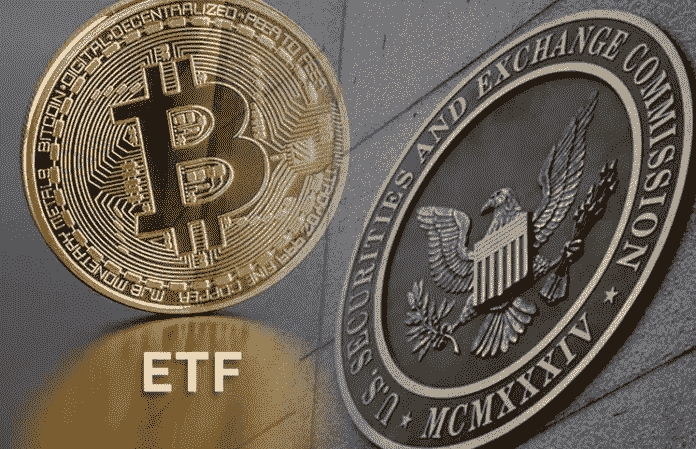

# 比特币交易所交易基金可能对个人投资组合造成的损害

> 原文：<https://medium.com/hackernoon/the-damage-a-bitcoin-etf-will-do-to-individual-portfolios-6526809c75f5>

Source: Bitcoin Exchange Guide

想让比特币 ETF 过关的加密爱好者还没有真正了解比特币。对于某些人来说，声称他们是“为了技术而来”是非常容易的，而且很容易看出他们是否在说真话。比特币 ETF 是由资产管理公司 Van Eck 提出的，该公司管理着近 470 亿美元的资产(AUM)。他们正努力争取监管机构批准推出这只 ETF。全球加密货币投资者将此视为游戏规则的改变者，将为市场带来更多流动性。虽然这可能是真的，但机构对比特币的投资可能只是其灭亡的催化剂。

支持 ETF 的理由很简单，因此它自然是令人愉快的，人们以积极的眼光看待它。就像宇宙中任何其他情况一样；每一个积极因素都有一个消极因素。对于比特币 ETF，首要考虑的是安全性。正如安德烈亚斯·安东诺普洛斯的名言“你的钥匙，你的比特币；不是你的钥匙，不是你的比特币”。随着所有这些投资者将他们的资金投入到一个被动管理的投资组合中，他们正在汇集他们的资金，并将其投入到由 Van Eck 及其托管人控制的一系列钱包中。比特币和以太坊的按位资产管理指数与此类似。这些特殊基金的唯一优势是它们有可能被纳入退休计划，如 401K。

# **单一加密被动基金会侵蚀你的收益**

对于加密货币来说，只有一种资产的被动基金的概念毫无意义。当你看对冲基金时，至少他们会给你提供多样化和专业管理的服务。但这些对冲基金大多由业余人士运营，他们认为自己在股市的主导地位或对基本区块链功能的了解，使他们适合管理一只加密货币基金。有一些非常好的基金，拥有非常能干的基金经理和研究部门，但大多数基金，即那些希望通过投身最新金融时尚来建立品牌或赚快钱的基金，占据了公众的注意力。

持有自己的私钥是比特币必不可少的一部分。通过投资 ETF，你实际上是在为他们购买你的加密货币支付 1.5-2%的管理费。具体来说:你可以投资 1000 美元到这些基金中的一个，每年将其中的 2%交给资产管理公司，让它为你持有资产。这是一气呵成的两个否定；你不能拥有你自己的资产，你必须付钱给他们！1000 美元的 2%只是 20 美元，所以看起来没什么大不了的。但是要看这个管理费的效果，考虑下面这个例子。

你在一只比特币交易所交易基金上投资 1000 美元。管理费 2%。比特币在接下来的 5 年里每年收益 10%，因此默认情况下，ETF 也是如此。与此并行的是，你直接投资比特币；无论是作为币安和比特币基地这样的交易所的个人，还是作为比特币基地 Prime 和 Gemini 这样的平台的机构。你五年来的投资结果总结如下。

Outcome for above scenario

通过避开 ETF 直接投资，你比 ETF 投资者多获得**12.9%****。随着你投资价值的增加而增加的管理费会严重侵蚀你的利润空间。在类似的情况下，想象一下，直到第 4 年，我们都有相同的条件(每年 10%的收益)，但在第 5 年，我们突然看到比特币的价格下跌了 12%。ETF 投资和直接投资的年末价值会发生什么变化？**

****

**Outcome for scenario with a loss in 5th year**

**当**的直接投资者看到他的投资同样下降了 12%**，与比特币同样下降，而**的 ETF 投资者看到他们的投资价值下降了 13.76%。****

# ****论证背后的逻辑****

**所有这些都归结为一个简单的问题:把简单的事情过度复杂化。购买比特币或任何加密货币都很容易；在接受您所在国家法定货币的知名交易所开立账户，添加一张卡或您的银行详细信息，从银行到银行或从借记卡进行电子转账，购买您选择的密码。让第三方创立一只基金，根据投资者的资金进出来买卖比特币，有什么必要让事情变得过于复杂呢？本质上，这种交易所交易基金将进入一个机构交易所，购买或出售比特币:这是你可以自己做的事情。**

**比特币和加密货币的可替代性使得单一资产 ETF 的概念变得毫无意义。黄金 ETF 是合乎逻辑的，因为它不能被分解成一亿分之一的单位。黄金最低以 1 盎司或 1-10 克出售(取决于你居住的地方)。在印度，他们以最低 1 克的价格出售黄金，约合 48 美元或 3350 印度卢比。人均国民总收入约为 10 万印度卢比，相当于 1400 美元。指望将年收入的 5%投入黄金肯定是不可行的。尽管印度投资阶层的大多数人每年的收入都比这高得多，但他们仍无法将这么大一部分资金配置到黄金上。黄金应该是投资组合中的一个次要角色，而不是一个巨大的配置。黄金交易所交易基金让投资者能够投资少量黄金，就像普通的股票指数交易所交易基金或共同基金让投资者能够投资相对少量的投资，实现行业多元化，否则只能在个人层面投资大量投资组合。**

**比特币 ETF 给不了你这样的好处；它没有为你提供多种资产多样化，也没有为你提供少量投资的能力。比特币目前可以除尽到小数点后第 8 位。当比特币价值 100，000，000 美元时，你仍然可以用 1 美元买到 0.0000001 比特币(1 Satoshi)。**

# ****ETF 会谈将走向何方****

**当我写这篇文章的时候，我听说 CBOE 撤回了 VanEck ETF 的提议。这几乎是 ETF 顺风的终结。既然这种想法已经在各种资产管理公司的许多首席信息官和首席执行官的头脑中扎根，我们必然会看到一家又一家公司试图获得 SEC 对 ETF 的批准。整个金融业就像哥伦比亚卡特尔一样紧密相连。当他们决定走到一起游说监管比特币投资产品时，美国证交会最终将屈服于他们的愿望。目前，瓦内克和其他一些实力较弱的玩家已经做出了尝试。当投资管理领域的真正大佬决定推出比特币和其他基于加密货币的金融产品时，SEC 将在某个时候满足他们的愿望。这可能是一件好事，因为当局将为加密货币制定一些指导方针和法规。这将让个人更加清楚他们应该如何对待这一新的资产类别。监管还意味着，更多迄今一直持怀疑态度的投资者将满怀信心地进入市场，因为他们相信值得信赖的证券监管机构会支持他们。**

**ETF 谈判毫无进展。他们会留在这里。对一些人来说，这些机构正在压低价格的理论似乎是彻头彻尾的疯狂。但你不能否认，以下两件事都是真的:他们有能力和资源来抑制加密货币市场的价格，他们将从这样做中受益匪浅。老实说，没有“机构操纵”的明确迹象，同时也不能排除这种可能性，因为我们无法确切看出加密货币的波动来自哪里**

# ****结论****

**单一加密货币的被动管理产品肯定会减少你的收益，增加你的损失。但它确实有自己的好处。作为主流金融产品的比特币 ETF 将让更多人对加密货币和分布式账本系统感兴趣。这将产生连锁反应(无意双关)，最终会有更多的人了解加密货币、去中心化，以及从大公司(至少)收回一定程度的权力和隐私的能力。**

**我们唯一可以希望的是，ETF 产品有助于吸引更多的注意力，随着人们了解越来越多，他们会看到被动单加密产品的缺陷以及持有你的私钥的重要性。从稍微悲观一点的角度来看，它还可能导致该领域的大型参与者利用人们，让他们跳入高风险的定制加密金融产品，将个人储蓄和整个经济置于风险之中。所以我想在这场反 ETF 的争论结束时，我们会注意到它要么让更多人转向加密货币，要么将其变成裙带资本主义的另一个渠道。只有时间能告诉我们确切的前进方向；我们所能做的就是抱最好的希望，继续为去中心化革命做贡献。**