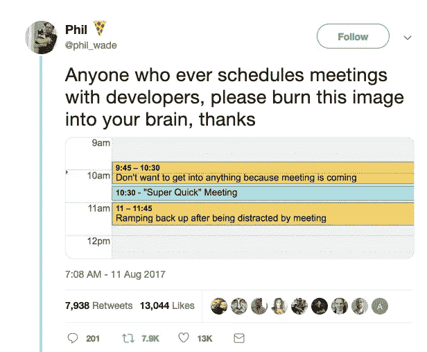
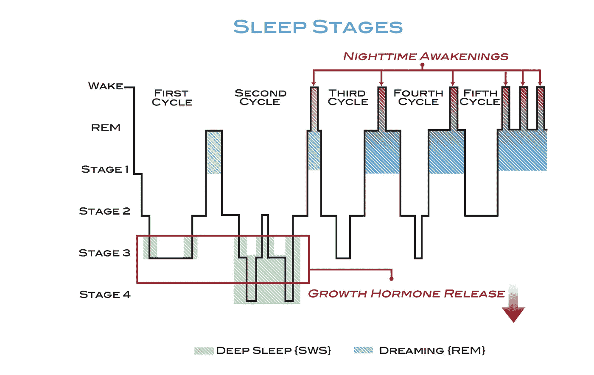

# 计划外工作的破坏性影响

> 原文：<https://medium.com/hackernoon/the-damaging-effects-of-unplanned-work-e28623e06657>

## 几乎对任何人来说，计划外的工作会扼杀几个小时的计划生产力。对于创造性工作者来说，比如那些写软件的人，它消磨时间。

不久前在工作中，一位潜在客户告诉我们，如果我们能够以某种方式分析他们的数据，那么他们有兴趣与我们做生意。我们有一个团队来处理临时分析请求，但该团队目前没有能力承担这项工作。他们四处寻求帮助，我就是这样参与进来的。

在我的职业生涯中，我做过很多面向客户的分析，但我并不特别喜欢它。当“完成”的唯一定义是“客户说他们对分析很满意”时，你知道你的项目范围将永远蔓延，直到客户决定关注其他事情。尽管知道这一点，当我参与时，我让项目经理同意非常具体的验收标准:我做 X、Y 和 Z，当 X、Y 和 Z 完成时，我的参与也就完成了。

我知道我的作用域定义并不重要，但是我为我所做的努力感到更好。我做了 X，Y，Z，每个都说很开心。有几个星期我什么也没听到，所以我继续我的正常工作，只是偶尔听到我过去经历的声音偶尔告诉我这只是时间问题。突然，我收到一封电子邮件，里面有客户的新问题。我同意 X、Y 和 Z，但现在他们想要 A、B 和 c，正如这类项目经常发生的那样，我最初的范围界定毫无意义，除非客户同意，否则我不会完成。

我非常期待一个不断扩大的范围，所以我不会对此感到太沮丧。让我发疯的是我完全没有能力计划这项工作。我的团队按照一个 sprint 时间表工作，在几个 sprint 的过程中，这些不可计划的任务多次抢占了我的计划工作。我所有正常的承诺被越推越远，因为当单一资源必须处理产品开发和面向客户的交付时，面向客户的交付总是胜出。

整个经历让我思考为什么我对计划外的工作有如此强烈的感觉。我所谈及的大多数经理和主管都持有这样的态度:“我们为你的时间付费，所以我们可以决定在我们想要的时间里做什么。”我认为这是真的，但我也认为用计划外的工作取代计划内的工作对业务是有害的——有时严重到我已经看到它让整个部门陷入停顿。

我想到的讨厌计划外工作的第一个原因是我见过很多人提到的:

[https://twitter.com/phil_wade/status/896010517617180672](https://twitter.com/phil_wade/status/896010517617180672)

当从事像写代码这样的创造性工作时，你会体验到不同层次的生产力。最有效率的水平是一些人所说的“处于最佳状态”。你不能想什么时候进入状态就什么时候进入——你必须在一段时间内工作效率较低，直到你习惯于自动做某些事情，这时你就可以开始更有效率地工作。这类似于睡眠的工作原理:

[https://i.pinimg.com/originals/42/77/d2/4277d2bd44bf3c26a2a77c57ef884c22.png](https://i.pinimg.com/originals/42/77/d2/4277d2bd44bf3c26a2a77c57ef884c22.png)

你不会从清醒状态进入深度睡眠。你必须经历不同的阶段。如果有人以不可预知的时间间隔反复叫醒你，你将不得不花时间重新入睡，即使这样，你也不会从你所得到的睡眠中充分受益。同样，如果有人不断打断你的日常工作，把你拉到紧急项目上，你的日常工作被延迟的时间不仅仅是做兼职项目的时间。这并不是说每天或每周没有花在紧急项目上的时间不够，总的来说，不够完成你的日常工作。而是这些干扰让你无法进入一个足够高效的区域，从而真正取得持续的进步。

一旦我收到一封关于新要求的邮件，我就停止了我正在做的任何事情，即使新要求在下一天甚至下一周才到期。知道我现在有一个新的我没有计划的截止日期，迫使我改变我的优先事项，以确保我能满足截止日期，这使我脱离了我在得到要求之前一直经历的生产力。一旦我重新安排了所有的事情，我有时有时间在转移到新任务之前回到我的正常工作中，但那时新任务已经浪费了几个小时，迫使我慢慢地回到高效区。

话虽如此，当我想得更多的时候，我意识到被迫离开我的生产区并不是我对计划外的工作感到沮丧的主要原因。

数据科学，像许多其他编码职业一样，[很大程度上是设计工作](https://towardsdatascience.com/data-is-a-stakeholder-31bfdb650af0)。设计工作需要将大量的东西保存在你的头脑中，然后你定期地将它们转移到代码、文档、图表、政策或其他形式的附属文件中。换句话说，这是一个创造性的练习。一旦实例化了片段，您就不需要再将它们保存在内存中，但是您必须记住它们是从哪里来的——问题的所有部分都与放入文档中的主题有关，但是它们本身并没有包含在那些文档中。

人类的大脑不能记住所有的事情，所以它会定期巩固记忆，只保留那些有足够回报或足够昂贵的信息，这些信息很可能在未来对我们有用。当我们睡觉时，我们的大脑会浏览我们最近的记忆，并编辑掉与成本或回报无关的信息。(你可以在这里找到一个技术讨论[，在这里](https://www.nature.com/articles/s41467-018-07280-0)找到一个非技术讨论[)。](https://neurosciencenews.com/memory-experience-10248/)

这就是中断的设计工作的问题。在任何时候，真正重要的东西——与成本或回报相关的信息——已经被转移到文档中。其他一切都是我们还没有下定决心的东西(换句话说，我们的代码只包含我们知道我们会需要的方法，而不是我们还不知道我们会需要的方法)。因此，在计划外的工作打断我们的时候，大多数尚未记录的信息是我们的大脑在几个晚上的睡眠过程中编辑出来的信息。

我是这样想的:一个新项目就像一张白纸。每次我写代码或文档时，我都会从纸上剪下一个形状，贴上标签，然后放在一边。这让我可以快速地引用我剪下的所有片段，所以如果我需要将这些片段以不同的顺序排列或以特定的方式排列，我需要做的就是查看形状和标签，我就可以知道什么该放在哪里。

那张纸的其余部分就不一样了——我没有剪下的部分。也许我在这里或那里草草记下了一些笔记，或者在没有完全切出新形状的情况下开始了一些切口。只要我坚持每天回到那张纸上，提醒自己我已经做了什么，我认为我接下来可能要做什么，我就能在很大程度上领先于我大脑的夜间记忆巩固。但是，如果突然我不得不完全停止思考那张纸，因为我不得不出乎意料地跳到另一个项目，我的大脑基本上会把纸的任何未被剪切的部分揉成一个小球。

当我计划外的工作结束后，我又回到被打断前的工作中，我就不能把那张纸弄皱了。我要么把揉成一团的小球剪出形状，要么拿出一张新纸。如果我试图用大脑留给我的巩固记忆来凑合，我最终不是为实际存在的问题而设计，而是为经过大脑过滤后存在的问题而设计。如果我放弃使用我大脑的剩余部分，尝试从整块布开始设计，我必须把我已经设计好的所有部分都拿出来，以确保我没有设计出明显多余或矛盾的解决方案。无论哪种方式，我都不得不花费大量的时间(几天甚至几周，相比之下，我不得不离开我的工作效率区所浪费的时间)来重新了解问题的范围和形式。

现在，我不得不承认，有时候记忆巩固对我有好处。我以前写过远离一个问题的好处，以便让我的大脑巩固记忆，如果我幸运的话，让我更清楚地知道我真正需要做什么。但是仅仅因为记忆巩固在某些时候是好的，并不意味着它在任何给定的时间都是好的。如果我为一个问题奋斗了几个月，但似乎找不到满意的解决方案，那么离开可能是好的。但是，如果我被迫以意想不到的时间间隔离开，每次都离开不可预见的时间，以便适应最新的办公室紧急情况，那么没有理由期望我的大脑会充满关于我的项目的足够多的信息，以使这些信息的整合有用。

几乎对任何人来说，计划外的工作每次发生都会扼杀几个小时的计划活动。对于像数据科学家和工程师这样的创造性工作者来说，它可以消磨时间。即使是“快速提问”也会在生产率和机会损失方面带来巨大的成本。认识到这一点的团队，相应地构建他们的优先级，完成更多的工作。