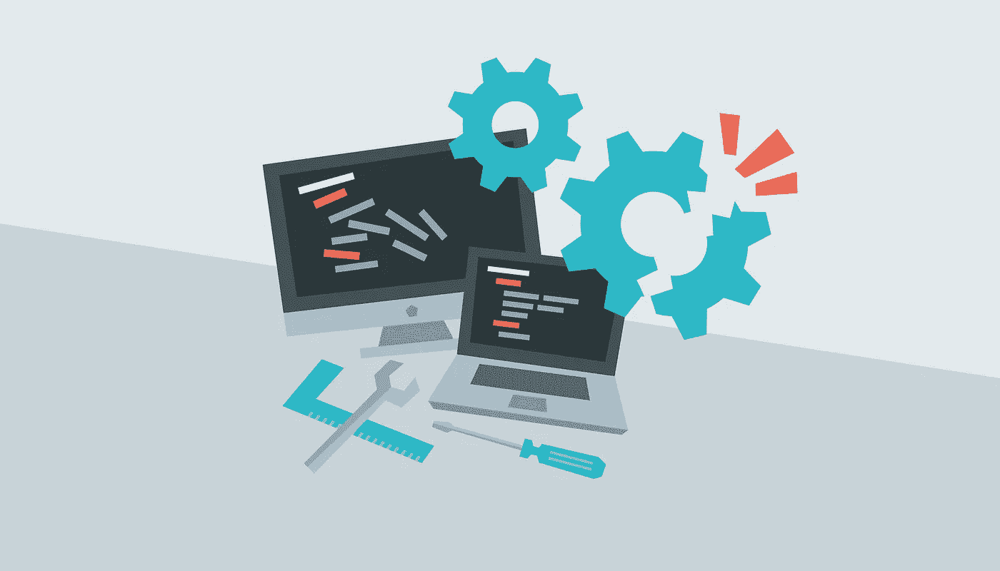
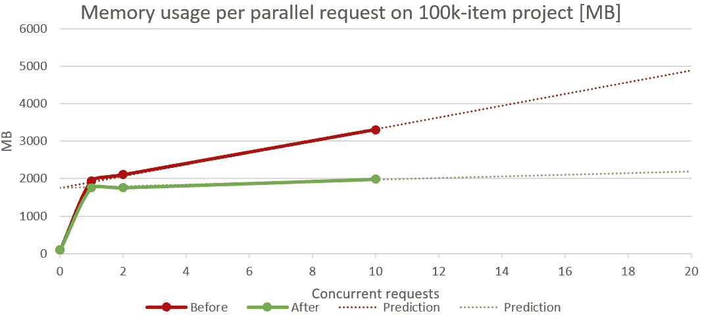

# 一个客户通过使用我们的云服务来帮助我们的那一天

> 原文：<https://medium.com/hackernoon/the-day-a-client-helped-us-by-dos-ing-our-cloud-service-af24d4e801bc>

## 我早上 7 点走进办公室，却发现我的两个(通常是悠闲的)同事惊慌失措。我们的云服务已经崩溃，所有用户都无法访问——这是多么令人愉快的一次觉醒。那么，当这种事情发生，你真的需要时间停下来的时候，你能做什么呢？

我在 Kentico Cloud 做开发，这是一个内容即服务系统。在过去的几年里，我们不断增加我们的企业功能目录。我们引入了一个特别的特性，我们知道它会使我们的产品成为一流的——内容管理 API。该 API 允许用户将现有内容导入内容管理系统(CMS ),而不必通过 web 界面手动插入。在我们最终发布之后，开发者们松了一口气，但是我们无法预见接下来会发生什么。这就是我们的一位客户的旅程的起点，他最终无意中帮助了我们——让我们称他为亚当。

亚当负责他公司的网站，他正在紧张的工作中。在他的网站上线之前，他需要将大量内容从他们的旧 CMS 迁移到 Kentico Cloud。手动复制粘贴所有内容需要数周时间。知道我们将在他的最后期限前发布一个新的内容管理 API，他急切地等待这个特性，并仔细地准备他的导入脚本。

发布后不到一周，他就执行了第一批导入数据集。几分钟后，Kentico Cloud 的管理界面没有响应，正在努力处理传入的请求，片刻之后，它关闭了；这就把我带回到介绍和我的两个吓坏了的同事。当你负责为成千上万的客户服务的云服务时，这是一个大麻烦。谢天谢地，这个问题只影响了 CMS 的管理部分；因此，依赖于从云中传输的数据的客户网站不会受到影响。

到我上班的时候，我的同事们已经发现可能是 Adam 对我们的服务器进行了第一次无意的 DoS 攻击。但是那天早上的主要目标很明确——确保我们服务的管理部分尽快启动并运行。

# 首先确保服务正常工作，然后进行调查

在对日志进行第一次分析后，很明显是来自 Adam 的导入批次导致了失败。处理这些请求的逻辑耗尽了 Azure 中 web 服务的所有可用物理内存。同时，我们的客户支持已经与 Adam 取得了联系，并了解了他的问题。因此，一方面，我们有一个期限紧迫且导入失败的企业客户，另一方面，所有其他客户都只剩下一个损坏的应用程序。

Number of parallel requests during the DoS attack

我们行动迅速。首先，我们创建了一个内存转储，供以后研究使用。然后，作为一个快速解决方案，我们旨在通过在 Azure 中为 Adam 的项目创建一个新的 web 服务实例，并将我们的 CDN 重新配置为将他的所有请求重定向到那里，从而将 Adam 与其他人隔离开来。在第一次事故发生后的几个小时内，我们恢复了对所有客户的服务，并使 Adam 能够及时完成进口。由于这个修复，API 请求的速度提高了，因为他暂时获得了一个专用的架构。

# 怎么会这样？

修复为我们赢得了一些时间，但我们知道我们需要找到一个持久的解决方案，因为可能会有另一个客户准备做与 Adam 完全相同的事情。此时，我们仍然不知道一个客户是如何耗尽所有服务器内存的。然而，我们有内存转储和亚当，谁一直很有帮助。他向我们提供了导入脚本，并解释了在服务器停止响应之前他所采取的措施。

我们发现 Adam 项目的内容项在服务器内存中重复了很多次，导致内存耗尽。乍一看，并不清楚是什么原因造成的。但是调试总是很有趣的，尤其是当你没有时间压力的时候，对吗？我们意识到有许多相互关联的问题。

# Azure 表和缓存

首先是蓝色的桌子。我们将它们用作所有内容项的存储，由于它们只是简单的键值存储，它们并不真正支持常规查询或排序。因此，为了对特定项目的内容项进行排序或过滤，我们首先必须将它们全部加载到内存中，并在那里执行这些操作。没错，但这并不能解释为什么内存中会有这么多内容项的副本。

很久以前，当我们实现缓存时，我们认为在从存储库中返回每个项目之前克隆它是一个好主意。这应该可以确保没有人能够改变它在缓存中的实际值。这是一个有效的理论，但不是一个特别可扩展的理论。当 Adam 导入他的内容项时，服务需要对每个内容项执行验证检查，以确保所有链接都是有效的。由于他的项目彼此大量链接，这些检查会重复创建所有内容项目的快照。你看到内存消耗是如何指数增长的吗？现在，将它乘以并行请求的数量。

This is not your average graph… this one is better flat!

# 实施面向未来的解决方案

在我们把所有的拼图拼起来之后，我们开始解决问题。我们确定了两个主要的技术债务:

1.  在我们从存储库中返回内容项目之前，所有内容项目都在被克隆
2.  项目之间的关系是临时计算的，没有倒排索引

一旦我们知道问题是什么，解决第一个问题就是小菜一碟。我们只是引入了从存储库中返回的项目的只读接口。这一调整不需要系统内的任何重大改变。如果一个模块需要改变一个返回的项，它会在本地完成。

为了解决第二个技术问题，我们必须引入倒排索引搜索。我们不必搜索所有的内容项来找出特定项的使用位置，只需在包含所有父子关系的倒排索引中查找它的用法。当你搜索“苹果”的时候，谷歌会做同样的事情。当你按下搜索按钮时，他们的算法不会搜索整个互联网——那会花很长时间；相反，它在现有的索引中查找结果。

这两项改变并不是解决我们问题的正确方法，而是权宜之计。我们仍然必须将所有项目内容项加载到内存中，以便我们的服务能够正确工作。然而，我们能够在可忽略的时间内解决问题，并防止类似事件在不久的将来发生。

尽管当前的问题已经解决，但我们决心拿出一个长期愿景。这些快速解决的技术债务给了我们更多的时间来研究和准备架构中的重大变化。对于许多企业客户，我们的目标是为满足他们未来的要求和需求做好准备。我们参与了关于改变底层数据库服务和调整整个服务层以进一步优化内存消耗的讨论。这将为我们提供一种可扩展得更好的服务，确保更快的响应时间，而无需为每个其他客户安装专用服务器。

# 主要外卖

我们已经从产品扩展中吸取了教训，并被提醒说，失去对核心架构实现的关注会给我们提供不间断服务的能力带来严重后果。感谢 Adam，我们现在知道了在向客户介绍新功能之前，退一步审视我们的架构并找出可能的瓶颈是多么重要。此外，我们还了解到，始终采取客户至上的方法至关重要。凭借出色的客户服务，我们能够将他们中的许多人转化为合作伙伴，帮助我们改进产品。

如果您想了解更多关于 Kentico Cloud 的信息，请访问我们的[主页](https://kenticocloud.com/)，它永远在线！