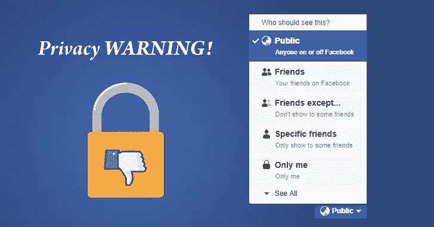
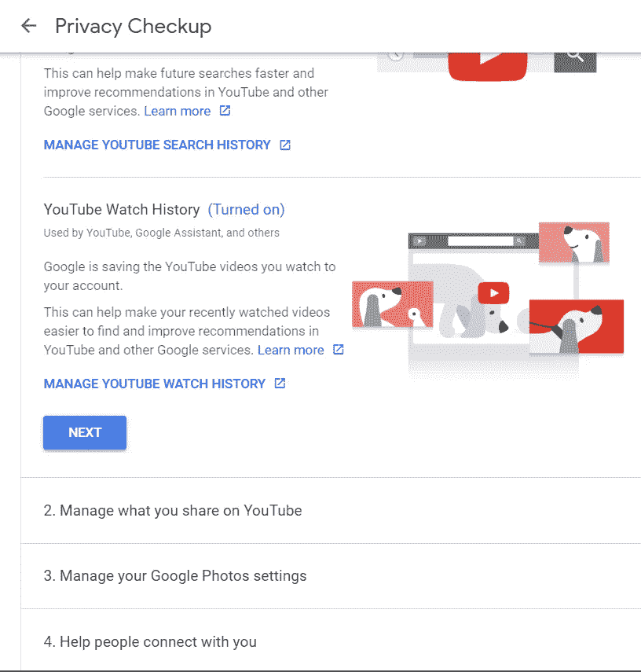

# 社交网络需要为用户提供更好的“默认”设置

> 原文：<https://medium.com/hackernoon/the-default-settings-on-your-social-media-ffdd5fc8d6a5>

## 互联网一直在讨论社交媒体网络上的数据隐私问题，这已经成为我们日常生活中的一个标准。

剑桥分析公司丑闻之后，脸书、推特和谷歌被全球各国政府传唤。虽然他们可能会被捧上神坛，被质疑他们的商业行为，但没有任何结果。主要是因为网络巨头能够说服每个人，当他们处理他们平台的用户提供的数据时，用户是出于自己的自由意志提供这些数据的。

这是因为平台上有一个选项，他们可以从中删除自己的历史记录或关闭数据共享。如果人们不使用这些选项，这意味着他们希望看到有针对性的广告，并愿意允许公司继续利用他们的数据赚钱。

# 默认设置

我相信人类天性懒惰。在点击同意应用程序和软件的最终用户协议之前，我们不会三思而行，只需在应用程序安装时点击允许任何选项，我们不会检查哪些选项是活动的或不活动的，直到出现紧急情况。

记住这一点，我相信虽然用户可以选择关闭他们的数据共享，但很少有人真正行使这些权利。

产品经理明白这一点。他们花了一生的时间去理解用户的行为和一些简单的事情，比如让开关开着而不是关着，给用户一种自由意志的错觉。并且超过 90%的用户(如果不是更多的话)从不为此烦恼，因为它不会给他们的生活带来任何不便。

我在脸书和谷歌上浏览了当前的用户旅程，看看它是如何工作的:

## 脸谱网

你可以在这里查看你的喜好:[https://www.facebook.com/ads/preferences/](https://www.facebook.com/ads/preferences/)

脸书选项相当简单，但它位于完整设置列表的底部，一旦出现，如果你试图更改设置，系统会提示你更改设置可能会丢失什么。不了解技术的普通用户不会继续使用它，因为他们不了解后果，也不想“破坏系统”。

Default settings on Facebook Ad settings

## 谷歌

谷歌的用户之旅更复杂，因为我必须通过 3 个不同的页面才能真正到达隐私选项，这些页面是描述性的，你实际上可以控制很多数据。

您可以在这里更改您的偏好:【https://myaccount.google.com/privacycheckup 

如果你是一个产品经理，你会知道当你给用户很多选择的时候，他们会感到困惑。我自己，在我到达这个页面后没有改变任何东西，因为有太多的选项供我选择。

虽然谷歌给了你权力，但知道有多少人在进入这个页面后真的做出了改变还是很有意思的。

# 如果默认设置不同呢

现在考虑这样一种情况，这些网络的默认设置是关闭数据共享，并有提示通知要求他们手动打开设置。

大多数人不会费心打开它们，这些平台即使在我们不活跃在平台上时也能监控我们的活动，只能从那些自愿和有意识地允许平台获取他们的数据并向他们展示定向广告的用户那里获取数据。

## 不利方面

不利的一面是，所有平台都在为自己辩护，你会看到广告的质量会下降。它们不是定制的，而是随机的，最适合你的浏览器提供给平台的 cookie 数据。

但是，如果你对此不满意，你可以从设置中打开数据共享，不是吗？

这不就是自由意志的意思吗？

## 考虑以下场景:

场景 1:你的水箱有一个洞，水一直从里面漏出来，直到你没有把它封住。

和...相对

场景 2:你有一个小水龙头，你可以选择让水流动的时间，让一股小水流流动，这样它就可以喂飞到你水箱里的鸟了。

你会选择哪一个？

我们大多数人会选择场景 2，而我们日常生活中的用例是场景 1。

# 最后

我认为，与其要求脸书和谷歌改变他们的商业模式(这是一项庞大的任务，不太可能成功)，我认为我们更容易说服他们改变默认设置，然后用户可以有意识地选择打开它们。

这不仅会让他们知道他们在分享什么数据，也不会导致未来出现像英国退出欧盟和 2016 年美国大选那样的重大失误。