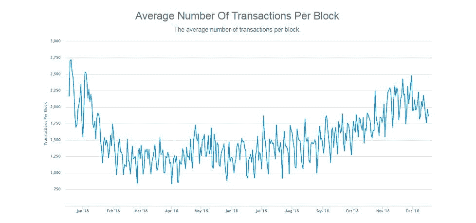
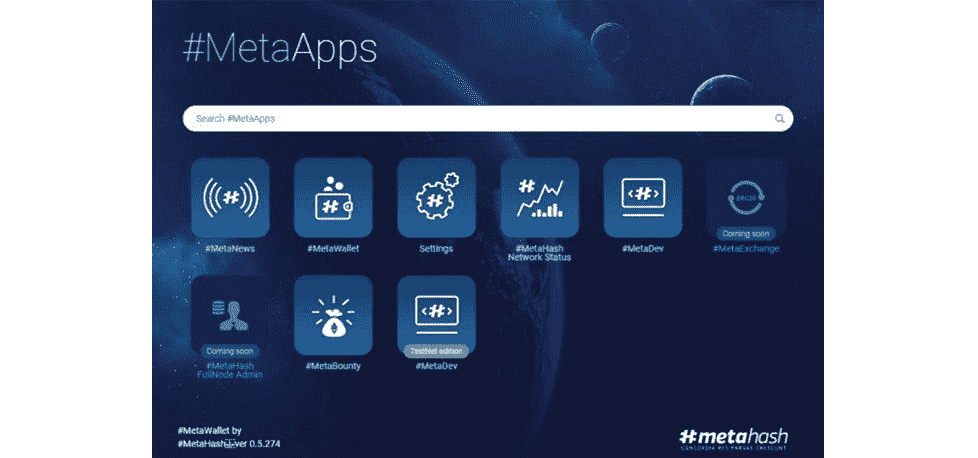
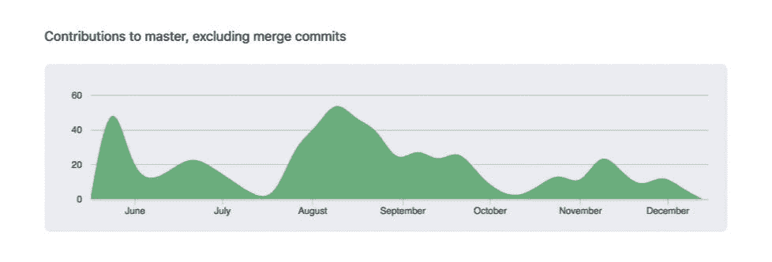
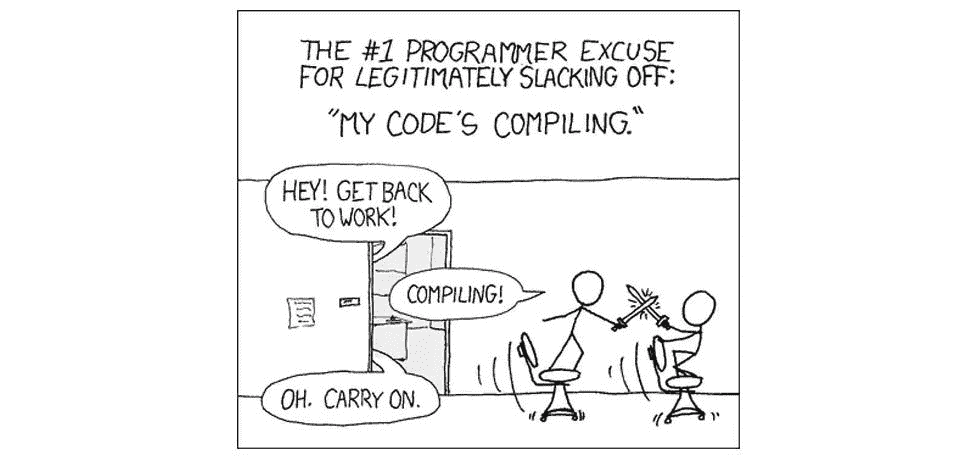

# 构建实时分布式应用的开发人员指南

> 原文：<https://medium.com/hackernoon/the-developers-guide-on-building-real-time-distributed-apps-833a53bd5018>

[https://fineartamerica.com/featured/peter-i-the-great-at-deptford-daniel-maclise.html](https://fineartamerica.com/featured/peter-i-the-great-at-deptford-daniel-maclise.html)

如今，分散式应用程序的发展阶段与亨利·福特时代的汽车差不多。换句话说，使用 dApps 是一个缓慢的过程，它是不安全的，每个人都总是问，“这到底是什么东西？”

事实上，在经历了近一年的熊市周期后，dApps 的状态就像一片烧焦的沙漠。看看这个地区目前的状况，很容易发现大多数项目都已经停止，几乎完全停止了。然而，在这种背景下，有一些分布式应用程序的开发者仍然很活跃。有成功的外围项目赢得了市场参与者的信任(如 [Storj](https://storj.io/) ，其日活跃观众[占所有 dapp](https://www.stateofthedapps.com/rankings/category/storage)总观众的一半以上)。当然，随着行业的进一步发展，这种情况会有所改变。但是今天，分布式应用程序仍然是极客和密码爱好者的玩具。这部分是因为加密货币领域在日常生活中的渗透率很低，但事实仍然是——这些应用程序太慢了，不可靠，现在还不能被大众接受。

[https://dappradar.com/charts](https://dappradar.com/charts)

# 现实世界中对 dApps 的要求

为了满足习惯于集中式服务的普通人的需求，分布式应用程序应该满足什么样的品质？他们不需要太多。应该是安全快捷的；真的很快！必须记住，对于分散化和数据控制的任何考虑都不会迫使一般人更喜欢缓慢和滞后的分布式应用程序，而不是快速和方便的经典应用程序。

我说的“非常快”是什么意思？嗯，WhatsApp 每个月完成大约[600 亿笔交易](https://www.statista.com/statistics/258743/daily-mobile-message-volume-of-whatsapp-messenger/)，或者大约 70 万 tx/秒。这大致是去中心化应用程序应该努力达到的速度水平，以便与 Telegram、脸书、Whatsapp 等“老大哥”展开有力竞争。今天，我们离这个目标还有多远？非常非常远。BTC 和区块链联邦理工学院的交易确认时间以分钟为单位计算(您可以在此处和找到一些特定的估计值[)；每秒钟大约有 7 笔交易通过以太网(区块链的当前状态可以在这里跟踪](https://www.fool.com/investing/2018/05/23/ranking-the-average-transaction-speeds-of-the-15-l.aspx))。

[https://www.blockchain.com/en/charts/n-transactions-per-block?timespan=1year](https://www.blockchain.com/en/charts/n-transactions-per-block?timespan=1year)

我们必须向以太坊开发者的努力致敬，他们试图让区块链明显更快，比如等离子的[实现。但这些数字表明，通往理想速度的道路并不短。所以最近出现了其他专注于解决这个问题的平台。这种平台的一个显著例子是](/@argongroup/ethereum-plasma-explained-608720d3c60e) [#Metahash](https://metahash.org/) ，您可以在这个平台上开发快速方便的分布式应用程序。

#MetaHash 支持创建实时工作的分散式应用程序，如普通的 web 服务和应用程序，并且可以对任何
区块链网络和普通互联网上的事件做出响应。#MetaHash 网络在超过 50，000 tx/s 的速度下允许 3 秒的确认时间

如此出色的性能是本教程致力于使用#MetaHash 并基于其区块链创建 dApp 的原因。

# 使用#MetaHash:完整指南

将来，#MetaHash 网络将包括一系列分散模块，以加速新项目的开发。例如，每个项目的创建者将能够使用现有的#MetaChains 服务，而不是创建自己的比特币或以太坊解析脚本。

这里我们将描述一些基本的操作，比如创建一个#MetaHash 地址，发送事务，以及强调 testnet 和 mainnet 开发环境之间的区别。更多信息可以参考 [#MetaHash 的黄皮书](https://static.metahash.org/docs/MetaHash_YellowPaper_EN.pdf?v=4)。

# 如何设置开发环境

首先，你需要在你的机器上安装 [cURL 软件](https://en.wikipedia.org/wiki/CURL)和命令行工具的基本知识。#MetaHash 使用的加密函数基于 [OpenSSL 库](https://www.openssl.org/docs/manmaster/man1/dgst.html)，您也将需要它。这两个程序都可以免费下载，你可以在这里找到关于如何设置它们的说明[这里](https://develop.zendesk.com/hc/en-us/articles/360001068567-Installing-and-using-cURL)和[这里](https://www.xolphin.com/support/ssl/OpenSSL/OpenSSL_-_Installation_under_Windows)。请注意，这些指南是专门为 Windows 用户提供的，如果您使用的是其他操作系统，请参考特定的教程。

# 如何设置客户端(#MetaGate)

#MetaGate 是一个轻量级用户客户端，当伪造模式处于活动状态时，可以选择使用部分硬盘作为存档存储。你可以从 metagate.metahash.org 下载客户端。

#MetaGate 同时充当加密钱包和去中心化互联网的“大门”。每个开发自己的#MetaApp(基于#MetaHash 的区块链构建的 dApp)的人都可以通过上面的接口提交给生态系统。

# 生成密钥

为了以#MetaHashCoin (MHC)加密货币完成交易和存储资产，用户必须拥有一个数字钱包。为了以编程方式创建这样一个钱包，您需要理解钱包开发的一个基本原则— [非对称加密](https://en.wikipedia.org/wiki/Public-key_cryptography)。

非对称加密涉及两个密钥——一个公钥和一个私钥；消息用公钥加密，用秘密私钥解密。当您执行交易时，所有数据也用您的私钥签名。所以，按键将作为你每一个动作的主要工具。

生成私钥是创建钱包的第一步，钱包中有一个地址，您可以在#MetaHash 网络上发送和接收付款。只有使用私钥才能确认拥有地址的权利。

要生成私钥，您需要使用基于椭圆曲线 [secp256r1](https://www.npmjs.com/package/ecdsa-secp256r1) 的加密算法。您可以通过以下方式使用 OpenSSL 库中已有的通用实现:secp256k1 (prime256v1 ):

*代码(插入命令行工具):*

> *OpenSSL EC param-genkey-name secp 256k 1-out test . PEM*

基于私钥，应该立即生成公钥。

*代码:*

> OpenSSL EC-in test . PEM-pub out-out test . pub

# 创建地址

私钥和公钥的存在允许您继续下一步—创建地址。地址是#MetaHash 网络中的用户 ID，这对于任何类型的交易都是必要的。网络上的每个用户都可以拥有无限数量的地址，这些地址存储在他们的钱包中并用于操作。

以下序列将创建一个#MetaHash 地址:

1.从公钥中取出 65 个字节(其中 1 个字节代表‘0x 04’，然后 32 个字节对应于网络内的 x 坐标，32 个字节对应于 y 坐标)。

*代码:*

> *OpenSSL EC param-genkey-name secp 256k 1-out test . PEM*
> 
> *OpenSSL EC-in test . PEM-pub out-out form DER | tail-c 65 | xxd-p-c 65>BTC _ test . pub*

2.执行公钥的 SHA-256 散列加密。

*代码:*

> *卡特彼勒 BTC _ test . pub | xxd-r-p | OpenSSL dgst-sha 256*
> 
> *(stdin)=****2969 f 47d 442 ed 5210355741 f1ca 3908 a 62 bee 9 b 20 a 0 c 37 db 39 b 356 D2 aa 0 b 8 f***

3.接下来，加密散列函数 [RIPEMD-160](http://homes.esat.kuleuven.be/~bosselae/ripemd160.html) 对前一步骤中获得的值进行散列。

*代码:*

> *echo-e '您在步骤 2 中的值' | xxd-r-p/OpenSSL dgst-rmd 160*

4.在接收到的值上，再次执行 SHA-256 散列(参见步骤 2)。

5.从最后一个值开始，再次执行 SHA-256 散列，并且只取接收到的散列的前 4 个字节(或 8 个符号)。

6.这 4 个字节添加到步骤 3 中 RIPEMD-160 哈希的末尾，0x 添加到开头。

输出是地址。

# 使用地址的操作

本部分描述了用于处理#MetaHash 地址的方法。可以在当前可用的 torrent 服务器列表上提出请求。这些类型的请求在生产和测试网络中都有效，如下所述。

**当前余额**

使用 fetch-balance 方法可以找出#MetaHash 地址的当前余额。

*代码*

> 投入
> 
> ' curl-x POST-data '
> 
> {
> 
> 【产品 id】:1、
> 
> "参数":
> 
> {
> 
> 地址":" 0x005511…00000 " / /地址
> 
> }
> 
> }‘XXX。XXX . XXX . XXX:YYYY/fetch-balance//IP:PORT/Method _ name
> 
> 输出
> 
> {
> 
> 【产品 id】:1、
> 
> “结果”:
> 
> {
> 
> "地址":" 0x005511…00000 "，/ /地址
> 
> “已接收”:0，/ /已接收(已接收)
> 
> “耗尽”:0，/ /耗尽(消失)
> 
> “count _ received”:0，/ /收据数量
> 
> " count _ spend ":0，/ /发货数量
> 
> “块号”:0”，/ /块号
> 
> “current block”:22，/ /当前的块数
> 
> }
> 
> }

**交易历史**

在元哈希网络中，有一种获取历史记录的方法，允许您查看某个地址的整个事务历史记录。

*代号:*

> 投入
> 
> ' curl-x POST-data '
> 
> {
> 
> 【产品 id】:1、
> 
> "参数":
> 
> {
> 
> 地址":" 0x005…555 " / /地址
> 
> }
> 
> }‘XXX。XXX . XXX . XXX:YYYY/fetch-history//IP:端口/方法名称
> 
> 输出
> 
> {
> 
> 【产品 id】:1、
> 
> “结果”:
> 
> [
> 
> {
> 
> " from": "0x001…b "，/ /从哪个地址
> 
> "到":" 0x00c…8 "，/ /到什么地址
> 
> 【价值】:10000000，，/ /多少钱
> 
> "事务":" 6b…34 "，/ /哈希事务
> 
> },
> 
> …,
> 
> { … }
> 
> ]
> 
> }

在 MetaHash 网络中还有其他类似 get-tx 的方法。想要了解更多，你可以参考 [#MetaHash 开发门户](https://developers.metahash.org/hc/en-us)或者去 [#MetaHash GitHub](https://github.com/metahashorg) 。

[https://github.com/metahashorg](https://github.com/metahashorg)

*支持上述所有方法的各种编程语言的脚本——c++、Shell、PHP、Python——可以在*[*https://github.com/metahashorg*](https://github.com/metahashorg)*找到。存储库的自述文件详细描述了如何使用这些脚本，并提供了它们在测试或生产网络中的应用示例。*

# 创建交易

网络事务是在两个地址之间传输 MHC 的操作。#MetaHash 网络中的交易是在有数字签名的情况下进行的。然后用私钥对数据进行签名。结合公钥，签名确认事务是由给定的#MetaHash 地址的真正所有者创建的。

下面以 POST 请求的形式描述#MetaHash 网络中事务的形成:

*代码*

> ' curl-x POST-data '
> 
> {
> 
> " jsonrpc": "2.0", / / jsonrpc 版本
> 
> "方法":" mhc_send "，/ /方法名
> 
> "参数":
> 
> {
> 
> "收件人":" 0x00f…9D "，/ /收件人地址
> 
> " value": "1000000", / /要发送的金额，这里 value=1 MHC
> 
> "费用":"，/ /佣金
> 
> " nonce": "1 "，/ /该事务发生时从该地址传出的事务数，即= count _ spend+1
> 
> " data ":" "，/ /以十六进制格式附加到事务的数据
> 
> " pubkey": "305…e6aa "，/ /公钥
> 
> " sign": "304…84 " / /带符号文本:to、value、fee、nonce、data、data 计数器等字段的值序列
> 
> 在二进制格式中(参见下面的二进制事务签名)，了解有关签名文本的更多信息。
> 
> }
> 
> }‘XXX。XXX.XXX.XXX:YYYY // IP:PORT。通过阅读本教程的下一部分，您可以找到如何获得可用 IP 和端口的列表。
> 
> 密码系统响应
> 
> {
> 
> “结果”:“还行”，
> 
> " params": "dd2…452" //事务的哈希
> 
> }
> 
> 或者
> 
> {
> 
> “结果”:“还行”，
> 
> " error":" Message " / /错误消息
> 
> }

# 生产与测试环境

元哈希网络是一组服务器，在网络中被划分为不同的角色。#TraceChain technology 运营着几个网络，分别标记为测试网络(TMH 网络)和生产网络(MHC 网络)。

#MetaHash 网络中的测试网络表示为 net-dev 和 net-test，生产网络网络的符号为“net-main”。

测试网络和生产网络之间的主要区别在于，测试网络不仅处理 POST 请求，因为它发生在生产网络中，而且还可以处理 GET 请求。

在# MetaHash 的任何这些网络中，您总是可以查看整个数字交易寄存器；探索者就是为此而开发的。为了方便用户，所有探索者可以在区块链中通过地址、散列事务或块号进行搜索。

探险者的地址:

*   net-main—[http://venus.mhscan.com](http://venus.mhscan.com)
*   网络开发—【http://mhscan.com/ 
*   网考—【https://mercury.mhscan.com/ 

# 结论

我们正逐渐进入去中心化应用的时代。在开发自己的 dApps 时，你肯定会面临选择最适合你目标的区块链的问题。如果您的目标是创建一个具有实时特性的应用程序，比如游戏、聊天室或社交网络，那么#MetaHash 将是一个很好的起点。

## 关于作者:

基里尔·希洛夫——geek forge . io 和 Howtotoken.com 的创始人。采访全球 10，000 名顶尖专家，他们揭示了通往技术奇点的道路上最大的问题。加入我的**# 10k QA challenge:**[geek forge 公式](https://formula.geekforge.io/)。