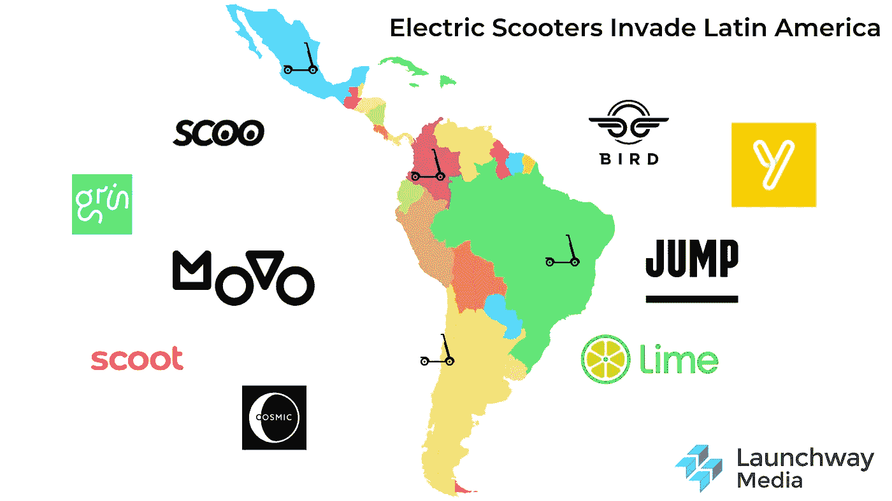

# 入侵拉丁美洲的电动滑板车创业公司

> 原文：<https://medium.com/hackernoon/the-electric-scooter-startups-invading-latin-america-e91b2fb5f70c>

到 2025 年，全球电动滑板车市场预计将达到 285.6 亿美元。

在拉丁美洲，短途旅行使用电动滑板车是一个相当新的现象。

虽然像 Bird 和 Lime 这样的美国电动滑板车创业公司在过去几年中迅速扩张，并筹集了数百万美元，但拉丁美洲直到 2018 年初才出现了第一家电动滑板车创业公司。

总部位于墨西哥城的 [**Grin**](https://ongrin.com/) 是第一家在拉丁美洲冒险的创业公司，在获得著名的 Y Combinator 的资助后，在首都的街道上部署其滑板车。然而，Grin 并不是唯一注意到拉丁美洲巨大潜力的运输初创公司。

拉丁美洲的许多大城市，如墨西哥城、波哥大和圣保罗，都以高峰时段的交通拥堵而闻名。更不用说，许多公共交通系统都在努力支持日益增长的人口。

在拉丁美洲人口稠密的城市，交通系统在高峰时段超负荷运行是正常的，这往往使公共交通成为一种紧张和不愉快的体验。

这些问题导致传统公共交通系统的替代品越来越多，包括乘车、自行车共享、汽车共享服务等。

据路透社报道，墨西哥和巴西是优步全球最大的两个市场。如今，自行车共享项目几乎遍布拉丁美洲的所有大中型城市。短短几个月内，电动滑板车领域的竞争已经开始升温。

## 以下是电动滑板车公司在拉丁美洲积极扩张的情况。🛴

# [咧嘴一笑](https://ongrin.com/)

Grin 于 2018 年 7 月推出，目前仅在墨西哥城运营。然而，该公司计划扩展到拉丁美洲的其他城市。

在短短几个月的时间里，Grin 得到了 Y Combinator 的支持，在拉丁美洲最大的 A 轮融资中筹集了 4500 万美元，T2 将 T3 与圣保罗的 T4 Ride T5 合并，进一步拓展了公司在拉丁美洲的业务。Ride 将在巴西以 Grin 品牌运营，并管理 Grin 在巴西的业务。

Grin 甚至与哥伦比亚的 Rappi 合作，帮助扩大其用户基础和在该地区的扩张。该公司最近带着 150 辆踏板车进入了哥伦比亚的测试阶段。

# [鸟](https://www.bird.co/)

2017 年，Bird scooters 首次出现在加利福尼亚州圣莫尼卡的街道上，并迅速扩展到其他本地和全球市场。在今年早些时候的 3 亿美元融资后，这家小型摩托车初创公司最近的估值为 20 亿美元。

2018 年 10 月，该公司宣布扩张到墨西哥城，这是其在美国以外的第五个城市，首先推出 100 辆踏板车。伯德还宣布，它计划下一步在巴西推出。

# [石灰](https://www.li.me/electric-scooter)

另一个电动滑板车先驱 Lime 自 2017 年 6 月首次推出以来，已经扩展到全球 72 个城市，包括墨西哥城。

优步的估值约为 11 亿美元，拥有 Lime 的少数股份，有传言称优步正在考虑收购滑板车公司或其主要竞争对手 Bird。

今年 Lime 计划在全球 50 个新城市推出。

# [宇宙围棋](https://cosmicgo.co)

Cosmic Go 是哥伦比亚第一批电动滑板车创业公司之一，于 2018 年 11 月在波哥大最繁忙的街区街道上推出了 [100 辆滑板车](https://www.eltiempo.com/bogota/patinetas-electricas-publicas-en-bogota-289220)。

该公司计划在麦德林、巴兰基亚、卡塔赫纳、圣玛尔塔以及哥伦比亚的其他城市推出 next。

# [黄色](https://www.yellow.app/)

去年以【T10 亿美元将他们的拼车初创公司 [99、](https://techcrunch.com/2018/01/03/didi-confirms-it-has-acquired-99-in-brazil-to-expand-in-latin-america/)出售给滴滴出行后不久，99 位创始人推出了 [Yellow](https://yellow.breezy.hr/) ，这是一家自行车和滑板车共享服务公司。

这家初创公司在 2018 年 4 月迅速筹集了 1230 万美元的种子轮，并在 2018 年 10 月筹集了 6300 万美元的 A 轮融资，这是拉丁美洲初创公司有史以来最大的 A 轮融资。

这笔资金将有助于该公司为其在该地区的扩张做好准备。

# [Movo](https://movo.me/)

在西班牙拼车巨头 Cabify 的投资下，Movo 计划在墨西哥、秘鲁、哥伦比亚、智利和西班牙推出电动助力车共享服务。

虽然还没有确切的上市日期，但据估计，20，000 辆小型摩托车将在拉丁美洲城市和西班牙上市。

Movo 将进入一个已经拥挤的空间，它与 Cabify 的合作是否能够加速它在拉丁美洲的采用，还有待观察。

# [史酷比](https://www.scoo.mobi/)

加入 Yellow and Ride 的 Scoo 是另一家由圣保罗企业家 Marcelo Duarte 创办的巴西电动滑板车公司。

在 2018 年 8 月至 10 月的一次试用期间，Scoo 记录了[15000](https://revistapegn.globo.com/Startups/noticia/2018/11/esta-empresa-quer-que-voce-troque-o-carro-por-patinetes-eletricos.html)次出行。虽然该公司拒绝透露在圣保罗街头有多少小型摩托车，但据估计，他们至少有[1000 辆小型摩托车](https://revistapegn.globo.com/Startups/noticia/2018/11/esta-empresa-quer-que-voce-troque-o-carro-por-patinetes-eletricos.html)。

有了[100 万美元](https://www.crunchbase.com/organization/scoo)的资助，Scoo 计划下一步在里约热内卢进行测试，明年扩展到其他首都城市。

# [酷航网络](http://www.scootnetworks.com/)

总部位于旧金山的 Scoot 是拉丁美洲另一家值得关注的电动汽车公司。

凭借现有的电动自行车和电动轻便摩托车，该公司最近选择智利圣地亚哥作为其第三个市场，于 2018 年 10 月推出电动滑板车服务。

在西班牙巴塞罗那成功推出后，该公司与圣地亚哥市长建立了合作伙伴关系，并获准进入智利，启动一支多达 500 辆电动滑板车的车队。

# [跳跃](https://www.uber.com/en-ES/ride/scooters/)

2018 年 5 月，优步以传言中的[2 亿美元](https://techcrunch.com/2018/04/09/uber-acquires-bike-share-startup-jump/)收购了自行车共享初创公司 Jump。虽然该公司专注于自行车，优步希望扩大其移动选项，包括电动滑板车。

该公司在美国的 10 个城市运营，但最近宣布计划于 2019 年第一季度在墨西哥和巴西推出电动滑板车服务。

不过，具体情况还不太清楚，优步新移动副总裁 Rachel Holt 说，他们已经和墨西哥的地方政府谈过了，在这个地区看到了巨大的机会。

# 真正的解决方案还是一时兴起？

2018 年无疑是全球电动滑板车年，尽管拉丁美洲的大多数滑板车活动都发生在这一年的最后几个月。

2019 年，我们很可能会继续看到初创公司在拉丁美洲的街道上投放滑板车，无论是否得到许可。

尽管如此，现在判断电动滑板车是否是拉丁美洲短途通勤的可行解决方案，以及拉丁美洲已经拥堵的城市是否能够支撑大量的滑板车还为时过早。

然而，与当地政府和合作伙伴合作的公司可能最有机会取得成功，因为它们在该地区大举扩张。

[*本文原载于 Launchway Media。*](https://www.launchwaymedia.com/blog)