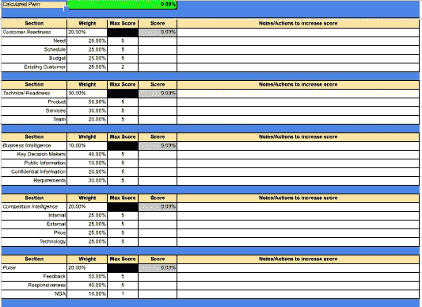

# 创业企业软件销售手册

> 原文：<https://medium.com/hackernoon/the-enterprise-software-sales-playbook-for-startups-584c1771ad5d>


Photo by [Vlad Tchompalov](https://unsplash.com/@tchompalov?utm_source=medium&utm_medium=referral) on [Unsplash](https://unsplash.com?utm_source=medium&utm_medium=referral)

好吧——你已经做出了决定。您已经评估了[任务矩阵](https://www.advanceb2b.com/thegrowthhub/the-mission-matrix-saas-go-to-market-strategy)，并决定高接触度的企业销售是您的成功之路，或者至少是您今天想要解决的群体。

如果你是一名工程师出身的首席执行官兼创始人，你根本不知道自己在做什么。这比你想象的要难得多，签署协议所需的时间也比你想象的要长得多(按年度*季度的整数单位)*，而且不——你没有合适的决策者在房间里——在相当长一段时间内你也不知道他们是谁。那么，你怎么赢呢？

方法如下:

## 集合你的队伍

首先，组建你的团队。如果你没有向企业销售的经验，你的第一反应是“*是的，但是这能有多难呢？都是报销单和租车，对吧？”*。当然可以。不难，就像管理一个幼儿园不难一样。但这需要一定程度的耐心，除非你第一次做，否则你无法理解。最有可能的是，你没有准备好，你也不具备成功的气质。雇佣去过那里的人——这是只有去过那里的人才能找到这个岛屿的罕见时刻之一。

所以第一步，组建一个坚实的，久经沙场的团队。至少有一个人，你的销售副总裁，需要这样。

用什么销售方法？我在下面推荐一个，但是有太多的方法可供选择——Challenger，Solution，Shipley——都是很好的销售方法。任何和所有都是好的，你继续做你的。最终，你需要做的更多的是咨询而不是销售，你的专业知识需要与他们的主题专家(SME)的专业知识相匹配。

对于现代方法来说，基于客户的销售(ABS)实际上非常好，并提供了一个优秀的高接触模型。所以让我们坚持这一点。我不会告诉你每个角色要得到多少(但这里有一个很好的帖子)，但你需要以下角色:

*   销售发展代表(SDR) —他们是您的交易来源。他们将收集名片，深入研究 LinkedIn 个人资料，并为 AE 找到可以交谈的人。
*   客户代表(AE) —客户代表是您的亲密伙伴。比如，“*把咖啡放下！”*
*   客户成功经理(CSM)——非常关键，通常在团队组建过程中被忽略。如果没有人直接与客户合作，确保他们对产品满意，你就不会成功。你不能让这个客户流失…

然而，ABS 模型可能是不够的，因为上述中小企业可能不是上述三者之一。如果可以的话，找一个也是 SME 的 AE，但是你可能仍然需要有人专门负责目标客户和定制客户演示。因此，添加以下内容:

*   销售工程师(SE) —幸运的是，他们可以支持许多 AEs，他们走得越多，就可以创建越多的固定演示

总而言之——用什么比例来搭配？有一天我会为此再写一篇博文，但这是你需要弄清楚的事情。顺便说一句，假设你有一个横向产品，你的 SDR(也许)和 AEs(当然)也可能沿着行业纵向排列。

你在这里面临的最大的陷阱是，你，首席执行官，可能相信你自己可以做到这一点。你不能，你需要一个团队。如果你以前这样做过，你就会知道为什么。如果你以前没有这样做过，你很快就会知道为什么了(**很快意味着 6-18 个月后，假设你成功了*)。

## 了解你的客户

要成功向企业销售，您需要确定客户组织中的以下角色:

*   冠军——这个人是你的产品和公司的倡导者
*   决策者，企业——这个人将做出购买的商业决策
*   决策者，技术人员—此人将做出购买的技术决策
*   影响者—此人是业务中已知的影响者
*   购买者——此人涉及应付账款
*   用户—此人将使用我们的产品/服务

你为什么需要它们？参见下面的 PWIN 和剧本。但基本上你需要知道你需要和谁交谈并说服谁。很有可能，如果你只和一个说“我是决策者”的人交谈，他们并不是决策者，他们甚至可能不知道自己公司的内部采购流程。他们甚至可能对此不熟悉。

真的有这么多人参与吗？是的，至少。请记住，每个角色通常不止一个人，尤其是在投标值大幅增加时。

## 了解销售周期和支出授权限额

每个行业都有自己的支出周期，并希望看到与他们的财政年度保持一致。一般来说，这意味着随着当年的战略目标得到资助并开始实施，您可以预期在 Q1 开始时会看到快速的发展，而在第四季度左右他们会放缓，因为他们可能会花光所有的钱。感恩节和新年之间的时间是典型的死亡空间，尤其是对美国公司而言。对欧洲公司来说，夏季来临是因为每个人都在享受假期。而且不知什么原因，Q3 总是慢。

但是 Q1 是什么时候..您客户的第 4 季度？没错。你需要知道这个。一些公司可能会在一个季度后做出购买决定，例如，如果他们想最大化半年或年度利润(你知道四个原则:早开发票，晚付款，低买高卖)。相反，公司可能会使用季度界限来谈判折扣…这都是公平的，选择你是想要钱还是时间，很少你能两者兼得。

这对您的销售周期意味着什么？这意味着您通常很难缩短销售周期，因为很可能会有公司因素控制资金支出，尤其是如果他们正在为下一年的预算寻找一项计划。那么需要多长时间？预计 6-18 个月。

6-18 个月？是的。*它能早点发生吗？*有，但可能性不大。我所知道的缩短*企业销售*周期的唯一方法是*而不是*从事*企业销售*——让客户像其他人一样购买产品(但可能会为他们包装得很好，例如 AMI、Kubernetes 等)。然而，大公司并不是这样购买的。

此外，公司和企业通常有与绝对合同价值相关的支出限制，成本越高，需要更多的人参与批准和选择供应商的决策——这通常是按顺序进行的*。翻译—更多时间…这是我发现的一个很好的花钱限制的例子。*

**

*[Example of Corporate Spend Limits](https://corporate.bclc.com/content/dam/bclc/corporate/documents/spending-and-signing-authority.pdf)*

*因此，请确保在您的收入预测时间中适当考虑这一点(假设您首先赢得了业务)。*

*大公司通常也会有与授权限额相关的采购程序，例如超过一定金额的采购活动需要公开招标过程。影响？更多时间，现在*你的竞争对手得到通知*。了解这些限制，并尽最大努力将需求堆叠成对你有利的形式。*

*事实上，正如我以前的老板和导师曾经告诉我的那样，“如果你没有写出需求，你就已经失败了。”*

## *完善企业三大法宝:产品—集成—培训和支持*

*企业销售的独特之处有很多，但所有企业交易的共同点是交付物的复杂组合。这些通常包括以下内容:*

*   *产品—这是您的主要产品。希望你不是在做一个纯粹的服务项目。这些是您销售给许多客户的产品，而不仅仅是这一家企业客户。这个你要根据你平时的产品定价策略来定价。你也会保留这个 IP。*
*   *集成—您的企业客户将需要针对他们自己的系统和数据湖进行集成。这是您定制软件以在客户环境中使用的地方。希望您设计的产品能够适应这一点，并且请记住，您可能有客户的本地、纯云或混合需求。这将是一个非经常性的工程(NRE)，你会在某种时间和材料(T&M)方法的价格。见下面我关于劳动力定价的笔记。你很可能不会保留这个 IP，当然也不会保留你客户的数据。*
*   *培训和支持—您的企业客户永远不会进行 RTFM。您需要组建一个团队，向您的客户展示这一切是如何工作的，他们将如何在日常生活中使用它，并回答他们的日常问题。这可以按单位定价，例如，为 20 人举办培训一周的费用为 20，000 美元，或者每年提交 10 个问题 1，000 美元，1 周响应时间，每年提交 10 个问题 1，000 美元，24 小时响应，等等。*

*是的，这确实是四个项目，但是 *trifecta* 更有诗意，同意吗？*

## *开发一个 PWIN 计算器*

*企业销售需要一种客观的衡量方法来衡量交易或提案的“完成程度”。对于桌面赌注，只有当您确定了需求、时间表和预算(NSB)时，每个销售机会才成为机会。但并非每个 NSB 看起来都一样，所以如何比较两个机会呢？输入获胜概率(PWIN)计算器:*

**

*[Sample PWIN Calculator](https://docs.google.com/spreadsheets/d/1jka-cFnJJwEal3bhp4oWH-l7IVl2lXqbDAJO7Tn2wog/edit?usp=sharing)*

*我给你举了一个[的例子](https://docs.google.com/spreadsheets/d/1jka-cFnJJwEal3bhp4oWH-l7IVl2lXqbDAJO7Tn2wog/edit?usp=sharing)。结合下面的行动手册，你将在每个类别中对自己进行主观评分，并由此开始在多个机会中制定一个客观分数。没错——我不能消除所有的主观性，但我可以尽可能让它客观。这是一个令人愉快的技巧，通过协调你的销售团队的努力和设计一个通用的评分系统，实际上效果很好。毕竟，这不是一项运动，除非你在记分。*

*我故意在示例中省略了对类别的详细描述。电子表格包含公式，您应该能够对它们进行逆向工程。不要强调细节，开发你自己的对你有意义的 PWIN 计算器。*

## *开发你的剧本*

*好了，我们终于到主菜了！剧本是什么？嗯…你必须发展它。[这是我用过的一款](https://docs.google.com/document/d/1LFCwbymGlpPH-hvtPAii7EhvZKGJiKPJ_3YW3HHuzrs/edit?usp=sharing)，效果很好。这是一个反复的过程，你收集信息，分析信息，创建/调整建议，调整 PWIN，发送给客户，重复。*

*你可以阅读全部内容，但以下是关键要点:*

*   *在您确定需求、时间表和预算之前，销售线索就是销售线索。你必须拥有这三者。如果你没有这三者，你就没有创业机会。如果你不能解释什么是需求、进度和预算，那你就找错了团队。*
*   *在流程的每个阶段评估和调整 PWIN。将此作为你的数据驱动销售方法。随着您获得获得机会的经验，您的过程将会受益，您也可以在销售会议上提出这一点，并说“嘿，我这里有一个 2，我需要增加，有什么想法吗？”。*
*   *这是非常重要的——建立一种机制，使**随时可以放弃** **投标**。你必须意识到什么时候获胜会对*所有客户*有用的通用产品造成破坏。留意你成为专栏作家的迹象(意味着一个客户正试图从你这里得到一个价格，以降低他们想与之做生意的真正公司的价格)。当心那些不会在 NDA 上签名的顾客！尤其是在你的提案过程中。这是一个巨大的迹象，表明你是专栏的素材，或者只是通知他们自己的 iR & D 组。*
*   *在评估竞争时，要认识到你客户的内部竞争往往是你最大和最直接的竞争！学习如何认识到这一点，以及如何对抗它。*
*   *不要忘记在最后分析每一个提议——不管你是赢是输。有一种趋势是永远不要谈论失去的机会，但你应该，为了加强你的下一个建议或出价。*

*但是你将不得不开发一些东西，这个过程将是反复而漫长的。*

## *劳动力定价*

*选项 1:选择一个数字。每小时 100 美元。成交。*

*选项 2:计算一个数字。这将遵循一个公式，例如:*

```
*Hourly Pricing = S * (1+GA%) * (1+OH%) * (1+P%)*
```

*在哪里*

```
*S  = Salary per hour
GA = General & Administrative costs as a percentage of revenue
OH = Overhead costs as a percentage of revenue
P  = desired profit*
```

*示例:*

*乔每年挣 9 万美元。他一年工作 52 周，每周工作 40 小时，所以总共工作 2080 小时。(这包括他带薪休假的时间)。你公司的 G&A 是 75%，OH 是 12%，你想要 30%的利润。因此你的时薪是:*

```
*90,000/52/40 * (1+0.75) * (1+0.12) * (1 + 0.30) = $91.87/hr*
```

*如果你选择第二种方法(我非常支持，因为它确保了一定程度的财务复杂性)，那么使用来自一些可靠来源的基于角色的平均工资，而不是 Joe 的实际工资。(*是的，你会发现像 G & A，OH 等术语。，在美国政府合同指南中使用，但不要让这个概念吓跑了你，它们是很棒的工具)。**

*选项 2 也给了你一个折扣策略的使用范围(见上文),你可以用它来换取实物价值。例如，如果你除去利润，你的人工直接成本是 70.67 美元，你不能低于这个价格。但是，你可以给他们 5%的折扣来获得这些销售权…*

## *折扣*

*或者更具体地说，单项折扣。企业交易既大又复杂，人类有一种自然的愿望，那就是在交易量上打折扣。仔细阅读下面几行:*

```
*DO NOT DISCOUNT.*
```

*如果您必须:*

```
*Only offer line item discounts, that you offer to all of your customers.  In fact, you should probably publish them along with your price list.*
```

*你已经努力赢得了完成这笔交易的权利。降价 10%是不可能的，除非你需要和你的竞争对手价格相当，但那样你很可能只是专栏素材，因为你的竞争对手会看到并提高你的折扣。相反，请执行以下操作:*

*   *为特定数量提供标准折扣表，并且只针对超出该数量的部分。例如，第一个 2080 小时的人工费率为 100%,第二个 2080 小时为 95%,等等。不要把你的利润定价过高！*
*   *为营销关系的权利提供标准折扣，从预先批准的材料中提取。*
*   *为在特定时间内完成交易提供折扣*

*一般来说，我不喜欢这些折扣加起来超过总成本的 30%，原因很明显。必须有特定的价值让你放弃金钱，而且必须是以物易物。在上面的例子中:*

*   *您在劳动力数量上打了折扣，因为它通过确保您没有额外的(非创收)容量来解决运营问题。*
*   *你低估了推销关系的权利，因为血统是卖点。*
*   *你打折拉进时间表，因为你需要达到数字和你的 QBR 是明天，嗯，你爱那个佣金检查。*

## *契约*

*如果你走到这一步，恭喜你！你可能只差三个月就能完成交易了！你需要和你的法律团队以及他们的法律团队一起协商细节。你应该这样做:*

*   *首先与客户就高级业务细节达成一致。*
*   *向客户索要他们的标准合同。相信我，这是一场你会输掉的惯性之战，因为他们的 m 比你的大得多。企业客户永远不会使用你的合同。但是..向他们要他们的，拿我们的红笔，你可以让它流血。这实际上比你想象的要容易得多！*
*   *让你的律师把这些细节翻译成一份可执行的合同，不要麻烦自己去做，你会节省时间。一个好律师一个小时能做的事，你至少要花十个小时，如果你幸运的话，你的会有一半好。*
*   *让你的律师审查他们的赔偿、责任和保证条款。尽情享受吧！你会发现它们是不可接受的，但你需要坚定而具体地提出要求来减轻或改变它们。此外，协商降低这些保险附加条款的责任限额，但要意识到，你将不得不开始携带某种正式的保险单，将你指定的企业客户作为额外的被保险人。这次你逃不掉了。幸运的是，这些东西比你想象的更容易获得，也更便宜。此外，我接触过的大多数公司对你作为一家初创公司的困境都很敏感，所以继续努力，尝试将这些负债谈判到一个低于你的 ARR 的数字，但 100 万美元通常是一个硬性的下限。*
*   *如果您打算获得联合营销权或新闻稿，请将基线版本作为合同附件的一部分进行协商，并包含在已签署的文档中。我经常看到这种情况在合同签订后被推掉，然后它从未发生，尽管保证“当然，我们不会无理拒绝许可*，它将很快得到解决*。读:*是的*他们会，因为不合理是主观的，*很快*就是*永远不会*。***

## **要寻找的公司**

**如果你正在做这个冷火鸡，你必须有一个在你想销售的行业中有密切联系的人。也许你是前高管，否则你的销售副总裁就是。**

**此外，寻找有战略投资部门或创新中心的公司。这通常意味着公司(a)认识到并公开承认他们需要不是他们开发的产品；(b)认识到他们的采购程序繁琐，是初创企业所厌恶的；并正式资助和组织项目，通过消除采购过程中的障碍，将小企业的技术引入他们的投资组合。**

**汽车公司就是一个很好的例子，我工作过的几家公司都有创新中心，他们的章程就是这样的。**

## **工具**

**使用适当的客户关系管理(CRM)系统，该系统旨在管理您的销售渠道，并可根据您的销售行动手册进行定制。你的销售副总应该告诉你她过去用的是什么，顺其自然就好。你花的每一分钱都值得。你不会要求你的工程师在没有 IDE 的情况下工作吧？不要吝啬你的销售团队——在这里省下一分一毫，以后会让你付出一分一毫。(有许多选项可供您选择，我的建议是根据功能而不是成本进行索引)。**

**—**

**上面有很多要解开的。您的销售副总裁应该带您了解上述所有内容。上面的说明可能会给你一个理由，让你改变直接向企业销售的决定。完美！不如找个渠道合作伙伴吧！我强烈推荐这个。**

**还有，上面的帖子是不是只适用于某几类产品？当然，很可能。我的背景是企业软件，所以我知道它适用于那里。但是我在这篇文章中提到的销售方法是与产品无关的，它们通常都采用相同的方法。所以我觉得你用这个来指导剧本创作就没问题了。**

**我会不时更新这个帖子，所以请回来。期待您的反馈！**

**—**

***本文原载于*[*the entrepreneurd*](https://www.theentrepreneurd.com/)*。我用我的* [*背景*](https://www.theentrepreneurd.com/about/) *作为一个涉足过商业开发、软件开发、销售、天使投资的联合创始人，来创作与创业和创业公司世界相关的原创和合成的思想内容。***

***本文中的想法和思考是我自己的，除了那些不属于我的，我总是在该表扬的地方给予表扬。我希望听到您的想法、反馈和见解。在* [*与 theentrepreneurd.com*](https://www.theentrepreneurd.com)*取得联系。***