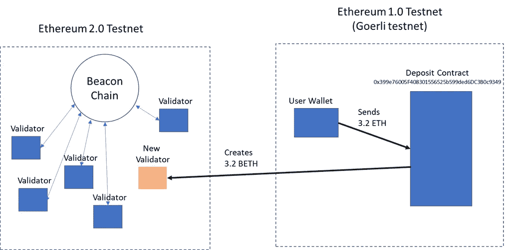

# ETH 2.0 网络和测试网——简单解释

> 原文：<https://medium.com/hackernoon/the-eth-2-0-network-and-testnet-simply-explained-9c6f2d01f1f1>

本月初 [Prysmatic Labs](https://prysmaticlabs.com/) 团队为以太坊 2.0 网络的第一阶段推出了最完整的公共[测试网](/prysmatic-labs/ethereum-2-0-phase-0-testnet-release-1e9e682db910)，该测试网使用了 [Prysm 客户端](https://github.com/prysmaticlabs/prysm)。此次发布受到以太坊社区的好评。许多人立即开始运行软件，并向 Prysmatic 实验室团队报告问题。以太坊 2.0 测试网上的验证器节点数量很快就超过了 800 个。这简单地表明了以太坊社区为以太坊进展到备受期待的以太坊 2.0 网络升级做出贡献的旺盛愿望。

为了让这种兴奋更进一步，有必要让更广泛的以太坊社区了解以太坊 2.0 测试网，为什么它的推出是一个至关重要的里程碑，为什么它花了很长时间才达到这个里程碑。本文试图通过揭开技术细节的神秘面纱，并用简单的语言表达出来，来扮演这个角色。它从讨论以太坊 2.0 与当前以太坊网络的不同开始，然后深入到对测试网功能的高层次解释。

# 以太坊 2.0 升级为什么这么久？

要回答这个问题，让我们从一个简单但重要的事实开始:

**以太坊 2.0 并不是对目前以太坊网络的升级。取而代之的是对以太坊的彻底检修和重新设计。**

许多人没有意识到这一事实，甚至可能不同意这种描述。所以澄清是很重要的。

1.  新的以太坊 2.0 网络摆脱了 PoW 共识，并使用了一种全新的创新的利害关系证明(PoS)共识机制，称为 [Casper](https://arxiv.org/abs/1710.09437) 。
2.  在权力链中，一种简单的方法用于选择区块链如何进行，以及在出现分歧(分叉)的情况下遵循哪个链。PoW 区块链构建在具有 ***最多累积工作*** 的链上，或者换句话说，构建在使用了最多散列率的链上。由于以太坊 2.0 使用 PoS，它引入了一组[分支选择规则](https://github.com/ethereum/eth2.0-specs/blob/dev/specs/core/0_fork-choice.md)，被称为 LMD 幽灵，以识别要构建的正确链。
3.  当前的以太坊网络使用单链(DAG)块。以太坊 2.0 网络将使用 1024 个并行链。这是以太坊雄心勃勃的提高可扩展性计划的核心，该计划被称为 ***分片*** 。这些不同的链(碎片)可以一起通信，所有这些链都将由一个称为信标链的主链来控制和验证。 ***这个信标链类似于一株植物的茎，有 1024 个相同的分枝*** 。
4.  由于这些彻底的改变，ETH 持有者将不能简单地在新的以太坊 2.0 网络上使用他们的 ETH 硬币。取而代之的是，他们将不得不烧掉他们当前的 ETH，作为回报，他们将在信标链上接收相同数量的 ETH。这种传输机制由以太坊 1.0 链上的智能契约处理，该契约由信标链监控。

虽然以太坊 1.0 和 2.0 之间有许多不同之处，但讨论的是主要的观点。这体现了交付以太坊 2.0 所需的工作量。

## 为什么以太坊 2.0 Testnet 发布会如此重要？

从讨论的差异中可以看出，以太坊 2.0 的设计有许多移动的部分，需要组合在一起并调整才能使机器工作。以太坊 2.0 的许多方面和概念都是全新的，以前没有像 Casper 共识机制一样在任何公开的区块链中测试过。

试图实现类似目标的协议，如 Cosmos 和 Polkadot，需要两年多的时间才能得到一个可行的设计，同时具有从头开始的灵活性。这些项目不需要担心像 ETH 和其他 ERC-20 令牌这样的资产从旧链转移到新链，也不需要担心减少变化对 dApp 开发人员的影响。以太坊社区需要看到以太坊迁移过程中的实际步骤，以增强对路线图执行的信心。

## 以太坊 2.0 蓝宝石测试网实现了什么？

回到前面提到的以太坊 1.0 和 2.0 之间的四个区别，testnet 实现了#1、#2 和#4，部分实现了#3。具体来说，Sapphire testnet 已经实现了具有新的 fork 选择规则的 Casper PoS consensus 机制，已经实现了 maser 信标链，并且最终实现了将 ETH 1.0 令牌转换为 ETH 2.0 令牌以在 testnet 上使用的机制。testnet 还没有实现 1024 分片或者分片之间的通信机制(跨分片通信)。

testnet 的另一个值得注意的缺失部分是以太坊智能合约功能的实现，它被安排在路线图的第 2 阶段。智能合同要求迁移以太坊虚拟机(EVM)或实现以太坊 2.0 协议中建议的替代方案(WASM)。

## 以太坊 2.0 testnet 是如何工作的？

以太坊 2.0 是一个 PoS 网络，它有验证器，验证器使用令牌来操作和生成网络块。因此，难题的第一部分是给验证器分配令牌，以便它们能够运行。

以太坊 2.0 网络最终将使用我们今天拥有的同样有价值的 ETH 令牌，这些令牌需要转移到新的以太坊 2.0 网络。为了测试这种转移功能，Prysmatic Labs 的开发人员使用了名为 Goerli 的假冒以太坊 1.0 testnet，任何人都可以获得他们想要的假冒 ETH，并开发了一个智能合同(称为[存款合同](https://goerli.etherscan.io/address/0x399e76005f408301556525b599ded6dc3b0c9349))，该合同可以无限期地持有任何存放在其中的 ETH 令牌。存款完成后，信标链发出与 ETH 2.0 令牌相同数量的 ETH。为简单起见，我们将 ETH 2.0 令牌称为:信标链 ETH (bETH)。

Diagram of how the transfer of ETH happens between Ethereum 1.0 and 2.0

**使用以下步骤将 ETH 1.0 迁移到 bETH:**

1.  验证者首先为以太坊 2.0 网络安装 [Prysm 软件](https://prysmaticlabs.gitbook.io/prysm/)，并在以太坊 2.0 上创建一个账户。帐户创建将生成“存款数据”，用于将以太坊 1.0 钱包链接到以太坊 2.0 生成的帐户。

3.在以太坊 1.0 Goerli 网络上，用户发送 3.2 ETH(现实中会是 32 ETH)给 D [eposit 契约](https://goerli.etherscan.io/address/0x399e76005f408301556525b599ded6dc3b0c9349)参与以太坊 2.0 验证。这有效地烧毁了 ETH 1.0 令牌。

4.以太坊 2.0 信标链观察存款合同中的令牌沉积，并向新创建的验证者帐户发出相同数量的 bETH 令牌。现在，一旦安全时间延迟过去，验证器就准备好参与验证过程。该延迟用于保护信标链的安全性。

5.验证者客户端开始参与共识操作，并为他们的工作获得验证奖励，或者如果他们不遵守协议规则，就会被砍。

## 验证者的工作到底是什么？

在 Eth 2.0 中，每 6 秒发生一次阻塞(在当前的 PoW 网络中为 15 秒)。在每个块中，来自验证器池的验证器提出一个块。许多其他验证器检查建议的块并证明其正确性。对于随后的每个块，不同的验证者提出该块，并且不同的验证者组证明该块的正确性。

每 64 个块的周期(称为时期)，所有的验证器被洗牌以改变为每个块选择的块提议者和证明者。在用于选择验证者的随机数生成的辅助下，这种混洗本质上防止了验证者共谋并增强了协议的安全性。

验证者需要一直在线来执行分配给他们的任务。当他们以诚实的方式完成这些任务时，他们会得到新铸造的贝丝代币作为奖励。如果验证者行为不当、串通或离线，他们的标记就会被削减或泄露。当验证者的余额低于验证阈值(测试网络中的 3.2 bETH)时，他们将被从验证者池中踢出，并且不能参与验证过程。

# 下一步是什么？

Sapphire testnet 只是通往以太坊 2.0 目的地的漫长道路上的一步。它实现了以太坊 2.0 路线图的[阶段 0](https://github.com/ethereum/eth2.0-specs) 。在以太坊 2.0 完全发挥作用之前，还需要完成两个阶段。

但即使是 0 期 testnet，在 mainnet 中推出 0 期之前仍有大量工作要做。首先，这是 testnet 的早期阶段，有很多问题和缺陷需要解决。其次，这是一个单客户端测试网。其他团队正在努力实现以太坊 2.0 网络的其他客户端，即[光轮](https://our.status.im/the-nimbus-mvp-testnet-is-here/)和[灯塔](https://lighthouse.sigmaprime.io/update-09.html)，以实现多客户端测试网。第三，阶段 0 的规范允许在不同账户之间转移 BETH，但这一功能尚不可用。最后，以太坊基金会研究小组仍在对阶段 0 规范进行微小的修改。这些规范需要在 2019 年底前启动 0 期 mainnet 之前，在多个以太坊 2.0 客户端中最终确定、完全实施和审核。

总之，testnest 的推出是交付以太坊 2.0 路线图中的关键一步。它的重要性源于以太坊社区的公众参与，以测试网络，识别问题和瓶颈，从而指导以太坊 2.0 开发人员解决这些问题。此次发布极大地增强了社区对以太坊 2.0 路线图的信心。此外，以太坊基金会[宣布](https://blog.ethereum.org/2019/05/21/ethereum-foundation-spring-2019-update/)他们将拨款 1900 万美元支持以太坊 2.0 和其他以太坊可扩展性解决方案的开发。这些资源可以加快开发和测试工作的进度。