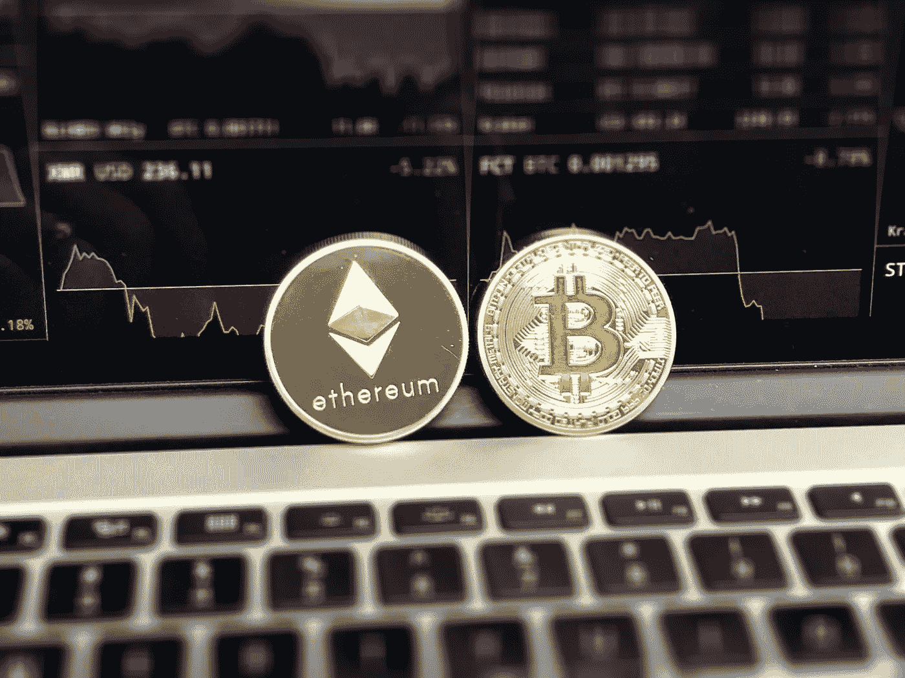

# 区块链手中杠杆的演变

> 原文：<https://medium.com/hackernoon/the-evolution-of-leverage-in-blockchains-hands-36a070cc0d60>

图片来源:pexels.com

将一种资产换成另一种资产并推测其价值关系的能力吸引了具有某种癖好的人。无论是用美元换股票还是用比特币换以太坊，交易者天生对风险的容忍度更高，因为他们无论何时开仓或平仓都面临风险。它已经变得很熟悉，交易者不再保持距离，而是经常拥抱风险，不管是好是坏。杠杆只是代表了最简单的方法，他们打开了拨号。

杠杆就像它听起来的那样——杠杆放大物理输入力的能力在金融领域得到了复制，允许交易者开立比其账户资金多很多倍的头寸。这种想法诞生于几十年前银行资本和准备金要求的阴影之下，当时大多数监管机构对银行发行新债所需的现金数量提出了正式要求。同样的概念也适用于你经纪账户中的现金量或交易所钱包中的比特币量。

由于区块链的创新和代币滑过账本的敏捷方式，加密货币爱好者拥有了一些有史以来最具实验性和最有利可图的杠杆选择。在许多方面，杠杆仍然和以前一样，但区块链允许交易所绕开一些更棘手的问题，提供同样多的利润和损失，并伴随着新的创新方法来控制混乱。

# 杠杆作用在密码市场中日益凸显

加密交易所在杠杆交易中遇到的一些最大的问题包括当高杠杆交易者被清算时发生的“小于零”的损失。由于许多原因，这是加密交换中突然出现的一个问题。一是加密资产比外汇或大宗商品波动性大得多，后者往往每天只波动几美分或几个点。另一个原因是缺乏一个监管体系，让利益相关者有法律追索权来挽回财务损失。像传统经纪人一样，可以通过制定保证金要求来控制风险，保证金要求会在接近清空交易者账户时自动平仓。

当一个交易者的杠杆达到 1:100 时，这基本上意味着他们用 1 美分借了交易所 1 美元的钱来交易。当比特币发生这种情况时，保证金就不那么可靠了，并导致 2018 年 7 月 OKEx 上的大规模清算等事件。一名交易员对比特币的不当押注导致 4 . 16 亿美元头寸被平仓，交易所的保险基金无法支付。由于它们不同的架构和资产，这些交易所通常建立一个社会化的损失模型。

社会化亏损从交易的“获利”方借入资本，而不是迫使交易所或其支持者支付大额清算。它提高了流动性(对加密交易所来说是一个棘手的问题)，但也可能不是最公平的操作方式，因为即使杠杆加密交易者有望赚得更多，他们也不应该承担自己抵押品以外的交易对手损失的负担。

# 标记过去的杠杆障碍

源于社会化损失模型的交易对手追回是交易所向加密交易者提供低负债杠杆和流动性的权宜之计。在真正的区块链时尚界，行业创新者已经在突破这些界限。除了为交易所提供稀释杠杆风险的新途径之外，这些策略还将同时奖励那些帮助实现这一目标的人。一个最相关的例子是[FTX](https://ftexchange.com/)加密衍生品交易所，它部署了一个稳定的基于硬币的交易基础设施，从而允许投资者使用系绳和自己的 FTX 令牌(FTT)从一个钱包进行所有市场的交易。

FTT 充当杠杆的抵押品，但也用于降低费用，交易所的[三级清算引擎](/@FTexchange/our-liquidation-engine-how-we-significantly-reduced-the-likelihood-of-clawbacks-67c1b7d19fdc)大大降低了收回的可能性。事实上，FTX 的新模式已经比加密巨头 OKEx 更具流动性。它提供杠杆的方式也很有趣，例如，交易者可以简单地投资 BTCBULL(比特币 3 倍长)或 ETHBEAR(以太坊 3 倍短)代币，而不是使用复杂的保证金系统。这些资产以放大的方式上下移动，与基础硬币的变化成比例，XRP、EOS 等其他类似结构的产品已经在交易。

另一种更好地管理客户杠杆作用的巧妙方法是类似于分散应用程序制造商如何完成类似的壮举。Maker 是一种智能合约，持有交易者存入的 ETH，然后根据同一合约向交易者发放 DAI stablecoins。DAI 可以用来购买其他加密货币，因此这种抵押债务头寸(CDP)非常类似于杠杆。当 ETH 的价值下降时，CDP 需要补充(通过算法确定，即每个 ETH 发行的 DAI 数量),否则将被清算。Maker 处理交易对手风险的方式是将 MKR 作为第二枚“权威硬币”，向持有者支付费用，但也让他们的 MKR 余额与威胁生态系统的清算事件挂钩。

# 边缘的未来

BitMex 是最早提供杠杆的加密交易所之一，通过拥有可能是世界上最大的保险基金(24，000BTC 约合 1.25 亿美元)的支持，它可以安全地处理清算事件，使其对去年经历的大规模损失负责。多亏了臭名昭著的 Twitter 账户@BitMexRekt，交易员可以在市场波动期间实时观看烟火表演。然而，并不是所有的交易所都负担得起这种方法，它们也不应该必须这样做。

先进的令牌化基础设施、专业平衡的激励模式和巧妙的智能合约在这方面有所帮助。到目前为止，2019 年已经见证了[交易所的杠杆率大幅增加](https://news.bitcoin.com/the-number-of-crypto-exchanges-offering-margin-has-multiplied/)，愿意探索利用杠杆的新策略的交易员和交易所都可以为区块链渗透到主流做好准备。