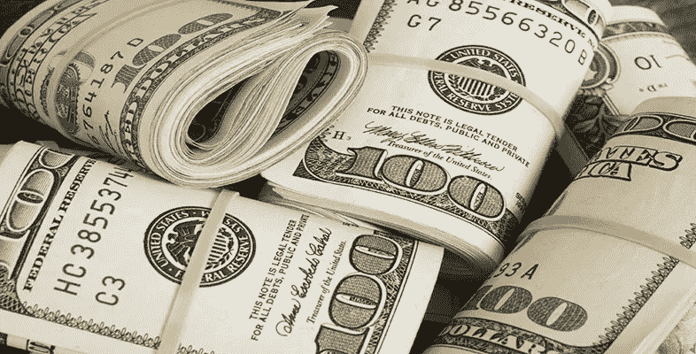
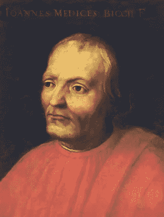

# 货币的演变。夏洛克和银行业时代觉醒。第二集

> 原文：<https://medium.com/hackernoon/the-evolution-of-money-the-age-of-shylocks-and-banking-chapter-2-146274a7bd37>

Money makes the world go round…

吕底亚国家银行的成功传播到了欧洲，特别是希腊，在那里，货币作为一种相互信任的体系的潜力在 6 世纪被复制、改编并迅速改进。其结果是希腊经济的深刻转型，城市的发展，以及一个更加成熟的社会的出现。

在硬币出现之前，古代地中海世界使用的是原始货币，这种货币不可能引发希腊经历的那种革命。

4000 多年前，古代美索不达米亚的人们使用泥板来进行特定的金融交易。随着农业的成功，人们需要用他们生产的剩余产品来交换他们没有的产品。

这些粘在粘土上的交易承诺并没有内在价值，不像金条或银币，但它们起到了货币的作用，因为参与交易的各方信任它。可以说，金钱之所以演变成现在的样子，是因为人们信任它。

## 欧洲的点钞问题

硬币作为货币的使用很快在欧洲和亚洲被接受，并在引入的地方大受欢迎。在一些社会中，硬币是用金银等贵金属铸造的，只要被接受，商业就会繁荣，经济就会繁荣。

到了公元 1200 年，随着罗马帝国的衰落而兴起的欧洲独立国家并存，甚至相互进行贸易。然而，问题是每个州都有自己的货币，这在很大程度上阻碍了贸易的顺利进行。

例如，在流行的商业城市如比萨和威尼斯，商人使用多达七种不同类型的硬币是很常见的。这项业务非常复杂，即使是最小的交易也需要复杂的计算。

此外，这些国家使用罗马数字系统，这是不适合复杂的数学和金融计算。随着这一发展，商人需要在交易时记录他们的钱，这导致了第一台计算机算盘的发明。

在东方，苏尼穆斯林哈里发、印度人和中华帝国的货币技术远比欧洲先进。事实上，直到公元 1202 年比萨的莱昂纳多(Leonardo)出版了《计算之书》(Liber Abaci)之后，随着印度-阿拉伯数字系统的引入，欧洲才开始赶上他们。

新的数字系统在应用于记账和货币兑换时更加实用。然而，它导致了货币的一个新功能的引入，改变了金融的历史:信用和利息。

## **信用和货币借贷的出现**

当硬币被引入现代意大利北部的世仇国家时，它的功能有限。斐波那契的出版物释放了更多的潜在资金，因为它发现了一个人可以依靠另一个人借钱，并在未来某个日期偿还。到 1397 年乔瓦尼·美第奇建立美第奇银行时，新的数字系统已经生根发芽。

计算百分比、日期和其他金融因素要容易得多，因此，贷款成为一种贸易。拉丁语“Credo”的意思是“T0 ”,我相信是“T1 ”,后来演变为“Credit ”,最初是由放债人在向商人贷款时使用的。威尼斯，因莎士比亚的*《威尼斯商人》中的放债人而出名的夏洛克的故乡，成长为世界上最大的放债城市。*

早期的放债人不受尊重。如果说有什么不同的话，他们被视为贱民，因为根据《圣经》,带息放贷是一种罪恶。正因为如此，犹太人，他们被免除了圣经的戒律，是唯一可以在 1516 年以一定利息借钱给大多数基督教商人的人。随着向威尼斯犹太人借钱的商人数量的增加，这些企业发展成为第一批银行。

“银行”这个词是从 *Banco Rosso* 演变而来的，它是犹太人在威尼斯犹太区入口处办公的建筑的名称。

## **金钱作为权力的新工具**

Giovanni Medici

犹太人借钱的代价是社会排斥。他们被限制在犹太区，因为他们的服务对基督教世界来说是一种罪过，但对威尼斯的经济来说却越来越必要。然而，随着时间的推移，放贷从犹太人聚居区蔓延到了这个城市最富裕的商人的领地。放贷是威尼斯城里回报最高的金融活动。

随着借款人数量的增加，冒着永远被诅咒的风险提供有利息贷款的人数也在增加。这导致放债人之间的竞争，最终降低了利率。随着越来越多的个人进入银行业，佛罗伦萨共和国(今天意大利的佛罗伦萨市)的美第奇家族成为最成功的放债人。

历史上没有任何一个名字能更好地象征货币业务，尤其是信贷服务的成功。放债不再是无可挽回的了；这成了任何人都能进入的最光荣的行业。在很短的时间内，那些从事银行业的人成为了新的权力掮客，因为他们对一个城市甚至一个州的经济最有影响力。

与过去国王对国家的运行有绝对的发言权不同，银行所有者建立了一种没人能预料到的遗产。为了理解银行家的影响力有多大，在短短的 400 多年里，美第奇家族产生了两位法兰西女王和三位罗马教皇。事实上，美第奇家族在公元 15 至 17 世纪的法国文艺复兴中扮演了重要的角色。

## **货币兑换业务**

到 16 世纪初，随着货币越来越多地被接受为价值的衡量和储存手段，几乎欧洲和亚洲的每个王国和国家都开始生产自己的货币。这也是一个商业繁荣、航运业初具规模、信贷使更多的商人能够承担更大的风险和进行更广泛的贸易的时期。

银行业虽然仍不为人所接受，但却是最赚钱的行业，只有有钱放贷的人才能成功。银行家通过收取小额佣金将货币从一种货币转换成另一种货币，赚了更多的钱。

随着时间的推移，教会放松了其反高利贷法，该法规定对贷款和银行收取利息是一种犯罪，这意味着这项业务变得合法，甚至更有利可图。渐渐地，簿记技术得到了发展，很快，银行开始使用复式记账系统来维持他们的制衡。

在乔瓦尼的领导下，美第奇银行仍然是银行业的开拓者，并很快从佛罗伦萨扩展到威尼斯和罗马。这种多样性意味着更多的地区受益于银行服务，银行所有者对城市的发展有更大的影响力。

## **纸币**

公元 618 年左右，中国人在唐朝首次使用纸币。这些钱主要以私人信用票据和后来的交换票据的形式存在。然而，由于纸币生产过剩，通货膨胀飙升，其价值最终在公元 907 年左右暴跌。

1455 年，纸币在中国被彻底废除，取而代之的是一种叫做*开元*的圆角圆形硬币，这也是 *cash* 一词的由来。

公元 1290 年，马可·波罗的中国游记将纸币的概念引入了欧洲。在此之前，欧洲最发达的国家仍然使用由金银等贵金属铸造的硬币。佛罗伦萨，当时最勤劳的金融国家，使用弗罗林，一种在欧洲和商人经常进行贸易的海外王国被广泛接受的金币。

因为当时通货膨胀还不是很严重，纸币直到 1661 年左右才流行起来，当时瑞典斯托克霍姆银行开始发行第一种纸币，以回应瑞典王国铸造重量比以前更轻的新硬币。

## **货币的金本位**

随着银行业务的发展，为了货币的价值，需要对货币进行标准化。17 世纪的欧洲是一个联系更加紧密的地区，商业繁荣，社会中最富有的成员是根据他们拥有多少钱来判断的。

有更多的钱意味着有更大的影响力来决定战争的结果，谁成为国王，以及世界可以与哪个国家做生意。

在下一篇文章中，我们将更深入地探讨货币在现代货币中的出现:第一种稳定的货币(如拜占庭金币和法兰克银币)以及罗马帝国和英国在它的演变中所扮演的角色。

***免责声明*** *:* *由*[*@ cryptomedics*](https://steemit.com/@cryptomedics)*提供的信息不构成投资建议、财务建议、交易建议或任何其他类型的建议，您不应将本网站的任何内容视为投资建议、财务建议、交易建议或任何其他类型的建议。做好自己的尽职调查，并在投资前做好自己的研究。如果你喜欢我们的内容，给我们点爱，upvote，分享一下，加入我们的* [*电报讨论*](https://t.me/cryptomedicsdiscussion) *或者主* [*密码医生频道*](https://t.me/cryptomedics) *。*