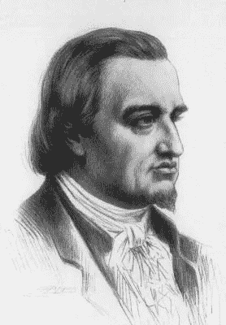

# 货币的演变。罗斯柴尔德银行的幽灵威胁。第三集

> 原文：<https://medium.com/hackernoon/the-evolution-of-money-the-phantom-menace-of-the-rothschild-banking-episode-3-4f4bb8c812e1>

**Mayer Amschel Rothschild**, written also **Anschel** (23 February 1744–19 September 1812), the founder of the [Rothschild banking dynasty](https://en.wikipedia.org/wiki/Rothschild_family).

随着银行业务的发展，为了货币的价值，需要对货币进行标准化。17 世纪的欧洲是一个联系更加紧密的地区，商业繁荣，社会中最富有的成员是根据他们拥有多少钱来判断的。拥有更多的黄金意味着拥有更多的钱，这意味着在决定战争的结果、谁成为国王以及世界可以与哪个国家做生意方面有更大的影响力。这是一个金钱逐渐取代宗教成为最强大的权力工具的时期。

要真正理解货币体系的金本位制，以及这种最珍贵的金属标准的价值如何给全球经济带来了革命性的变化，我们必须后退一步，回到罗马帝国的衰落时期。在鼎盛时期，罗马人非常成功，原因很简单，他们基于硬币的经济可以抵御通货膨胀。这是因为罗马帝国的货币价值与黄金和其他贵金属的价值直接相关。在罗马历史的大部分时间里，他们的货币由铜、银、青铜和黄金制成。

公元 434 年罗马帝国灭亡后，他们成功地用货币储存财富和价值。由此产生的遍布欧洲、亚洲和北非的四分五裂的国家用贵金属铸造了他们自己的硬币，很快，银和金成为最可行的货币。随着 13 世纪意大利佛罗伦萨货币借贷的兴起以及随后航运和国际贸易的成功，随着宗教被置于礼仪背景之下，货币在政治王朝的形成中发挥了核心作用。

## **英格兰银行和股票市场**

到 17 世纪末，英国已是一片金融废墟。超过五年的对法国和其他王国的无休止的战争耗尽了王国的资源，他们不得不转向私人贷款人来资助新的战争。主要靠货币兑换发家的放债人收取高价，并要求纳税作为担保。这些原来是私人银行，在股票交易所控制和操纵英镑。英格兰银行由这些私人银行于 1674 年建立，以巩固其权力，垄断黄金支持货币的发行。英格兰银行成为世界上第一家私有中央银行。

在拿破仑战争之前的时代，多个欧洲王国一直在争夺领土。战争需要钱。士兵们必须得到食物和军饷，武器和马匹的获得和调动需要花费大量的金钱。政府向当时最富有的银行寻求贷款，贷款连同利息一起偿还。1803 年，包括英国、西班牙王国、普鲁士王国和汉诺威王国在内的欧洲列强组成联盟，于 1803 年抗击拿破仑。为了资金，他们向当时最富有的银行家迈耶·罗斯柴尔德家族求助。

政府债券，当时被称为战争债券/战争控制台，由政府发行，承诺向持有者支付等值的货币面值，并在股票市场交易。罗斯柴尔德家族资助了政府战争，但同时也在证券交易所进行投机和交易。政府发行的债券价值根据投资者对政府的信心而波动，就像今天的货币一样。滑铁卢战役期间，金融市场屏住呼吸，等待法国与两支联军——英国和普鲁士军队——之间的战斗结果。这场战争将决定政府债券(尤其是英国政府债券)的价值是会随着胜利而上涨，还是会随着失败而下跌。

## 罗斯柴尔德家族和滑铁卢战役

在塑造现代货币的演变过程中，没有哪个个人或团体比罗斯柴尔德家族发挥了更重要的作用。现代货币及其与黄金之间经久不衰的关系的整个历史可以追溯到欧洲的一场决定性战役，这场战役可能塑造了整个人类历史:1815 年 6 月 18 日的滑铁卢战役。正是在这场战斗中，广受欢迎的银行家和债券交易员内森·罗斯柴尔德(Nathan Rothschild)利用有关滑铁卢战役结果的信息，实施了最大的金融政变，他控制了股票市场，甚至英格兰银行。

为了更清楚地了解一个家族是如何控制整个证券交易所和世界上最强大王国之一的中央银行的，我们必须进一步追溯，了解罗斯柴尔德家族是如何主宰欧洲银行业的。

迈耶·罗斯柴尔德于 1710 年出生在神圣罗马帝国(今天的法兰克福)的法兰克福犹太人聚居区。像大多数生活在城市犹太人聚居区的人一样，他很快学会了货币兑换和贷款业务。当时，只有犹太人可以从事货币业务，因为大多数基督教徒认为带息放贷是一种罪恶。梅耶尔在他所做的事情上非常成功，他很好地教会了他的五个儿子如何经营金融业务。犹太百科全书宣称，迈耶·罗斯柴尔德通过向黑森州的威廉九世王子出售硬币获得了大部分财富，并最终被委托管理他的账户和银行业务。

当儿子们长大后，迈耶·罗斯柴尔德把他们送到欧洲不同的城市开始同样的生意。内森去了伦敦，在那里他开始了纺织和贷款业务，阿姆谢尔接管了法兰克福家族银行，所罗门在维也纳建立了自己的家庭，卡尔曼去了那不勒斯，雅各布在巴黎开办了家族银行。像他们的父亲一样，罗斯柴尔德兄弟通过为贵族联系和管理银行业赚了大部分的钱。内森·罗斯柴尔德与威灵顿公爵关系密切，被任命为宫廷犹太人，这是对为欧洲皇室处理金融事务的犹太银行家的一种特殊称呼。

罗斯柴尔德家族接近权力给了他们商业优势，他们最大限度地利用了这一优势。从 1809 年开始，全欧洲的五家银行都开始经营金条和政府债券。当拿破仑在欧洲肆虐的时候，这些王国向罗斯柴尔德家族寻求贷款来资助他们对抗他的战争，而这正是家族银行赚钱最多的地方。这是因为贷款给政府非常有利可图——银行家可以决定条款，而且因为他们是由纳税人担保的，风险是最小的。拿破仑从谁那里得到了战争经费？没错，他也收到了罗斯柴尔德家族的来信。

到 1815 年，罗斯柴尔德五兄弟秘密向威灵顿公爵领导的联军和拿破仑军队提供黄金和白银(通过法国的雅各布银行)。这可能是他们接受资助战争双方的政策的时候。随着时间的推移，罗斯柴尔德家族越来越喜欢战争，原因很简单，战争对交战双方来说是昂贵的，但对任何有资金借给他们的人来说都是巨大的利润。当他们资助双方时，谁赢谁输并不重要，因为胜利者总是会履行贷款条款。资助双方的政策从 19 世纪延续到 20 世纪。

罗斯柴尔德家族最有条件资助欧洲的每一场重大战争，不仅因为他们已经拥有遍布欧洲的银行基础设施，还因为他们建立了一个无与伦比的间谍和信息传递网络，配备了快速信使和秘密路线。由于这是一个政府债券价格大幅波动的时代，罗斯柴尔德家族总是领先时事一步，在投机甚至决定债券价格方面非常成功。此外，由于罗斯柴尔德家族资助了战争双方，他们的信使是唯一被允许通过法国和英国封锁的商人。内森，像他的父亲一样，明白金钱就是力量。他对自己的地位非常自信，有人引用他的话说:

Nathan Rothschild

> 给我一个国家货币的控制权，我不在乎谁来制定法律。

## **政府债券**

在 1815 年 6 月 18 日拿破仑时代滑铁卢的最后一战中，据称已经是证券交易所中受人瞩目的人物和首富的内森·罗斯柴尔德，通过散布关于战争结果的虚假消息来引发抛售狂潮，以使英镑价格暴跌，并秘密买入。罗斯柴尔德家族复杂多样的间谍和信鸽信息系统被证明是无价的。内森·罗斯柴尔德已经安排了一个名叫约翰·罗沃斯的人在战场的北边，靠近英吉利海峡，他的任务是一旦战场上有任何进展，就立即发送消息。

战斗结束后，特工罗沃斯立即派了一只信鸽去通知内森，联军胜利了。这个消息可能是在 6 月 19 日星期一晚上发出的，比 21 日政府信使骑马带着消息到达的时间早了 24 小时。据称，内森利用他对战斗结果的了解，散布谣言说联军已被击败，导致证券交易所的英镑债券被恐慌性抛售。罗斯柴尔德家族的代理人随后被指示以几个小时前债券价值的零头买入所有债券。

当拿破仑战败的消息传到伦敦，英镑价格回升时，内森·罗斯柴尔德和罗斯柴尔德家族银行是英格兰银行的最大股东。据[估计](https://www.globalcapital.com/article/ry3hgfjfbv79/old-money-battle-of-waterloo-making-a-killing)那天内森·罗斯柴尔德的投资增加了 20 比 1，罗斯柴尔德家族的财富在一天内翻了一番，从 50 万英镑增加到 100 万英镑，这在当时是一笔深不可测的财富。

## **货币的金本位**

金本位货币是一种货币体系，在这种货币体系中，特定的货币，通常是硬币和纸币，其价值直接与特定的黄金价值挂钩。这意味着货币的价值是“健全的”或“稳定的”。拥有货币的国家为黄金设定一个固定的价格，并以此价格买卖贵金属。这为非通货膨胀的纸币的生产铺平了道路，这些纸币被印刷在更便宜、更方便的纸上来代表一定数量的黄金。随着政府将其黄金储备的价值转换为纸币，并使用向私人银行和个人发行的债务工具，纸币和黄金之间的斗争最终导致了流行的金本位货币。

1816 年，英国成为第一个以黄金为基础规范货币价值的王国。这意味着持有最多政府债券的银行和个人也持有同样多的国库黄金。这是货币史上的一个重大发展，因为这意味着同一种货币的不同面值可以由一个中央机构生产，而无需实际证明该货币所代表的黄金可以按需获得。纸币本质上是一种收据，证明持有人在发行人(政府)处存放了一定数量的黄金，并且“物有所值”。

尽管欧洲在 16 世纪引入了纸币，但金币和金条继续统治着全球货币体系，直到 18 世纪纸币变得更加流行。

## **部分准备金银行的起源**

随着技术，尤其是航运和全球贸易的巨大进步，英国迅速崛起成为世界上最大的经济体。对包括亚洲、美洲和非洲在内的新大陆的探索和开发为英格兰银行带来了大量的黄金，这在巩固金本位和使用纸币作为理想货币方面发挥了至关重要的作用。由于王国、殖民地甚至商业之间的贸易不平衡是用黄金解决的，拥有英格兰中央银行的金匠们实际上控制了新旧世界。直到今天，该银行几个世纪以来积累的[黄金储备](https://www.investopedia.com/ask/answers/040715/what-countries-have-largest-gold-reserves.asp)仍然存在。

随着黄金支持的纸币作为主要货币的使用，出现了其他一些东西。由于没有人真正知道银行储备了多少黄金，银行可以印出比储备更多的纸币，并作为贷款发放出去，没有人知道。例如，银行可以为每 1 英镑的储备黄金发行 100 英镑，并收取全额利息，没有人会知道。他们赚取的利息被用来购买更多的黄金和印刷更多的钞票，如此循环往复。

今天，这种做法是合法的，它被称为部分准备金银行。它被定义为一个银行系统，其中只有一小部分银行存款由可提取的手头现金支持。这种形式的银行业务有助于经济扩张，因为它释放出的资本可以贷给其他机构。世界上大多数银行都被要求至少保留通过贷款和客户存款获得的现金储备的百分之几。

然而，一些银行被免除这一准备金要求，但所有银行都是按照被称为“准备金利率”的准备金利率支付的。据 Investopedia 报道，在美国，资产价值超过 1.102 亿美元的银行需要满足 10%的准备金要求。那些资产价值在 1520 万至 1.102 亿美元之间的银行被要求至少保留 3%的准备金，而资产价值低于 1520 万美元的银行则不受准备金要求的限制。

金本位货币在 1871 年被德国采用，并在 1914 年第一次世界大战开始时达到顶峰，从而成为国际货币。它的成功导致了世界上其他州和国家的采用。美国是最后几个在 1900 年采用国际货币金本位制的国家之一，金本位法案的颁布为美联储的建立奠定了基础，以实施货币金本位制和抑制通货膨胀。分业经营、政治联盟的变化、国际债务的增加以及政府财政的恶化导致了国际货币金本位制的崩溃。

## **结论**

随着世界在第一次世界大战期间对金本位失去信心，整个全球经济下滑，经济困难加剧。一些专家将此归咎于金匠银行的贪婪，而其他人则认为金本位制的灭亡是不可避免的。不管是哪种情况，战后很明显，世界需要一种更新、更灵活而可靠的方式来支撑全球经济。

在本系列的下一篇文章中，我们将关注为什么美元和英镑取代黄金成为全球经济的储备货币。

***免责声明*** *:* *由*[*@ cryptomedics*](https://steemit.com/@cryptomedics)*提供的信息不构成投资建议、财务建议、交易建议或任何其他类型的建议，您不应将本网站的任何内容视为投资建议、财务建议、交易建议或任何其他类型的建议。做好自己的尽职调查，并在投资前做好自己的研究。如果你喜欢我们的内容，给我们点爱，upvote，分享一下，加入我们的* [*电报讨论*](https://t.me/cryptomedicsdiscussion) *或者主* [*密码医生频道*](https://t.me/cryptomedics) *。*