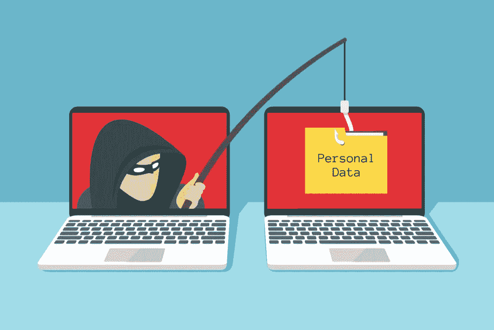
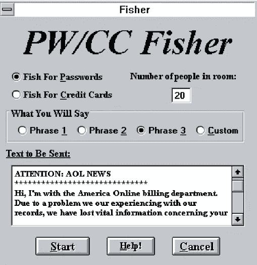
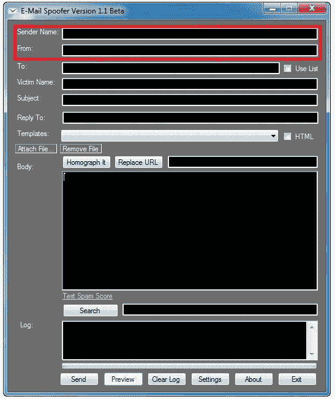
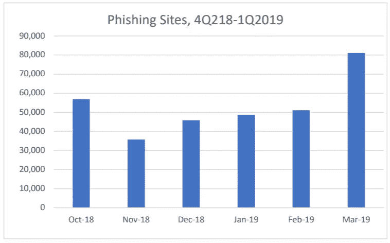
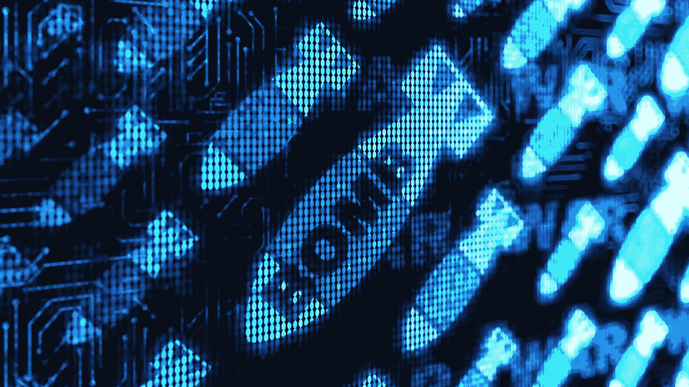

# 网络钓鱼攻击的演变:为什么它们仍然有效？

> 原文：<https://medium.com/hackernoon/the-evolution-of-phishing-attacks-why-are-they-still-effective-44bdb8f458c2>

我第一次间接遭遇网络钓鱼是在大约二十年前。那时候，我有一份夜班工作，早上睡几个小时，然后中午去学习。诺基亚 3310 刚发布，我养成了休息时间关机的习惯。上午 11 点左右，我听到一个紧张的敲门声，却发现我担心的母亲在外面。她告诉我的事情既好笑又麻烦。

[https://www.ophtek.com/high-profile-organizations-that-have-been-phished/](https://www.ophtek.com/high-profile-organizations-that-have-been-phished/) img: square-smb-phishing.jpg

显然，她接到了一个“警察”的电话，说我出了车祸。简而言之，她需要提供适量的资金来保释我。很自然地，她试着先给我打电话，而我的手机关机让她很担心。然而，我的日程安排得很紧，通常在上午 11 点就睡着了，所以她想在做任何决定之前来看看。我们都笑了，但它让我思考。

首先，我有一张驾驶执照和一辆登记在我名下的汽车，这些信息不难得到。第二，他们在我手机关机的时候打电话给我，并且知道这将增加收到付款的机会。所有这些都让这个电话很有说服力。这些骗局被称为“Vishing”(“voice”+“phishing”)，可悲的是，它们仍然存在。

此外，新技术和万维网的快速发展为改进旧策略开辟了新的途径。网络钓鱼主要依赖于人为错误因素，网络安全专家强调教育是防范它的第一道防线。因此，让我们仔细看看网络钓鱼的演变和当前的事态。

## 网络钓鱼的定义

***网络钓鱼是企图欺骗受害者获取机密和私人信息和/或分发受感染文件。*** 现在这个术语几乎是电子邮件网络钓鱼的同义词，但这是对这种做法的狭义理解。除了金钱上的收益，可能的目标也会变得简单。在本文的后面，我将详细阐述最近网络钓鱼被用于政治目的的例子。

## 第一次网络钓鱼攻击

在 1994-1995 年，AOL(美国在线)度过了一段美好的时光。他们是最大的互联网接入提供商之一，拥有稳定增长的用户群。然而，网络安全更多的是政府的事情，私营企业很少投资于网络安全。AOL 成为第一个网络钓鱼攻击的受害者，这是一个惨痛的教训。

大约在 1994 年的某个时候，一个名叫“大慢性病”的黑客开发了一个 windows 应用程序，并将其命名为“AOHell”。在其他功能中，它有史以来第一个利用 AOL 的直接消息系统的网络钓鱼工具包“CC/PW Fisher”。此外，它是自动化的。黑客能够通过向不知情的用户发送直接消息来获取个人凭证:

“嗨，这里是美国在线客户服务部。为了安全起见，我们需要验证您的帐户。请问，您能提供您的用户名和密码吗？”

[https://www.semanticscholar.org/topic/AOHell/3132882](https://www.semanticscholar.org/topic/AOHell/3132882)

以前从未遇到过这种情况的不知情的受害者自愿给出他们的个人信息，并成为第一个遭受网络钓鱼攻击的人。

## 网络钓鱼攻击的演变

AOHell 的成功是网络钓鱼历史上的一个重要时刻，但可以肯定的是，它会以某种方式成为一种主要的黑客行为。主要是因为它不需要深入的网络知识，甚至不需要基本的编程技能。它依赖于人为错误和缺乏在线安全意识，像技术工具一样操纵人类心理。

例如，奥地利航空零部件制造商 FACC [遭受了超过 4000 万欧元的损失](https://www.reuters.com/article/us-facc-ceo/austrias-facc-hit-by-cyber-fraud-fires-ceo-idUSKCN0YG0ZF)，因为一名不幸的员工收到了一封来自其首席执行官的电子邮件。一封电子邮件要求将一大笔钱转移到一个未知的银行账户，这被称为“收购项目”的一部分。在这个阶段，没有涉及到黑客攻击(在这个词的普通意义上)。黑客们很幸运地猜到了首席执行官的邮件，然后伪造邮件，伪造一封令人信服的信，并观察资金的流动。

[https://heimdalsecurity.com/blog/ip-email-phone-spoofing/](https://heimdalsecurity.com/blog/ip-email-phone-spoofing/) img: email-spoofing.png

适当的教育可以防止这种事情发生。如果有问题的员工知道什么是电子邮件欺骗，如何仔细检查电子邮件中的钓鱼标志，并接受过网络安全培训，他很可能会有不同的反应。

让我们回忆一下 AOHell 案例，两者都有一个共同点:黑客伪装成别人来得到他或她想要的东西。这部分在二十多年里几乎没有变化。不断发展的是可用于成功的网络钓鱼攻击的技术。

电子邮件欺骗软件、能够群发电子邮件的代理服务器，以及可以使用简单算法生成的高内容质量的电子邮件，这些都是技术方面的进步。然而，适当的网络安全培训和意识还没有，而且[的公司已经在警告](https://techcrunch.com/2019/01/27/too-few-cybersecurity-professionals-is-a-gigantic-problem-for-2019/)缺乏这方面的专家。

另一个必须解决的问题是社交网络的兴起。要创建一封令人信服的电子邮件，你必须至少有一些信息，迫使收件人采取行动。之前，一封常见的钓鱼邮件以“亲爱的客户”开头，是区分真假邮件的指标之一。现在，钓鱼邮件包含姓名、家庭地址，甚至用于某种服务的密码变得越来越常见。

这就带来了最后一点——数据泄露。脸书和 T2 谷歌都在一年内经历了数据泄露，这些公司有能力投资网络安全。MySpace 或 ArmorGames 等较小的服务也经历过泄露，所有这些信息都直接进入了 Dark Web。现在有一大包[22 亿泄露的凭证出售](https://www.wired.com/story/collection-leak-usernames-passwords-billions/)，可以肯定的猜测是网络钓鱼者购买它来提高他们电子邮件的质量。

## 克隆网络钓鱼和克隆网站

根据 APWG(反钓鱼工作组)[2019 年 Q1](http://docs.apwg.org/reports/apwg_trends_report_q1_2019.pdf) 季度报告，克隆钓鱼网站有所增加。随着越来越多的人意识到这种骗局，通过电子邮件或聊天向人们询问个人信息已经不再有效。然而，将受害者引导到克隆的网站并要求他们输入个人信息是一种更有效的方法。

[https://docs.apwg.org/reports/apwg_trends_report_q1_2019.pdf](https://docs.apwg.org/reports/apwg_trends_report_q1_2019.pdf)

费西合唱团 Phry 袭击事件[就是这种情况。攻击者使用克隆的网络钓鱼电子邮件、秘密重定向和克隆的网站。他们成功地伪造了一封假电子邮件，这封邮件类似于问题银行用来联系客户的真邮件。然后，他们修改里面的链接，将受害者重定向到一个克隆的网站，该网站也类似于一个官方银行网站。从那时起，任何输入到该网站的信息都落入了不法之徒的手中，受影响的账户被榨干了所有的钱。](https://www.bankinfosecurity.com/phish-fry-nets-100-fraudsters-a-1846)

此外，克隆网站很难追踪，因为这种网站的平均寿命只有一天。一旦收集到足够的信息，这些网站就会被关闭，追踪到最初的创建者变得很复杂。识别此类网站的一种方法是检查它们是否以 HTTP 或 HTTPS 开头，第二种方法是合法性的一个指标。可悲的是，由于监管不力，即使是假冒和克隆的网站也可以获得 SSL(安全套接字层)证书，并伪装成安全域。

## 出于政治目的的网络钓鱼

在 2016 年美国总统竞选期间，支持希拉里·克林顿的政治家约翰·波德斯塔成为鱼叉式网络钓鱼的目标。鱼叉式网络钓鱼是指黑客针对特定的个人，而不是广大网民。他收到了一封伪造的电子邮件，类似于谷歌安全警报，并缩短了使用流行的 Bitly 服务伪造的链接。然后他被带到一个克隆的网站，输入个人 Gmail 凭据，导致机密邮件泄露。

[https://worldofweirdthings.com/2010/09/25/did-cyber-warfare-finally-invade-the-real-world/](https://worldofweirdthings.com/2010/09/25/did-cyber-warfare-finally-invade-the-real-world/) img: cyberwar_1200.jpg

2015 年在乌克兰，黑客入侵了三家能源分销公司的信息系统，并暂时中断了对其消费者的电力供应。再次，鱼叉式网络钓鱼被部署为针对特定员工，希望他们打开包含 BlackEnergy 恶意软件的附件。与其他网络钓鱼攻击不同，最终目的不是获取机密信息，而是用恶意软件感染设备，随后造成巨大损失。

网络钓鱼可以被用来窃取私人凭证或传播病毒，这一事实令人担忧，并表明缺乏适当的安全实践。网络安全公司不断将克隆网站添加到他们的黑名单中，如果发生数据泄露，第三方会通知他们的客户。但是，只要万维网的网民继续漫不经心地点击缩短的链接和打开附件，黑客就会找到利用这一点的方法。

## 摘要

重要的是要记住，每一次网络钓鱼企图都需要快速的反应，所以当你在网上被诱惑毫不犹豫地做一些事情时，要做完全相反的事情:冷静地仔细检查你面前的信息，有疑问时咨询专家，并不时阅读网上存在的危险。了解当代的网络钓鱼技术将帮助您区分真实的电子邮件和虚假的电子邮件，合法的超链接和隐蔽的重定向，以及克隆的网站和官方网站。