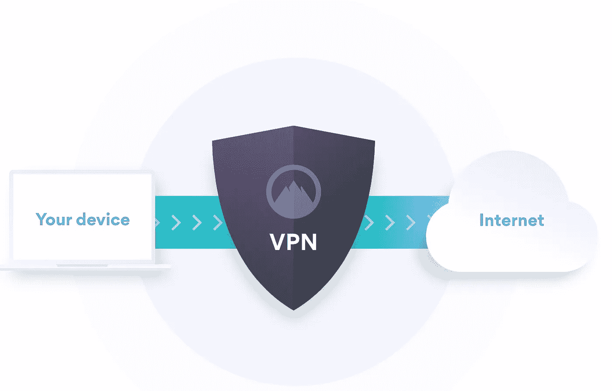
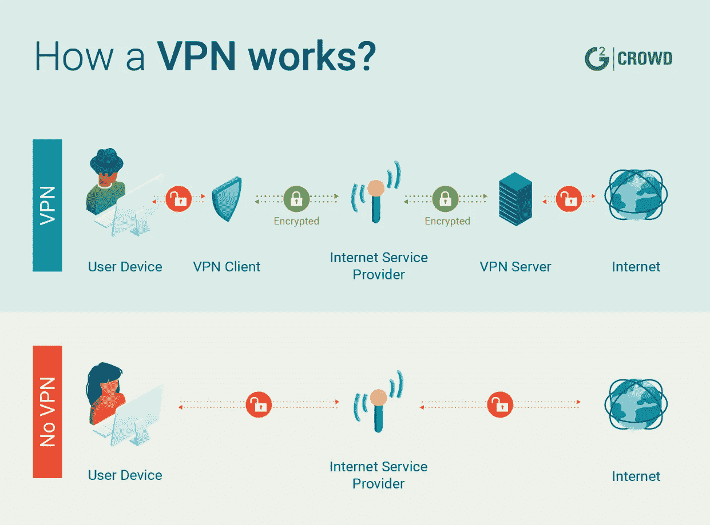
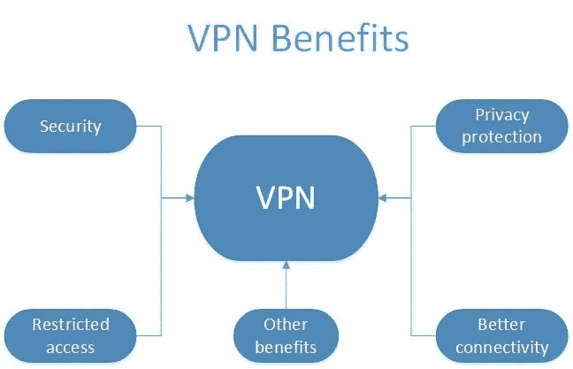

# VPN 的发展:从商业安全到隐私保护

> 原文：<https://medium.com/hackernoon/the-evolution-of-vpns-from-business-security-to-privacy-protection-b45a3bbf490f>

十年前，缩写词“VPN”对一个普通的互联网用户来说没有什么意义。总的来说，虚拟专用网和网络安全是企业为了保护自己的贵重物品而参与的事情。多年来，VPN 只是一个通往远程数据库的安全网关，只对选定数量的员工或相关方开放。

[https://nordvpn.com/what-is-a-vpn/](https://nordvpn.com/what-is-a-vpn/) img: scheme.svg

目前，VPN 正享受着巨大的关注度和快速增长的用户基础，据说到 2022 年将达到近 360 亿美元的市场价值。美元。此外，随着大多数网络安全公司，如卡巴斯基和 Avast，正在将 VPN 服务添加到他们的各种产品中，服务提供商的列表变得更加丰富。甚至 Opera web 浏览器也推出了内置 VPN 服务。

对于虚拟专用网络目前的流行，我将简要概述几个原因。首先，网民们开始意识到网上可能存在的危险，并把网上安全掌握在自己手中。其次，地理限制的出现，即特定内容仅在某些地方可用，而在其他地方被禁止，推动了该业务发展到现在的状态——一个竞争极其激烈且不断增长的市场。

在本文中，我将详细阐述为什么这项技术在商业应用中如此流行。但在此之前，我们先简单概述一下什么是 VPN。

## 什么是 VPN？

VPN 代表虚拟专用网络。通俗地说，VPN 建立了一个安全和私有的互联网连接。无论是网页、服务器上的某些信息，还是正在进行 torrenting 会话的另一台计算机，VPN 都通过加密信息流动的“隧道”来保护这种连接。

[https://learn.g2.com/free-vpn](https://learn.g2.com/free-vpn) img: How-VPN-Works.png

最初，VPN 是为商业目的开发的。第一个 VPN 可以追溯到 1996 年，当时一名微软员工开始开发对等隧道协议(PPTP)。目标是为员工创建一种连接到公司内部网的安全方式。然而，这些年来，互联网发生了如此大的变化，VPN 开发商做出了反应，两大 VPN 提供商 [NordVPN](https://play.google.com/store/apps/details?id=com.nordvpn.android&hl=en_US) 和 [ExpressVPN](https://play.google.com/store/apps/details?id=com.expressvpn.vpn&hl=en_US) 分别于 2012 年和 2009 年推出商用。

## 为什么 VPN 越来越受欢迎？

我使用 VPN 已经将近 20 年了，还记得那时它是一种不起眼的、几乎不舒服的连接特定数据库的方式。商业和商用 VPN 之间几乎没有共同之处(除了技术方面)。后者是为临时互联网用户设计的，有 Windows、Android、iOS、macOS 等版本的原生应用。他们的 UX/用户界面被打磨到了极致，从切换服务器到更改协议，一切都只需点击一下鼠标。易用性肯定与受欢迎程度的提高有关。

但是一个主要的突破点是由地理限制造成的。这不是一个新现象，在第三个千年之前就有地质区块存在，但没有达到现在使用的规模。流媒体服务的巨大成功，如网飞、HBO、BBC、YouTube 等，将地理区块直接带到了客户面前。

[https://techzillo.com/this-video-is-not-available-in-your-country/](https://techzillo.com/this-video-is-not-available-in-your-country/) img: video-not-available-youtube-error.png

这个想法背后的逻辑非常简单:地区购买某些内容的许可证，如果他们不这样做，那么由于版权法的原因，这些内容在目标位置是不可用的。然而，当你向流媒体服务提供商支付了一大笔钱后，你得到的是“这个视频在你的国家不可用”，那么消费者就会生气。

有一段时间，内容访问受限的问题是通过 torrents 解决的。但是 torrent 服务提供商仍然受到迫害，下载需要时间，而且不能保证你下载的文件中没有恶意软件。这就是 VPN 的用武之地。它不仅保护了你的 p2p 会话(不幸的是，不是恶意软件部分),隐藏了你的所有活动，不让任何偷窥者看到，这个软件还擅长绕过地理限制。

简而言之，地理区块拒绝访问特定的 IP 地址。如果你在德国浏览，那么你的 ISP 会给你一个 IP 地址，指向德国的一个地方。如果你想访问 BBC 的一些内容，BBC 会检查你的 IP 地址是否指向英国，如果不是，你就会被锁定。如前所述，VPN 通过它们的服务器重定向你的流量，所以如果你选择英国的服务器，那么你将被分配一个适当的 IP 地址，并解锁地理屏蔽的内容。这种程序如此简单有效，以至于大多数流媒体提供商仍然无法找到应对 VPN 行业的方法。

最后但同样重要的是，VPN 提供的安全功能。隐私已经成为科技界的流行语。今年，马克·扎克伯格和 T2·桑德尔·皮帅都在他们的演讲中阐述了隐私的重要性。然而，没有一个软件像 VPN 一样致力于隐私保护(记录用户活动的 VPN 是另一个主题的不同问题)。屏蔽你的 IP 地址和加密所有流量的能力既有助于地理封锁，也有助于个人的在线隐私。

[https://medium.com/@mwhites9/complete-guide-to-the-advantages-and-disadvantages-of-vpns-f58f354cb6e5](/@mwhites9/complete-guide-to-the-advantages-and-disadvantages-of-vpns-f58f354cb6e5) img: 1*Oo-lpN1z3p4SXxI5MNKiIw.jpeg

高质量 VPN 最重要的部分是它使用的加密技术。上述两种 VPN 都使用带有 256 位密钥的 [AES(高级加密标准)](https://searchsecurity.techtarget.com/definition/Advanced-Encryption-Standard)，这是全球政府和网络安全软件开发商使用的加密标准。如果不加密，你所有的浏览信息都可以被第三方旁观者获得:互联网服务提供商可以看到你在做什么，谷歌和网络罪犯也可以。加密增强了在线匿名性，防止各种监控机构以及中间人攻击。

## VPN 行业的下一步是什么？

如前所述，VPN 市场预计将持续增长。从 adBlock 服务到密码管理器，每年都有新功能推出。然而，选择正确的 VPN 对隐私保护至关重要。一些 VPN 被发现记录用户在线活动，而其他的则通过独立审计来证明他们的无日志声明，或者测试他们的软件安全特性。不管怎样，激烈的竞争迫使产品不断发展，并听从消费者的要求，VPN 有了一个良好的开端。