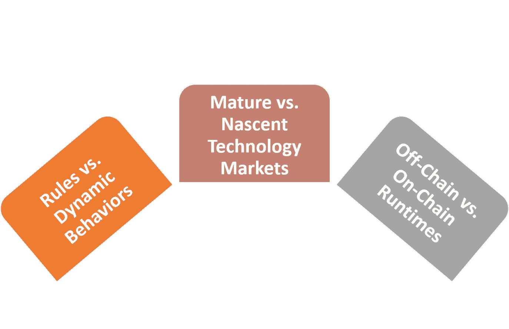

# 自助式安全令牌发放的幻想和一些解决办法:第一部分

> 原文：<https://medium.com/hackernoon/the-fantasy-of-self-service-security-token-issuances-and-some-ideas-to-fix-it-part-i-5a1bc00b3a4a>

发行安全令牌不应该这么难。这是我经常从我在区块链的一位导师那里听到的一句话，他解释说，如今大多数安全令牌的发行都涉及手写智能合同。几乎作为对安全令牌发放过程复杂性的过度反应，已经有过几次尝试来推广自助发放工具，这些工具承诺通过几次点击来创建安全令牌。今天，我想解释一下这种方法的一些根本缺陷，并提出我认为更好的替代方法。

当涉及到加密安全问题时，安全令牌空间采取了两种极端的立场。在一个极端，每个安全令牌都需要智能合约开发人员编写大量重复代码，并出于合规性原因利用一些基本协议。在另一个极端，我们可以填写一些表格，按一个按钮，另一方面得到一个安全令牌。第一种方法复杂且容易出错，但可以看作是安全令牌市场早期阶段的结果。第二种方法根本不切实际，它只是在一个仍在试图建立基础的市场中树立了错误的先例。

自助安全令牌发放工具植根于这样一种理念，即您可以使用通过友好的用户界面抽象的一组确定性规则来表达安全令牌的基本机制。原则上，好处似乎是显而易见的，因为任何人都应该能够在不掌握智能契约语言的情况下创建自己的安全令牌。尽管在概念上很吸引人，但从技术和财务的角度来看，自助式安全令牌发放的想法是有根本缺陷的。自助安全令牌发放可以被视为被称为简化论的认知心理学现象的表达。

# 还原论思维和安全令牌

简化论谬误是一种认知动态，它解释了当面对复杂的论点时，人类如何倾向于忽略关键细节的简单解释。这种简单的解释只在问题的一些最抽象的表现中起作用，在任何严格的分析下都行不通。在安全令牌的上下文中，认为我们可以使用一些规则来建模加密安全的结构和行为是简化论谬误的一个例子。自助安全令牌发行试图简化创建加密证券的过程，以吸引可能对该领域的技术复杂性感到不知所措的细分市场。然而，通过采取简化主义路线，自助服务安全令牌发放技术忽略了加密证券的许多关键要素，创建了对任何实际目的都无用的令牌。

自助安全令牌发放工具不仅在技术上存在缺陷，而且无论从哪种历史标准来看，它们的上市时机都相当糟糕。下面，我列出了三个主要论点，可能有助于我们识别自助安全令牌发放中的简化主义思维模式:

1) **规则与动态行为:**通过用户界面配置发布安全令牌隐含地假设加密安全的行为可以用一些 IF-Then-Else 规则来抽象。这与事实相去甚远。安全令牌需要表达相当动态的金融行为，如股息分配、违约、风险调整和其他需要超出逻辑规则的复杂业务逻辑的构造。甚至一些最简单的符号化表示(如公开交易公司的股票)也可能受到各种复杂行为的影响。发行传统证券的过程是复杂的，不仅因为涉及的参与者，还因为这些金融工具的复杂性质。

2) **成熟与新生的技术市场:**自助服务工具是成熟技术市场的副产品。在集成领域，像 IFTTT 这样的平台只有在中间件技术发展了几十年之后才有可能出现。在数十年的数据可视化和分析工作之后，自助式商业智能工具才被广泛采用。安全令牌空间还不到两年，而且绝对没有基础来通过几次点击来抽象加密证券的发行。简化主义思维…

**3)** **离链运行时与链上运行时:**这是一个有点微妙的论点，但确实相关。假设我们可以使用一些基于 UI 的规则来实现安全令牌，这在本质上意味着我们建模加密安全行为所需的一切都发生在链外(通过规则)，这简直是一个谬论。为了有效，安全令牌需要利用大量的链上构件，如 oracles、gas、调用其他智能契约和其他一些不能简单地通过 UI 抽象的构件。

为了正确看待前面的一些论点，让我们举几个跨几种技术趋势的成功和失败的自助服务技术堆栈的例子:

**不好:UML 和代码生成工具:**在 21 世纪初，有一个工具的爆炸，试图使用图形标准，如统一建模语言(UML)来建模面向对象的程序。尽管这种趋势产生了成功的收购，例如 Rational Software，但是大多数工具被证明非常局限于构建任何形式的复杂程序。这一代工具的部分失败可以归结为图形化的、规则驱动的环境和动态的、基于代码的逻辑之间的阻抗不匹配。

**坏:机器学习工作流工具:**机器学习领域正在发展的一个趋势是使用可视化工作流创建模型的想法。虽然现在判断这种趋势是否会成功还为时过早，但它们似乎只适用于一些非常基本的场景，数据科学家因此使用 TensorFlow 或 PyTorch 等框架来编写更复杂的模型。

**好:自助服务分析工具:**几十年来，商业智能(BI)解决方案中的报告和数据可视化的创作需要专业领域的专家来做一些基本上是商品的事情。最终，市场产生了新一代的自助式数据可视化平台，如 Tableau 或 QlikView，允许非专家编写真正复杂的仪表板，而无需编写任何代码

**好:机器学习领域特定语言:**碎片化和复杂性是机器学习领域的主要挑战之一。市场上有如此多的机器学习框架和平台，编写机器学习程序不仅复杂，而且在堆栈之间没有可移植性。最近，像脸书和微软这样的公司发起了开放神经网络交换格式(ONNX)的创建，该格式提供了一种更高级别的(但不是基于视觉规则的)语言，用于以兼容不同底层框架的方式创建机器学习模型。

总之，有效的自助工具有几个共同的特征:

a)它们允许添加复杂的业务逻辑。

b)它们运行在与底层运行时相似的环境中。

c)他们在成熟的技术市场运营。

这听起来像是自助安全令牌发放工具吗？😉

# 一种可能的解决方案:安全令牌域特定语言

我们如何在不创建无用抽象的情况下简化安全令牌的发布？编写以太坊智能合约很难扩展，但是使用基于 UI 的规则是没有用的。介于两者之间的怎么样？想象一种声明性语言，它能够以一种可以立即翻译成不同智能契约语言的方式对加密证券的结构进行建模。

为加密证券设计一种更高级的特定领域语言的想法有很多好处，而且不会忽视智能合约语言的任何优点，比如可靠性。我在这方面做了一些工作，并将在下一篇文章中详细介绍。