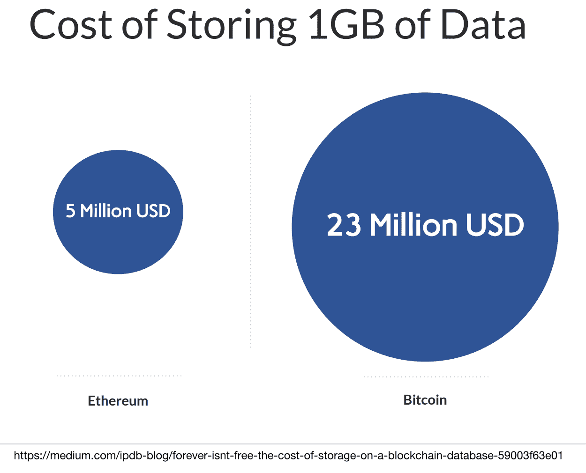
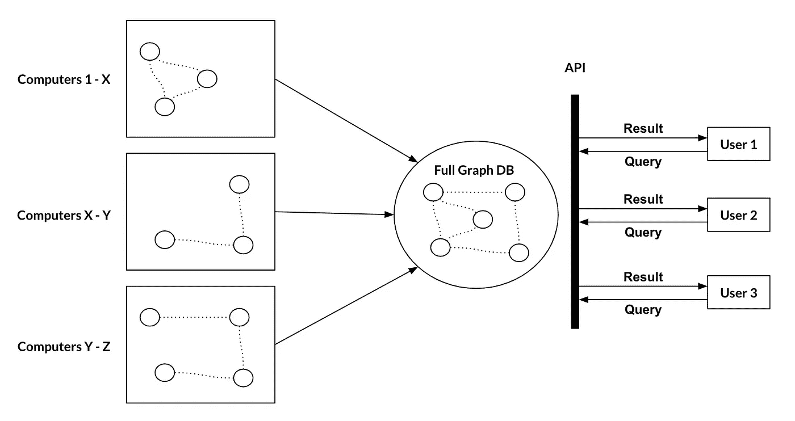
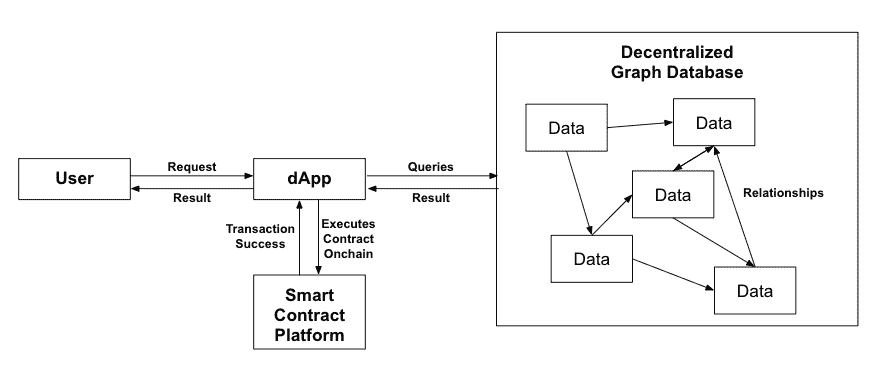

# 数据的未来:一个分散的图形数据库

> 原文：<https://medium.com/hackernoon/the-future-of-data-a-decentralized-graph-database-bbb668715bd1>

Photo by [Ander Burdain](https://unsplash.com/photos/1BhDhPBbHLA?utm_source=unsplash&utm_medium=referral&utm_content=creditCopyText) on [Unsplash](https://unsplash.com/search/photos/data?utm_source=unsplash&utm_medium=referral&utm_content=creditCopyText)

一场范式转变正在发生，它将改变公司存储、计算和传输数据的方式。这种转变将催生大量新机遇，包括解决大型科技公司和用户面临的最顽固问题的方案。本文将探索这样一个机会——创建第一个真正分散的图形数据库。除了具有可伸缩性、成本效益和安全性之外，这项技术还允许用户以一种不可信、无权限的方式操作和检索他们的数据。

这不是另一个抱怨大型技术公司违反数据道德的故事。相反，它试图从经济、社会和技术的角度，与用户和公司产生共鸣，并理解他们为什么这样做。

# 数据的兴衰

无处不在的计算的兴起伴随着个人数据生产率的指数增长。从查看我们手机上的社交媒体到与我们公寓里的 Echo 设备互动，即使是我们最平凡的活动也会产生大量的数据。

被问得不够多的问题是——“数据一旦被创建，会发生什么？”。答案因公司而异，但在许多情况下，我们的集体数据被存储这些数据的公司滥用，或者被恶意的第三方黑客攻击。脸书是一个经典的例子:该平台不仅遭受了重大数据泄露，影响了数百万人；但也在未经用户明确同意的情况下向其合作伙伴出售数据。

对于用户和公司来说，这显然是一个很大的问题，因为他们有责任保护这些数据。然而，用户并没有离开这些平台，公司也没有做出任何重大改变。**为什么？**

# 用户:控制和所有权的幻觉

在互联网上，除了脸书，还有很多其他选择。那么，为什么在最近的一系列丑闻之后，它的大部分用户感到不得不留下来呢？

我和[的许多](https://ruben.verborgh.org/articles/redecentralizing-the-web/) [的其他人](https://www.amazon.com/Life-After-Google-Blockchain-Economy/dp/1621575764)认为，这主要是由于“围墙花园”的问题:在**在此插入大型科技公司名称** 上度过了过去 X 年后，用户上传并积累了大量数据，如朋友、照片、记忆，这些数据无法轻易转移到不同的平台。用户删除他们的账户意味着失去对他们认为属于他们的数据的访问，因为尽管他们可能拥有他们发布的内容，但他们不拥有它在平台上创建的“关系”。

此外，相对于大公司而言，大多数用户并不足够关心他们的隐私而采取行动。这是一种交换。用户缺乏隐私的回报是免费服务、个性化产品和广告。大多数用户并不真的觉得他们有什么重要的东西要隐藏，所以他们心甘情愿地上传他们的数据，并误以为他们“控制”了这些数据。

那些开发免费生成和接收我们数据的产品的公司采取了一种“胡萝卜加大棒”的方法来收集数据。如果你向他们提供你的数据(超个性化的服务)，你会获得额外的功能，如果你没有对一份 50 页的法律文件点击“我同意”，这可能会使你已经付费的设备或服务变得无用。如果说 21 世纪的创业世界教会了我们什么，那就是用户体验至上。

最后，让我们面对现实吧，没有人能保证拥有相同服务的更新、更小、可替代的创业公司比每年投入数百万美元用于安全的公司遭受的数据泄露更少。

# 公司:云计算的到来

另一方面，你可能会认为，在最近一系列高调的数据泄露事件之后，公司已经采取了重大措施来确保数据安全。然而，我们现在每隔一周就能听到新的黑客攻击。

云计算的出现导致公司将数据存储在高度集中的数据中心。云计算为公司节省了数十亿美元；然而，这是以单点故障为代价的。这也意味着黑客现在知道在哪里可以找到用户的数据。最后，知道用户将无法离开他们的平台，用一点点负面宣传换取数十亿美元的决定是一个容易的决定。

科技公司还养成了在没有征得用户明确同意的情况下向合作伙伴出售用户数据的习惯。这是用户可以避免的问题吗？用户用他们的注意力和时间，通过看广告，用他们的数据为公司的免费服务付费。由万维网发明者蒂姆·伯纳斯·李爵士牵头的一些伟大项目，如 [Solid](https://solid.inrupt.com/) ，正在寻求解决这个问题，并推动对我们数据的真正控制。

然而，亚马逊、谷歌、脸书和苹果——科技“四巨头”——垄断了我们的数据，并且无意放弃这种控制措施。大型科技公司不愿意授予用户对其数据的完全所有权和控制权，因为这样做不仅会推倒那些“围墙花园”，还会切断另一个重要的(如果不是主导的)收入流:免费出售你的数据和由此产生的见解的能力。

最终，所有已经做出和正在做出的决定都完全基于经济推理，上市公司也是如此。

# 范式转变:速度、安全性和成本

科技界正在发生一场范式转变，这将改变公司存储数据的方式。谷歌和其他科技公司开始在他们自己的数据中心遇到带宽瓶颈。简而言之，在处理和传输数据方面，它们已经达到了最大容量。

另一方面，每年，我们周围的个人计算设备变得越来越强大；这些设备大部分时间都处于闲置状态。当以协调的方式连接时，它们能够并且将会在速度、安全性以及最重要的成本方面胜过当前的任何数据中心。

有效地利用这些设备未使用的计算能力不会导致云计算时代的立即终结，而是对其进行补充，特别是对于延迟敏感的任务。然而，它也将宣布“雾计算”时代的诞生(由思科在 2014 年 1 月创造)。

幸运的是，由于雾计算依赖于分散的网络，理论上它也更难被黑客攻击，从而解决了安全问题。

# 雾计算与云计算

在一个高层次上，雾计算最初将完全像大型科技公司的云计算一样工作:用户将通过向公司提交请求来创建、读取、更新和删除他们的数据，公司将依次将数据传递给分散的设备网络。这是云计算为王时的做事方式，没有明显的理由要改变。

然而，正如我们之前看到的，人们留在当前平台的主要原因之一是因为没有可行的替代方案可以保证更好的结果。雾计算使这种假设过时了。你的数据现在存储在世界各地成千上万的设备上；因此，你可以直接向设备网络发出请求，而不是通过大型科技公司等中介获取数据。一种未经许可、不可信的方式来访问您的数据。

这也意味着，通过直接与分散的网络通信，您可以更细致地决定谁有权访问和使用您的数据:数据所有权的圣杯。

那么，为什么大型科技公司会允许你与分散式网络通信呢？好吧，长话短说，他们没有。然而，这项技术正在建设中，将随时提供给公众。提供这种大规模数据控制的竞争将会出现，由于大型科技公司的数据中心不会为他们提供与今天相同的竞争优势，他们的整个商业模式将有被颠覆的危险。

为了保持竞争力，他们将被迫为用户提供粒度数据控制。这意味着让用户选择将他们的数据货币化，免费提供，或者完全拒绝将数据用于核心服务之外的任何其他目的。这种牺牲的成本与用户完全流失到同一个市场的竞争对手手中相比就相形见绌了。

# 重访区块链

最近，区块链作为第一项利用分散式设备网络的技术成为关注的焦点。向用户承诺完全拥有他们的数据并将其货币化，区块链表面上是遗留的第三方数据农场的引人注目的替代品。那么，为什么我们不都使用区块链技术呢？我认为这仅仅是因为我们误解了区块链应该帮助我们做什么。

区块链被誉为安全、不变和透明的数据库。然而，一个区块链只能容纳非常少量的数据，而不会让托管它的计算机耗尽内存，变得集中化。此外，区块链是非常难以查询；这部分是因为数据存储在带有不同时间戳的块中，但也因为不存在“简单”的固有查询语言。简单地说，在区块链搜索信息既不高效也不容易。

假设一家医疗公司需要尽快访问区块链数据，它可能会首先将数据移动到一个高效的第三方数据库，然后执行查询；从而彻底摧毁了分权的概念。区块链最适合支付或纯粹基于交易的系统。

事实上，这正是它们最初被发明的目的:比特币，一种数字足迹相对较小的支付系统。虽然区块链利用日益强大的个人设备的增长趋势，但他们的使用案例相对狭窄，并且没有充分利用范式转变的潜力。

这并不是说所有的区块链在寻求对我们数据的更多控制方面都是无用的。以太坊诞生时，区块链出现了一个更广泛的用例。

正如你在左边看到的，在上面存储数据的价格仍然高得离谱。然而，它引入了一个革命性的新概念:智能合约，正如我们将在后面看到的，当与分散存储解决方案结合使用时，它非常方便。

# 一个分散的图形数据库

为了加速向上述未来的过渡，即每个用户都被赋予新的数据所有权和控制权，我们还需要相关的技术:用户可以直接与之通信的分散式设备网络。在它的其他功能中，它应该是私有的(在需要时用于用户数据)、可扩展的(在存储和计算能力方面)和不可信的(你不必信任一个中央机构来访问你的数据或维护其安全性)。它将作为产品的后端，可以与大型科技公司提供的用户体验相媲美。

我一直在思考这个难题的解决方案，在为 Graphen 工作期间，我(在哥伦比亚大学硕士生金佩琪和杨洋的帮助下)为一个分布式数据库编写了一份白皮书。

从开发人员的角度来看，这种分散式数据库的功能与云数据库完全一样；然而，它托管在一个完全对等的网络上。它不是区块链，但利用了一些相同的加密算法，如 Patricia-Merkle 树。我不会详细阐述技术细节，白皮书就是为此准备的，但它基本上由三部分组成:

*   工作人员出租存储空间和计算能力来托管数据库碎片和计算查询。他们被称为主节点，并获得金钱奖励，如美元或加密货币，以换取他们的硬件时间。他们还被鼓励定期检查彼此的数据和查询结果，以保证整个系统的正确性。
*   创建数据库的用户，通常是开发人员或科学家。他们通常向主节点支付费用。
*   通过应用程序或直接通过对主节点的请求向给定数据库贡献数据的用户。他们可以与之前的用户相同。他们还被提供一个私人密钥，允许他们保留对其信息的完全所有权(在没有第三方许可的情况下，通过向网络请求来请求、删除或更新其数据的能力)。

我相信图形数据库是未来。随着每一天的过去，我们的世界变得越来越相互关联，我们产生的数据也是如此。图数据库的特殊之处在于适应这些关系。此外，所有其他“类型”的数据都适合图形数据库:非结构化数据和结构化数据虽然分别在非关系数据库和关系数据库中操作更有效，但也可以存储在图形数据库中(反之则不然，例如，图形数据不能存储在非关系数据库中)。

[https://wilsonmar.github.io/neo4j/](https://wilsonmar.github.io/neo4j/)

在过去的几年中，图形数据库的应用显著增加。例如，图形数据库已经被脸书用于其社交媒体平台，被 Stripe 用于欺诈交易，被亚马逊用于产品推荐，被世界各地的公司用于各种领域和问题的大数据分析。

图形数据库非常快，可扩展，可以从它们包含的数据中产生令人难以置信的洞察力；这就是为什么我首先选择它们作为分散的分布式数据库来实现。

这个分散的图形数据库满足了我们前面提到的所有必要特性:可伸缩性、不可信任性和隐私性(通过使用特定类型的同态加密)。

这是对数据流外观的高度概括:

# 一个真正去中心化的互联网

如果我们看看当前的 Web 2.0 应用程序，我们有一个前端，一个后端和一个数据库。虽然分散前端没有多大意义，但是后端逻辑可以而且应该分散。这就是智能合约平台的用武之地。Turing complete(理论上能够解决任何计算问题)智能合约平台，如 Ethereum、EOS 或 Cardano，有能力用其本地编程语言支持这种逻辑。它们甚至可以与图形数据库通信，以真正分散的方式检索相关数据。

最终，如果这项技术如预期的那样成熟，它甚至可能成为互联网发明者蒂姆·伯纳斯·李在他的 Ted 演讲中描述的新语义互联网的基础。

> *“所以，关联数据是巨大的。我只告诉了你很少一部分事情。*
> 
> *我们生活的每个方面都有数据，工作和娱乐的每个方面都有数据，这不仅仅是数据来源的数量，而是将数据连接在一起。*
> 
> 当你将数据连接在一起时，你会以一种不仅仅发生在网络和文档上的方式获得力量。”

感谢您花时间阅读这篇文章！该白皮书可在[*www.graphenprotocol.com*](http://www.graphenprotocol.com)获得。如果您有任何反馈或问题，请随时通过 *mgavaudan@graphen.ai* 与我联系。

我们正在为 Graphen 的一家子公司筹集资金，这家子公司将专门从事这项技术，所以如果你是投资者，请给我发电子邮件，索取我们的推介资料。

*我还要感谢陆杰博士、林清勇博士以及我所有的朋友(Matteo、Kai、Haley、Kevin、Srikar、Eric、Lizzie……)在整个过程中给予我的帮助和反馈。*