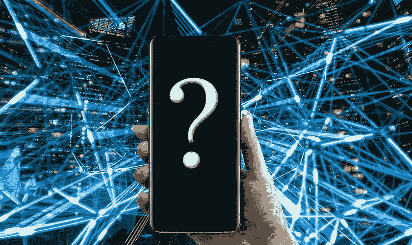

# 智能手机的未来技术

> 原文：<https://medium.com/hackernoon/the-future-technologies-in-smartphones-6f139e3d2cf2>

我的第一部手机是诺基亚 3310。2001 年我 14 岁的时候我爸给我买的。那一次我甚至没有想到要买一台电脑。目前我使用的是 iPhone X，去年我去波士顿的时候被锁定了。虽然我在阅读了 movical.net 关于解锁 iPhone 的文章后修复了它，但一个随机的想法进入了我的脑海:“未来会怎样？”早在 2001 年，我就迷上了我的诺基亚 3310，我喜欢更换铃声的功能。我还可以定制屏幕图案——令人印象深刻——不是吗？从那时起，技术已经发展了很长一段时间。如果回头看那个时候，我今天的 iPhone X 不亚于一个奇迹。大型触摸屏显示器，高科技规格，令人印象深刻的摄像头，甚至生物计量和 3D 面部识别。过去，我从未想过电话除了打电话还会有其他用途。但是今天我们用它们来玩游戏、听音乐、看视频、聊天、上网等等。相信我，在 2001 年，我从未想过这些设备会在 20 年后做这些事情。没有人能预测到手机对我们生活的影响。这种事情在当时只不过是科幻小说。

这些事情让我思考未来。会怎么样？未来 10 年、20 年或 30 年，我们将拥有什么样的技术？在这里，我提出了一些未来你可能会在智能手机上看到的技术:

# 精神控制

在手机出现的初期，我们习惯用物理键盘来控制它。现在键盘最终被触摸屏取代。
最近，谷歌助手、Siri 和三星 Bixby 等服务正在帮助我们用语音与设备互动。这种进化的下一个阶段可能是——精神控制。精神控制将允许你用你的思想通过触摸或声音来执行你能做的每一项任务。这项技术将允许我们通过触摸或声音来完成每一项任务。只要有想法，你就能编辑图像、播放音乐、玩未来游戏和许多其他东西。我们离建造这样的东西还有几年的时间，但是研究人员和科学家正在这个方向上取得进展。一个例子是脸书开发了一种工具，它将允许我们用头脑打字。

# 空中充电

一个苦涩的事实:大多数智能手机的电池寿命很差。即使你的手机有 4200 毫安的大电池，它也不会持续超过 2 天。要么你用无线充电板，要么用传统充电器把电取回来。嗯，以后就不会这样了。借助强大的发射器，你可以远距离无线充电。像手机发射塔一样，这些发射器可以放在任何地方，以确保你的设备永远不会没电。[watt up 中场发射机](https://www.cnbc.com/2017/12/28/energous-jumps-271-percent-after-wattup-charging-technology-gets-fcc-approval.html)是这种技术的第一步。虽然它可以从 3 英尺的距离给你的手机充电，但我们希望未来能有更长的充电距离。

# 改变智能手机的颜色

买新手机时，你不会只看规格，但选择颜色本身就是一场斗争。粉色、黑色、蓝色、白色，你应该选择哪一种？你可能全都喜欢，也可能一个都不喜欢。将来，你不必选择颜色。想象一下，一部智能手机有着玻璃般的透明背面，你可以改变设置来获得你想要的颜色。这不是很神奇吗？

# 可拉伸手机

柔性显示屏将是未来智能手机技术的下一件大事。有了三星 Galaxy Fold，Royole FlexPai，华为 Mate X，预告片我们已经看到了。在未来，你也许可以根据自己的需要拉伸或缩小智能手机显示屏的尺寸。你可以把手机从角落里伸出来看视频，或者在旅行时折叠起来缩小手机尺寸。这一技术领域的工作已经开始，但我们还有很长的路要走。

# 电子墨水和有机发光二极管

有机发光二极管显示器为玩游戏和观看视频提供了绝佳的体验。但是它们不适合作为阅读展示品。如果你想阅读一些东西，电子墨水技术可以提供完美的体验。尽管有机发光二极管具有蓝光和夜间模式等功能，但它无法与电子墨水显示的质量相媲美。在未来，智能手机将同时拥有这两种显示屏。只需轻轻一点，你就能把有机发光二极管变成电子墨水。不幸的是，目前这种事情是不可能的。苹果已经为这种技术申请了[专利，我们可以期待在不久的将来。](https://www.wired.com/2011/04/apple-patent-hybrid-display/)

在我看来，这四项技术将主宰智能手机的未来。欢迎在评论区分享你的观点，让我知道你希望在你的手机上看到什么技术。