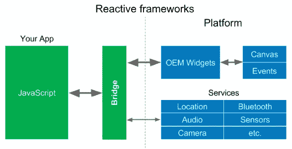
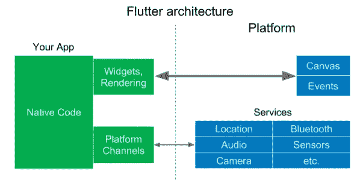
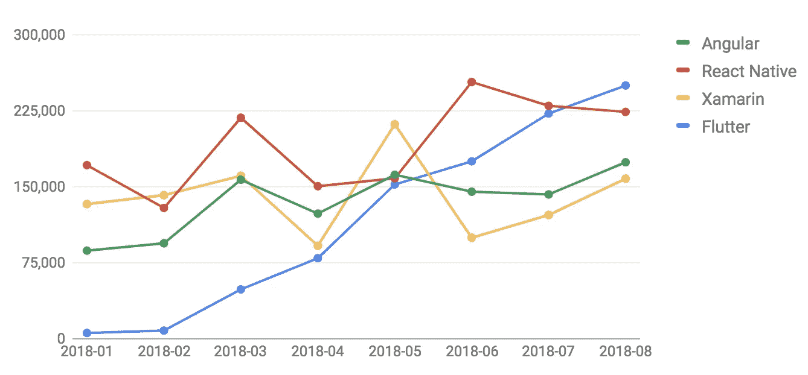
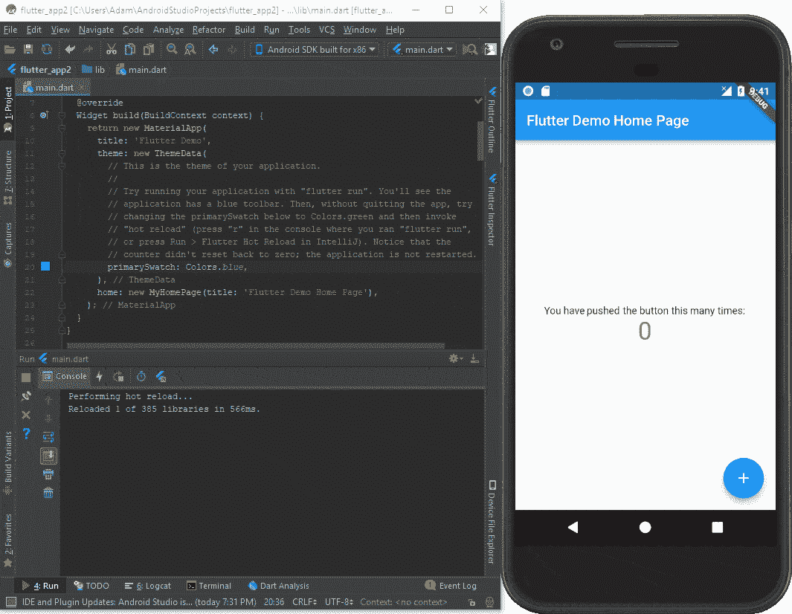
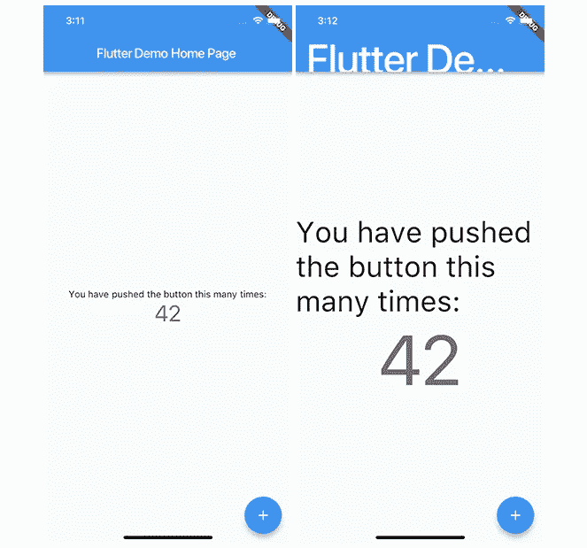

# Flutter 应用开发的利与弊

> 原文：<https://medium.com/hackernoon/the-good-and-the-bad-of-flutter-app-development-45f27b1caa36>

在不知情的情况下，你可能已经使用过用 Flutter 制作的应用了。无论你是在阿里巴巴购物，在谷歌广告上开展广告活动，还是使用电子优惠券，你都有可能见证 Flutter 短暂历史的结果。

该产品已经测试了很长时间。现在，随着它的[发布预览 2](https://developers.googleblog.com/2018/09/flutter-release-preview-2-pixel-perfect.html) 版本，它终于在最初的 1.0 发布之前踏上了终点线。我们理解开发人员对这种新的变革性技术的犹豫和兴奋，所以这里是我们对 Flutter 的优缺点的概述——以及您可以用它做什么。

关于 Flutter，你可能会问的第一个问题是“它有什么不同？”如果你熟悉混合和跨平台开发，就此而言，质疑 Flutter 如何优于 [Xamarin](https://www.altexsoft.com/blog/mobile/pros-and-cons-of-xamarin-vs-native/?utm_source=MediumCom&utm_medium=referral) 、 [React Native](https://www.altexsoft.com/blog/engineering/the-good-and-the-bad-of-reactjs-and-react-native/?utm_source=MediumCom&utm_medium=referral) 或 Ionic 是有道理的。转行有什么意义？由于我们无意在其他技术上推广 Flutter，我们决定弄清楚为什么你应该对该产品感到兴奋，以及应该警惕什么。

# 颤振到底是什么？

Flutter 是谷歌的新开源技术，用于通过单一代码库创建原生 Android 和 iOS 应用。与其他流行的解决方案不同，Flutter 不是一个框架；这是一个完整的 SDK —软件开发工具包—已经包含了构建跨平台应用程序所需的一切。这包括渲染引擎、现成的小部件、测试和集成 API 以及命令行工具。

类似的技术，如 Xamarin、React Native、Ionic 或 NativeScript，都试图通过不同的方法实现平台本机性。我们写了一整篇文章来比较这些[跨平台工具](https://www.altexsoft.com/blog/engineering/xamarin-vs-react-native-vs-ionic-vs-nativescript-cross-platform-mobile-frameworks-comparison/?utm_source=MediumCom&utm_medium=referral)。现在，我们来看看 Flutter 给游戏引入了什么。

Flutter 遵循了**反应式开发架构**，但是有所改变。关于反应式编程需要知道的主要事情是，当您更新代码中的变量时，它会自动更新 UI 内容。React Native 也遵循这个原则，但是它使用 JavaScript 桥来访问 OEM 小部件。但是由于应用程序每次都必须通过这个桥来访问小部件，这就导致了性能问题。然而，Flutter 完全省略了这个桥，并使用 Dart 与本机平台通信。

**Dart** 是 Flutter 的面向对象语言，使用超前的编译技术，无需额外的桥接就能编译成本地代码。这明显加快了应用程序的启动时间。另外，Flutter 不需要调用 OEM(原始设备制造商)widgets，因为它使用自己的 widgets。如下图所示，Flutter 使用操作系统作为画布来构建界面，并将手势、渲染和动画等服务移入框架本身，这使开发人员可以完全控制系统。

*Reactive frameworks vs Flutter
Source:* [*Wm Leler on Medium*](https://hackernoon.com/whats-revolutionary-about-flutter-946915b09514)

**在 Flutter 中调试**也多亏了 Dart。Dart Analyzer 和 Dart Observatory 工具有助于使用特定命令查找错误。该过程在[颤振调试文档](https://flutter.io/docs/testing/debugging)中有详细解释。另一种方法包括使用支持颤振的 ide 和它们特定的调试器。由于 Flutter 不使用 WebView，所以它不能在像 Ionic 这样的浏览器中直接调试。React Native 和 NativeScript 允许通过 Chrome 开发工具进行测试。然而，考虑到这些产品通常更喜欢第三方解决方案进行调试，Flutter 的过程应该不会有很大不同。

由于 Flutter 是一个成熟的 SDK，它已经提供了一个自动化测试工具集，特别是针对三种类型的测试:单元测试、小部件测试和集成测试。你可以在这个链接找到谷歌关于这些测试[的教程。Flutter 还通过](https://flutter.io/docs/testing) [fastlane](https://docs.fastlane.tools/) 支持[连续交付](https://www.altexsoft.com/blog/business/continuous-delivery-and-integration-rapid-updates-by-automating-quality-assurance/?utm_source=MediumCom&utm_medium=referral)模型，fastlane 是一个免费的工具，它将 Flutter 与 Travis、Jenkins 或 Cirrus 联系起来。

# 颤振发展的优点

关于 Flutter，有什么创新的、不同的、更好执行的地方？让我们回顾一下那些会让您考虑放弃 React Native 而使用新工具的特性。

## +用于快速 UI 编码的现成和定制小部件

之前我们提到过 Flutter 使用现成的小部件。你甚至可以说 Flutter *就是* widgets。该产品的革命性之一是它如何利用这些构件帮助创建用户界面。与使用不同对象(布局、视图、控制器)的其他方法相比，当 Flutter 拥有一致和统一的对象模型时。

Flutter 中的任何对象都是一个小部件，从按钮到填充或字体。小部件可以组合起来创建布局，并且您可以选择在任何级别的定制中使用小部件——从现有的构建模块到最低级别，当您使用与 Flutter 团队相同的工具创建自己的小部件时。

Flutter 中的小部件是以树的形式组织的，这对于渲染来说很方便，但是可能会导致整个结构过于复杂。大型应用程序可能需要多达 10 层代码来创建一个基本对象，因此您必须提前计划好结构。

*Flutter widget tree*

事实上，Flutter 有自己的部件，这给了你一个很大的优势:Flutter 已经提供了完全遵循[材料设计](https://flutter.io/docs/reference/widgets/material)和苹果[库比蒂诺](https://flutter.io/docs/reference/widgets/cupertino)外观的部件。在跨平台开发中通常需要最长时间才能完成的 UI 定制在 Flutter 中花费的时间最少。

## +最温和的学习曲线和不断增长的社区

鉴于习惯 Dart 对您来说不是一个大问题，学习这个工具本身应该很容易。Flutter 团队指出，他们见过编程知识非常有限的人进行原型开发和构建应用程序，还提到使用 Flutter 不需要任何移动开发经验。

此外，谷歌以创建详细和结构良好的文档而闻名，这是对本土斗争的反应。除了经典的[文档](https://flutter.io/docs)，你还可以观看来自谷歌团队的[视频课程](https://www.youtube.com/playlist?list=PLOU2XLYxmsIJ7dsVN4iRuA7BT8XHzGtCr)，并在 [Codelabs](https://codelabs.developers.google.com/?cat=Flutter) 上进行实践练习。而这些只是官方提供的资源。你可以在 Udemy 和 Udacity 上找到课程，加入脸书社区，甚至还有一个关于 Slack 的学习小组。

对于这样一个年轻的技术，Flutter 的发展速度非常快。此图显示了在 Release Preview 2 发布之前，与其他前端框架相比，StackOverflow 对 Flutter 的兴趣。尽管仍处于测试阶段，但该工具已经可以投入生产，这只是激起了人们的兴趣。它可用于商业用途，并且已经在企业、中型机构和初创公司中成功实施。

*Number of StackOverflow question views
Source:* [*Google Developers blog*](https://developers.googleblog.com/2018/09/flutter-release-preview-2-pixel-perfect.html)

## +Dart——面向 Java 程序员的简单有效的语言

Dart 是一种现代的面向对象语言，它的语法会让你想起 T2 Java 或 C++。它支持[强和弱两种打字风格](https://www.wikiwand.com/en/Strong_and_weak_typing)，让初学者很容易掌握。上面，我们提到 Dart 负责一些关于 Flutter 的重要事情。我们来分析一下 Dart 的天性是什么让 Flutter…嗯，Flutter。

**AOT 和 JIT 两种编译类型。在开发中，工程师通常不得不选择他们的编程语言提供的编译。提前编译的程序通常运行得更快，因为它们之前已经被编译过了。然而，在这种情况下，发展本身放缓了很多。即时编译可以加快开发周期，但可以预见的是，它会影响应用程序的启动速度，因为编译器会在代码执行前进行分析。Flutter 在开发过程中使用 JIT 编译，并切换到 AOT 来发布应用程序，从而实现了两全其美。**

**不需要 XML 文件。**Android 开发中，工作分为布局和代码。布局应该用 XML 写成视图，然后在 Java 代码中引用。Dart 通过将布局和代码放在一个地方来解决这个问题。因为 Flutter 中的所有东西都是一个小部件，所以布局也是在 Dart 中创建的。

**没有 JavaScript 桥，性能更好。**正如您已经知道的，用户设备上的应用程序将流畅运行，因为 Dart 直接编译成本机代码，无需桥接。

当我们谈论 Dart 的好处时，值得一提的是，这种语言并不局限于移动开发——它也用于构建 web 应用程序，Google 也不例外。它通常与 web 框架结合使用， [AngularDart](https://webdev.dartlang.org/angular) 是谷歌自己对其某些服务的选择。

## +热重装功能，实现即时更新

这个工具已经被嵌入到 Flutter 的架构中，不需要任何插件就可以工作。热重装基本上可以让你实时看到更新。假设你在运行一个程序时遇到了一个错误。在 Flutter 中，您可以立即修复它，从您停止的地方继续，而无需重新开始整个过程。回到部署需要几分钟的常规编程可能是一场斗争。热重载提高了程序员的生产力，有助于快速迭代，并允许您在没有长时间延迟的情况下进行实验。Xamarin 和 React Native 也有类似的功能，但一些评论称它在 Flutter 中要快得多。我们还没有看到证明这一点的基准。

*Changing app UI with Hot Reload
Source:* [*BuildFlutter*](https://buildflutter.com/hot-reloading/)

## +便携性

由于 Flutter 不仅仅是一个框架，而是一个完整的 SDK，它几乎可以在任何带屏幕的设备上运行。已经创建了第三方端口来构建用于 Mac OS、Windows 和 Linux 的 [Flutter 应用。它们包括嵌入 API、鼠标和键盘输入功能以及不同的插件。有些人甚至](https://github.com/google/flutter-desktop-embedding)[尝试用 Flutter 构建电视应用](https://www.youtube.com/watch?v=crODae5bIew)。考虑到可能性和谷歌对物联网设备的喜爱，有理由期待这一功能将在未来成为官方功能。

## +国际化和可访问性

作为多样性和包容性的倡导者，谷歌提供了内置的机会，使您的应用程序可以被更广泛的用户访问。通常，当您希望您的应用程序以不同的语言运行并在不同的地区使用时，您需要准备代码，以便为通常稍后创建的本地化内容做好准备。这个过程叫做国际化。

Flutter 原生提供了基于 [Dart intl 包](https://pub.dartlang.org/packages/intl)的小部件，简化了这个过程。今天它支持 24 种语言，还支持货币、度量单位、日期、布局选项(对于从右向左书写的语言)等等。

Flutter 还确保 [web 可访问性](https://www.altexsoft.com/blog/uxdesign/reach-your-audience-with-accessible-and-inclusive-design/?utm_source=MediumCom&utm_medium=referral)并支持以下三个组件:

*   大字体—将字体大小调整为用户在操作系统设置中指定的大小
*   屏幕阅读器—提供关于 UI 元素的口头反馈
*   足够的对比度—使文本更容易阅读

虽然所有这些都是自动化的，但开发人员还应该针对不同的设置测试他们的设计。例如，他们可以使用最大的字体设置来查看它如何适应小的移动屏幕。

*Standard vs the largest possible font settings*

## +高性能

评估应用程序的性能有很多因素:CPU 使用率、每秒请求数、平均响应时间、每秒帧数等等。Flutter 团队承诺恒定的 60fps，这是现代屏幕显示平滑清晰画面的速率。由于这种帧速率的任何滞后都会立即被人眼注意到，开发人员试图将运动保持在这一水平。

要了解 Flutter 的表现，请参见[这项研究](https://www.slideshare.net/KorhanBircan/crossplatform-app-development-with-flutter-xamarin-react-native)比较 Flutter、Xamarin 和 React 的本地性能。剧透:Flutter 以 58fps 和 220 毫秒的发射时间获得第一。Xamarin 以 53fps 的成绩在 345 毫秒内推出，React Native 以 57fps 和 229 毫秒的成绩排名第二

只是做了一些其他的实际比较。[这里是](https://robots.thoughtbot.com/examining-performance-differences-between-native-flutter-and-react-native-mobile-development#conclusion)，Flutter 几乎与原生应用的 CPU 使用率相当，但使用的内存比 React Native 多 50%。

# 颤振发展的缺点

每当我们回顾一项年轻或不太受欢迎的技术时，我们都会注意到同样的一系列缺点在削弱产品的成功。尽管跨平台开发是一种新的编程实践，但 Flutter 有时会在与稍老的竞争对手的战斗中失败。有哪些弊端？

## –缺少第三方库

第三方库和包在为程序员自动化软件开发和减轻从头开始编写代码的需要方面发挥了重要作用。这些库大多是开源的，容易获得，并且经过预先测试——谁不想尝试一个以前在不同环境中使用和测试过的工具呢？

对于许多更老、更流行的技术来说，找到所需的包不是大问题。正如移动开发者 Aawaz Gyawali [在媒体上所说的](/@awazgyawali/flutter-are-there-plenty-of-third-party-libraries-bc138d7fc37a):

*说起 React Native，哦好家伙是 JS。我们得到了 10+ npm 模块的一切。只需输入“……”..npm 模块”，你会得到超过 10 个结果。使用 RN 的主要好处是开发者社区非常大，如果你在 GitHub 上提交一个问题，你会发现有人会为你创建一个模块。*

像任何新技术一样，Flutter 不共享这些数字。Flutter 的免费软件包官方资源越来越好，它的工具列表还在增长。至少，Flutter 用方便的小部件满足了你的 UI 包需求，但是任何长期的开发都可能需要等待一段时间，产品才会有丰富的内容。

## 又是飞镖

您可能已经在我们的[Flutter 与 Xamarin](https://www.altexsoft.com/blog/engineering/flutter-vs-xamarin-cross-platform-mobile-development-compared/?utm_source=MediumCom&utm_medium=referral) 的比较中看到，我们从正面和负面两方面提到了 Dart。这是因为 Dart 本身就是一种很棒的语言——它的范例应该为大多数程序员所熟悉，它很快并且是面向对象的。但是与其他技术相比，它经常会失败，尤其是像 JavaScript、C#或本机 [Objective-C](https://www.altexsoft.com/blog/engineering/swift-vs-objective-c-out-with-the-old-in-with-the-new/?utm_source=MediumCom&utm_medium=referral) 和 Java 这样的巨头。没有多少初级开发人员会选择 Dart，为您的移动团队寻找新人也是一个挑战。当您选择跨平台方法时，这应该是要考虑的事情。

## –大文件大小

开发人员不遗余力地最小化应用程序的大小。用户在手机上的存储空间有限，所以发布一个不会让他们为了珍贵的照片或音乐库而删除它的应用程序要好得多。为了减小程序的大小，程序员倾向于避免动画，将库和包的数量减到最少，或者压缩图像。

当 Hello world 应用程序的发布文件大小达到 6.7MB 时，Flutter 让开发人员非常沮丧。即使在降至 4.7MB 后，它[仍然比原生 Java (539KB)和 Kotlin (550KB)应用程序大得多——而且这还是针对最低限度的应用程序。虽然，公平地说，它的竞争对手也有同样的问题，甚至可能更严重 Xamarin 的发布版本将需要大约](https://android.jlelse.eu/comparing-apk-sizes-a0eb37bb36f) [16MB](https://docs.microsoft.com/en-us/xamarin/android/deploy-test/app-package-size) 和 React Native 的 7MB。

## –iOS 的问题

由于 Flutter 是由谷歌开发的，开发者有理由担心它在 iOS 上的实现。毫无疑问，在 Flutter 上构建 Android 应用程序是快速和令人愉快的，因为谷歌直接对在最短的时间内修复错误感兴趣。但是苹果设备呢？

Flutter 发布的预览版 2 中最大的更新之一是拥有像素级完美的 iOS 外观。团队[通过在 Flutter 上重新创建 iPhone 设置，展示了](https://3.bp.blogspot.com/-UF1Gy-3Ajzo/W6Aume35h7I/AAAAAAAAGCw/lTQwwiQu2PEWegrxQiG9cqsxvzg8CMctwCLcBGAs/s1600/transitionimage2.gif)Cupertino widgets 的可能性。然而，直到最近，设计功能还没有更新，并遵循了 iOS 10 的功能，而 iOS 11 已经上线了几个月。目前还不清楚当产品最终离开测试阶段时，更新是否会像 Android 版本一样快。

# 如何开始使用 Flutter

因此，我们回顾了 Flutter 的主要功能，并与其他产品进行了一些比较，希望能够帮助您形成自己对该技术的看法。现在，你如何开始使用 Flutter？

**检查你的系统需求。** Windows 用户必须预装 Windows 7 SP1 或更高版本(64 位)的 [Windows PowerShell 5.0](https://docs.microsoft.com/en-us/powershell/scripting/setup/installing-windows-powershell) 和 [Git for Windows](https://git-scm.com/download/win) 。Mac OS 开发者需要安装有 [Xcode 9.0](https://developer.apple.com/xcode/) 或更新版本的 64 位版本，而 Linux 用户则不必遵守任何特殊要求。

**下载 Flutter SDK。** [选择您的操作系统](https://flutter.io/docs/get-started/install)并按照说明进行操作。所有操作系统都支持 iOS 和 Android 开发，但您还需要一个特定于平台的编辑器。Dart 预装了 Flutter。

**安装编辑器。**你可以使用任何带有 Flutter 命令行的 IDE，但是谷歌推荐使用他们官方支持的编辑器的插件: [Android Studio](https://developer.android.com/studio/) 、 [IntelliJ](https://www.jetbrains.com/idea/download/#section=windows) 和 [Visual Studio](https://code.visualstudio.com/) 。

此外，您可能会发现以下链接很有用:

[颤振材料设计文件](https://material.io/develop/flutter/)

[查看资源管理列表](https://github.com/Solido/awesome-flutter)

[在展示区探索 Flutter 应用](https://flutter.io/showcase)

[查看 Flutter widgets 图库](https://play.google.com/store/apps/details?id=io.flutter.demo.gallery)

# Flutter 会取代 React Native 和 Xamarin 吗？

简而言之:还没有。

长回答:应该吗？考虑到我们改进编程习惯的速度，我们有理由期待几年后会出现新的动荡。这并不意味着任何旧技术变得过时，它只是给了我们更多的选择，打开了新的可能性。

然而，在商业中，当有一个经过测试的旧工具时，决定是否使用一个新工具可能会花费很多。如何知道自己该不该走这一步？我们始终建议考虑以下三个因素:

**团队。**如果您有内部开发人员，他们会乐意学习 Dart 并着手创建与以前不同的应用程序吗？如果你想雇佣一个外包团队，有没有有颤振经验的？如果你想创造自己的开发专长，市场上有足够的飞镖/颤振人才吗？

**时间限制。**您的团队在项目任务之间有时间学习 Dart/Flutter 吗？你的项目对时间有多敏感？

**范围。你有多大的项目？是复杂且长期的吗？还是在失败的情况下会带来最小损失的 MVP？**

伊恩·帕克在 [Unsplash](https://unsplash.com/?utm_source=unsplash&utm_medium=referral&utm_content=creditCopyText) 上拍摄的照片

*原载于 AltexSoft Tech 博客**[***扑 App 开发的好与坏***](https://www.altexsoft.com/blog/engineering/pros-and-cons-of-flutter-app-development/?utm_source=MediumCom&utm_medium=referral)*