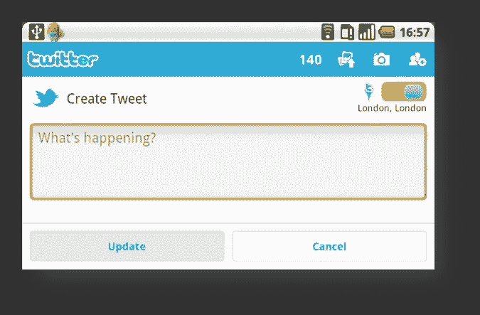
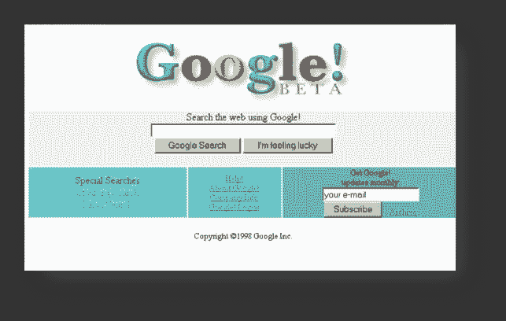
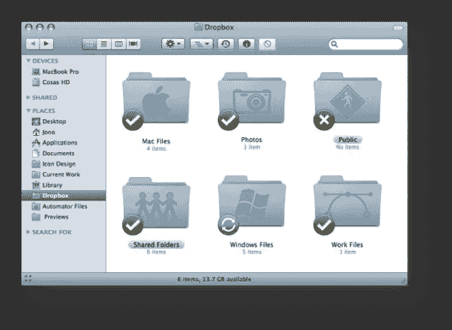

# 革命性产品背后隐藏的故事

> 原文：<https://medium.com/hackernoon/the-hidden-story-behind-revolutionary-products-80932763f119>

## **或者成功的创业公司如何在什么都没说的情况下讲述一个吸引人的产品故事**

***本文的目标是帮助产品经理和产品设计师通过一个新的棱镜——产品故事* * *更好地理解他们的使命和目标

多年来，我一直困惑于试图理解一些最具标志性的科技产品最初成功的背后是什么。作为一个最初被培训为沟通策略师的人，我很难相信你可以不通过口头与人沟通就能成功。然而，许多成功的产品都是由初创公司制造的，而且营销传播的预算为零。那么他们为什么会成功呢？

我没有答案，所以我认为它有某种非道德的魔力。这些标志性产品的外观、手感，或者——如史蒂夫·乔布斯所描述的——工作方式，显然是非常出色的。但是对于像我这样的人来说，好的 UX/用户界面是不够的，我在生活中到处寻找公式。我敢说我找到了一个。

这种理解之旅始于大约五年前，当时我了解到故事是如何与我们大脑的基本线路“对话”的。关于他们与参与、同理心和**行动**的基本联系。我看到这样一个事实，我们的大脑需要故事来作为 21 世纪最惊人的神经科学发现之一。保罗·扎克的这个 TED 演讲对于理解故事的力量是一个很好的介绍

当我第一次了解到这一点时，我只是将这种理解应用到我所领导的战略故事和品牌过程中。但是有一天，在指导初创公司产品/市场匹配时，这个关于产品的恼人问题又回来了:如果大脑需要故事来行动，你如何在不实际讲故事的情况下讲故事？

## 故事的核心——产品联系在于这样一个概念:故事不是你讲述的东西，而是大脑制造的东西。基本上，我们的大脑试图将所有外部信息储存为故事，包括坏的、好的、道德的等等。而且是完全无意识的。

[我将在下一篇帖子中更深入地解释产品相关的故事参数。感兴趣就跟着来。]

基于这种理解，我试图把产品看作是能在我们脑海中唤起正确故事的东西。这一表述让我看到了好产品如何“讲述”我们的故事，并帮助我理解了一些最令人困惑的成功故事背后的魔力:

**推特**

Twitter 在第一个主要社交媒体播放器 ICQ 推出 10 年后，MySpace 推出 3 年后，脸书推出 2 年后，Reddit 推出 1 年后推出。然而，它凭借零营销迅速获得了关注。这都是因为短信兼容性吗？它的产品勾起了什么故事？

我认为这是一个关于和我在这篇文章中相似的人的故事，他们只是不停地说，却没有说到点子上。关于 Twitter 将要对付他们的秘密武器:140 个字符。直接说重点！[再举两个例子，我就要说重点了。]

**谷歌**

谷歌从一开始就提供了优秀的搜索结果，但大多数研究人员将其最初的成功归功于它提供的直接搜索体验。谷歌在推出时在用户和世界的脑海中唤起的故事是什么？

- *当我们想找东西的时候，像 AltaVista 和雅虎这样的目录和搜索引擎让我们沿着复杂的路线找到我们想要的东西。谷歌为我们提供了一条简单的高速公路，让我们准确地到达我们想要去的地方。*

**收纳箱**

Dropbox 发布了一个简单的[演示视频](https://www.youtube.com/watch?v=7QmCUDHpNzE)后，获得了解析和关注。那里有什么故事？

- *当我们想要保存和传输文件时，我们可以选择许多不同的路径，所有这些路径都充满了不确定性和丢失宝贵信息的可能性。Dropbox 是一个神奇的盒子，可以无缝地跟踪你的所有进展，你的信息永远不会丢失或删除。清晰的旅程:红色—您的文件没有备份；蓝色——它正在路上；绿色——安全！*

**这是我承诺的外卖:**

将你的产品制作成一个故事可以让人们几乎直观地理解它和它的价值。更重要的是，它允许你清楚地管理你的产品路线图，因为任何不符合故事的特性都不会被使用，而那些支持故事的特性会被使用。当然，前提是你的故事结构正确。

我将在下一篇文章中详细阐述如何恰当地组织产品故事。如果这听起来与你有关，请点击下面我的照片旁边的“关注”按钮继续收听。

__

> [【1】](#_ftnref1)“大多数人都错误地认为设计就是它看起来的样子。人们认为这是一种装饰——设计师们拿到这个盒子，然后被告知，‘把它做得好看点！’这不是我们所认为的设计。不仅仅是看起来像什么，感觉像什么。设计就是它的工作方式。”—史蒂夫·乔布斯