# 信任的 Instagram:如何重新设计产品的信任架构

> 原文：<https://medium.com/hackernoon/the-instagram-of-trust-how-to-redesign-the-architecture-of-trust-in-products-8eeb5689446b>

## 第一部分。

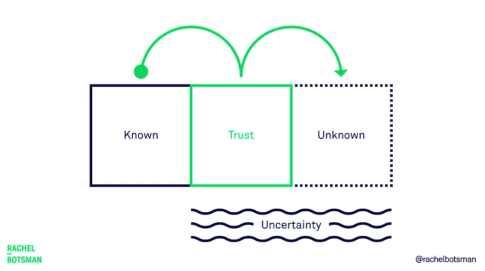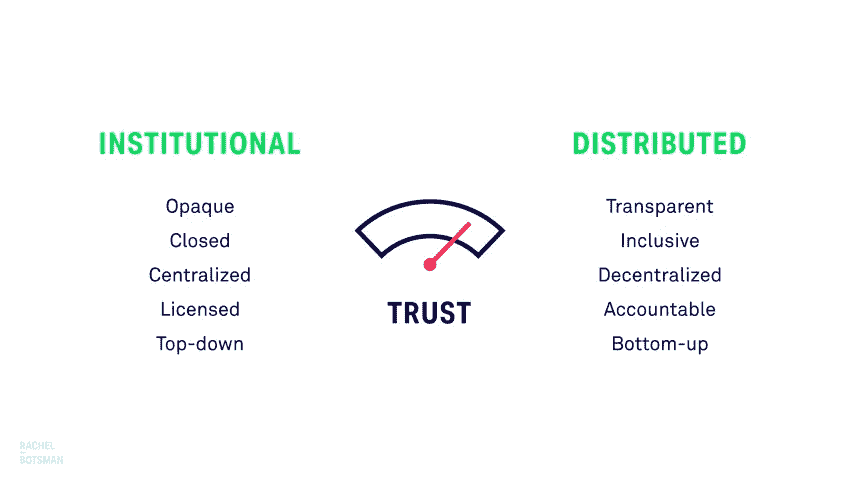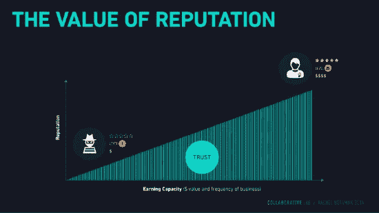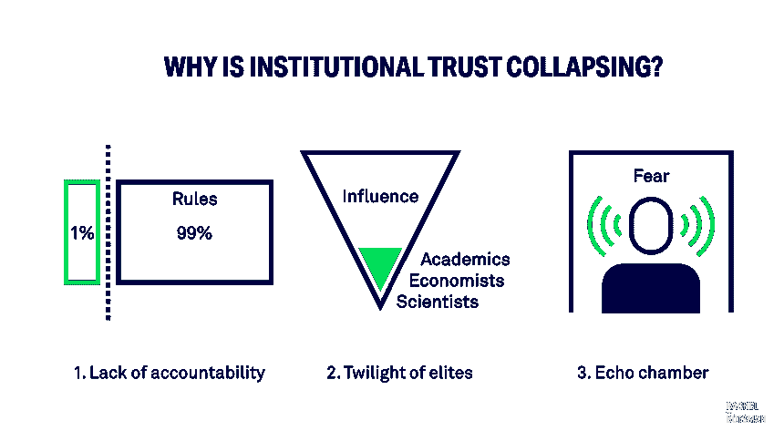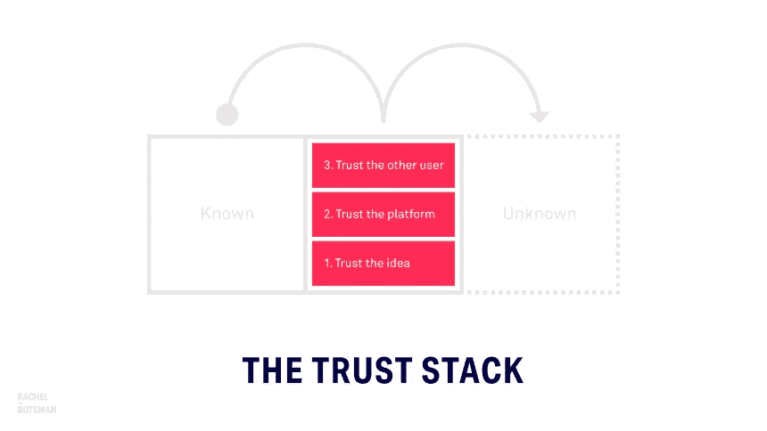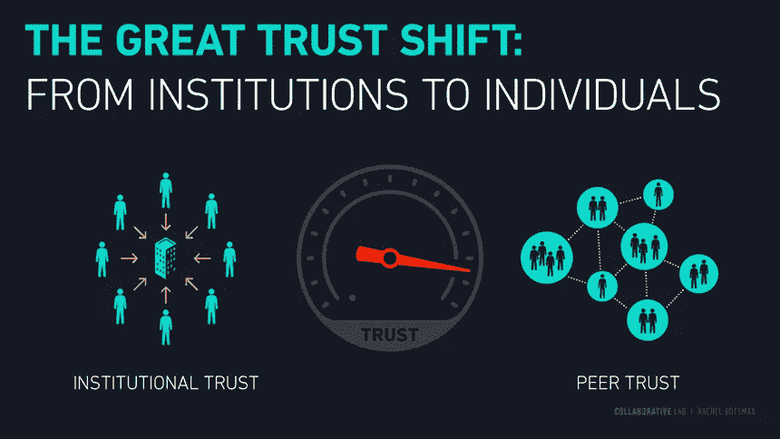

[Rachel Botsman](https://medium.com/u/e6f40f2ee20c?source=post_page-----8eeb5689446b--------------------------------)

政府机构中的铁锈正濒临崩溃；正如[内森·金赤](https://medium.com/u/443caa17b680?source=post_page-----8eeb5689446b--------------------------------)提到的，人们转向企业和其他人来解决社会问题和修复经济。人们不信任“体制”及其领导人。这是一个全球性的现象。**信任破裂是一个颠覆和重新设计的成熟领域。**技术正在为我们创造新的互动方式，这些方式要求我们信任我们不了解的人、公司和想法。正如 Suzanne Ginsburg 在她的文章《为自动化而设计》中所说，这项技术也将不同的交流和设计方法带入了我们的日常互动中，这也需要加深信任。随着自动化程度的提高，如果信任不能恰当地嵌入智能系统，只会造成对新解决方案的不信任，减少人们适应变化的机会，并大规模分裂社会。

更多的技术要求我们为了更好的个性化而放弃隐私。但是，如何解决我们社会日益缺乏信任的问题呢？越来越多的品牌要求人们基于他们的承诺和透明的政策来获得信任。但是信任心理学的运作方式完全不同。围绕算法的黑盒和算法如何工作的透明性，有许多尝试和争论。但我想问:**透明度够吗？**这是与客户建立长期关系的有效方式吗？它会建立对品牌和产品的信任吗？

在很长一段时间里，我们会相信当地人和他们的知识来做出我们的选择，因为在一个小村庄里，声誉就是人们所拥有的一切；声誉是随着时间的推移建立在服务质量的基础上的，并从一张嘴里传播开来。但是互联网已经把我们的村庄变成了充满陌生人、复杂技术和我们不知道的商业的地球村。令人垂涎的设计、令人信服的内容和第一位顾客的奖金已经将这种信任掌握到了极致。也许问题应该是如何在社会中重建信任，因为这是一个令人担忧的问题，并从那里开始？在这篇文章中，我不打算谈论为客户创造价值等方面，这些方面对于打造成功的产品和赢得用户的长期信任是不可替代的。相反，我将深入研究如何利用人类心理学来创造信任机制，从而唤起信任感并赢得客户。

**让我们回顾一下将信任视为设计问题的重要性:**

*   人们不信任机构
*   社会信任正在崩溃
*   人们希望品牌照顾他们的生活，但他们不相信品牌会照顾他们的隐私
*   技术变得越来越复杂，因此需要我们提供更多数据
*   信任允许创新
*   信任必须重新设计，以符合当前互联/数字社会的格局
*   透明是不够的
*   它可以转变您的品牌/组织，并建立您的客户之路

# 社会信任心理学

> 在当今社会，我们不仅需要信任人，还需要信任机构和制度。与其说我信任今天早上驾驶我的飞机的那个飞行员，不如说我信任按照时间表培养训练有素、休息良好的飞行员的航空公司。我并不信任某个出租车司机，而是信任造就了他的出租车许可制度和整个警察系统。同样，当我今天早上使用自动取款机时——另一个有趣的信任练习——我并不信任那台特定的机器、银行和服务公司，而是相信国家银行系统会从我的银行账户中扣除适当的金额。[来源](https://www.schneier.com/essays/archives/2013/02/trust_and_society.html)

让我们从理解信任在产品驱动的经济中是如何运作的开始。有三个主要的信任层，允许公司通过利用客户的这三个主要层次来创造收入。

1.  **信任概念**
2.  **信任企业**
3.  **信任同行**

信任就像连锁效应。如果其他人使用这项服务，这意味着它已经赢得了声誉，必须提供它所承诺的东西。人们通常会选择他们认识的人向他们推荐的服务。这样可以节省时间，而且他们知道他们不会冒任何风险，或者至少风险已经大大降低了。网络搜索既费时又有很多风险。基于网络的信誉系统也可能不可靠，因为评论可能是机器人生成的，或者是公司付钱让广告出现在你的搜索结果中。

> 信任危机是自相矛盾的:我们越来越多地将我们的福祉和安全托付给机构、技术和陌生人，但与此同时，我们报告对这些机构、技术和个人的不信任感增强或信任度下降。[来源](https://www.americamagazine.org/politics-society/2019/02/20/western-societies-cant-ignore-crisis-trust-were-experiencing)

另一方面，我们的社会正变得越来越分散，那些一字一句传来传去的建议已经不那么普遍了。我们生活的社区变得越来越分散，它们不允许进行日常互动，而这种互动可以进行知识交流。这些社区通常生活在网上，因此我们缺乏与它们相关的验证方法。网上的人可能与我们没有直接关系，他们也无法被与我们关系密切的人证实。在线声誉与真实社区中的声誉基于不同的指标。我们必须依赖其他信任来源，并寻找其他验证来源。

> …尽管由于现代生活的复杂性，我们越来越需要信任他人和机构，但信任却很难建立——我们不再有同样的保证，即他人值得信任，也不再有同样的追索权(如果我们的信任被背叛),而这正是我们经常有机会进行面对面交流的原因。[来源](https://www.americamagazine.org/politics-society/2019/02/20/western-societies-cant-ignore-crisis-trust-were-experiencing)

缺乏信任不仅扰乱了社交领域，而且也让创新无法蓬勃发展，因为它们可能缺乏用户来尝试新产品/服务。[信任被视为“决定我们作为一个社会如何进步的关键因素”，它让我们习惯于做让我们不断前进的新事物。](https://www.google.com/url?sa=i&source=images&cd=&ved=2ahUKEwi88LXDpY7iAhVMQ6wKHaj5CzcQ5TV6BAgBEAs&url=https%3A%2F%2Frepository.tudelft.nl%2Fislandora%2Fobject%2Fuuid%3Ac1996e12-1462-4683-8716-72110c665d4c%2Fdatastream%2FOBJ%2Fdownload&psig=AOvVaw1PbsyBW32YT4qpws89r70p&ust=1557485529980874)

# 适销的透明度和隐私

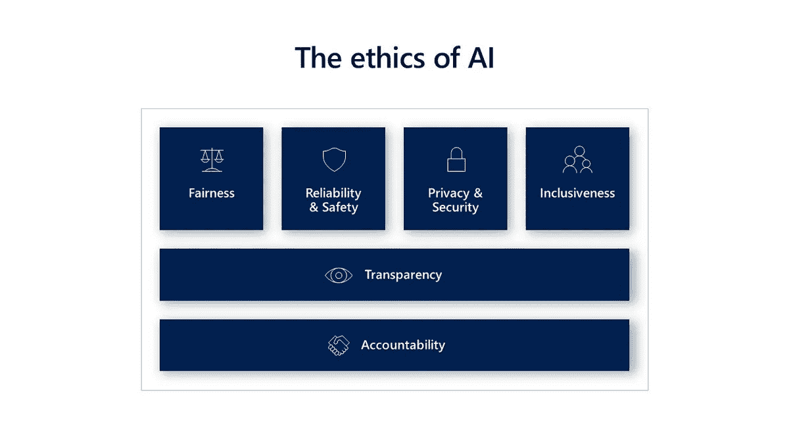

*Six Ethical Principles For AI By* [*Microsoft Design*](https://medium.com/u/d97749d23c4a?source=post_page-----8eeb5689446b--------------------------------)

如果我们想要一个自由的市场，在组织之间有一个健康的竞争，我们需要知道如何赢得用户的信任。消费者每天都变得越来越聪明。他们的信任在很久以前就被废除了，因为最近网络上流传着许多隐私问题。公司正在利用这个机会展示他们的透明度和可信度，因为这将直接触及消费者的情绪，帮助他们做出正确的选择。在不断增长的数据驱动的社会中，我们将比以往任何时候都更加依赖我们的情感反应，关闭我们大脑的理性分析部分，因为需要消耗的信息太多，无法做出选择。我们会受到如何被定位的影响。设计师有责任确保信任是为了创造价值，而不是被滥用。责任还包括在使用产品/品牌服务的同行中找回社会信任。

> 为了实现这一点，我们必须关注我们的产品所传递的情感，使用直观的信息架构和令人愉快的设计来管理它。探索你的用户，与他们建立情感联系。 [UX 银行和金融科技设计机构](https://medium.com/u/7213f8852991?source=post_page-----8eeb5689446b--------------------------------)
> 
> *人类通常基于社会认知的两个潜在的普遍维度来解释他人的行为:* [*热情和能力。*](https://www.frontiersin.org/articles/10.3389/fdigh.2018.00014/full) [*爱门阿万*](https://medium.com/u/f512d4701fa1?source=post_page-----8eeb5689446b--------------------------------)

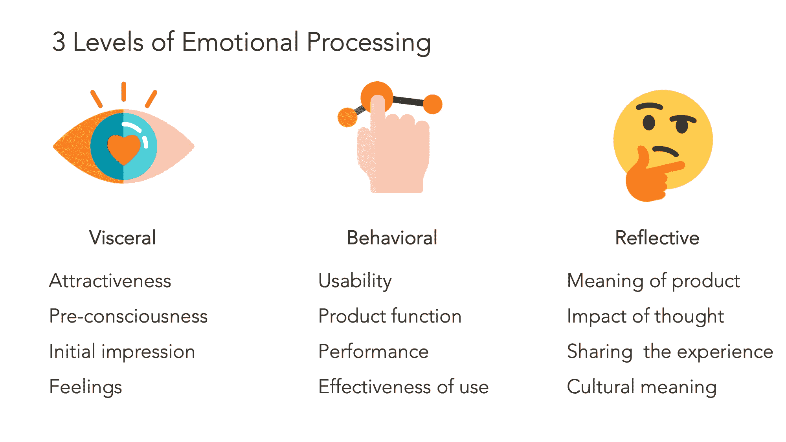

[Justin Baker](https://medium.com/u/f713ef315ee8?source=post_page-----8eeb5689446b--------------------------------)

透明度和隐私已经成为我们这个世纪的市场化方面，因此，消费者不那么容易被说服，尤其是在涉及敏感数据时，他们更愿意信任大公司。但是，我们也希望经济在新企业的推动下繁荣发展。目前市面上的大多数数码产品都要求我们填写个人信息。他们询问这些信息是为了继续提供服务。如果一个陌生人在街上向我们询问姓名、电话号码、家庭住址和社会保险号，以便我们得到更好的服务，我们会有什么感觉？对我们来说，这样做很可能看起来很奇怪，而且这种承诺不会基于任何现实的数字。但现实却大相径庭。我们每天都自愿披露我们最私人的信息。虽然给予这些公司这种信任让我们的生活变得更轻松，但我们不应该忘记，这种信任可能在任何时候被打破，而没有任何预期。

让我们看一些公司如何处理透明度方面的例子，以及他们采取什么步骤来沟通和赢得用户的信任。

## **十郎**

[Juro](https://medium.com/u/7dc7a401e908?source=post_page-----8eeb5689446b--------------------------------) 对你留在他们网站上的数据的使用非常明确。他们列出了以下信息:

*   我们收集数据的时间和方式
*   我们收集的数据类型
*   我们如何以及为什么使用您的数据
*   您的隐私选择和权利
*   我们收集的数据有多安全？
*   我们在哪里存储数据？
*   我们会将您的数据存储多长时间？
*   处理您的数据的第三方

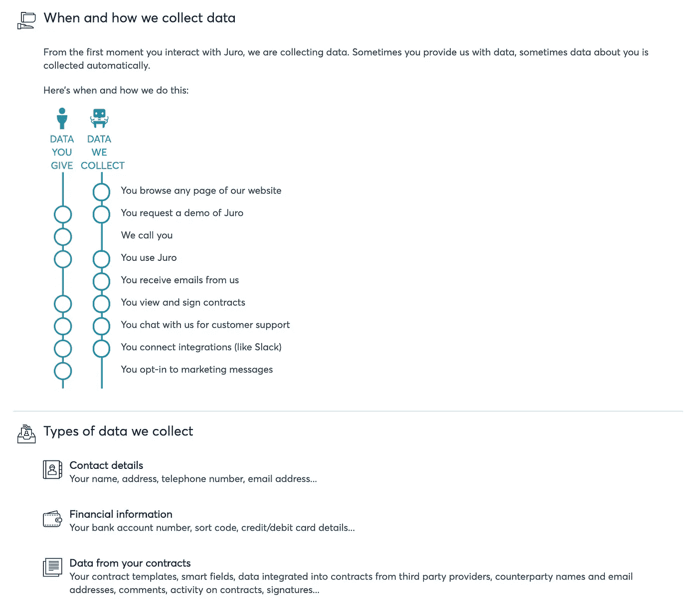

Source [www.juro.com](http://www.juro.com)

虽然需要处理的信息很多，但这是向教育用户如何使用他们的数据迈出的一大步。但是让我们向前迈出一步。这些信息的可操作性如何，他们是否可以选择加入或退出该政策的特定点？透明会在注册服务前的第一时间赢得消费者的信任吗？我们是否应该引导用户理解这些条款和条件，以便对他们有利？

## **大于 X**

由 [Nathan Kinch](https://medium.com/u/443caa17b680?source=post_page-----8eeb5689446b--------------------------------) 领导的一个名为 [Greater than Experience](https://www.greaterthanexperience.design/) 的工作室一直在围绕向客户翻译数据进行研究，围绕数据透明度进行产品设计，以实现双赢解决方案，如赢得用户信任和实现收入最大化。他们提供的解决方案在客户方面创造了相对于其他公司的竞争优势，允许组织在消费者了解数据的实际使用情况以及他们可以从此次收购中获得什么并最终接受条款和条件后收集更多数据。他们设计了一个名为[数据信任的框架](https://www.greaterthanexperience.design/data-trust-by-design-playbook/data-trust-by-design)，如下图所示:

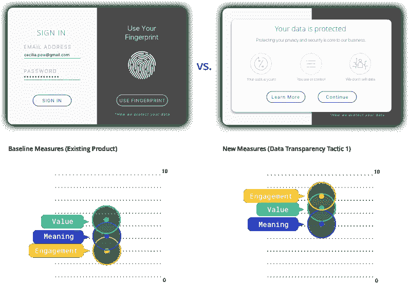

[GreaterThanX](https://medium.com/u/627430af6d2e?source=post_page-----8eeb5689446b--------------------------------)

那么，当用户第一次接触一个产品时，我们如何逐步建立信任呢？虽然与客户建立持久的信任是你能为企业创造的最宝贵的东西，但这需要进一步研究信任在社会中的作用，并提前一步将其引入产品设计。这种信任机制会因你的业务类型而异，必须根据你的客户的想法和他们最看重的东西进行调整。因此，他们可能不会告诉你在做用户测试时，需要对你的行业做进一步的研究来发现共同的模式。下面我介绍了几个设计方案，说明如何将信任融入入职体验，甚至是之前的阶段，比如发现产品。

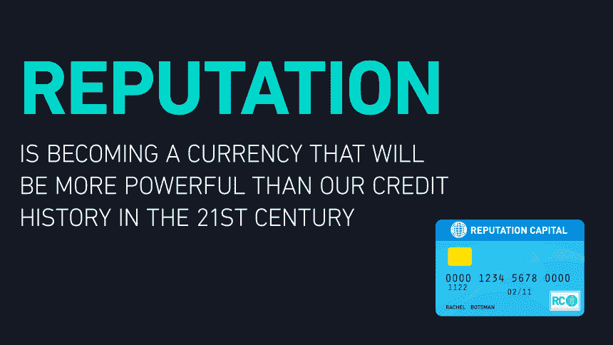

Reputation Capital (2012) [Rachel Botsman](https://medium.com/u/e6f40f2ee20c?source=post_page-----8eeb5689446b--------------------------------)

# 为可识别性而设计

Evidence-Based Behavior Change In The Real World — Paul Cohen, 2019 [Source](https://vimeo.com/321914105)

在最近的 Interaction '19 会议上，我有一个很好的机会聆听来自 [One Medical](https://www.onemedical.com/) 的 [Paul M. Cohen](https://medium.com/u/e4af029d7013?source=post_page-----8eeb5689446b--------------------------------) 关于将行为经济学、市场营销科学和认知心理学融入设计师清晰实用的课程的演讲。帮助我构思这篇文章的一个例子是 Paul 关于可识别性设计的演讲的一部分，以及如果人们能够更容易地识别所提供的选项，他们将如何极大地改变他们对疫苗的选择。在这种情况下，使用医生的真名，而不是使用医疗团队的通用名，会导致围绕该选项的更多活动。比起从未听说过的组织的名字，人们更容易相信真实的人。很难衡量医疗团队的声誉，而不是他们从朋友那里听说的某个人。当筹集资金时，人们更可能把钱捐给个人，而不是一个不知名的人。延续这一思路，Paul 在他的网站上展示了更多关于产品设计中社会可识别性的例子。以下是其中的一些:

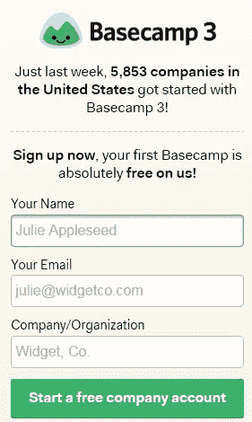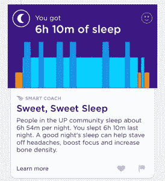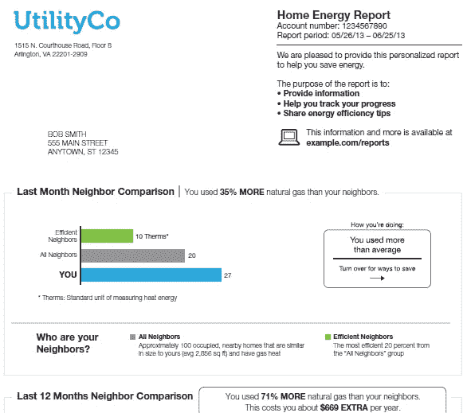

[http://www.paulcohen.com/category/behavior-library/](http://www.paulcohen.com/category/behavior-library/)

# 设计信任

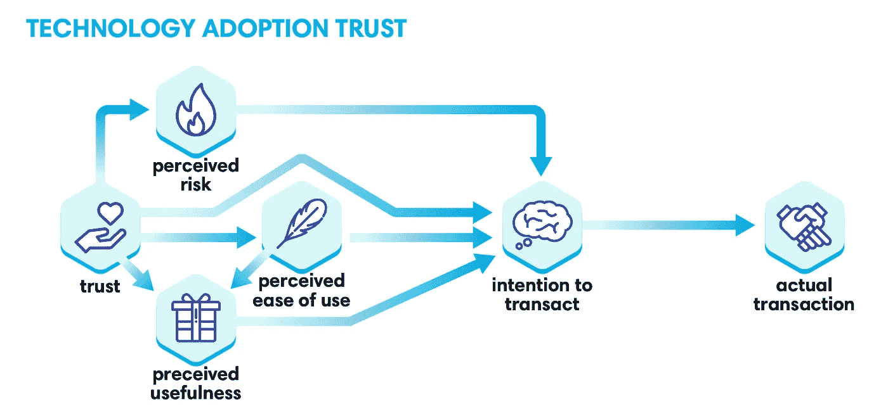

Technology adoption model by *Sebastian Manrique*

我认为，在不久的将来，我们将把人工智能嵌入到我们的个人设备中，它将根据对我们有益的内容，从广泛的选择中为我们预先选择选项，但这也将得到人类的同意。并且基于每个用户对现实和社会的感知，推荐可以对每个用户起不同的作用，自治系统可能不完全能够做出这些选择。他们可能在一定程度上了解我们的社交圈，但他们不知道我们的价值体系，也不知道这个品牌的哪些特点会吸引我们。它也不知道我们想要信任哪些朋友，谁的话对我们更重要。

我建议，为了成功地采用产品，获得两个信任系统。一是基于信任在社会中几十年来是如何发展的，并利用这一点(通过为用户嵌入关于我们认识的人的选择的通知，这将更有可能增加产品的可靠性并有助于做出选择),二是重新发明/重建基于产品/服务的新信任机制背后的意义和系统。但是用户怎样才能真正了解产品呢？

*   社会化媒体
*   朋友推荐
*   文章
*   另一家公司的推荐
*   应用商店
*   博客
*   广告
*   网络搜索
*   服务查找器门户

我将为您提供的解决方案可能不太适合当前的搜索/查找系统，因为没有找到产品或服务的独特方法，但这些解决方案旨在进一步开发这些发现采购服务。其中一些可能会在打开产品页面或应用程序之前就显示出来，还有一些可能是入职策略的一部分。信任路线图没有明确的起点或终点，因为它是每个业务战略计划的一部分。

1.  **将信任在社会中的传统运作方式融入到产品中**

*   信任你的社区、你认识的人、你在**关注的公众人物、他们喜欢什么、他们使用什么服务以及他们推荐什么** —这种方法可以整合到更大的平台以及拥有碰巧是你朋友的用户社区的应用程序中，通过展示你的朋友圈选择什么来利用对你产品数据库中资产的信任
*   信任企业/品牌和他们的选择，他们会推荐什么。如果你信任一个品牌，那么他们支持的任何东西都会继承他们的信任

> 根据我的研究，可以肯定地说，如果用户把我们的产品推荐给他们的朋友，他们就完全信任我们的产品。如果用户信任你的个人信息，他们更可能信任你的敏感信息和财务信息。[艾蒙阿万](https://medium.com/u/f512d4701fa1?source=post_page-----8eeb5689446b--------------------------------)

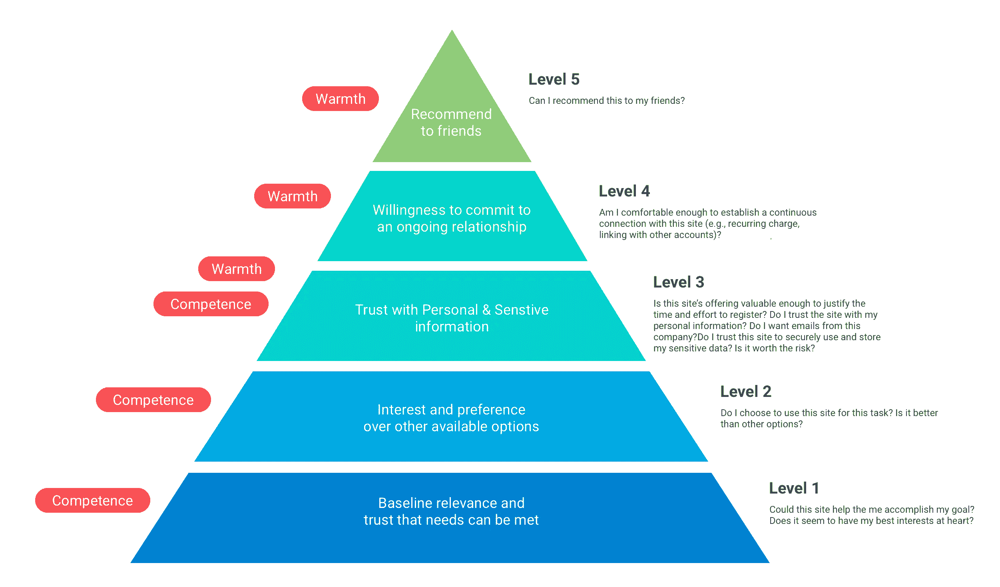

Importance of competence at early stages of trust Aimen Awan

2.向领域专家寻求建议— **一个平台的想法；如果你想扩大个人价值，并根据建议创造收入。这些领域专家可能是你追随的人的圈子里的人，也可能是你完全不认识的人**

**3。重塑信任对你的产品意味着什么，并开发一种机制让它为你的服务服务**

*   用户评级，但前提是应用程序已经建立了声誉
*   询问人们他们想要什么，他们的痛点是什么，你实际上可以做什么，并帮助他们实现
*   在用户入职时公开您的合作，炫耀
*   提前展示社区对你的看法，但要让它变得可信
*   提前展示你的声誉
*   根据用户社区提前展示谁在使用该产品
*   显示机构验证
*   讲述一个关于你的产品和它能解决什么问题的真实故事。消费者正在互联网上寻找有关商业的信息。对他们来说，重要的是要知道这些公司做了什么，它们与其他人的关系如何，是什么驱使他们，他们有什么价值观。
*   展示你公司的真实故事，突出社区驱动的特点。在情感层面上与客户沟通，而不是专注于展示产品的特性。今天的消费者收到的关于产品的信息量太多了。人们通过情感来行动，这是你与用户的基本本能对话的机会。人们会忘记信息，但会记住经历，而经历是由情绪创造的。

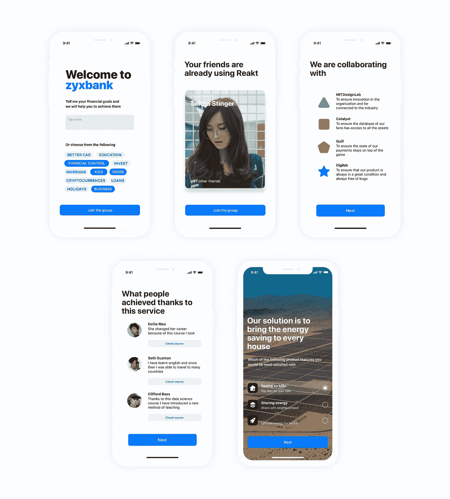

参考资料:

 [## 保罗·寇恩|医疗保健战略与创新

### One Medical 医疗保健战略与创新、基于价值的护理和行为经济学领域的领导者。阅读文章…

www.paulcohen.com](http://www.paulcohen.com/)  [## Juro.com,《管理合同的聪明方法》。

### Google Analytics 使用 cookies 让我们可以看到网站访问者和用户的活动信息

juro.com](https://juro.com/policy.html)  [## UTU 信托基础设施

### UTU 在斯瓦希里语中是人类的意思。我们的名字既让我们想起了我们公司在肯尼亚的渊源，也让我们想到了一个更安全、更…

utu.io](https://utu.io/)  [## 超越 X -道德、隐私和信任的设计

### Greater Than X 是一家研究、设计和战略咨询公司，位于个人信息经济的前沿…

www . greaterthanexperience . design](https://www.greaterthanexperience.design/) 

[https://www . Amazon . com/Trust-Economy-Building-realizing-Exponential/DP/9814751669](https://www.amazon.com/Trust-Economy-Building-Realising-Exponential/dp/9814751669)

如果你有兴趣了解更多关于我为分布式自治经济设计身份的方法，你可以阅读我的其他文章，标题分别是[设计一个分散的轮廓 dApp](https://uxdesign.cc/designing-a-decentralized-profile-dapp-ab12ead4ab56) 和[分布式自我主权身份](https://uxdesign.cc/ai-hub-identity-management-centre-a33bd935aa90)，这两篇文章都由 UX 集体出版。

*别犹豫* [*通过电子邮件联系*](mailto:info@agazima.org) *，或者👇*

*   👩‍💻[在 dribbble 上查看我的照片](https://dribbble.com/agnieszkazima)
*   🔧[研究我在行为方面的用例](https://www.behance.net/agazima)
*   📖[在媒体上阅读更多信息](/@agazima)
*   🐦在[推特](https://twitter.com/drthrdwr)上关注我
*   👍[在 facebook 上喜欢我](https://www.facebook.com/drthrdwr/)

*免责声明:这些是我出于热情在业余时间独立完成的项目，它们与任何组织都没有联系，我也没有与文章中提到的公司合作。*