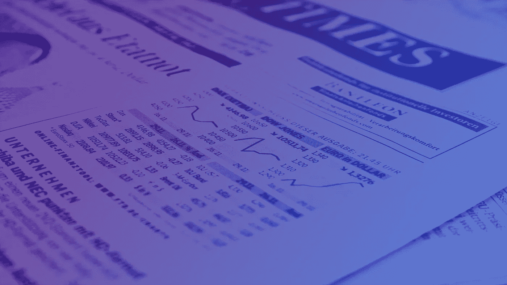

# 机构对加密货币和区块链的兴趣

> 原文：<https://medium.com/hackernoon/the-institutional-interest-in-cryptocurrency-and-blockchain-5f3423ae318>

Find out more at www.AXPR.io

## 介绍

最近的一项研究显示，超过 30%的顶级 ico 价值下跌，绝大多数 ico 交易亏损。所有这些都导致交易量下降，从而使新兴的 ico 在过去几个月里极难筹集到更多资金。但令人惊讶的是机构对区块链的浓厚兴趣、加密货币基础设施的发展以及新资本的推出。

1994 年至 2003 年期间纳斯达克的表现与 2018 年 10 月至 8 月期间比特币的表现之间存在密切的相关性。这引发了一些问题，比如比特币的价格是否也会像纳斯达克那样上涨。一个有趣的事实是，许多发行代币的公司将在市场上看到倍增效应，代币价格可能会随着比特币一起上涨，这有助于增强市场上加密货币资产的整体资本化。或许比特币的价格将面临来自其协议不同硬分叉版本的压力，如比特币现金、比特币 SV 等。无论如何，在前进的道路上要记住的一件事是围绕比特币区块链的运行及其消耗的大量电能的担忧，特别是从普通个人的公共认知角度来看。

## 由于机构采用加密货币，零售参与减少

尽管加密货币资产的资本化从 8000 亿美元大幅下降到 1300 亿美元，但由于机构对该技术的兴趣增加，区块链各地的几家跨国企业和公司正在申请专利，包括亚马逊、谷歌、脸书、万事达卡等。伦敦、纽约、直布罗陀、马尔他、新加坡、瑞士和波士顿的证券交易所进一步增强了机构对区块链的兴趣，这些交易所正致力于推出证券交易所，从而实现令牌化证券的上市和交易。允许养老金管理公司和共同基金通过在公认的交易所上市，轻松投资于各种加密货币资产，可能对增长至关重要。机构经理要求的加密货币资产交易框架的另一个重要部分是托管服务，因此高盛、富达和比特币基地已经确认他们将提供此类服务。

在世界各地，银行都在测试区块链技术的各种使用案例。

*   在欧洲，ABN Amro 银行商业化推出了托管管理解决方案用例，而 Allied Irish Bank 和 BNP Paribas 分别在国内银行间支付和贸易融资方面仍处于试点模式。
*   在北美，花旗集团正处于私人证券用例数字支付解决方案的试点模式，高盛和富国银行分别处于股权互换交易和私人标签 MBS 证券化用例的测试阶段。
*   亚洲的韩国银行和友利银行分别在客户识别和跨境交易处理用例方面处于试点模式。

机构对区块链科技的兴趣不仅限于银行服务。

*   大都会人寿的 Vitana 是世界上第一款由区块链技术支持的妊娠糖尿病自动化保险产品。
*   Pemex 的 Beluga Pay 允许在 Pemex 加油站进行加密货币支付。
*   Maersk IBM 的 TradeLane 建立了一个联合业务，利用区块链技术进行交易。
*   沃尔玛(Walmart)的沃尔玛食品可追溯倡议(Walmart Food Traceability Initiative)设计了一种方法，通过采用区块链技术支持的平台，将沃尔玛的绿叶产品追溯到最初的农场。
*   这些只是全球涌现的众多用例中的一部分。

## 结论

机构对区块链和加密货币资源的兴趣最初集中在筹集资本上，主要是针对科技初创公司和新企业。但是，不幸的是，在几乎可以忽略不计的指导方针和法规的背景下筹集了近 200 亿美元，各种骗子被快速轻松赚钱的保证所吸引，因此，目前市场上推出的 4，500 种 ico 中的绝大多数注定会出现短缺。尽管如此，加密资源已经预示了对这种新资产类别和更广泛技术的热情，并且有越来越多明确无误的证据表明，实际现金正被用于有价值的区块链项目。这方面的两个例子是供应链和忠诚度计划，这两者都被利用区块链技术的公司所破坏。

最后，加密资源目前正朝着被用于提供大量资源债券、私人和引用基金、财产的部分所有权的方向发展，甚至包括 JP 摩根正在象征化的金条等产品。通过这种方式，有大量证据表明，机构对区块链和加密资源的兴趣正在增长。

区块链创新不是一种世界观，加密资源也不是我们每个问题的答案，尽管它们确实提供了一些令人印象深刻的新设备来限制合作的费用，并且它们在我们快速数字化的世界中提供了直截了当、安全和控制。