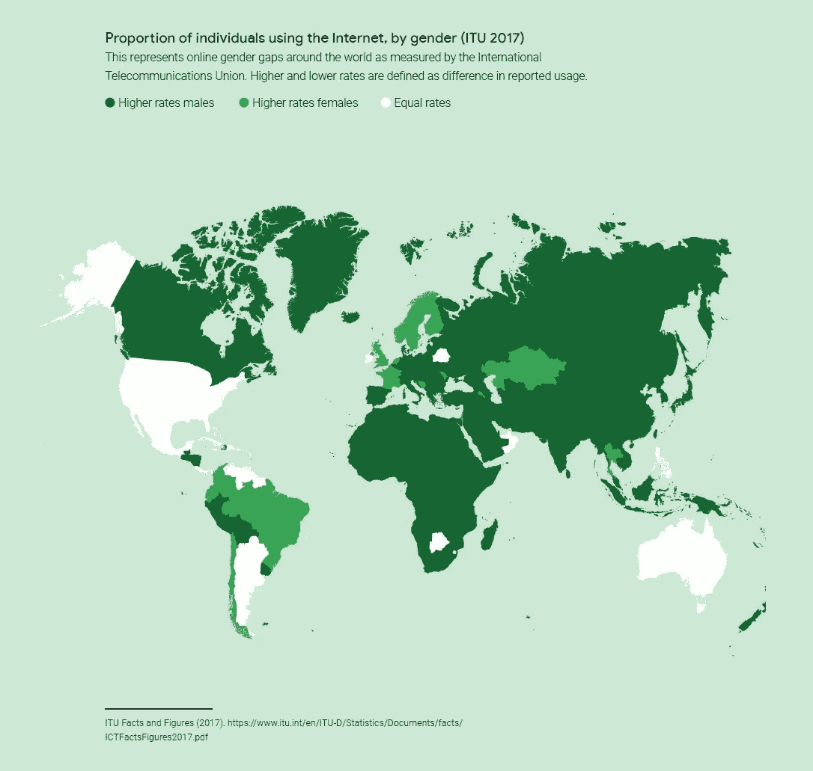

# 互联网是性别不平等的

> 原文：<https://medium.com/hackernoon/the-internet-is-not-gender-equitable-5ec7c2cf96e5>

## 谷歌指出了网上性别平等的四个主要障碍:访问、内容和社区、隐私和安全。

(Image credits: Google)

谷歌最近发布的一份新报告非常明确地重申了“互联网是不公平的。”

研究负责人 [Nithya Sambasivan](https://medium.com/u/30749b162d20?source=post_page-----5ec7c2cf96e5--------------------------------) 在 Twitter 上写道:“近两年来，我们对 7 个国家不同性别的 4000 人进行了研究，以了解为什么以及科技制造商可以为此做些什么。”他指的是他们在孟加拉国、印度尼西亚、墨西哥、尼日利亚、巴基斯坦、巴西和印度的研究活动。

Nithya Sambasivan ‏on Twitter.

根据这家科技巨头和国际电信联盟(ITU)汇编的统计数据，估计显示，在全球三分之二的国家，女性上网人数少于男性。

此外，国际电联发现，高等教育入学率中的性别平等与互联网使用中的性别平等之间有着密切的联系。唯一一个使用互联网的女性比例高于男性的地区是美洲，那里的国家在高等教育性别均等方面得分也很高。

虽然这份报告是为技术制造商写的，但作者强调了“每个人都倡导性别平等作为基线”的重要性。

“除非我们采取有意的方法，否则公平不是互联网的默认结果，”该研究指出。“让我们考虑一下我们的技术对女性的影响，从产品开发到上市。我们有巨大的机会为所有互联网公民创造更具包容性的在线体验，因为技术在为每个人服务时效果最佳。”

Full report by Google.

谷歌确定了性别平等在线的四个主要障碍:

*   **访问**:“在我们的研究中，许多女性的行动能力、流动性和访问互联网的时间都很有限。互联网有时被视为对女性角色和名誉的威胁。在低连接性地区访问互联网往往需要旅行，但女性的身体活动可能会受到限制。负有重大家庭责任的女性表示，她们很少有空闲时间上网。
*   **内容和社区**:“互联网充满了内容和社区——博客、视频、社交媒体对话等等。但女性通常很难在网上找到相关内容或支持社区。对骚扰和厌女症的预期导致女性创作的内容较少。即使内容确实存在，也很难找到，因为推荐算法通常是根据男性占多数的数据进行训练的。”
*   **隐私**:组织通常认为隐私是对在线身份的管理。女性经常与朋友和家人分享她们的设备，并且需要创建隐私实践来允许她们舒适地分享这些设备。例如，女性使用应用程序锁定或删除她们的搜索历史。虽然许多在线体验需要姓名和电话号码等个人信息，但女性通常不愿意透露这些信息。
*   **安全**:“新技术可以为女性提供保持联系所需的工具，从而改善她们的生活。但是这些工具也会产生安全问题。女性经常经历网络骚扰、冒充和个人内容泄露等网络虐待。在线虐待的后果可能很严重，导致现实世界的影响，如名誉损害和身体暴力。身体骚扰是一个严重的问题，尤其是在公共场所。女性很少向在线平台或当局举报虐待行为。相反，他们限制在线参与，转而向家人寻求支持。

(Image credits: Google)

在他们的结论中，研究人员还鼓励技术领导者承认一些事实:

*   认为自己是女性和非二元人的人经常会遭遇双重标准和偏见，而互联网经常会产生和强化这些不公正。
*   互联网提供了挑战由来已久的歧视的必要工具，领导人可以利用技术进化的快速速度作为加速平等的积极力量。
*   在线权益可以增加参与和公正，但不是单独的。

那么，我们如何向前迈进，在网上实现性别平等呢？

谷歌为组织提供了四种方法来支持和实现在线性别平等:

*   伦理案例:从伦理上讲，组织有义务建立一个惠及所有人的互联网
*   招聘案例:强大而有意义的工作吸引最优秀的人才。
*   商业案例:包容性设计可以促进产品增长，使企业受益。
*   技术案例:解决性别平等促进技术创新。

回到 2018 年 11 月，[网络基金会](https://medium.com/u/aabc4af7ffad?source=post_page-----5ec7c2cf96e5--------------------------------)的[网络](http://webfoundation.org/docs/2018/11/The-Case-For-The-Web-Report.pdf)报告注意到“互联网用户在过去 30 年的增长是多么的显著。”它还警告说，“如果我们不采取措施缩小数字性别差距，缩小全球数字鸿沟将仍然是一个不可能的目标。”

“就在 13 年前，即 2005 年，全球上网人口还不到 16%，互联网主要是西方的——当时近 50%的欧洲人上网，相比之下，只有 2%的非洲人上网，”该报告称。“尽管我们已经取得了长足的进步——据估计，如今全球有近 50%的人在使用互联网——但我们仍有很长的路要走。”

> 在全球范围内，数字鸿沟——能够访问和使用互联网的人与不能访问和使用互联网的人之间的鸿沟——主要存在于性别、经济和地理界线上。如今，近 40 亿离线用户中的大多数是女性——研究表明，在贫困的城市地区，女性在线的可能性比相同社区的男性低 50%。大多数离线用户生活在中低收入国家。如今欧洲人上网的比例(80%)是非洲人(22%)的近四倍。

The report of the The World Wide Web Foundation.

根据网络基金会的说法，被排除在互联网接入之外的后果是“严重的”，因为“今天离线意味着错过经济机会、全球公共辩论、社会和文化交流、基本政府服务和民主赋权。”

该报告补充说，“未能连接这些离线人口将导致每个人的损失:这几十亿人保持不连接的时间越长，我们从他们的集体知识、才能和对经济繁荣的贡献中受益就越少。”

2018 年 3 月，[欧洲议会](https://medium.com/u/302f389ec496?source=post_page-----5ec7c2cf96e5--------------------------------)公民权利和宪法事务政策部应 *FEMM 委员会*的要求委托进行的一项研究试图揭示不同因素之间的联系——访问、技能、社会经济和文化——这些因素阻止了女性平等地获得数字技术。它还探讨了处理线上和线下不平等的方法，以缩小数字性别差距，改善妇女和女孩的数字包容性和未来与技术相关的职业道路。

这项引用欧盟统计局数据的研究显示，尽管欧洲的数字鸿沟正在缩小，但它仍然是一个问题。2013 年，70%的 16-74 岁女性在家里可以上网，而男性为 74%；在工作中，这一比例分别为 29%和 35%。在定期使用互联网方面，2013 年，每周或更频繁使用互联网(包括每天)的女性为 69%，男性为 74%；59%的 16-74 岁女性每天都使用互联网(65%的男性)。尽管如此，在 2010 年至 2014 年期间，16-74 岁女性经常使用互联网的比例增加了 13 %(相比之下，男性增加了 9%)。

2018 年，经济合作与发展组织( [OECD](https://medium.com/u/fe25a5d0be89?source=post_page-----5ec7c2cf96e5--------------------------------) )也在其[的《弥合数字性别鸿沟:包容、提升技能、创新](http://www.oecd.org/going-digital/bridging-the-digital-gender-divide.pdf)中研究了这个问题，根据该报告，“女性目前没有被赋予利用数字化转型所提供的机遇的能力。”

经合组织将获得机会与机会联系起来，展示了“虽然 20 国集团经济体采取了重要行动来缩小总体上的性别差距，但还需要做更多工作来增加妇女和女孩对数字经济的参与，以便她们也能为正在进行的数字转型做出贡献并从中受益。”

经合组织的研究指出,“在世界范围内，平均而言，女孩上学的时间往往少于男孩——这最终导致世界范围内女性的文盲率高于男性；在创办或拥有企业方面，她们也面临着比男性更高的障碍，她们努力将家庭责任与赚取急需的家庭收入结合起来。

它注意到数字鸿沟造成的不利条件如何造成不一定与接入和数字权利相关的差距:

*   妇女和女孩可能会从数字技术中受益匪浅。
*   互联网改善了信息流动，降低了获取一般和具体知识的障碍，包括关于教育和培训的可能性。虽然这对所有人都有好处，但它可能对受教育不多的女孩(如果有的话)特别有帮助，因为她们可能能够访问在线课程并获得一般信息，这些信息也以播客、视频、教程和“如何做”类型的说明的形式提供，减少了对书面教科书的依赖。
*   对于以农业为收入来源的妇女来说，使用互联网可以使她们从天气预报中受益，从而有助于优化收获时间以及产出的质量和数量。
*   它还可以帮助妇女获得医疗保健相关信息，包括关于特定医疗或预防的信息，并降低早孕的风险和成本。