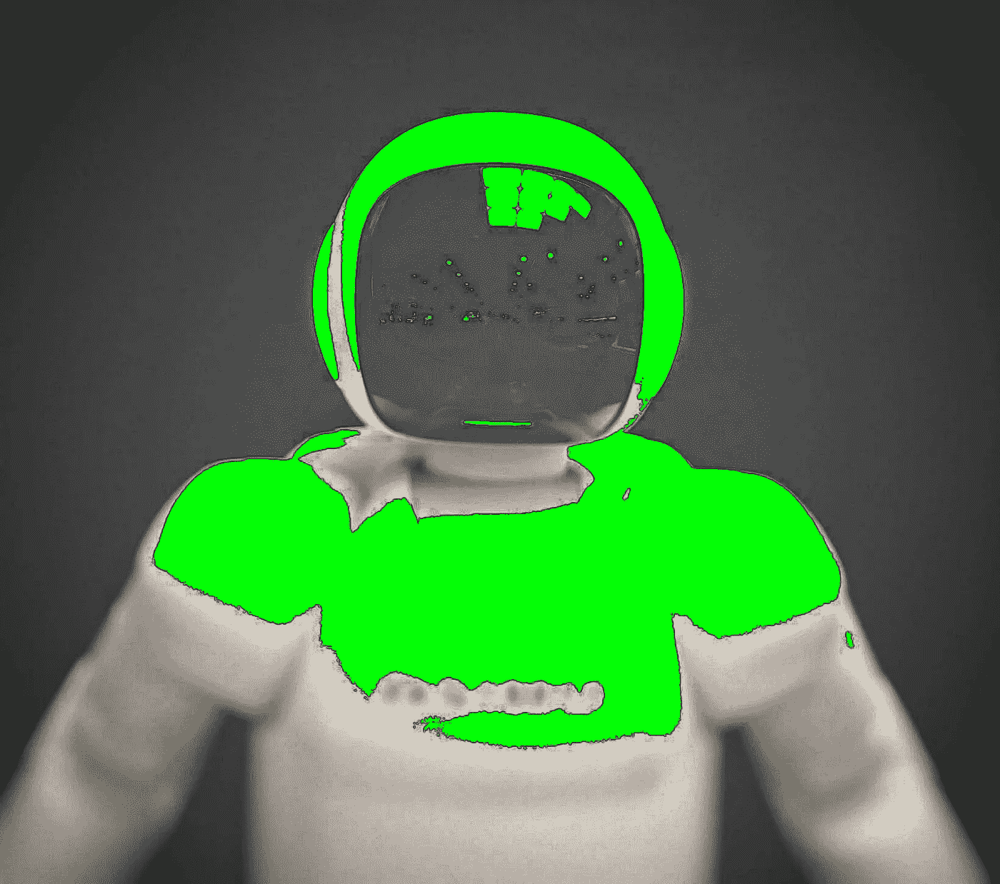

# 麻省理工学院教授和研究人员的最新机器学习趋势

> 原文：<https://medium.com/hackernoon/the-latest-machine-learning-trends-from-mit-professors-and-researchers-cdda345dd207>

麻省理工学院( [MIT](http://web.mit.edu/) )一直以其开创性的研究而闻名，对当今以技术为中心的环境产生了持久的影响。随着机器学习的发展在这些天获得了令人难以置信的牵引力，该研究所的科学家们有理由特别关注这项被夸大的技术，提出创新的知识。

在这篇文章中，我们将深入研究麻省理工学院最近的研究，并简要介绍你可能没有听说过，但希望纳入你的业务流程的 ML 用例。

# 监测致残疾病

[根据官方统计](http://parkinson.org/Understanding-Parkinsons/Causes-and-Statistics/Statistics)，每年大约有 60，000 名美国人被诊断患有帕金森病(PD)，预计到 2020 年将有近一百万人患有该病。

为了更好地了解帕金森病和其他衰弱性疾病——如肌肉萎缩症和多发性硬化症——并能够完善治疗，由教授[迪娜·卡塔比](https://www.linkedin.com/in/dina-katabi-19653a/)领导的麻省理工学院团队创造了 [RF-Pose](http://openaccess.thecvf.com/content_cvpr_2018/CameraReady/2406.pdf) 。这是一个人工智能解决方案，它教会无线设备检测人们的姿势和运动，即使是通过墙壁和遮挡。

研究人员使用深度神经网络方法来分析从人体反射的无线电信号，并构建模拟患者行为的动态简笔画。在经过计算机视觉模型的训练后，该系统仅使用无线信号来估计 2D 姿态。

由于能够监控跌倒、受伤和活动模式的变化，该解决方案不仅可以帮助老年人更加独立地生活，还可以在搜索和救援任务中帮助定位幸存者。

针对可能的 GDPR 问题，该团队表示，他们收集的所有数据都得到了受试者的同意，并被匿名和加密以保护用户隐私。

# 创造个性化的工作氛围

办公室的物理环境和员工参与度之间有很强的相关性，这已经不是什么新闻了。也就是说，69%的公司报告在引入健康建筑功能后有所改善。如果雇主提供有吸引力的工作场所设施，37%的求职者愿意接受薪水较低的工作。

考虑到这一点，麻省理工学院媒体实验室的反应环境小组启动了一个[新项目“中介氛围”](https://vimeo.com/192196471)，旨在从个人层面改善工作场所的氛围。这个系统是如何运作的？

Mediated Atmosphere 使用具有特殊纵横比的无框屏幕、自定义照明网络、扬声器阵列、视频投影以及可穿戴和非接触式生物信号传感器的组合，来彻底分析用户的行为和精神状态。

然后，这些数据将用于以有意义的方式同步各种设备，并创建相应的沉浸式环境，帮助员工集中注意力、减压和舒适地工作。此外，如果用户对光线水平或声源不满意，他们可以简单地告诉系统他们想要多么专注或放松。

为了在构建可适应任何办公空间的可定制安装方面更进一步，该团队计划分析尽可能多的不同数据，并利用高级 ML 工具增强其基于图像的分析。

# 编辑视频中的音乐

另一个值得一提的麻省理工学院的新奇事物是 [PixelPlayer](https://www.youtube.com/watch?v=2eVDLEQlKD0) ，这是一套深度学习网络，可以分析音乐视频，在像素级别识别特定的乐器，隔离它们的声音，并使某些乐器听起来更柔和或更响亮。

经过 60 多个小时的视频训练后，该系统可以准确地从从未观看过的音乐表演中提取声音。

据首席研究员[赵航](https://www.linkedin.com/in/hang-zhao-48402a47/)称，该系统可能有助于提高旧音乐会录像的音频质量。此外，PixelPlayer 可以帮助制作人预览某些乐器在一起的声音，以选择新录音的最佳组合或改变现有录音的音频混合。

目前，该系统可以识别大约 20 种乐器，但随着更多数据的不断输入，它将能够检测更多类型，甚至区分乐器子类之间的细微差异。

# 构建路线图

道路测绘是一项繁琐的任务，即使有了航拍图像，一些公司也倾向于花费大量时间和人力来描绘路段。为什么？航空影像可能有建筑物、树木和阴影，这使得它们模糊不清，需要一个后处理步骤。

为了填补地图上可能的空白区域，来自麻省理工学院计算机科学和人工智能实验室(CSAIL)的研究人员设计了 [RoadTracer](https://www.youtube.com/watch?v=Lj_g1qb4cbs) ，这是一个支持 ML 的构建路线图的系统，比传统方法精确 45%。

RoadTracer 从道路的已知区域开始，然后使用神经网络来分析周围的位置，并定义更有可能成为道路上下一部分的点。添加这些点后，RoadTracer 重复该过程。

该系统的增量方法的优点在于，它允许人类主管轻松快速地纠正错误，并从他们停止的地方重新启动算法，而不是让 RoadTracer 继续使用不准确的信息，并在最终的路线图中增加错误。

# 在自然对话中检测抑郁

抑郁症是一种常见的精神疾病，影响着全世界各年龄段约 3 亿人。尽管有有效的治疗方法，但不到一半的患者接受了治疗，不准确的评估是其主要原因之一。

麻省理工学院的研究人员正试图借助机器学习来应对这一挑战。他们的[新神经网络模型](http://news.mit.edu/2018/neural-network-model-detect-depression-conversations-0830)检查患者对特定问题的文本和听觉回答——以前的精神疾病、生活方式、情绪等。—在没有任何背景的情况下，识别指示抑郁症的语音模式，并将其用于诊断新患者。

为了提供准确的结果，该系统被输入了约 142 个对精神疾病患者的文本、音频和视频采访，并根据抑郁程度对他们进行 0-27 分的评级。

根据研究人员的说法，这样的神经网络可以使移动应用程序能够远程监控用户精神痛苦的互动，并及时向医生发送警报。在未来，经过额外数据的训练后，麻省理工学院的 ML 模型将被用于早期检测许多其他认知障碍，如健忘症或痴呆症。

# 最后一点

从医疗保健到制造再到艺术，机器学习正在逐步提高医疗质量，自动化一系列业务流程，并完善客户服务。而这些只是你可以效仿的几个 ML 应用例子。

根据你的定位和商业目标，你可能需要扩大现有的解决方案或者从头开始建立一个定制的 ML 系统。无论您选择哪种方法，请放心，您都将获得巨大的收益。

> **关于作者**:
> 
> 亚娜·叶丽娜是软件工程和 IT 咨询服务提供商 Oxagile 的技术作家。了解有关我们机器学习开发的更多信息。她的文章被刊登在 KDNuggets、ITProPortal、Business2Community、UX 事务和 Datafloq 等网站上。Yana 对尚未开发的技术潜力充满热情，并探索它可以为各种业务带来的好处。你可以在[yana.yelina@oxagile.com](mailto:yana.yelina@oxagile.com)联系到雅娜，或者通过 [LinkedIn](https://www.linkedin.com/in/yana-yelina-8a1072a9) 或 [Twitter](https://twitter.com/yana_yelina) 联系。