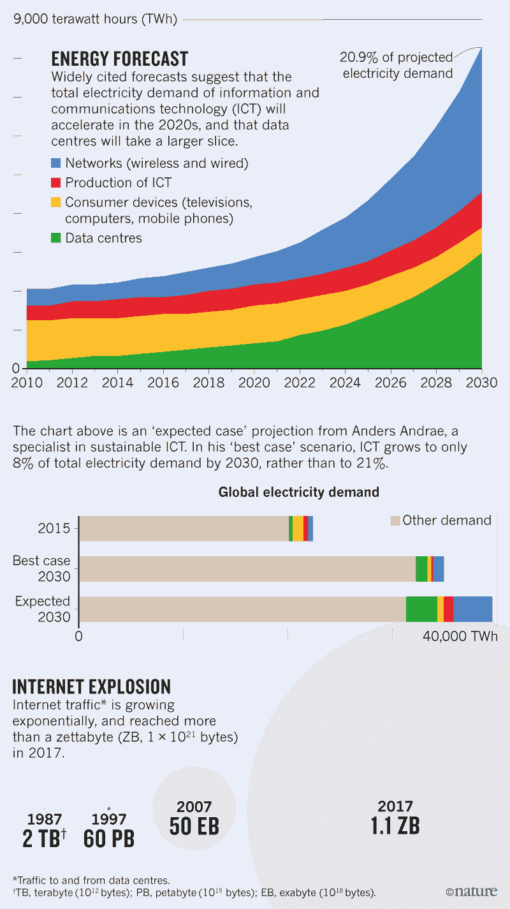
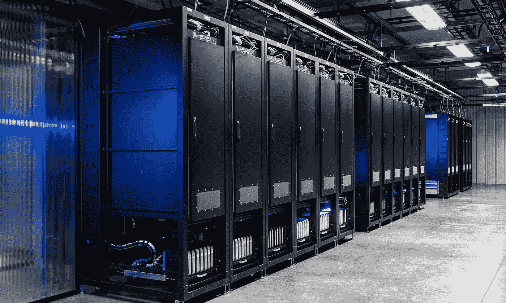

# 数据背后的巨额能源费用

> 原文：<https://medium.com/hackernoon/the-massive-energy-bill-behind-your-data-5d278bbe1ec6>

## 我们将如何抵消数据中心快速增长的功耗？超大规模摘下了低垂的果实。下一步是什么？

BalticServers.com [CC BY-SA 3.0 ([https://creativecommons.org/licenses/by-sa/3.0](https://creativecommons.org/licenses/by-sa/3.0))], from Wikimedia Commons

## 小测验:你身体的哪个器官消耗的能量最多？

当然是大脑。

你的大脑消耗了你每天摄入热量的 20%。

也许这解释了为什么我们很容易接受计算机在处理过程中会使用大量的能量，并释放出如此多的热量，以至于它们还需要二次能源来冷却它们？

我们越来越意识到支持我们最喜爱的社交媒体网站、电影和音乐流媒体服务以及在线购物的数据中心正在使用的能源量，并且预计在未来会使用:

Image from [Nature News](https://www.nature.com/articles/d41586-018-06610-y) ([source data](https://www.mdpi.com/2078-1547/6/1/117/pdf))

去年，全球数据中心估计使用了 200 太瓦时(TWh ),超过了一些国家的全国能源消耗，约占全球电力需求的 1%。数据中心对电力的需求预计将在未来几年内迅速增长，特别是如果计算密集型加密货币开采[继续增长](https://dzone.com/articles/cryptocurrencies-are-they-worth-it)。

据绿色和平组织称，这可能会对全球碳排放做出巨大贡献，因为数据中心使用的电力中只有大约 20%来自可再生能源[。](https://www.theguardian.com/environment/2017/dec/11/tsunami-of-data-could-consume-fifth-global-electricity-by-2025)

然而，大约 20 家互联网公司，包括像脸书、苹果和谷歌这样的大公司，已经承诺使用 100%的可再生能源。一些公司计划在其数据中心附近建造可再生能源发电厂，但在大多数情况下，他们是从电网供应商那里购买电力。

谷歌现在是全球最大的可再生能源企业购买者。数据中心正在吞噬爱尔兰等国家生产的可再生能源，这一事实有一些有趣的含义，《卫报》在 2017 年的一篇[伟大文章中对此进行了探讨。](https://www.theguardian.com/environment/2017/dec/11/tsunami-of-data-could-consume-fifth-global-electricity-by-2025)

悲观的模型预测，到 2030 年，数据中心的用电量可能会上升到全球总用电量的 8%左右。更温和的估计是，尽管他们的需求会增加，但效率的提高会抵消这些需求。让我们考虑一下。

# 有没有更好的方法来冷却数据中心并回收它们浪费的热量？

效率提高是可能的。超大规模数据中心效率极高，使用专为可扩展性(多达数十万台服务器)而设计的计算架构。

数据中心的用电效率(PUE)定义为运行数据中心所需的总能量(包括照明和冷却)除以计算能量。传统数据中心的 PUE 通常约为 2.0，而超大规模设施通过消除不必要的能源消耗(无视频显示器、无闪光灯)并按照纯粹的适用性设计进行建设，已被削减至约 1.2。

超大规模数据中心目前约有 400 个，占全球数据中心用电量的五分之一，但据估计，在几年内，超大规模数据中心将加快取代传统数据中心的步伐，并占国际能源机构报告的近一半。

超大型飞行器也通过改善冷却降低了它们的 PUE。在传统的数据中心，空调大约占能源账单的 40%(并消耗数十亿升水)。通过消除对压缩式冷却器和冷却塔的需求，在能源和水消耗方面都有环保效益。一种方法是使用较冷的地点作为数据中心(你好斯堪的纳维亚和冰岛),并向其中吹入凉爽的室外空气。其他方法包括自来水，这使得数据中心可以位于任何地方，并使用温水冷却。

在我最近参加的一次峰会上，有一个关于[将服务器浸入冷却液](https://submer.com/)的有趣讨论。

伴随着更好的冷却，数据中心产生的任何热量都可以得到更有效的再利用，例如，[用来加热邻近的建筑](https://www.cloudandheat.com/customer-stories/commerz-real/)，但是，因为热量不容易传播，这只有当数据中心可以放置在任何热量接收器附近时才有效。另一种方法是将多余的热量转化为电能，或者用它为冷却系统提供动力，冷却系统反过来可以用来保持数据中心的凉爽。

Image by [Navneet Srivastav on Pexels](https://www.pexels.com/photo/datacenter-server-449401/)

# 今后

虽然我们的大脑消耗了我们摄入热量的 20%,但相对而言，它们比电脑要高效得多。也许是时候接受一种需要，即通过超越硅来重新定义计算机本身以降低能耗了？

除了量子计算和混合模型，还有一些出路的想法，如反应化学计算，DNA 计算，水库计算和黏菌的使用(这是濒临最近的星际迷航系列！).其他方法是模拟动物大脑的神经元(神经形态计算)，这是 IBM 和高通正在尝试的，可能在人工智能的一些方面特别成功，如模式识别。这是未来一篇文章的主题，我期待着很快就能写出来！

请在回复中告诉我你的想法。我们正在走向一个没有硅的未来吗？哪里有可能节约能源？我们应该重新考虑我们对大规模数据中心的需求吗？