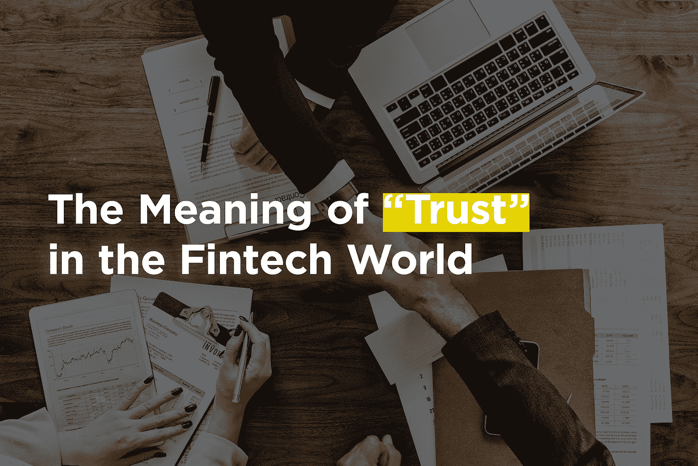

# 金融科技领域中“信任”的含义

> 原文：<https://medium.com/hackernoon/the-meaning-of-trust-in-the-fintech-world-9bfc2a5ccd6a>

信不信由你，困扰金融业的一个主要问题是过度依赖可信的第三方(或简称为“信任”)来完成交易，尤其是在数字支付方法被广泛采用之后。

可以说，信任现在是一种非常有价值的商品，事实上，金融领域的许多参与者都将其作为市场上的主要产品。

然而，出于多种原因，这并不是一件好事。

# 在提供金融服务的过程中，信任究竟是怎样的一个痛点？

“信任”这一棘手问题有四种表现方式:

## **1。集中式数据中心中用户数据的脆弱性。**

数据在提供各种金融服务中至关重要，尤其是在集中支付系统中。正是通过数据，服务提供商可以认证客户、衡量风险、确定信用评分或信誉、预测收入流，或者简单地说，使金融交易成为可能。

但是收集、存储和处理这些数据是一项非常复杂的任务。特别是，保持 it 安全意味着将技术高超、积极主动的不良行为者拒之于集中式数据中心之外。

利益相关者，尤其是消费者，必须相信那些受托管理数据中心的人会始终正确地完成他们的工作。

但最重要的是，他们必须相信这些数据管理员自己不会变成坏人。为了经济利益而滥用自己保管的数据的动机几乎总是存在的。

必须指出的是，在为许多金融服务提供动力的集中式系统中，消费者完全无能为力，不仅不知道如何保护他们的数据，也不知道如何使用这些数据。他们只需要相信有人有能力和良好的意愿。

不幸的是，数据泄露的情况如此普遍，滥用用户数据几乎是常态。

## **2。在交易中鉴别交易对手身份的困难。**

建立、确定和认证交易对手和利益相关者的身份是交易执行的核心。集中式和分散式支付系统都是如此。

很明显，从表面上看人们表现出的自我并不是一个好主意。这是因为人们总是有理由和动机去歪曲自己，尤其是在涉及价值的时候。

这就是为什么金融服务提供商必须依靠强大的系统来帮助识别他们的交易对象。“了解您的客户”(KYC)法规遵从性要求使这一需求变得更加必要。

但是为了使过程更容易，服务提供商和客户必须信任第三方验证者来提供准确的数据。他们还必须相信，他们收到的数据不会被以某种方式篡改。鉴于数字形式的数据(尤其是在集中式系统中)不是不可变的，这一点尤其重要。

金融机构建立身份的成本总是巨大的。根据管理咨询公司 Accenture 编写的一份关于身份和银行业务的[报告，金融机构将超过 30%的安全预算用于身份认证。](https://www.accenture.com/_acnmedia/Accenture/Conversion-Assets/DotCom/Documents/Global/PDF/Dualpub_9/Accenture-Future-Identity-Banking.pdf)

## 3.难以为数字签名提供合法性。

即使金融服务实现了实质性的数字化，如果没有人工执行某些批准步骤，仍然很难批准交易，尤其是涉及大量金额的交易。

在大多数系统中，有必要让几个受信任的人有能力确保交易是合法的并符合要求的规范。虽然这是一个有用的预防措施，但它会减缓价值的移动和交易的完成。

但更重要的是，它使得在不与可信的监督者和其他人共享个人身份信息的情况下签署交易几乎是不可能的。这增加了侵犯隐私的风险。

## 4.交易结算和对账缓慢

由于需要值得信赖的集中服务商来人工结算跨境交易和进行对账，即使互联网加快了信息的流动，但服务的提供速度却很慢。

用户通常会在周末或公共假期等到下一个工作日才能确认或批准他们的交易。

即使交易完成后，可信的第三方也可能需要几周时间来进行对账，这使得在错误新鲜且更容易修复时，很难实时发现错误。

# 那么，在金融科技领域，信任的意义是什么？

从可信的第三方获得不同形式的公证、审计或批准服务的累积成本使得金融服务变得昂贵。[根据比尔·T4·梅林达·盖茨基金会资助的世界银行的报告](https://www.worldbank.org/en/news/press-release/2018/04/19/financial-inclusion-on-the-rise-but-gaps-remain-global-findex-database-shows)，在全球 25 亿没有银行账户的成年人中，超过 26%的人认为交易成本是他们的原因。

在金融科技领域，有多种实现方式。但是让我们从它的实际含义开始。

一般来说，信任意味着公平和透明地对待客户，包括交易费用。

然而更实际的是，这意味着将数据保护和用户控制交给消费者。

这也意味着利益相关者有一个单一的真实来源，他们可以通过这个来源来确定与他们做生意的人的身份。这意味着有能力证明人们是他们所说的人，而不暴露个人数据或有可信的第三方为他们担保。

这也意味着消费者能够跨平台携带他们经过验证的身份、信用评分和个人资料，能够证明数据是可信的。

信任还意味着实时结算和核对交易，以便所有利益相关者在事情没有得到适当完成、执行或记录时能够注意到。

特别是，这意味着利益相关者可以访问不可变的共享分类帐，在那里他们可以看到交易结算和对账。

# 金融科技到底是如何实现这种信任的？

金融科技(fintech)就是利用创新来解决消费者在获得金融服务时面临的痛点。这可以通过现有机构或作为挑战者金融机构建立的新创公司来实现。

获得这种新型信任的最终目标是改善服务交付、确保交易安全、保护用户数据并降低相关成本。

非常有效地实现这一点的技术是分散式总账，通常被称为区块链。

区块链允许以不可变状态存储数字数据。该技术还使许多利益相关者能够安全地访问他们通过点对点网络上的实时共识维护的共享账本。

不过，关于区块链的一个极其革命性的概念是，通过公钥-私钥加密，用户数据在共享的公共账本上被加密。完成后，只有数据的所有者才能授予访问权限。

即使这样，数据的可信度也可以在不公开其细节的情况下得到证明，因为即使是数据的所有者也不能更改它。

在[区块链](https://hackernoon.com/tagged/blockchain)上数字数据的不变性使得用户可以用他们已经被证实的身份跨平台移动。那些交易或接触到该身份的人不必信任该所有者，因为他们可以容易地且没有显著成本地证明其可信度。

# 超越区块链和分散分类账

虽然区块链系统是分散的，但不同类型的分类账目前是孤立的系统。有超过 3000 家独立的主要公共和私营区块链，而且这个数字还在快速增长，每年都有新的项目上马。

与此同时，认为中央支付系统会很快过时是不现实的。这意味着需要解决方案来推动行业提高效率，解决垄断问题，降低整合的复杂性。

这也意味着，为了让价值在全球范围内自由流动，不同的支付和价值转移系统必须互通。换句话说，它们必须是某种有价值的“万维网”的一部分。

创建这个*价值互联网*的快速解决方案是让可信的第三方介入平台之间。不幸的是，这将我们带到了依赖可信第三方来完成交易的最初问题。

避免这种循环正是像 [GEO Protocol](https://geoprotocol.io/) 和 Interledger 这样的开源项目正在努力解决的问题。

他们提供的一般解决方案是创建基于信任线的协议，作为跨不同平台的价值路径，而不需要信任集中的实体。这尤其可以通过 IOU 架构来实现，IOU 架构依靠国家通道和类似技术来结算跨链交易。

特别是，它涉及利用点对点互动中存在的信任，这就是所谓的“传递性信任”简单来说，就是我们信任家人，最好的朋友，同事等等。但是，我们也信任那些我们的家人、朋友和同事信任的人。如果我信任我的老板，我也会信任老板信任的人。这创建了信任链或路径，价值可以在其中流动，而不需要依赖第三方来确定这个或那个网络参与者的可信度。

这些基于信用额度的协议保证了不同区块链和集中支付系统之间的可传递信任，可以像互联网赋予信息流动一样赋予价值流动。最棒的是。要实现这一点，我们不需要信任庞大的中央集权实体。

## 遵循 GEO 协议:

[ [媒体](https://medium.com/geoprotocol/) | [推特](https://twitter.com/geo_protocol)|[GitHub](https://github.com/geo-protocol)|[Gitter](https://gitter.im/GEO_Protocol/)|[电报](https://t.me/geoprotocol)|[LinkedIn](https://www.linkedin.com/company/geoprotocol/)|[YouTube](https://www.youtube.com/channel/UC3jEvQvZAmCUXa7dCoX9_Lg/)]