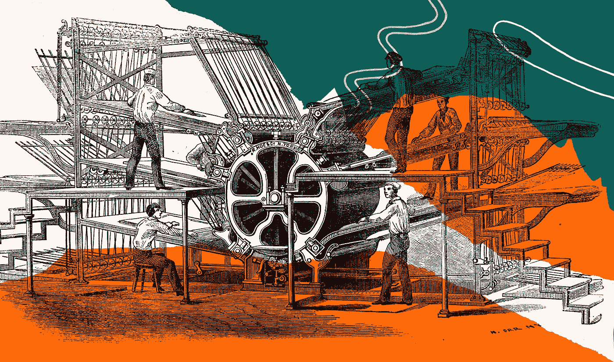
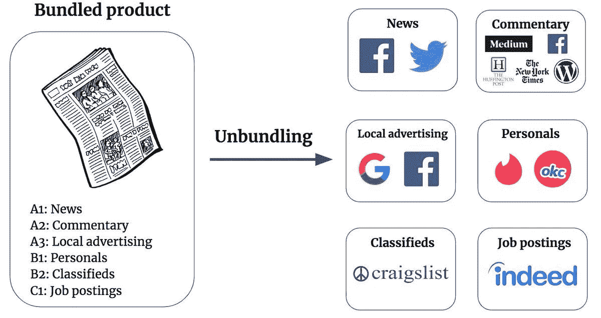
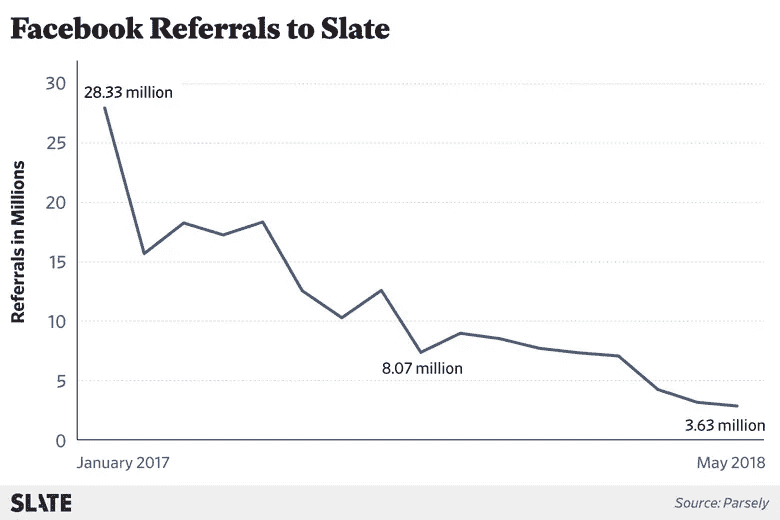

# 媒体产业崩溃了:平台如何修复它

> 原文：<https://medium.com/hackernoon/the-media-industry-is-broken-how-platforms-can-fix-it-df31f9c1f40c>

## 通过恢复人与人之间的联系，融合媒体和技术来修复行业

回顾过去几十年的媒体行业，我们可以有把握地说，它一直相对稳定。主要参与者没有改变。他们与金融家、记者和各种内容制作者建立了关系。直到最近，这个行业结构看起来还会永远存在。

但是现在，事情发生了变化。在行业内，变化的速度是如此之快。未来看起来不确定且令人恐惧。当人们谈论这个行业时，他们谈论疯狂，不稳定和破碎的职业生涯。权势集团不再像过去那样控制行业了。权势集团的衰落正在催生一种新的互联网本土公司，它们遵循着权势集团无法与之竞争的新剧本。

Repackaging a market in either direction is a timeless and often disruptive business model. Quote and img by Haseeb Qureshi ([https://twitter.com/hosseeb](https://twitter.com/hosseeb))

信息匮乏的老派媒体环境塑造了整个行业的结构。然后这一切都被数十家科技创业公司打乱了。

首先，技术入侵者夺走了观众，然后他们得到了所有的广告商。他们扰乱了媒体行业的基本商业模式，但无法扼杀新闻业。人们仍然需要高质量的信息和从事研究、遵循标准并以可消费的方式呈现信息的新闻权威。

By Ben Thompson ([https://stratechery.com/](https://stratechery.com/))

虽然出版社作为一种商业模式可能已经崩溃，但对精选信息的需求并没有消失。记者也没有。

如果专业记者和投稿人只是不再需要出版商了呢？他们能建立个人品牌并引领新一波媒体企业家的崛起吗？

**可能会也可能不会**。这条路既危险又阴暗。我们经历过，我们知道那些一个人的媒体创业公司接下来会发生什么。

# 老式工具

2010 年，我创建了我的第一本在线杂志，因为我很幸运有一个同意免费编写所有代码的程序员朋友。

在得到一点资金帮助后，我们开始建立自己的 CMS，把我们的积蓄投资给开发者，比我们付给制作我们主要内容的真正的记者多得多。精神错乱！

2019 年，它仍然运行在第一个 CMS 的修改版本上。在那里改变任何东西都是沉重的、不灵活的和极其昂贵的。但是我们保留它。为什么？因为我们拥有它。我们是如此的依恋！我们在开发上花了一大笔钱。我总是问自己，有什么选择？

几乎所有东西都有大量的“无代码”产品。我是 [Readymag](http://readymag.com) 的忠实粉丝，我总是用它来创建演示和着陆。它能代替我们的 CMS 吗？绝对不行。适用于着陆的方法，不适用于大量的日常新闻。Wordpress 怎么样？嗯，它很旧，设计很差，通常需要大量定制。哦，当然我们可以埋葬在脸书创造你的媒体的想法，因为它不可预测的算法。实话实说:说到在线媒体，除了你自己的 CMS，没有便宜、漂亮、功能齐全的替代品。至少，我们还没找到。

# 老派发行

最终，我们成为该国领先的生活时尚杂志之一，每月读者超过 100 万。花了多少时间？将近 10 年的有机增长。我必须说，在他们改变他们的算法，从根本上降低我们的参与度之前，我们得到了大多数脸书观众。

我明白，如果没有大量的流量购买，新杂志几乎不可能达到同样的受欢迎程度。忘了免费关注吧。除了由一些随机影响者和像 **Medium** 这样的分发平台培养的罕见病毒案例，你总是不得不为一点点参与度支付可观的费用，我们自己的追随者甚至看不到我们发布的内容。

# 老派货币化

10 年后，我们的知名度成为了一个巨大的竞争优势。然而，这在经济上有回报吗？嗯，不是。如果你现在想赚钱，不要做媒体。事实上，我们最大的问题不是 CMS 或分销:而是销售。你以前的忠实客户不断将你的 CPM 与 Instagram 和脸书进行比较，告诉你你对他们来说太贵了，他们通过投资上下文广告获得了更多的客户。

*他们到底为什么需要你？*

另一个问题是寻找销售人员。你必须接受比这家新成立的科技创业公司少赚两倍的钱，付出更多的努力。不可能！

当我抱怨这种情况时，媒体经理建议将我们的记者转变为销售人员。记者抗议。首先，这不是他们的工作。新闻的质量和客观性会受到影响。第二，他们会过度工作，直到筋疲力尽，永远离开媒体。

# **我们创造了一个恶性循环:你出售人们的注意力，但你仍然要为注意力付费，而你的广告商宁愿不付钱给像你这样的中介，因为你无论如何也吸引不了注意力**

打破这种恶性循环的唯一方法是从少数仍然相信媒体的风投那里筹集资金。我说的是第一个英语世界中少数几家获得融资的媒体初创公司，比如 Hassle 和 Axios。问题是媒体风投和支持机构也效率低下。美国唯一支持媒体企业家的加速器 Matter.vc 于去年不幸关闭。

我们应该接受它，一劳永逸:当前的老式媒体模式不再适合你的业务。是的，你没听错，[你的媒体业务将无法挽救](/@joshuatopolsky/your-media-business-will-not-be-saved-1b0716b5010c)！

# 平台能帮助我们节省媒体吗？

自从剑桥分析丑闻以及媒体对社交媒体对我们生活的负面影响的反弹以来，用户已经成群结队地从脸书蜂拥而至。事实上，根据皮尤研究中心的调查，多达 40%的美国用户已经停止查看他们的账户，有时会持续数周。

## 我们有各种各样的内容制作者没有工作，我们有观众离开有史以来最大的社交网络。不是很配吗？

他们能去哪里？

Medium 大概是最值得注意的地方。这是第一次尝试为创作者提供必要的基础设施。只有两个问题。首先，货币化模式非常不灵活。不能添加原生广告或任何品牌植入。除了订阅和基于社区的收入分成，什么都没有。第二，媒体拥有你的内容。如果它消失了，你的内容也会被删除。还是太集权了。

苹果新闻收入分成在某种程度上看起来是一个可能的解决方案。应用程序仍然非常有限:货币化的可能性非常少，苹果公司完全控制着发行。此外，他们只与知名出版商合作，而忽略了所有独立的内容创作者。

Reddit / Twitter 作为大众对内容的利他监管反映了某种程度上的早期互联网文化。虽然它确实很棒，但 Reddit 和 Twitter 提醒人们，未经加工的钻石需要大量的时间和特定的技能来理解和组装一个一致的故事。

# 媒体行业最大的机会是窃取一个平台商业模式

作为出版商和内容制作者，我们不应该反对自己搭建平台，用付费墙来保护我们的领地。如果我们想赢得这场战争，我们必须团结起来，制造一种终极武器，一颗注意力原子弹，一台智能内容生产机器。它的外观和工作方式都像一个平台:提供内容并从中获利。

想象一下，人们在为出版商和内容创作者打造的平台上管理广告商赞助的话题。第一个光荣的 P *平台出版商*。

待续...

*想了解更多？
写我们在[future@wig-wag.co](http://future@wig-wag.co)的*。

