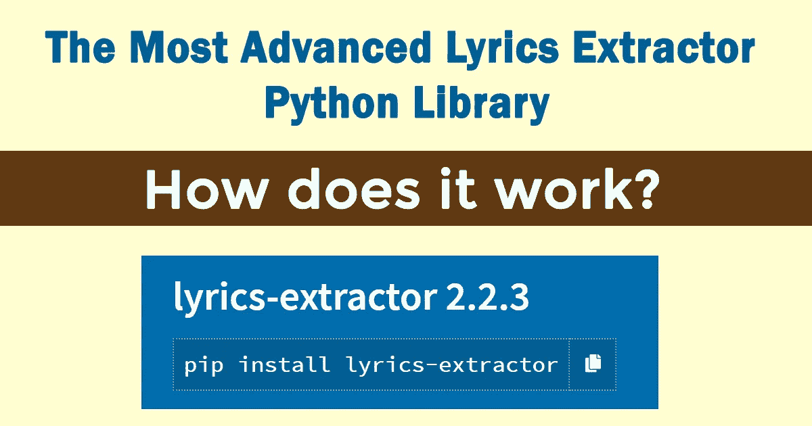

# 最先进的歌词提取 Python 库解释

> 原文：<https://medium.com/hackernoon/the-most-advanced-lyrics-extractor-python-library-explained-f03fdedd5f41>



几个月前，我在开发一个聊天机器人，我想给它添加一个很酷的功能。我想获取用户请求的歌曲名称的歌词，并在我的 WhatsApp 聊天机器人上发送回来。[这里有一个用 Python 构建多功能 Slackbot 的深度指南](https://hackernoon.com/a-guide-to-building-a-multi-featured-slackbot-with-python-73ea5394acc)

当我在搜索一个 Python 库来提取歌曲的歌词以将其集成到我的 WhatsApp 和 Slack chatbot 时，我找不到任何只能在其参数中接受歌曲名称的库或 API。我测试的 API 和库要求准确拼写歌曲名和艺术家名，以便获取歌词。即使传递了所有这些信息，仍然有一些歌词在 API 和库中不可用。

这是我决定写一个算法来从各种网站上抓取歌词的时候，即使是用户传过来的任何**拼错的歌名**。

# **这个图书馆是如何运作的？**

我们使用 BeautifulSoup，并请求 Python 库从我们选择的几个网站上抓取歌词。

**注意:**如果你打算将这个库用于商业目的，那么我要求你看一下这些网站的条款和政策，只从允许其内容被商业使用的网站上抓取歌词。

我们从创建自己的[谷歌定制搜索引擎](https://cse.google.com/cse/create/new)开始。然后，我们从我们的[需求](https://pypi.org/project/lyrics-extractor/)中提供的网站列表中添加网站 URL，以获取所请求歌曲名称的歌词。

您可以自由定制您的自定义搜索引擎，优先选择您喜欢的关键字，排除任何网页或打开“安全搜索”功能。

**注意:**请不要打开“搜索整个网络”功能，因为目前无法从搜索结果中出现的任何随机站点进行抓取。

现在复制您的引擎 ID 和 [API 键](https://developers.google.com/custom-search/v1/overview)，并像这样实例化该类:-

```
extract_lyrics = Song_Lyrics(GCS_API_KEY, GCS_ENGINE_ID)
```

**记住:**不要忘记用 API key 替换 GCS_API_KEY，用收到的引擎 ID 替换 GCS_ENGINE_ID。

您可以通过在类函数中传递歌曲名称来获取歌曲的标题和歌词，如下所示

```
song_title, song_lyrics = extract_lyrics.get_lyrics('Sheap fo you')
```

只要您请求传递的歌曲名称的歌词，就会在我们刚刚创建的自定义搜索引擎上进行搜索。

如果实例化类时传递的 API 键和引擎 ID 是正确的，那么使用 Google 建议的结果检查歌曲名称是否有拼写错误。在自动纠正拼写错误的歌曲名称后，获取结果。

我们从第一个搜索结果中提取标题和链接，因为根据 Google，它是与用户查询最相关的搜索结果。是啊，谷歌搜索算法的巧妙运用。😃

一旦我们得到链接，我们从链接中找出网站名称，运行正确的刮刀从其中提取歌词。

我们使用 BeautifulSoup 提取网站的 HTML，并通过从适当的类中选择它来进一步提取内容。

最后，如果找到歌曲名称和歌词，我们将返回给用户，否则我们只返回“没有找到{song_name}的歌词”。

# 主要问题

从不同网站抓取的一个主要问题是我们使用的类可能被改变或修改，或者整个 DOM 可能被网站修改。这将直接影响我们的 scraper，因为它将无法获取歌曲歌词，并且它将简单地返回 **No lyrics found** ，即使歌曲名称存在歌词。

为了解决这个问题，我们将不得不定期检查刮刀是否适用于所有添加的网站，如果出现错误，就相应地进行更新。

**你对我们如何解决这个问题有什么想法吗？在你的建议下面评论。**

# **结论**

在这篇文章中，我试图讲述我的 [**歌词提取器**](https://pypi.org/project/lyrics-extractor/) Python 库是如何在不需要艺术家姓名和正确拼写的歌曲名称的情况下工作的。该算法确保向用户返回最相关的歌词。如果发现不同歌词的歌曲名称相同，则选择最流行的一个。

但是，您可以控制显示的搜索结果，这可以很容易地从您的自定义搜索设置中进行调整，以满足您的需求。

最后，我想说，一定要尊重网站的服务器，请不要一次用大量的请求轰炸，否则你肯定会得到一个错误。

如果你发现一些 bug 或问题，可以随时在 [**GitHub**](https://github.com/Techcatchers/PyLyrics-Extractor) 上提出问题。我将非常感激，如果你提出一个修复错误或增加新功能的公关。

## 非常感谢你花时间阅读这篇文章！如果你喜欢它，请给它一些掌声，因为它会帮助更多的人看到这个故事。如果你喜欢这个项目，可以看看 GitHub 上的这个资源库。❤