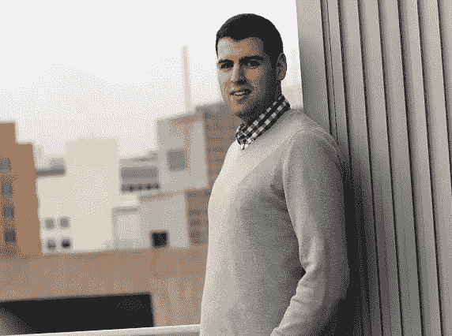

# 数字游戏:一位麻省理工学院的博士如何进入 200 万美元的种子期

> 原文：<https://medium.com/hackernoon/the-numbers-game-how-an-mit-phd-pivoted-his-way-into-a-2-million-seed-round-d80fe4ce6846>

詹姆森·图尔第一家公司的投资者。三个月后，当他带着一个全新的项目， [Fritz](https://www.fritz.ai/) 再次出现时，他一定很惊讶。

但詹姆森的快速转向并没有阻止他迅速为弗里茨筹集到 200 万美元。事实上，詹姆森认为他在 Wherehouse 的经历，以及他在那里建立的小而专注的团队，帮助他为自己的新公司筹集了资金。

在[的“我是如何筹集资金的”播客](https://soundcloud.com/user-2586856/how-i-raised-it-with-jameson-toole-of-fritzai-on-2518)的一集里，我请詹姆森分享一些关于是什么让他转向 pivot，以及他如何能够在不出错的情况下连续为两家公司获得资金的见解。

**Fritz 是什么，你为什么要创办这家公司？**

[Fritz](https://www.fritz.ai/) 帮助开发者将机器学习或人工智能模型放到他们的移动应用中。我们正在这些领域看到所有这些进步——例如，在图像识别和语音识别的神经网络方面——并且有加速的人工智能专用芯片进入设备。如果你买了新的 iPhone 或新的 Pixel，他们实际上已经有了特殊的芯片来处理这些机器学习算法背后的数据结构。

所以，我们实际上可以开始把这些神经网络和模型从云中取出来，直接放到设备上。他们跑得更快更便宜，而且更私密。

**你是怎么想出这个主意的？**

我在密歇根大学学习物理和经济学，然后在麻省理工学院攻读博士学位，在那里我将这两个学科结合起来。毕业后，我在波士顿的一家消费移动技术公司工作了一年多，组建并管理了一个数据科学团队。然后我就很想离开去尝试一些东西。这就是通向 Wherehouse 的原因。

**你是怎么让它离地的？**

我和我的联合创始人大约在两年前开始创业。第一年，我们将我的一些博士研究成果商业化，并启动了业务，这非常有趣。

但大约一年后，我们认为可能会有另一个增长潜力更大的市场值得我们去追逐。所以当我们开始看到人们正在建造一些令人惊叹的东西时，Fritz 的想法就进入了我们的脑海，比如 Snapchat 围绕增强现实添加的东西，或者无人驾驶汽车的发展。在经历了大约六个月的自力更生之后，我们才在一个让我们感到舒适的地方长大。

你筹集了多少钱？

我们做了一轮，正式的种子期，在大约 6 个月的时间里，我们从机构投资者那里筹集了 200 万美元。

**你有主要投资者吗？**

是的，是纽约州的 [Eniac Ventures](http://www.eniac.vc/) 。他们是很棒的人。然后我们有了[未锁定资本](https://uncorkcapital.com/)，两个辛迪加完成了这轮融资。

这实际上是我给人们的一个建议。我们强调，在找到主要投资者之前，我们不会试图完成这轮融资。有些人喜欢走出去，试图用软承诺来建立一些势头，我们在第一笔业务中就尝试了这种做法。

我们实际上经历了两个独立的过程。你仍然需要做同样多的工作来获得小财团的承诺，就像获得大额支票一样，但这太多了。对于弗里茨，我们明确表示，“让我们先找到一个主要投资者。”

**你是如何确定哪些投资者该谈，哪些不该谈的？**

我们非常狭隘地聚焦于以种子为主要业务的投资者。偶尔，做 a 和 b 的较大基金会写种子支票，但那里有一些信号风险。这是一种预期，投资者会做你的 A，如果他们不这样做，这是一个很大的负面信号给其他投资者。

这也有助于他们和你在一起的时间。如果你是一个更大的基金，你在一家公司投入了 1 亿美元，在另一家公司投入了 200 万美元，猜猜谁会得到你的大部分时间？

**你是如何识别通常主导交易的人的？**

不要仅仅因为一个投资者的网站说他们在一个你不在的领域，就回避与他们交谈。在大多数情况下，他们正在寻找一个好的交易，他们会和你说话。我们仔细研究了我们感兴趣的每一家公司，通过查看他们的简历、背景以及他们之前主导的交易来寻找合作伙伴。然后就差找个热情的介绍了。

你的漏斗中有多少家公司？

在我们两家公司之间，我想大概有 50 家公司。第二次，我们知道更好地瞄准谁，这很好。公司越来越少，但仍然很多。

你会回到你第一次推荐的那些人身边吗？

是的，那对我们来说是一次积极的经历。一方面，投资者可能会有点担心，你为一个想法努力了一年，然后就放弃了。但是大多数风投认为我们真的致力于做一些事情是很棒的，所以我们回到他们那里没有任何问题。

**从推出第一家公司到推出 2.0 有多长时间？**

我想大约三个月。

**你是如何挑选 Eniac 作为主角的？你经营的是一个竞争过程吗？你在交易中有好的竞争吗？**

那实际上是一个有趣的故事。维克·辛格是我们在那里的合伙人，他实际上是我们投给弗里茨的第一个投资者，是我们的第一个版本。我肯定那是一个糟糕的推销。

但维克不久前决定，他需要了解会议桌上企业家的一面。他实际上已经开了一家公司。事实证明，他的公司正好有我们试图解决的问题，所以它真的很快就成功了。我们仍在运行一个非常正式的流程，但有一个同时也是创始人的投资者让这变得非常明显。

**然后你做了什么？**

我们联合达成了这笔交易。以我的经验来看，这的确是真的，所有的动态都在那之后翻转。得到领导的“是”是你经历过的最困难的事情，然后剩下的事情就相对容易了。所有的公司彼此都有关系。他们有喜欢打交道的公司，也有不喜欢的公司。我们通过我们的主要投资者与他们中的许多人取得了同步。

不过，我会小心听取投资者的介绍，因为这存在信号风险。如果一个投资者在没有投资的情况下把你从他们的公司转到另一家公司，这可能会引发一些危险信号。

**当你让 Eniac 担任领导时，你的公司有什么样的衡量标准？听起来你几乎是概念性的，对吗？**

我们有一个原型，而且我们已经确定了一个由三名工程师组成的团队，我们过去曾与他们合作过。他们已经准备好了，就等着我们付钱给他们。我认为有一个真正强大的创始团队和一个准备好立即投入运行的工程团队就足够了。

显然，如果你是一个创始人，就吸引力而言，尽可能等得久一点。如果一切正常，你的公司每天都会变得越来越有价值。就我们而言，我们已经自举了足够长的时间，我们看到了市场的走向。我们真的很想赶在它前面。

**那一轮融资最难的部分是什么？**

最难的部分是得到一个肯定的回答，让领导就位。运行流程[和真正完善你的故事](/foundersuite/how-to-raise-capital-building-a-funnel-running-a-process-6739ac219ded)需要做很多工作。我们每个公司的推介材料都有 14 或 15 个版本。

去见创始人，记下他们问的所有问题，然后听取汇报，每次都换一副牌，这感觉很棒。作为一名企业家，你需要不断地这样做，这需要大量的工作。

我想我已经打败你了！在我们的种子期结束时，我已经是我们的第 42 个版本了。对未来的总体资本战略有什么想法吗？你预计必须筹集大量资金，还是尽可能保持精简和吝啬？

我们筹集了 12 到 18 个月的资金，这就是我们现在正在做的。如果有意义的话，我们显然会寻求更多的资本，但我们的目标是达到一个我们可以实际有效地配置资本的地方。那是加注的最佳时机。

**你在考虑获得一定程度的客户吸引力吗？**

当你的流量如此之大，以至于你必须让其他工程师来确保一切正常运行时，当你有如此多的功能需求，以至于积压的需求无法得到足够快地拒绝时，或者当你有一个运作良好的营销渠道，以至于你花的每一美元都可以得到 3 美元、4 美元或 5 美元的回报时。

很明显，在这些情况下，你应该往火上浇油，加大马力。在此之前，尽可能保持苗条，尽可能降低燃烧率。

**如果让你重来一次，你会给自己什么建议？**

哦，这是个好问题。不要试图在夏天筹集资金。也许这只是波士顿的事情。每个人都在享受美好的天气，所以在 7 月和 8 月很难找到人。我们在六月和七月开始了所有这些对话。有一次，我想，“我要租一艘船，在楠塔基特找到所有这些风投，然后把他们推销到那里。”

那可能有道理。如果人们想检查你，它只是 Fritz.ai，对不对？

没错。我们还有一份名为 [Heartbeat](https://heartbeat.fritz.ai/) 的社区出版物。如果你有一个符合人工智能的心跳，我们会发布任何与机器学习和移动开发的交集有关的内容。我们有一个伟大的贡献者计划，所以我们会付钱给你写一个伟大的职位，像其他开发者开始使用这种东西的指南。

我的曾祖父来自德国，绰号叫弗里茨。这个名字有什么故事吗？

这是一个我们可以轻松获得的五个字母的域名，我们的工具肯定有一个方面可以帮助你找出你的机器学习算法在数亿台设备上存在的问题。希望它易于人们记忆，我们将确保您的应用程序不会出现故障！

*内森·贝克德是 Foundersuite.com***的首席执行官，这是一个软件平台，自 2016 年以来已经帮助用户筹集了超过 10 亿美元的种子和风险投资。这个 Q & A 是根据 Foundersuite 的* [*我如何筹集它的播客*](https://soundcloud.com/user-2586856) *的一集改编的，一个关于创业公司创始人如何筹集资本的幕后故事。**