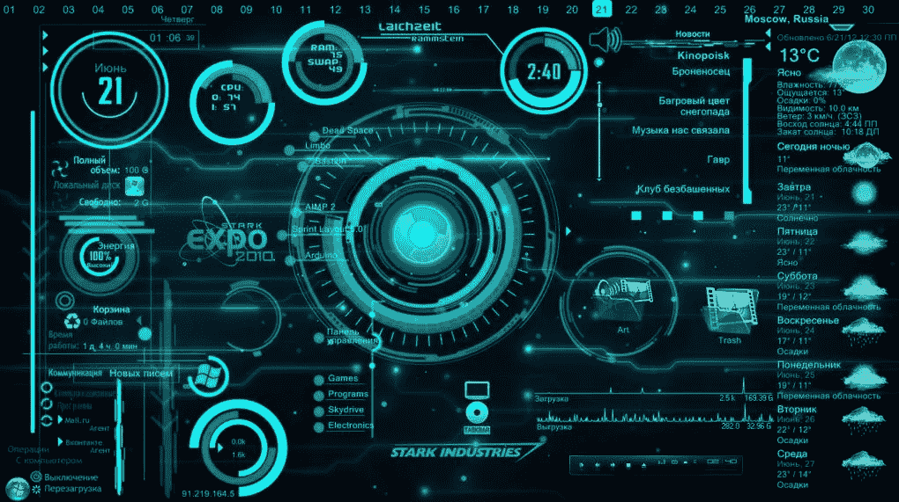

# 通往人工超级智能的道路

> 原文：<https://medium.com/hackernoon/the-path-to-artificial-super-intelligence-5df1767a9815>

Photo by [Tony Webster](https://unsplash.com/photos/F9o7u-CnDJk?utm_source=unsplash&utm_medium=referral&utm_content=creditCopyText) on [Unsplash](https://unsplash.com/search/photos/robot?utm_source=unsplash&utm_medium=referral&utm_content=creditCopyText)

人工智能的新春天是我一生中计算机领域最重大的发展。每个月都有令人惊叹的新应用和变革性的新技术。但这些强大的工具也带来了新的问题和责任。”
——谢尔盖·布林

谢尔盖·布林说得再清楚不过了。被称为十年技术的人工智能已经成为每个未来学家的口头禅。从[客户支持聊天机器人](http://www.kommunicate.io)到智能助手，人工智能已经开始改变众多的行业垂直领域。

如果你深入研究一下，你会注意到人工智能已经开始在几项任务中超越人类。就像[比肿瘤学家更好地检测癌症](https://drive.google.com/file/d/0B1T58bZ5vYa-QlR0QlJTa2dPWVk/view)或者翻译语言或者[击败围棋(中国跳棋)世界冠军](https://storage.googleapis.com/deepmind-media/alphago/AlphaGoNaturePaper.pdf)。这些成就为未来定下了基调。智能机器人和超人不仅仅是科幻电影的一部分。

Jarvis, Iron Man’s super intelligent assistant, [Marvel Comics](https://www.marvel.com/)

这被称为人工超级智能，机器的认知取代了人类的认知。想想《漫威》中的贾维斯或奥创，阿诺德·施瓦辛格的《终结者》或《她》中的萨曼莎。

与普遍的看法相反，ASI 与现实相去甚远。事实上，它可能需要 15-20 年(最好的情况)到几个世纪才能实现！在这篇文章中，我们将着眼于实现 ASI 的道路，一些当前令人兴奋的项目和 ASI 拥有的危险。

为了理解上述所有观点，我们需要了解为什么人工智能会突然兴起，以及人工智能研究的现状。让我们马上开始吧。

# 是什么带来了 AI 开发的突然繁荣？

人工智能一词是在 20 世纪 50 年代创造的。但该领域的所有重要工作都始于 2000 年代末。从那以后，人工智能领域的工作有了飞跃。21 世纪初发生了什么？

答案围绕[数据](https://blog.wiredelta.com/future-creating-anything/)展开。数据是人工智能的食物，2000 年见证了比以往任何时候都更大、更好的数据集的创建。人们开发了用于文本分析的大型语料库、用于图像和视频处理的巨大数据集。这极大地提高了人工智能算法的准确性。

A sample of image dataset from [Stanford Vision Lab](http://vision.stanford.edu/)

大约在同一时间，Nvidia 发布了名为[图形处理单元](https://www.nvidia.com/en-us/about-nvidia/corporate-timeline/)(GPU)的高级数据处理单元。这为组织和个人创造先进的人工智能模型和算法提供了动力和速度。

这两者结合在一起，产生了深度学习。深度学习是机器学习算法的高级形式。它非常专注于“学习”部分，向算法提供数据，并让它们从中“学习”。

*“我相信深度学习是我们迈向真正人工智能的最佳途径。”
——*[*吴恩达*](https://www.andrewng.org/) *，首席科学家，百度*

从此，艾再也没有回头。今天，人们可以轻松地购买 GPU，获得大型数据集来训练他们的人工智能算法，并开发令人难以置信的技术，而无需掏腰包。

# 人工智能的现状

然而，目前状态下的人工智能远非超级智能。假设如果一个来自未来的智能机器人转动时间车轮，来到今天的旧金山与它的前辈见面，它会怜悯他们的原始性。想象一下几万年前遇到来自西非的尼安德特人。

事实是，大多数人工智能模型能够单独做一件事。如果你使用一个翻译语言的程序来把语音转换成文本，它将会悲惨地失败。另一方面，人类可以做过多的任务。人类可以很容易地将英语翻译成西班牙语，并将语音转换成文本。这就是为什么人工超级智能是一个遥远的未来。人工智能应该能够一边哼着埃尔顿·约翰的歌一边煮咖啡，还能给他所有的机器人伙伴写圣诞明信片。

AI 中有一些新的项目和模型开始同时执行一系列不同的任务，如[多任务学习](http://ruder.io/multi-task/)和[迁移学习](https://machinelearningmastery.com/transfer-learning-for-deep-learning/)。然而，这些算法只有在任务集紧密相关时才会表现得更好。例如从文本片段中找到情感并从中提取命名实体。

# ASI 的障碍

没有克服挑战，就不会有伟大的成就。人工智能是一个相对较新的技术领域，它有自己的障碍。我们来讨论一下其中最突出的。

## 解决复杂的问题

创新和研究的作用对人类来说至关重要。鉴于人工智能仍处于起步阶段，它还没有解决许多非凡的问题。我同意，聊天机器人极大地帮助了客户互动，我们还有一部由电脑程序导演的电影《T2》。真正的问题是，你如何利用人工智能解决更大的问题，如全球变暖、太空探索、贫困和许多其他问题。

## 大量的数据

训练任何 AI 算法，都需要大数据集。为了很好地训练它并提高它的准确性，你需要更大、更干净和处理得更好的数据集。然而，整理大型数据集并保持良好的质量并不容易。这里的挑战是用较少的数据训练和部署算法。因此，这是发展人工智能最重要的障碍之一。

## 数据处理能力

如前所述，AI 需要大量的数据。大数据需要更好的数据处理能力。深度学习革命席卷全球的原因是 GPU 的出现。它给了独立研究人员和小型创业公司尝试人工智能的权力。并非每一项发明都存在于在数据中心有足球场大小的科技巨头工作的人的头脑中。构建 ASI 需要的数据比我们想象的要多得多。我们如何在不花费大量金钱的情况下带来令人印象深刻的处理能力？

谷歌可能有答案。最近，他们发布了 [TPUs](https://cloud.google.com/tpu/) (张量处理单元)，用于加速机器学习任务。但目前，TPU 的产量有限。

## 全新的数据呢？

假设你已经训练了一个算法来识别这些形状——正方形、圆形和直线。该算法可以非常精确地做到这一点。但是，如果你想让算法正确识别矩形、三角形和五边形，你必须从头开始重新训练。请注意，训练算法是一个漫长的过程。这种增量数据更改在现实世界的问题中非常频繁。因此，调整新数据是超级智能算法的主要关注点。

## 深度学习是一个黑匣子

深度学习主要在人工神经网络上工作，人工神经网络模仿人类神经网络的行为进行学习。我们有大量基于类似原理的其他算法。但是我们还没有完全理解人工神经网络实际上是如何工作并得出解决方案的。我们不能有效地改进、控制和提高我们不完全了解的事物的效率。

# 致力于人工超级智能

全世界的研究人员都在致力于开发更智能的人工智能。通往人工智能的道路是由机器应该采用人脑的工作方式并取代它的想法铺成的。

从长远来看，不可避免的是，ASI 将在各方面远远超过我们。人脑所能达到的成就有化学和生物学的界限。对于超级聪明的有知觉的人来说没有。随着时间的推移，它只会变得更聪明、更好。

## 模仿人脑

迈向人工超级智能的第一步将是提高机器的认知能力。许多项目正虔诚地致力于模仿人脑，并赋予机器认知能力。这方面的真正进展可能不会公开，因为大多数公司和组织出于竞争优势的考虑不会透露太多。

然而，蓝色大脑项目就是一个例子。这是 EPFL 的一项倡议，试图实现哺乳动物大脑的完全数字化重建。该项目有望启发我们更多关于意识以及如何数字化植入意识的知识。目前，他们已经模拟出蜜蜂大脑大小的突触。

A simulation of the cortical microcircuit. Credits: [Blue Brain Project](https://bluebrain.epfl.ch/)

[据报道，谷歌 DeepMind](https://deepmind.com/) 也在进行类似的项目。他们的使命是这样的:

*我们正在进行一项科学任务，以推进人工智能的边界，开发能够学习解决任何复杂问题的程序* ***，而无需被教导如何去做。***

AI 与神经科学的合作真的很重要。人类的思维是进化中最负盛名的创造之一。我们如何更快地将几十万年的进化过程克隆成算法和代码，这是我们需要回答的问题。

[谷歌大脑](https://ai.google/research/teams/brain/our-mission/)，一个来自谷歌的深度学习项目，也在尝试拥有类似或等同于人类水平的智能。机器学习公司 Numenta 也在致力于创造[皮层学习算法](https://numenta.com/machine-intelligence-technology/)。

## 基因工程和永生

年复一年，研究人员一直致力于战胜生物学。基因工程已经成为我们现在和未来的巨大组成部分。我们如何停止衰老？或者找到治疗最危险疾病的方法？我们如何恢复失去的肢体和身体部位的活力并使其再生？最终，我们如何获得永生并从此幸福地生活？

想知道这一切与人工智能，尤其是人工智能有什么关系？潜在的，所有的！

想象一下，一个仿生手臂能够理解来自大脑的信号，并像正常人手一样帮助截肢者。一系列纳米机器人增强免疫系统，对抗致命疾病，让人类永远活着。一个通过在电脑里保存你大脑的副本来使你永生的程序。可能性是无限的，所以我会让你放飞你的想象力。

Artwork Credits: [Kutlayev Dmitry](https://www.behance.net/auriso)

这让我们想到了一种可能性，一个比人脑聪明得多的 ASI 程序正在人体内运行。你可能认为这是一个疯狂的矩阵迷理论。但是，未来学家已经详细讨论了这种人类和机器的共存。

当我们到达 21 世纪 40 年代时，我们将能够使人类的智力翻十亿倍。这将是一场本质上独一无二的深刻变革。计算机将会变得越来越小。最终，它们会进入我们的身体和大脑，让我们更健康，更聪明。”
— [*雷·库兹韦尔*](http://www.kurzweiltech.com/aboutray.html) *，未来学家*

# ASI，人类文明的盛年还是终结？

在未来，人工智能将变得有意识、自我持续、自我学习。我们不需要照看它。ASI 将帮助我们消除贫困，控制污染，对抗疾病，寻找外星生命等等。如果时机成熟，它将参与我们的战争，摧毁潜在的灾难性流星，并抗击外星人入侵。

在我们的生活中，我们每天都需要它，这是无可争议的。但这并不强迫 ASI 为我们做同样的事情。想象一下，一个智能实体控制了世界，削弱了远不如自己聪明的其他人，并按照自己的意愿修补了世界。这听起来熟悉吗？我们人类对整个地球都这样做了。一个聪明得多的人工智能不会对我们做同样的事情的可能性有多大？

你想知道超级智能机器人会如何对待普通的血肉之躯吗？最好从调查人类如何对待他们智力较低的动物表亲开始。当然，这不是一个完美的类比，但这是我们可以实际观察到的最佳原型，而不仅仅是想象。”
— [*尤瓦尔·诺亚·哈拉里*](https://www.ynharari.com/)

一切都是猜测。我们可能会快乐地共存，或者 ASI 会接管，或者如果它不再需要人类，它可能会把我们引向毁灭。我们的未来，作为神经网络，是一个我们不知道的黑盒子。

T-X, a cyborg sent to destroy humans in the movie [Terminator](https://www.imdb.com/title/tt0181852/?ref_=tt_rec_tt).

# 最后…

在建立这样的系统时，我们需要更加负责任。我们需要理解和定义管理 ASI 的法律。会和人类一样被对待吗？谁来制定法律，是美国还是我们？正义将如何伸张？ASI 会投票、选举还是执政？阿西会为总统竞选吗？谁将控制军队？谁会有核武器库的密码？被无情的独裁者、贪婪的人类或者聪明的、为了更好的未来而建造的 ASI 统治可以吗？人类，一个高度不可预测的物种，将如何成为一个整洁的人工智能世界的一部分？

世界在对未来的猜测中分裂。每个人都在问这些问题，我们最好开始准备答案。像埃隆·马斯克和斯蒂芬·霍金已经说过 ASI 将是人类文明的终结。另一方面，像马克·扎克伯格和罗伊·库兹韦尔这样的人相信完美的和谐。一个乐观主义者会声称一个和平的世界是由人类和 ASI 完美的伙伴关系建立起来的。悲观主义者会想象我们这个物种的困境，以防我接管。在这两种情况下，我们人类都需要做好准备。

*本文原帖* [*此处*](https://blog.wiredelta.com/the-road-to-artificial-super-intelligence/) *。*