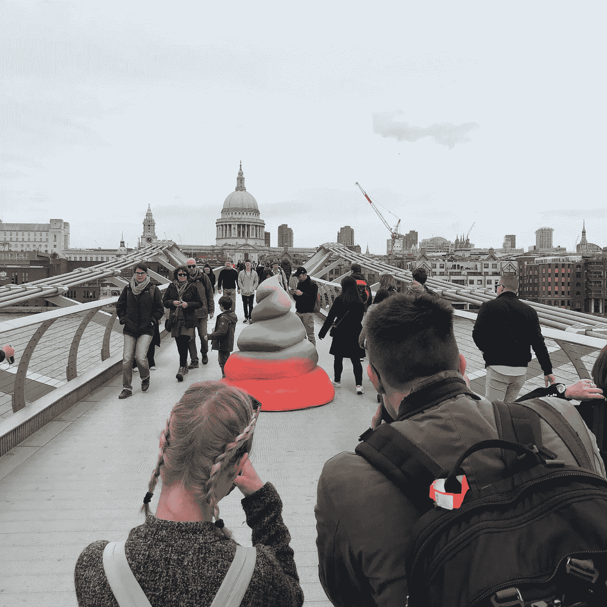

# 便便表情💩对于数字讲故事

> 原文：<https://medium.com/hackernoon/the-poop-emoji-for-digital-storytelling-9738e873794b>

## 像[#赠品](https://twitter.com/search?q=%23GiveAShit&src=typd)和[#世界盥洗日](https://twitter.com/search?q=%23WorldToiletDay&src=typd)这样的活动已经创造了有效的最佳实践，特别是在社会影响活动方面。

Rainbow poop emoji sculpture on the Millennium Bridge, London, part of a 2018 campaign by mobile network Three. (Credits: Andreas Sandre)

为什么便便表情符号如此引人注目？这个充满微笑、异想天开的垃圾漩涡让我们开心，让我们发笑，当然也吸引了我们作为社交媒体用户的注意力。

我以前写过便便表情符号的历史——官方名称*便便堆*——去年，我就在这里

[(Credits: WHO on Twitter)](https://medium.com/u/504c7870fdb6#世界厕所日活动。
<figure class=)

[一年前，](https://medium.com/u/504c7870fdb6#世界厕所日活动。
<figure class=)[和应用程序](https://medium.com/u/9d92a82a9640#赠品社交媒体活动<a class=)来提高对同一问题的认识。

(Credits: WaterAid on Youtube)

结果令人印象深刻。

(Credits: WaterAid on Twitter)

据水援助组织称，超过 50 名艺人、艺术家、活动家和社交媒体明星参加了这场运动，激励来自世界各地的人们通过在智能手机上创建个性化的便便表情符号，与朋友分享便便，并向这项事业捐款，来展示他们的#施舍。

#赠品在全球 53 个国家吸引了年轻人和老年人的关注，获得了 Business Insider、Mashable、Glamour、Metro、《华尔街日报》和 Yahoo！产生了超过 2.3 亿的媒体印象。

甚至[美食&葡萄酒杂志也报道了这次活动](https://www.foodandwine.com/fwx/secrets/best-use-your-poo-emoji-bringing-water-and-toilets-those-need)——尽管对于一家专门从事美食和餐馆的商店来说，这不一定是开胃的！

这是一个令人不安的讨论话题，这导致该团队在 2015 年报道了#赠品运动,《食物与酒》。“便便表情符号已经达到了文化意义的临界点。这是每个人都知道和使用的东西，”帮助创建该项目的克里斯·普莱哈尔告诉该杂志。“没有人谈论狗屎问题。我们认为没有比艺术更好的方式了。”

该活动吸引了 11，000 多名新支持者加入水援助组织及其工作，以实现一个每个人、每个地方都有干净水、厕所和卫生设施的世界。

第二年，2016 年， [Water Aid 在表情符号和非营利类别的](https://shortyawards.com/8th/brands-and-orgs/finalists) [Shorty Awards](https://medium.com/u/ec31423af130?source=post_page-----9738e873794b--------------------------------) 中入围。

几年后，2019 年 4 月，加拿大温哥华大都会地区完全接受了便便表情符号，并为其 [*和*](http://www.metrovancouver.org/services/liquid-waste/preventing-problems-pipes/unflushables/Pages/default.aspx?utm_source=google&utm_medium=search&utm_campaign=unflushables2019) 活动创造了便便和尿尿两个吉祥物，以提高人们对将违禁产品冲进厕所的高昂损失和环境后果的认识。

Meet Poo and Pee: Metro Vancouver’s newest mascots (Credits: Metro Vancouver via Facebook)

企业界也未能免受便便表情符号的影响。

去年 4 月，在伦敦，“本周末，一群超大的彩虹便便被倾倒在该市一些最具标志性的地标外，旁边还有一些淘气的街道名称和以狗为主题的热点，”正如[写的那样](https://www.timeout.com/london/news/did-you-spot-a-rainbow-poo-in-london-this-weekend-041618) [Time Out London](https://medium.com/u/9e3a9ad841c3?source=post_page-----9738e873794b--------------------------------) 当时——其中一个被放置在千年桥的一端，距离泰特现代美术馆几步之遥。"移动网络三号是这一噱头背后的非铲屎者，旨在为其即将到来的宣传造势."

这项倡议是与一个临时的 Snapchat 过滤器一起发起的，是一个广告活动的一部分，重点是一只名叫 Puggerfly 的虚拟宠物，一只湿漉漉的脸，紫色翅膀的哈巴狗，据该网络称，它是“体现所有社交和乐趣的东西”

根据一口大小，“Puggerfly 允许用户在七天内访问不同的连续 Snapchat 镜头，让他们培育和热爱他们的 Puggerfly，因为他从一只追逐球、拉彩虹的 puppyfly 一直成长为一只完全成熟的飞行 Puggerfly。”

虽然便便表情符号现在已经渗透到互联网和社交媒体——以及流行文化——但就目前而言，它最近已经成为日本一家博物馆的焦点。

名为 Unko Museum，字面翻译为便便博物馆，位于东京以南约 25 英里的横滨。

“我们认为将便便作为娱乐，而不是博物馆，这在世界上是第一次，”Unko 博物馆的一名代表告诉 CNN 旅游 [。“昂科博物馆里没有肮脏的棕色便便。都是五颜六色，可爱又流行的设计便便。”](https://medium.com/u/374a801b3eb2?source=post_page-----9738e873794b--------------------------------)

据美国有线电视新闻网(CNN)报道，该博物馆将在整个夏天开放，截至 4 月份，已经有超过 1 万名游客，游客可以坐在颜色鲜艳的假马桶上，画出他们排便的艺术表现，对着麦克风大喊“unko”，在装满填充粪便的球坑中玩耍，并在颜色柔和的填充粪便玩具前自拍。

 [## 黑客正午表情符号制造者

### 我们正在为社区设计和贡献复古图标的工具。试用一下，并给我们发送…的截图

community.hackernoon.com](https://community.hackernoon.com/t/hacker-noon-emoji-maker/536/31)