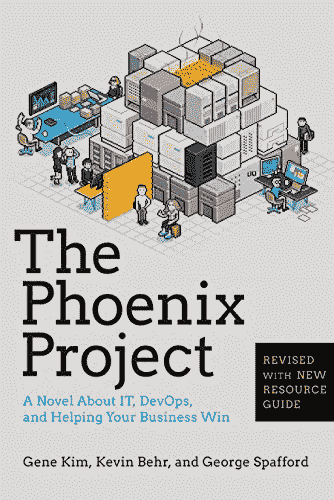
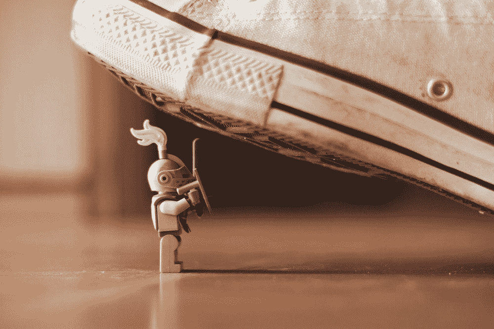

# 产品所有者——Scrum 的巨大成功和失败

> 原文：<https://medium.com/hackernoon/the-product-owner-scrums-great-success-and-failure-dfc12dbb3fd8>

# 你不一定要有一个“产品所有者”才是敏捷的

有一个关于敏捷开发的抱怨是:“Scrum 是如此出名和广泛使用，以至于人们经常把 Scrum 误认为是敏捷开发。”这是一个公正的批评。最典型的例子就是“产品所有者”的角色。产品负责人角色(据我所知)来自 Scrum。该角色旨在满足这一敏捷原则:

> "业务人员和开发人员之间密切的日常合作."

几乎所有的软件开发公司都想变得敏捷，设立“产品负责人”的职位似乎是这个过程的一部分。问题是这个角色被固定在 Scrum 对“产品所有者”的定义上。虽然这解决了一些问题，但也引发了其他问题。为了明确我说的是 Scrum 对产品负责人的定义，从现在开始我要说“Scrum 产品负责人”。

# Scrum 产品所有者角色成功的地方

我最近读了“凤凰计划”，它真的帮助我理解了 Scrum 产品所有者的概念给行业带来的巨大价值。

[https://www.amazon.com/Phoenix-Project-DevOps-Helping-Business-ebook/dp/B00AZRBLHO](https://www.amazon.com/Phoenix-Project-DevOps-Helping-Business-ebook/dp/B00AZRBLHO)

这是一个关于一家企业在 It 团队受到来自企业各处的请求的打击时陷入困境的故事。IT 团队只能自生自灭，试图找出这些请求的优先级，并实施错误的事情，因为他们不理解所请求工作的目标。

这就是 Scrum 产品负责人角色的闪光点。理解所有进来的业务需求，区分它们的优先级，并把它们转换成开发团队可以处理的格式。这是一个简单但强大的概念，无疑改变了许多企业。

# Scrum 产品所有者角色失败的地方

问题在于问责制。Scrum 指南说:

> “产品负责人是唯一负责管理产品积压的人……产品负责人可以做上述工作，也可以让开发团队来做。但是，产品负责人仍然是

*这里的陷阱是，如果产品负责人是管理积压工作的“唯一的人”，那么你如何让 UX 的设计师和工程师负责呢？如果最终是 Scrum 产品负责人独自决定工作是否完成，你能让他们对他们交付的工作负责吗？我不这么认为。*

*Scrum 产品负责人的责任将 UX 和工程变成了利益相关者。*

*"但是难道工程和 UX 不能对此负责吗？"你可能会问。Scrum 产品负责人的定义很明确，backlog 是 Scrum 产品负责人的唯一责任。这项工作可以委派出去(例如，UX 和工程)，但你不能委派责任。归根结底，Scrum 产品负责人需要能够解释为什么 UX 改进比工程维护任务更有价值。这意味着 Scrum 产品负责人必须理解待办事项中所有工作的价值。*

*Thoughtworks 的 Pete Coulter 谈到了对 Scrum 产品负责人的[不切实际的要求](https://www.thoughtworks.com/insights/blog/iterating-product-owner-role-owner-assistant):*

> *“越来越多的时候，我发现在采用敏捷工作实践时，组织很难找到合适的人来担任产品负责人(PO)的角色。即使当这个角色被填满时，将个人授权到一个合适的水平并给予他们如何计算真正商业价值的知识的任务也很少被完成…不仅[产品所有者]需要对产品充满热情，还需要对用户价值、商业价值、成本/收益分析、商业会计、运营成本、市场和竞争对手分析、利益相关者管理等概念和实践有扎实的知识。”*

*在[客户至上的团队没有产品负责人](https://hackernoon.com/customer-obsessed-teams-dont-have-product-owners-7c20a01c195f),“现代敏捷”的发明者 [Joshua Kerievsky](https://hackernoon.com/@JoshuaKerievsky) 说:*

> *“选择建造或修复什么是困难的。做好这件事需要许多人的洞察力。如果你想做得很差，把所有的工作都委托给一个产品负责人(PO) …客户至上的公司知道，如果你不了解他们的需求，你就不能让他们变得很棒。这需要一个团队来做好，而不是一个 PO。”*

*为什么我们给我们的 Scrum 产品负责人这么大的压力？这对初级 Scrum 产品所有者来说是如何工作的呢？难道还指望他们对这一切负责吗？*

*Scrum 产品负责人的责任太大了。*

# *该产品共同导致救援*

*让我们抛弃那种单一的个人责任概念，取而代之的是一个由产品共同领导、UX 共同领导和工程共同领导的团队。*

*他们需要在待办事项上达成一致。不允许任何一个人/学科来决定。他们的成功不仅取决于确保他们的所有需求在待办事项中得到平衡，还取决于他们的选择能否实现价值最大化。*

*但是不要只听我的，[听听 BNB 航空](https://airbnb.design/defining-product-design/)*

> *“[工程、产品和设计]团队在每个项目中都得到了重建，平等的、指定的工程、产品和设计领导一起工作……这种多学科团队中的平等访问和权力允许惊人地同步和快速的产品开发，可以随着公司的发展而扩展。”*

*还有[亚特兰蒂斯](https://www.uxpin.com/studio/blog/inside-atlassians-design-process-power-autonomous-teams/)*

> *“为了管理产品开发，Atlassian 使用三位一体模型，在该模型中，工程、产品管理和设计部门共同协作做出决策 Alastair 说，“在解决工程、业务和客户问题的三位一体中，你需要健康的张力。如果产品性能因为技术债务而受损，那么这些功能看起来有多完美并不重要。三合会最终要对整个经历负责。""*

*和[基地营](https://m.signalvnoise.com/how-we-structure-our-work-and-teams-at-basecamp/)，他们有一个稍微不同的三人组:*

> *“最终，由我(首席执行官)、David(首席技术官)和 Ryan(战略)来决定是什么进入了[待办事项清单]。在循环开始前一周左右，我们回顾了张贴在 Basecamp 上的所有宣传，分享了一些我们自己的想法，并经常激烈地讨论各种选择。然后我们会……再讨论一些，并做出最后的决定。”*

# *我认为最好的产品负责人已经认为自己是产品合作者*

*以我的经验来看，最好的产品负责人已经扮演了“共同领导”的角色。他们将 UX 和工程结合在一起，并帮助将需求和愿景合并到一个待办事项列表中。让我们用“产品共同领导”来明确这个角色的意图，并把它和 Scrum 产品负责人的角色分开。*