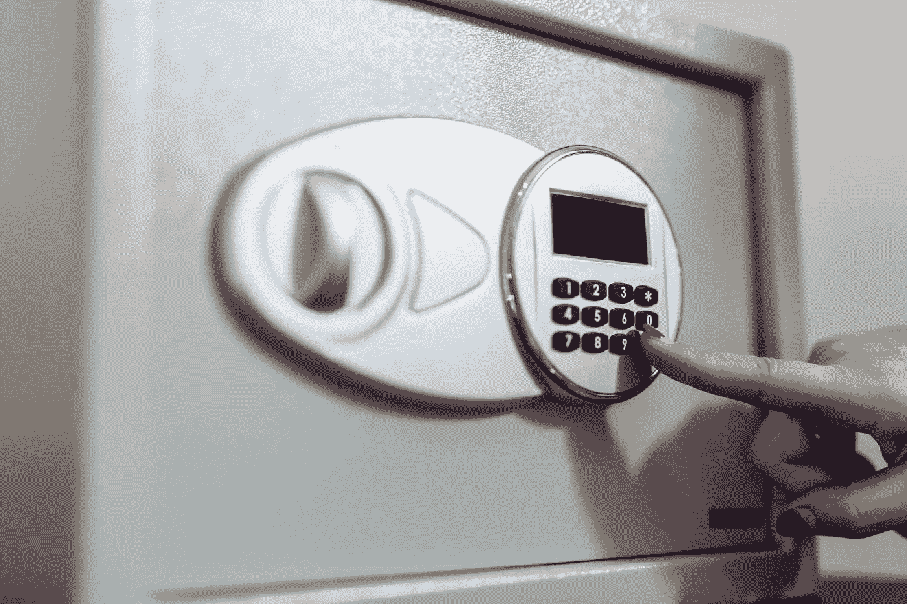

# 零信任架构的兴起

> 原文：<https://medium.com/hackernoon/the-rise-of-zero-trust-architecture-17464e6cbf30>

## 什么是零信任架构，为什么它与今天相关？

# **打破零信任架构:**

零信任架构是希望通过更可靠的方式来防止机密数据泄露并降低现代网络攻击风险的组织可以考虑的一个选项。零信任最初是由分析公司 [Forrester Research](https://go.forrester.com/) 开发的，它被作为传统安全架构的替代产品推向市场。

大多数企业使用传统的安全体系结构，这种体系结构使用现在已经不正确的理论，即包含在他们自己的网络中的任何东西都可以被认为是可信的。在现代，安全威胁可能来自内部，并且比以往任何时候都更加智能化。

需要审查新的安全方法，以阻止威胁在组织内出现。如前所述，标准安全方法只能防止来自组织外部的威胁。任何已经渗透到网络中的东西都不会受到检查，不会被发现，并且会泛滥成灾，这使得他们能够接触到极其敏感的信息。

这导致零信任架构越来越突出。零信任架构本身就是在**“从不信任，总是验证”的基础上工作的。像这样的系统设计旨在防止威胁通过网络横向传播。这是通过利用微分段和加强周边网络安全来实现的，这将基于用户 ID、位置和其他数据权限。关于网络安全威胁的横向移动是一个术语，用来描述攻击者通过网络到达他们想要获取的资产和数据的方式。**

更传统的网络安全架构允许企业在其网络安全中创建一个“子边界”，该边界将使用一套既定的规则来创建，这些规则基于谁在使用系统、他们正在使用的应用程序以及他们试图访问的文件目录。创建这些子边界有助于通知企业攻击已经发生，并防止攻击者在网络中横向移动时不受挑战。

值得注意的是，当网络安全攻击发生时，攻击者进入受害者网络的点通常不是他们的目标文件或信息所在的位置。这就是为什么防止跨网络的横向移动和访问如此重要的原因，它可以阻止攻击者到达他们的目标。或者，如果某人的凭证被盗并被用于访问敏感数据，那么如果攻击者使用这些凭证来达到他们的目标，这些凭证将必须被网络记录。这有助于确定用户 ID 是否需要临时挂起。来自组织内部的攻击和泄露变得越来越常见。

您允许用户访问和横向移动的级别取决于用户的身份以及他们对特定特权文件的访问级别。例如，在大型组织中，财务团队及其设备可以访问与企业财务状况相关的文件，而营销团队及其设备不允许访问这些文件。这就是为什么当怀疑受到攻击时，您必须识别哪个用户应对此负责，他们试图访问组织网络的哪个部分，以及他们是否拥有访问这些文件所需的权限。

如果这些系统被实施到您的网络安全程序中，您将能够跟踪攻击者的活动，并有机会阻止攻击继续进行。

零信任架构允许企业快速识别外部和内部安全威胁，这意味着它们有更大的机会被快速纠正。

# **零信任架构是如何跨组织实施的:**

## **皮划艇:**

[Kayak](https://www.kayak.com/) 是旅游搜索引擎的行业领导者，拥有超过 40 个不同的国家网站，每年还负责处理超过 15 亿个不同的旅游搜索。为了帮助确保员工保持效率和生产力，Kayak 允许员工在办公室之外使用他们自己的个人设备工作。

自然，这导致网络攻击的风险增加，也让 Kayak 的安全团队头疼。他们需要对员工的设备建立有限的可见性，还需要在远程使用他们的系统时注意兼顾用户体验和安全性。

Kayak 对标准的自带设备(BYOD)管理技术不满意，也找不到一个安全平台来区分 Kayak 自己的设备和员工的设备。

Kayak 还希望能够通过检测过时的操作系统来检查这些设备的状态。他们尝试了各种方法来解决这些问题，包括移动设备管理(MDM)、网络访问控制和客户端证书解决方案。

前面提到的系统过于笨重和复杂，难以管理，并且在过渡到基于云的计算时不能提供足够好的安全性。

因此，Kayak 最终决定使用 [Duo Beyond](https://duo.com/docs/beyond-overview) ，这是一种由 [Duo Securities](https://duo.com/) 提供的零信任安全方法。该系统允许他们的安全性区分 Kayak 拥有的设备和员工拥有的设备。他们还能够使用自己的系统获得有关每台设备状态的更新，并且能够提供一种安全的方法来允许其员工远程工作。

除此之外，Kayak 还能够实施一项政策，这意味着高级别的第三方管理帐户只能通过 Kayak 设备访问，从而限制了相关的安全风险。只要员工的个人设备安装了最新版本的浏览器，他们就可以访问自己的常规账户。

此外，Kayak 不需要依赖 VPN，他们为员工提供了使用 Duo 网络网关的能力。这是远程访问他们的应用程序的更方便、更安全的方式。

Kayak 选择了一些他们最常用的关键应用程序，并通过使用 Duo 可信访问架构来访问它们。这允许 Kayak 在允许用户访问他们的应用程序之前检查用户设备的健康诊断和他们自己的 ID。

## **西门子:**

[西门子](https://new.siemens.com/global/en.html)是欧洲最大的工业制造商，他们也认为其安全架构的最佳选择是使用零信任模型。西门子数字化网络，监督西门子数字应用的创新。他们为自己的数字应用定义了三个关键目标。

*   为他们面向互联网的应用提供最好的安全性。
*   确保他们能够降低数字应用的成本。
*   为他们的[用户的数字身份创造高性能体验。](https://startupstash.com/the-rise-of-digital-identity/)

因此，西门子决定将 Zscaler 的云安全架构用于他们自己的基于云的网络。由于西门子的业务规模，他们在选择安全解决方案时需要考虑的一个关键因素是该解决方案是否可扩展以满足其业务需求。零信任架构可以扩展到任何规模的企业，无论是初创企业还是全球企业集团。

零信任架构符合他们的三个核心原则的方式是，与传统的网络安全模型相比，零信任架构模型在功能上非常经济高效。此外，拥有软件定义的外围系统是保持云应用安全的最有效方法之一，因为它们可以让您的应用在互联网上不可见，从而降低外部攻击的风险。再加上 SDP 提供的内部安全性，您可以很容易地看到使用零信任模型是保护您的基于云的应用程序的最佳方式之一。

## **谷歌:**

许多大型组织已经意识到在他们的安全系统中使用零信任架构的潜力和好处。例如，世界上最大的公司之一，[谷歌](https://www.google.com/)多年来一直在探索零信任安全。

谷歌有 85，050 名员工在工作，有大量设备正在被使用，这些设备有被入侵的真实可能性。由于他们越来越依赖云技术，这一风险进一步增加。正因为如此，传统的基于边界的网络安全不再是保持谷歌网络基础设施安全的可行选择。

这就是为什么六年前，谷歌开始在他们的业务中实施零信任安全架构，使用 [BeyondCorp](https://beyondcorp.com/) ，实现软件定义的边界系统。这是企业用这种新架构取代传统安全方法的第一个例子。

BeyondCorp 模型的一个关键点是，公司系统内的内部流量并不比外部流量更值得信任。当试图确定用户的 ID 以及他们的设备是否可信时，这种安全方法消除了对更普通的 VPN 和安全凭证的需要。

谷歌自己使用一个基于分级访问的系统，这意味着零信任系统将分析用户自己的权限以及他们的组权限，用户在组织中的角色将需要什么信息，他们还将识别有关所使用设备的关键信息。

使用他们的分层系统，谷歌内部有四层访问权限。您有“不可信”、“基本访问”、“特权访问”和“高度特权访问”。如果一个设备不可信，它将不被允许访问谷歌应用程序。基本访问权限允许用户访问非常有限的机密数据，特权访问权限增加了机密级别更高的可访问信息量。高特权访问提供了对他们公司服务的每一部分的访问。