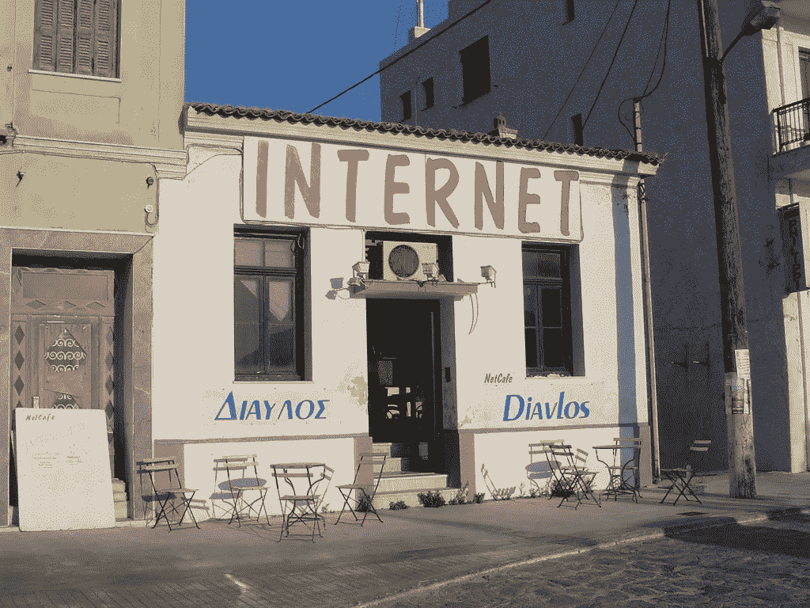
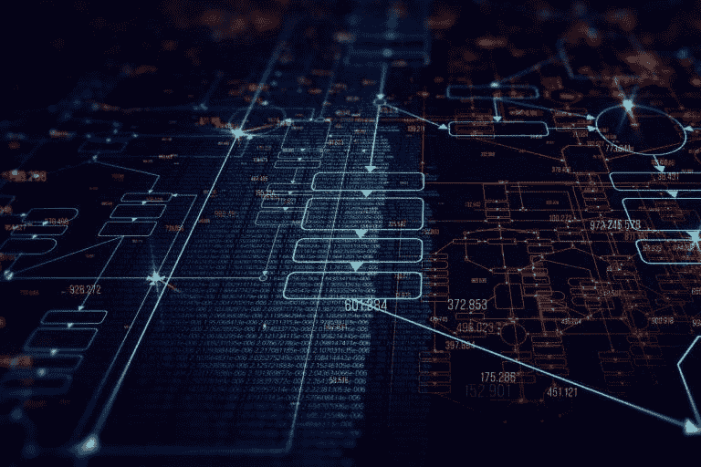

# 跨链技术在推动去中心化互联网中的作用

> 原文：<https://medium.com/hackernoon/the-role-of-cross-chain-technology-in-powering-a-decentralized-internet-66f8fb1c63f0>

## 区块链被描述为驱动下一代互联网的技术。然而，在互操作性和可伸缩性方面还有重大的挑战需要克服。解决方案的一部分是交叉链技术。

Image by [151676781@N07](https://www.flickr.com/photos/151676781@N07)

## 什么是集权？

我们今天所知的互联网是集中的。集中化是指一个或少数实体控制整个网络的结构。目前，少数非常强大的技术公司对互联网施加了最大的控制。这几家公司被称为 FAANGs(脸书、苹果、亚马逊、网飞和谷歌，以及微软和 Twitter 等其他公司也处于寡头垄断状态)。这些公司足够强大，可以为行业标准设定条款。较小的实体也效仿并使用类似的操作方法。这样看来，现在的互联网可谓是中心化的。

我们今天所知的集中式互联网存在一些严重的问题。例如，每天有数十亿条个人数据在网上共享，其中绝大多数存储在 FAANGs 和其他人拥有的巨型服务器上，这些服务器位于世界各地的几个地方。这些数据对于广告商和市场研究人员以及不太可信的行为者来说是有价值的，他们可以获得这些数据并影响我们的生活。集中式数据存储易受直接攻击，如黑客攻击。控制数据的公司也出售数据获利。这影响了用户的在线体验和他们接触的内容类型。与此同时，公司从用户的个人信息中赚钱，而用户却没有得到任何回报。

Image by [anitachu2](https://www.flickr.com/photos/anitachu2)

## 区块链如何推动去中心化的互联网

基于区块链技术的分散式互联网将依赖于由许多计算机组成的网络，而不是大型企业服务器。每台计算机将充当一个节点，为分布式存储网络系统提供电力和内存。这样，网络就没有集中的服务器。事实上，它根本没有中心。数据不能存储在孤岛中。将没有黑客攻击的中心点，寡头也没有办法控制信息。

区块链技术很有吸引力，因为它回应了人们对集中式互联网的许多担忧。它比我们今天使用的互联网更透明，更不易腐败。区块链网络包括交易分类账和智能合约，在满足特定条件时可以自动执行。虽然不是必需的，但区块链网络也可能有一个本地硬币或令牌，帮助验证链上的交易和数据，并向网络参与者提供[投票权或治理权](https://hackernoon.com/r/?url=https%3A%2F%2Fnews.coinsquare.com%2Flearn-coinsquare%2Fproof-of-work-vs-proof-of-stake%2F)。

区块链平台的一个主要优势是，它们存储个人数据的方式与 FAANGs 截然不同。数据不是保存在分布式分类帐网络中充当“节点”的计算机上。个人可以控制谁/什么可以访问他们的数据，而不必交出个人信息。我们不是一次又一次地分享我们的个人数据，而是每次我们在网上参与一个行动或互动，都会在区块链上留下一个永久的记录。我们可以在需要时给予企业和其他实体访问这些数据的临时许可。区块链实际上就像一个票务系统，跟踪谁获得了访问权限，而不会放弃对底层数据的控制。这种结构允许个人重新控制谁/什么可以访问他们的数据

Photo by [cheesegod](https://www.flickr.com/photos/cheesegod)

## 需要克服的挑战

尽管前景看好，但区块链技术面临的挑战可能会影响其作为互联网基础技术的应用。其中之一与“[互操作性](/swlh/interoperability-scalability-key-for-blockchain-in-2019-68605cfad7a2)有关这是指当前不同的区块链无法相互通信和共享数据。加密货币交易员对此很熟悉。这就是为什么比特币不能通过第三方交易所或软件来兑换以太坊。在区块链能够直接相互交流之前，这种技术的主流应用将会受到限制。

另一个挑战是[的可扩展性](https://hackernoon.com/blockchain-scalability-layer2-bitcoin-ethereum-bb34afd1f9d2)。即使是最先进的区块链也只能处理有限数量的交易(例如以太坊每秒 10-15 次)。然而，在一个去中心化的互联网中，每个搜索引擎搜索或社交媒体帖子都会产生一个区块链交易。广泛使用将成倍增加区块链交易的数量。目前的情况是，在处理能力大幅提高之前，任何一个区块链网络都不可能为全球互联网提供动力。

Image by [151676781@N07](https://www.flickr.com/photos/151676781@N07)

## 交叉链技术

在许多方面，互操作性和可伸缩性的挑战是相互关联的。解决这两个问题的一个方法是开发技术来促进不同区块链之间的交互，也称为“跨链”技术。跨链技术通过提供一个平台来实现互操作性，该平台允许不同的区块链相互交互，并且本质上作为一个单链运行。这涉及到互操作性的问题。同时，cross-chain 可以通过利用现有区块链各自的综合吞吐量来增强可伸缩性。

一个试图开发跨链技术的项目是 [EVEN Foundation](https://medium.com/u/535d88285970?source=post_page-----66f8fb1c63f0--------------------------------) ，它正在创建“EVEN 跨链交互网络”。其核心目的是通过将外部区块链集成到单个平台中来提供跨链交互的基础设施。有了这样一个平台，就可以管理跨链交易，包括不同区块链网络上的智能合约。[甚至](https://bit.ly/2XVUhhW)也提供了几个功能来创建跨链交互的基础设施。

*   **跨链共识**

甚至网络也有自己的基于各种其他算法混合的一致性算法。该协议使得执行传输和跨链交换成为可能。

*   **跨链智能合约**

至少在短期内，跨链智能合约是互操作性的重要组成部分。这些智能合约可以与不同的区块链进行互动，使得在不进行互换或交易的情况下将价值从一个转移到另一个成为可能。 [EVEN](https://bit.ly/2XVUhhW) 平台将为外部区块链平台提供标准智能合约模板库，可通过 API 使用。

*   **交叉链 dApps**

跨链基础设施可以让分散的应用程序与第三方区块链同步，如比特币、以太坊和 EOS。EVEN 的平台允许用户使用独特的软件开发工具包(SDK)开发和运行 dApps。SDK 包括一组工具来处理各种日常任务，并使创建 dApp 的过程更快。为了展示这一功能，谷歌甚至正在开发自己的两个 dApps:一个多币种加密钱包和一个分散式交易所。

dApps 的分布和用户数据在[甚至](https://bit.ly/2XVUhhW)网络中的存储是基于“数据存储”系统的。这类似于 torrent 网络，参与者提供存储和分发文件的空间以换取报酬，而其他人则免费下载数据。[甚至](https://bit.ly/2XVUhhW)也将提供一个名为“dCloud”的云服务来执行 dapp，这是一个为涉及大量用户和/或需要永久网络连接的 dapp 提供的服务。

*   **互操作性和可扩展性**

由于增强的互操作性，跨链 dApps 将比构建在任何单个区块链上的 dApps 更具可伸缩性。跨链 dApps 能够与不同的区块链交互，因此它们可以利用多个链的速度来增强可伸缩性。

Image by [vilson_frangaj_design](https://www.flickr.com/photos/vilson_frangaj_design)

## 结论

从集中到分散的互联网的转变将代表着在线信息存储和共享方式的巨大进步。它还会促使我们的日常生活方式发生实质性的——或许是革命性的——变化。然而，目前还没有一个区块链强大或独立到足以成为一个全球分散互联网的基础。大多数人认为，在这个历史时刻，前进的道路是让区块链团结起来。跨链基础设施的发展是使我们更接近 Web3 的更大运动的一部分。

*订阅我的* [*中*](/@minadown) *和* [*推特*](https://twitter.com/minad21) *频道如果你想了解更多关于区块链和加密货币项目的信息，

如果您对本文有任何疑问，请在下面的部分发表评论。谢谢大家！*