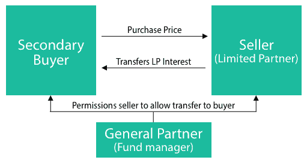
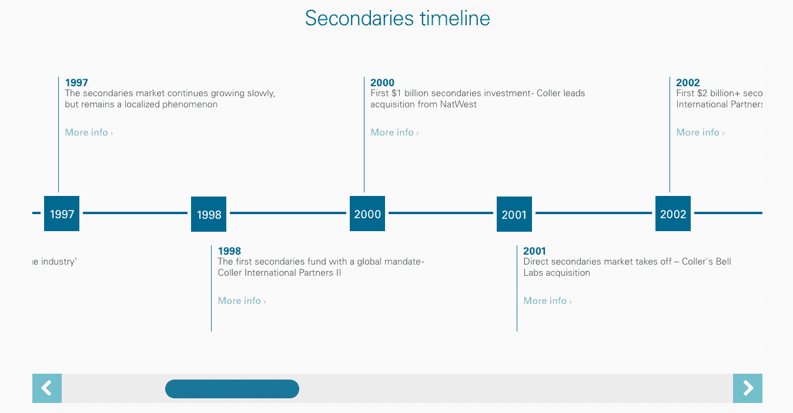
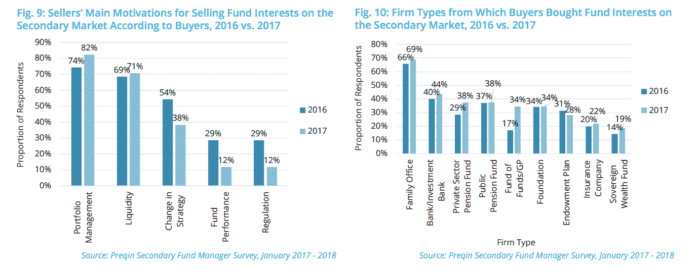
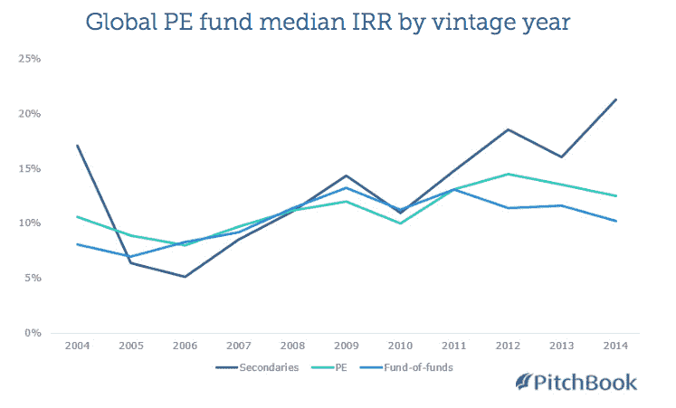
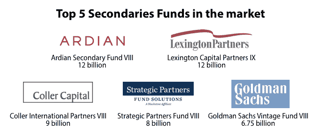
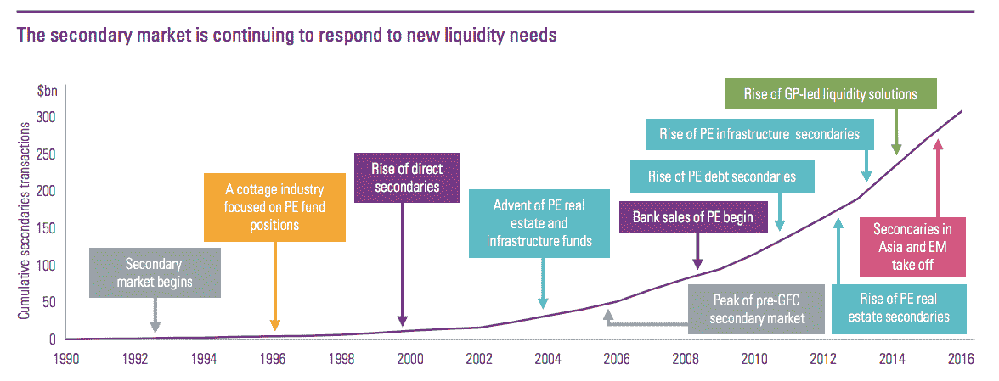
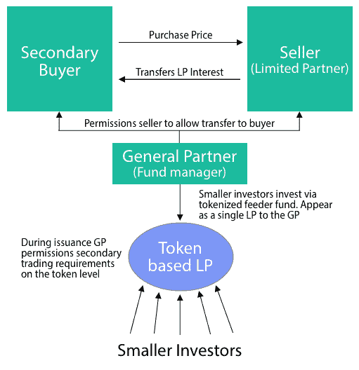
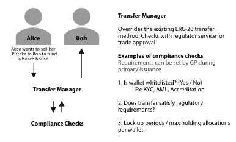
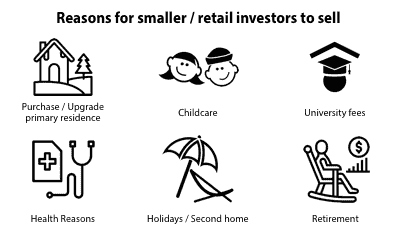
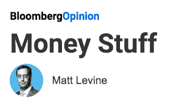

# 私募股权二级市场在发展证券代币流动性中的作用

> 原文：<https://medium.com/hackernoon/the-role-of-private-equity-secondaries-in-developing-security-token-liquidity-5412cdac6b0e>

什么类型的令牌化产品在 1 年、3 年、7 年内仍然是有吸引力的投资？标志着早期阶段的种子轮本身可以提供好处，不幸的是，有很大的可能性，该公司将在 7 年内不存在。但是，某些类型的投资产品提供较低的风险，并可以使用令牌化为主要投资者提供*改善的流动性+在第 5 年*为新投资者提供强劲的投资机会。

本文将探讨私募股权基金中**标记化 LP 利益的流动性改善论题。它将说明私募股权作为一级和二级市场上的投资产品的吸引力和风险状况。**

**第一部分:**介绍私募股权二级市场的现状。**第二部分:**探索位于区块链的二级有限合伙人权益如何适用于较小的买方/卖方。

***注:*** *如果你已经熟悉私募股权二级市场，请跳到第二部分:私募股权二级市场的区块链机会。请发送反馈/发表评论——我希望这篇文章能作为讨论的起点。*

# **第一部分:私募股权二级市场简介**

私人股本经理继续筹集创纪录的资金，机构投资者(养老金、捐赠基金、超高净值人士)继续向私人股本分配资本。为什么？因为私募股权资产类别长期以来能够[产生α](https://www.investopedia.com/terms/a/alpha.asp)。根据麦肯锡的一份报告，“最近，整整 90%的有限合伙人表示，最大的私人资产类别私募股权(PE)将继续跑赢公开市场。”然而，这种性能上的优势是有代价的，你的投资缺乏流动性。投资者通常希望将资本锁定 10 年，以换取潜在的更高回报。随着私募市场的发展，并非所有投资者都能在基金的整个生命周期中承受这种流动性不足。如今，越来越多的有限合伙人在约定的基金期限(大约 5-8 年)之前出售资产，以实现收益并对现有投资组合进行调整。基金到期前对流动性的需求创造了二级市场。

*想了解私募股权初级投资的现状？* [*阅读贝恩 2019 年报告。*](https://www.bain.com/contentassets/875a49e26e9c4775942ec5b86084df0a/bain_report_private_equity_report_2019.pdf)

## 什么是私募股权二级市场？

私募股权二级市场是出售投资者(有限合伙人)在私募股权基金中的权益或在各种基金中的权益组合。这是通过将投资者在基金中的有限合伙(LP)或 LLC 成员所有权利益从出售 LP 转移到购买 LP 来实现的。买方拥有相关权益的所有权利，包括任何资本承诺。5-10 年的基金代表了二次销售的最佳时机。

*下图展示了私募股权二级市场交易目前的运作方式。*

自 2008 年金融危机以来，私人股本二级市场一直在快速增长。如今，二级市场被证明是家族理财室、保险公司、主权财富基金、捐赠基金、基金会和养老基金越来越受欢迎的多元化策略。2018 年，封闭式私募股权基金二级市场的[交易量](https://blog.palico.com/2019/03/small-pe-secondaries-find-their-place-even-as-average-deal-size-increases/)创下历史新高，达到 700-800 亿美元。与 10 年前相比，这是一个巨大的增长，当时年度总市值为 160 亿美元。更不用说，二级市场已经显示出较低的风险和较高的策略 IRR 中值。[根据](https://pitchbook.com/news/articles/from-niche-to-normal-the-global-secondaries-market-commands-attention) Pitchbook，2018 年二级市场的 IRR 为 21.3%，而私募股权为 12.5%，组合基金为 10.2%。然而，尽管二级市场增长了 4 倍，机构投资者的兴趣也很大，但小投资者没有办法进入这一资产类别。基于区块链的私募股权股份(证券代币)可能被证明是一种让新观众进入这一有吸引力的投资类别的手段。

## **二级历史:**

1984 年，VC for America (VCFA)筹集了第一个二级市场基金，投资者承诺投资 600 万美元。直到 2000 年代初(网络泡沫破灭)，它仍然是一个相对较小的行业。2000 年后，随着私人资本行业的发展，二级融资活动开始加速。最大的增长发生在 2008 年金融危机之后，当时二级市场发展成了我们今天看到的局面。金融危机爆发后，越来越多的有限合伙人需要减少他们在历来缺乏流动性的私人市场的资本敞口。保险公司或企业养老金等有限合伙人不得不履行短期义务，这导致了各种基金头寸的被迫抛售。在 2008 年危机期间，二级基金以相对于资产净值(NAV)的大幅折价买入头寸。

科勒资本(Coller Capital)制作了一条[完整时间线](https://www.collercapital.com/about-secondaries/history-secondaries)，显示二级市场从 1984 年的 600 万美元行业增长到 2018 年创纪录的 720 亿美元全球交易额。它们被公认为引领着私人股本二级市场的工业化。

## **为什么要成为二级市场卖家？**

根据 [Preqin 的二级基金经理调查](https://docs.preqin.com/reports/Preqin-Special-Report-Secondary-Market-Update-Q1-2018.pdf)，二级基金销售的首要原因是投资组合管理。其次是流动性。2017 年，基金业绩仅占二级市场销售额的 12%。压倒性的二级市场抛售并不是因为基金发生了什么而触发的，而是因为持有它们的 LP 发生了什么。

*   投资组合管理，随着投资目标的发展，将资产重新分配到新的领域
*   有限合伙人的现金和流动性
*   避免未来的资本调用
*   消除或减少管理任务和间接费用

## **为什么要成为二级市场买家？**

> *在二级市场，投资者为流动性而来，但为回报而留。*

科勒资本的合伙人大卫·乔利在一次采访中解释道

> “二级回报仍然强劲，风险低于其他私人股本策略，有限合伙人可能会专注于提供顶级回报的优秀收购基金，但选择这些基金实际上比听起来更困难，随着你建立投资组合，你可以获得平均回报。随着时间的推移，二级市场总体上能够良好增长，并保持真正有吸引力的风险/回报状况。”

数据更加支持这一观点。请看下图，据报道，二级基金的中值内部收益率为 21.3%，而传统私募股权基金的中值内部收益率为 12.5%，组合基金的中值内部收益率为 10.2%。

*   投资持续时间更短，3-6 年即可收回投资，而不是 10 年或更长时间
*   提高基础资产的可见性。投资者可以评估投资组合中已经存在的东西，而不是盲目地向基金经理投资
*   J 曲线效应下降([定义 J 曲线](https://www.investopedia.com/terms/j/jcurve.asp))，现金分配已经到位
*   接触新的基金/经理

在[的一次私人股本连线采访中，EMEA 私人股本&房地产区域总监 Thomas Erichsen 谈到了二级市场。他指出，私募股权二级市场的部分吸引力在于，它允许投资者在投资组合的投资周期中进一步接触基金。](https://www.privateequitywire.co.uk/2019/05/30/276147/why-technology-can-play-role-pe-fundraising)

> “投资者既不靠近 J 曲线的起点，也不太靠近 J 曲线的后半部分；投资并没有平衡。仍有增长，但就一个人的资本被锁定的时间而言，机会之窗更短了。
> 
> “对一些投资者来说，这是一个非常有吸引力的提议。他们可以计算出在更短的时间内他们的回报可能是多少。如果你从风险的角度来看，这可能是一个较低的风险/回报剖面。
> 
> “对于投资者来说，这是退出某些投资、将资金重新配置到其他地方的一种重要方式。我认为这是推动二级市场增长的部分原因，”埃里克森总结道。

## **二级市场是如何定价的？**

二级市场的定价基于私募股权基金公布的报告估值，通常以季度为基础，并以报告净资产值(“NAV”)的百分比表示。一般来说，买方和卖方在交易开始时商定估价日期(有时也称为“参考日期”)。

## **二级市场今天看起来如何？**

今天，二级市场作为一个活跃的市场正在不断发展。二级资产市场 Palico 的发言人 David Lanchner [表示:](https://www.institutionalinvestor.com/article/b1505qn9clnxgy/record-cash-pours-into-private-capital-secondaries-funds)

> “这是一场进化的顶点……我们已经看到二级市场从一个底层渔民寻找不良资产的狩猎场彻底转变。现在，这是一个更加充满活力、持续发展的市场。”

在 2019 年 1 月的一份报告中，Palico 还报告称，家族理财室、保险公司、主权财富基金、捐赠基金、基金会和养老基金等买家——历史上投资于一级基金的投资者——对二级交易的兴趣有所增加。这个市场预计将继续扩大。越来越多的多样化投资组合进入市场，越来越多的买方和卖方认识到二级市场是一个可行的投资组合解决方案。

CAIA(另类投资教育的领导者)[预测](https://caia.org/sites/default/files/a_primer_for_todays_secondary_pe_market.pdf)未来，二级市场将继续增长，其驱动力是:

**不断壮大的玩家群体**

*   由不断变化的需求、宏观力量和正常化态度驱动的卖方
*   追求产量和充足干粉的买家

**可供出售资产的扩大**

*   在质量、资产类别和成熟度方面拓宽范围
*   一级私募股权市场资产积压越来越多

**基金经理和普通合伙人的基金角色不断扩大**

CAIA 继续解释说，普通合伙人直接在二级市场发起交易正变得越来越普遍。普通合伙人已经开始主动向投资者提供流动性选择。私人投资中资产类别的全面扩大，使得风险回报状况、基金结构和投资时间框架更加多样化。

由于二级市场投资能够消除初级基金投资的一些启动风险(已经知道投资组合中有什么，减少了 J 曲线的影响)，二级市场可以提供更有效的替代资产。二级市场的增长可以通过越来越多的市场参与者来进一步证明，如向私人公司提供流动性的纳斯达克私人市场或股票交易所。此外。正在筹集额外的资金，重点是二级市场战略。

# **私募股权二级市场的区块链机会**

## **当今二级市场的问题**

如今，有限合伙人往往会引发大多数二级市场的讨论。 [Campbell Lutyens 2019 年调查](http://www.campbell-lutyens.com/docs/default-source/NewsDocuments/unquote-secondaries-2019.pdf?sfvrsn=2)指出，有限合伙人主导的交易占二级市场的 61%,这是利用不断增长的二级市场买家名单的一种手段。作为一种整体投资组合管理工具，他们希望更早地获得回报。然而，几乎所有成功的二级市场交易[都需要](https://www.lexology.com/library/detail.aspx?g=2588a616-8fd1-4d75-bda8-7f8de8eaec3b)销售投资者在销售过程中与 GP 密切合作。这是因为在大多数基金协议下，需要 GP 的同意才能转让基金中的权益。潜在买家也需要 GP 的参与才能获得他们需要的尽职调查信息。由于要求 GP 参与，GP 可以无故拒绝转移基金权益。此外，普通合伙人通常希望因在转让过程中履行其职责而获得报酬。该费用传统上由买方/卖方分担。除此之外，就何时同意权益转让而言，普通合伙人往往有各种限制(每季度、每两年、与税收相关的转让限制)。

尽管私募股权二级交易具有诱人的风险/回报性质，但由于涉及大量的普通合伙人和交易成本，产生了一个主要问题:

> *二级市场销售过程中的高成本和大量 GP 参与往往会限制二级市场销售给大型基金中的大型 LP 股份。只有机构投资者能够参与。*

这一点可以得到强调，尽管 2018 年二级市场交易量创下纪录，2018 年底达到 500 亿美元，[这一数字](https://www.mpag.com/wp-content/uploads/2019/02/MPAG_Insights_Q1_2019_Pricing_and_Volume.pdf)偏向于大型交易。Setter 的 2018 财年销量报告指出，17 家大型买家(部署超过 10 亿)占总销量的约 73.7%。

## **区块链解决方案**

正如我们从下面科勒资本的[图](https://www.collercapital.com/sites/default/files/Coller%20Capital%20%E2%80%93%20the%20private%20equity%20secondary%20market.pdf)中所看到的，我们已经看到二级市场的发展是对日益增长的流动性需求的回应。这种发展的下一个阶段可能由选择通过象征性支线基金发行部分主要融资的普通合伙人领导。这些支线基金将作为一个单一的 LP 出现在 GP 面前，但可以允许二级市场**不**要求 GP 直接参与。这可能为小投资者创造二级市场机会。

## **它如何*【可能】*工作**

利用 GP 主导的二级市场交易的兴起，向前发展的 GP 可以选择通过令牌化的馈线发行其一部分一级基金份额。这种令牌化的支线基金对普通合伙人来说是一个单独的有限合伙人，但它代表的是一群较小的投资者。然后，这些较小的投资者可以根据 GP 在一次发行期间设定的一系列二次交易要求，在令牌化的馈线内交易他们的 LP 权益。

请看下图，这种代币二级交易可以与更大的机构基金二级市场并存。虽然这只是早期的可能性，但对于希望提供二次解决方案的 GPs 来说，这是一个潜在的有吸引力的选择，因为:

**答:**这使他们能够在主要筹资过程中获得新的投资者基础

**B.** 在基金的生命周期内，象征性投资者将继续看起来像一个单一的有限合伙人

**C.** 在首次筹资期间设定的固有合规要求允许他们在二级交易期间不受影响

德勤(Deloitte)2019 年的“token assets the securities of tomorrow”[报告](https://www2.deloitte.com/content/dam/Deloitte/lu/Documents/technology/lu-token-assets-securities-tomorrow.pdf)通过一个实际例子强调了这种潜力，作为更大的数字资产生态系统的一部分:

> “目前，私募股权、房地产和另类投资基金(AIF)的投资者可能会发现，由于缺乏流动性或有组织的市场，很难出售/转让他们的股份。
> 
> 如果这种基金持有通过 DLT 转换成数字代币，那么这些代币可以更容易地交换，并且交易可以实时(或接近实时)确认或验证。
> 
> 投资者的另一个好处是，将股票从一个账户转移到另一个账户会更容易，因为这将通过 DLT 进行。这也将为托管人创造机会，成为将实物股份转化为数字资产的代理人。至少在理论上，这个过程可以用于任何资产。"

## **标记化 LP 兴趣如何运作？**

令牌化的 LP 权益(通常称为安全令牌或数字证券)通过利用转移管理器来覆盖 ERC-20 转移机制来工作。该转让管理器能够阻止交易，直到通过发行人(GP)设定的一组合规要求。

## 案例研究:基于区块链的私募股权房地产二级交易

虽然有各种各样的私募股权战略(风险资本、收购、基金的基金……+)，但我想特别关注一个关于区块链私募股权房地产(PERE)基金的案例研究，如 [Leaseum Partners](https://www.leaseumpartners.com/) 。

投资于主要 PERE 投资，投资者在基金中配置资本的决策主要基于:

*   市场:*纽约市* y
*   策略: *Core-Plus &增值，Office &多家庭*
*   投资管理团队:*迈克尔·切特里特，在纽约管理的 2M 平方英尺；大卫·达汗，前英杰华投资公司总经理*

投资者不能做的是知道投资组合中的具体资产，因为它们还没有被购买。在二级市场上，尽管市场、策略和团队仍然重要，但投资者得到了一个额外的镜头。*他们已经知道投资组合里有什么*。

*   **投资组合:** *投资组合内的确切建筑*

与初次募集期间的盲池相比，二级投资者可以获得更多信息。这对房地产尤其适用。投资者可以看到投资组合的报告资产净值，并查看附近最近买入/卖出资产的价格。对于其他 PE 策略，如风险投资或收购，信息披露更加复杂。普通合伙人可能不愿意透露他们所拥有的私人公司的信息。(稍后将详细介绍)

## **二级市场的新零售机会**

这种基于区块链的二级市场交易自动化模式可能会推动一个容易进入的二级市场，并为散户投资者带来一笔有吸引力的投资。此外，这种投资机会可以推动更广泛的数字证券二级市场。

专注于二级投资的私募股权公司 Pomona Capital 的首席执行官 Michael Granoff 在 2018 年的主题采访中评论了二级交易对散户投资者的吸引力。

> “我们相信，与其它私人股本策略相比，成为一家私人股本二级市场管理公司，能让我们更好地适应零售和退休市场。这是一个完美的捕鼠器吗？不，但我认为，我们已经比收购或基金的基金战略更接近了。有了二级市场，投资者有能力完全减轻 J 曲线的影响，并立即分散投资策略、全球定位系统和年份。

## **如果一项投资有吸引力且表现良好，散户投资者为什么会卖出？**

由于机构抛售的主要原因不是基金业绩，而是投资组合管理目标，散户投资者将出于不同的动机抛售。由于散户投资者的背景多种多样，散户投资者出售其基金股份的决定可能会受到其个人财务目标的驱动。这种不同的出售动机表明，散户投资者有时会希望出售基金股份，这对一批新买家来说仍是不错的投资。

激励散户投资者卖出的因素可能包括:

## **为小投资者创建一个私人股本二级市场需要什么？**

如前所述，二级市场的最佳时机始于基金的第 5-10 年。虽然目前在该年龄范围内还没有令牌化基金，但在以下情况下，它有发展的潜力:

数字证券的一级市场以两种主要方式发展:

**高质量的投资产品选择提供一部分资金作为数字证券**

*   为了有一个健康的二级市场，我们需要一级市场上有吸引力的投资机会。例如，虽然你可能能够从早期创业公司的愿景中获得初级投资，但处于财务绝望中的初创公司不会进行有吸引力的次级投资。此外，一只表现不佳的基金在二级市场上没有吸引力。

**改善投资和持有令牌化资产的用户体验**

*   今天存在的数字安全世界是从加密货币热潮中衍生出来的。不幸的是，从钱包、发行平台到托管，数字证券需要更强的基础设施来发展更广泛的生态系统。这将有助于增加更多的投资机会和投资者类型。

如果市场出现有吸引力的投资机会，则必须开发二级零售市场的支持基础设施:

**第三方尽职调查工具/平台需要支持小投资者**

*   多样化的买/卖情绪可以为小投资者购买二级市场创造有吸引力的投资机会，但是，并不是每一次二级市场销售都是有吸引力的。小投资者将无法像今天的机构二级市场基金那样，完成对现有投资组合的全面尽职调查。此外，普通合伙人可能不愿意向非常小的投资者(或潜在的竞争对手)分享其投资组合中有关私人公司的机密信息。必须有第三方评级机构或尽职调查平台来支持小买家进行二次投资。

**数字资产的二级市场交易需要更加成熟**

*   有一些二级数字证券交易所正在启动，但没有一个取得显著的交易量。无论是开始或支持数字证券的传统交易所，还是新的交易所，都需要有一个活跃的二级交易所/市场供小投资者使用。这个市场不需要 24/7，它可以由零星交易驱动。

**普通合伙人必须为二级投资者设置钱包上限**

*   为了使小投资者能够获得有吸引力的交易，GP 强制钱包上限必须嵌入数字安全级别。在总部位于区块链的私募股权基金的二级市场上强制设立钱包上限，可能会被证明是一种防止大型二级市场基金包揽所有最佳交易的手段。

基于区块链的私募股权二级市场可能会像对机构投资者一样，成为对小投资者有吸引力的投资机会——但这不会在一夜之间发生。在我结束之前，从 2019 年 6 月 19 日的一段话中对私募市场公开化提出警告，这段话来自[马特·莱文的《金钱的东西》](https://www.bloomberg.com/opinion/articles/2019-06-19/private-markets-could-be-more-public):

— — —

这里有一个简单的私人股票市场运作模式。我的意思是，“私人股票市场”不太合适；私人股票往往不会在“市场”上频繁交易。但在美国，有一些私人公司以私募方式向“**”合格投资者发行股票，“主要是指其中大约 1600 万人——***——他们拥有超过 100 万美元的资产或年收入超过 20 万美元。下面是我的模型:***

**某家炙手可热的私人公司想要筹集 1 亿美元。它召集了十几个著名的风险投资家。他们都竞相为 it 提供最好的条件，并展示他们在建议和培育热门创业公司方面的能力。该公司从最好的风险投资中选择最好的条款，并从其中一家或几家公司筹集 1 亿美元。**

**一些稍微不那么热门的私人公司想要筹集 1 亿美元。风投们并没有争取达成交易，但该公司四处游说风投，并让其中一些人相信了它的愿景。它以非常好的条件从非常好的风投那里筹集了 1 亿美元。**

**某个不冷不热的私人公司想筹集 1 亿美元。当它向知名风投推销时，它很难说服他们，但能够找到一些例外:离开大型风投公司并自己创业的人，在其他初创公司工作并致富的人，现在正作为投资者试试运气的人，等等。它从形形色色的风险投资家那里筹集了 1 亿美元，条件反映了这项业务的风险。**

**某冰冷的私人公司想要筹集 1 亿美元。它在佛罗里达州雇佣了一个呼叫中心，给美国所有的牙医打电话，要求他们每人投资 1 万美元。它从牙医那里筹集了 7940 万美元的小额资金，足够好，无论如何。**

**看，看，看，这不是一个完美的模式，也不总是正确的，一些被知名风投忽视的小初创公司从牙医那里小批量筹集资金，最终成为巨大的全垒打，然后那些牙医变得非常富有。但总的来说，期待私人资金的瀑布似乎是合理的，在这种情况下，大多数明确的家庭经营的想法将倾向于获得成熟的专业投资者的资助，他们能够开出大额支票，并为年轻的公司提供有用的专业知识，而大多数由陌生牙医资助的想法将是成熟的专业人士会传递的想法。**

***不总是这样！有时老练的专业人士是错误的！但重点是:***

***小规模但合格的个人投资者通常不能获得与大型成熟专业投资基金相同的私人投资机会，以及***

**这些产品的质量可能存在系统性差异。**

**— — —**

**虽然马特·莱文的文章没有具体讨论私募股权二级市场，但我认为他从信息和可用性两方面说明了私募交易的重要一点。**

> **对于私募股权二级市场和所有令牌化股票，小投资者无法像大机构投资者那样完成尽职调查。需要有工具/平台来支持*“私募[数字证券]市场中的小投资者。”***

**小投资者需要获得私人投资机会，而老练的投资者也会发现这种机会很有吸引力。展望未来——毫无疑问，私募股权二级市场将继续增长。问题是，区块链技术会被用来帮助推动这种增长，并为小投资者提供机会吗？**

*****请发送反馈:*** *这篇文章是一个工作项目，我欢迎反馈，反驳和进一步探索的领域。请在评论中让我知道你的想法。我也总是乐于接受关于技术在另类投资领域的影响的批评性对话。***

***关于作者:朱丽安是* [*Leaseum Partners 的分析师。*](https://www.leaseumpartners.com/) *Leaseum Partners 是一家总部位于区块链的房地产投资管理公司。***

****来源:****

*   **风险投资漏斗显示，2019 年成为独角兽的几率约为 1%。 [CB Insights](https://www.cbinsights.com/research/venture-capital-funnel-2/)**
*   **私募市场的兴起与崛起，2018。麦肯锡**
*   **从利基到正常:2018 年全球私募股权二级市场需要关注。[宣传手册](https://pitchbook.com/news/articles/from-niche-to-normal-the-global-secondaries-market-commands-attention)**
*   **二级市场更新，Q1 18。[先秦](https://docs.preqin.com/reports/Preqin-Special-Report-Secondary-Market-Update-Q1-2018.pdf)**
*   **中学的历史。[科勒资本](https://www.collercapital.com/about-secondaries/history-secondaries)**
*   **2019 年，即使平均交易规模增加，小型私募股权二级市场也能找到自己的位置。[帕利科](https://blog.palico.com/2019/03/small-pe-secondaries-find-their-place-even-as-average-deal-size-increases/)**
*   **二级定价列表-尽管股价下跌，二级基金仍以平价或更好的价格出售，2019 年。[帕利科](https://blog.palico.com/2019/01/secondary-pricing-list-secondary-funds-sell-at-par-or-better-despite-falling-stock-prices/?utm_source=AC_newsletter&utm_medium=top_CTA&utm_campaign=secondary_pricing_20190117&utm_content=download%20the%20full%20list%20here)**
*   **2017 年，创纪录的现金涌入私募股权二级基金。[机构投资者](https://www.institutionalinvestor.com/article/b1505qn9clnxgy/record-cash-pours-into-private-capital-secondaries-funds)**
*   **为什么技术可以在 PE 募资中发挥作用，2019。[私募股权线](https://www.privateequitywire.co.uk/2019/05/30/276147/why-technology-can-play-role-pe-fundraising)**
*   **今日私募二级市场入门，2019。 [CAIA](https://caia.org/sites/default/files/a_primer_for_todays_secondary_pe_market.pdf)**
*   **私募股权二级市场，2019 年。坎贝尔·卢泰恩斯**
*   **基金二级市场的关键问题。词汇学**
*   **2019 年私募股权二级市场定价和成交量。 [MPAG](https://www.mpag.com/wp-content/uploads/2019/02/MPAG_Insights_Q1_2019_Pricing_and_Volume.pdf)**
*   **私募股权二级市场，2019。[科勒资本](https://www.collercapital.com/sites/default/files/Coller%20Capital%20%E2%80%93%20the%20private%20equity%20secondary%20market.pdf)**
*   **代币资产是 2019 年明天的证券吗？[德勤](https://www2.deloitte.com/content/dam/Deloitte/lu/Documents/technology/lu-token-assets-securities-tomorrow.pdf)**
*   **在二级市场保持敏捷，2017 年。[波莫纳资本](https://www.pomonacapital.com/sites/default/files/news/pei_perspectives_pomona_capital_dec_17_jan_18_issue.pdf)**
*   **“揭开喧嚣的二级市场的神秘面纱”，2017 年。[与导航员的虚拟圆桌会议](https://www.youtube.com/watch?v=XTNKt0K27Pc&t=1481s)**
*   **次级初级读本:第 1-4 部分，2019。[布雷特·明斯特](/@bmunst)**
*   **私人市场可能会更加公开，2019 年，[马特·莱文，彭博](https://www.bloomberg.com/opinion/articles/2019-06-19/private-markets-could-be-more-public)**