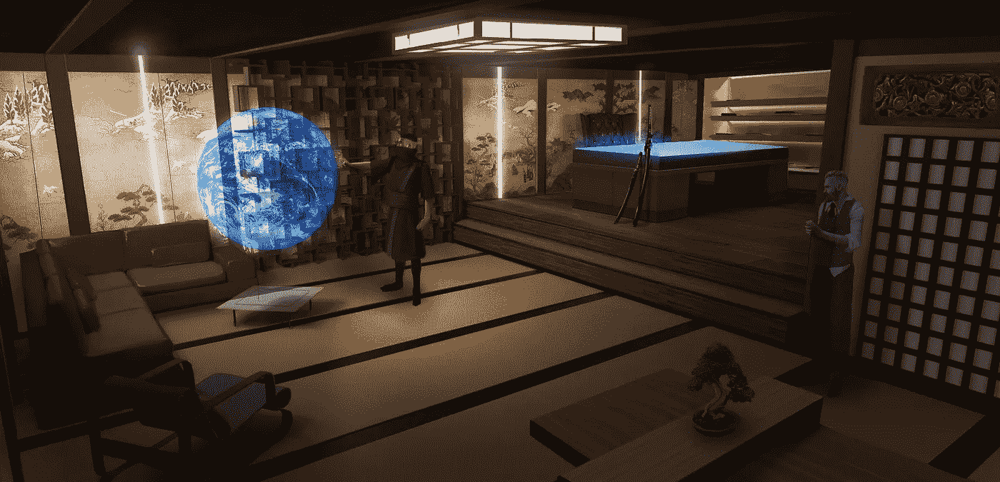

# 区块链游戏行业的现状

> 原文：<https://medium.com/hackernoon/the-state-of-the-blockchain-gaming-industry-3d3445dc2ec>

Hiro Protagonist’s Office, Snow Crash fan art

# 什么是区块链博彩？

作为“下一代计算平台”，区块链在游戏世界中实现了全新的功能:首先，能够在游戏之间交易数字资产，其次，能够在游戏玩家之间直接交易数字资产。这两个新功能提供了全新的开放市场和生态系统，让游戏玩家和游戏开发者迎来了互联游戏的新时代。因为游戏，首先是有趣的体验和令人上瘾的游戏，区块链游戏将会成功地平衡引人注目的游戏性和通过区块链嵌入的新经济。平衡是很棘手的，因为游戏必须有趣，同时还要平衡新的功能，这不应该有损于有趣的游戏本身。

# 区块链博彩的前景

试着想象一个游戏世界，让玩家有更多的机会参与游戏世界本身的创造。在这个宇宙中，游戏有记录良好的公共 API，为玩游戏的社区构建有用的工具很容易。更重要的是，在一个游戏中获得的资产可能会被用来交换其他游戏中的资产，甚至直接用于其他游戏中。所有这些都是通过在区块链上构建游戏“免费”实现的。

此外，区块链在区块链游戏世界中实现了商业伙伴关系的程序化执行。一个例子是 OpenSea 收入分享系统:任何基于 OpenSea 的公司都可以从其产品在 OpenSea 市场的二次销售中获益。在一个数字资产被隔离到特定生态系统并且不能本地互操作的世界里，这样的共生关系很难实施。

# 1.区块链游戏空间的早期

在过去的几周里，我有幸与在区块链游戏领域工作的一些最好的团队聊天。

区块链游戏的发展才刚刚起步。事实上，现存的区块链游戏并不是由游戏开发商开发的，现有游戏的质量就是明证。除了赌博和庞氏骗局，可能只有二十几个可信的项目实际上拥有必要的人才和经验来让这个行业更上一层楼。其中，四个团队筹集了更大规模的首轮融资，目标是每款游戏的玩家人数在 10 万到 100 万之间。显然，以区块链今天的基础设施水平，这是不可能的。其中几个团队正在积极寻找能够帮助他们实现目标的连锁店。

更重要的是，传统游戏行业的其他人都在观望，认为加入这个领域还为时过早。这是为什么呢？

区块链基础设施的可用性和可扩展性是当今的一大瓶颈。不仅现有的区块链游戏的加入率下降了 97-99 %,而且，一旦可用性得到修复，基础设施将需要能够跨越数百万游戏玩家。

即使解决可用性和可扩展性问题也不足以说服传统游戏行业进入新的领域。

游戏工作室需要一个工具生态系统来进入太空，并能够快速构建新范式的游戏。没有这些工具，这个行业的其他人就不会在新生的区块链领域下注。

接下来的 2-3 年将会是构建这样的基础设施和工具的时期。

# 2.今天阻止大规模采用的四个因素

今天，游戏开发者市场是巨大的:仅 Unity 生态系统就有大约 1200 万游戏开发者。

为了让这些开发商中的大部分进入区块链游戏领域，他们必须对以下内容开放:

*   围绕游戏开发的思维模式的转变(放弃开发者对游戏规则的控制)
*   习惯更复杂的经济学
*   穿越界面障碍，使区块链本身隐形
*   了解区块链的局限性和独特优势

# 2.1 开发人员心智模式的变化

说到游戏开发理念，现有的心智模型强调中心化，从基础设施到实际的游戏开发。在数百万游戏开发者加入这个领域之前，这种思维模式必须调整。

新模式有利于游戏玩家，因为他们对数字资产拥有可证明的所有权。为了让我们大规模地转向新的运营方式，一些游戏开发商需要接受这种模式。新模式对游戏玩家更公平。

此外，今天大多数游戏开发者认为他们的观众是有围墙的花园。大多数人认为他们已经建立了自己的观众群，他们害怕失去他们。在游戏之间进行任何形式的价值和资产转移都需要一种开放的心态。这种心态认为所有游戏都是一个更大的生态系统的一部分，在这个生态系统中，游戏机制和经济学共同工作，海潮托起所有船只。

# 2.2 游戏市场经济的变化

重要的转变将是从中央控制经济向自由市场经济的过渡。中央控制的经济必须担心管理经济的所有变量，而自由市场的经济将复杂性留给了开放的市场。虽然自由市场在技术上可能更“复杂”，但这种复杂性的管理可以由系统中的自由行为者来处理，并由看不见的手来引导。对于游戏来说，这可能是一个比完全中央控制更好的系统。

来自一个无限资源的世界，出版商可以在任何时候创造许多不同的项目，区块链从经济学的角度介绍了一个更加复杂的市场。

作为一名区块链游戏开发者，你考虑的不仅仅是游戏中的物品，还有一旦物品开始在游戏外交易时的价值。

对这样的经济学建模变得更加复杂，但是我确信我们将会在未来几年看到开源版本的未来市场经济标准的出现。

# 2.3 用户界面模式的变化

在区块链游戏的早期，有一点是显而易见的，那就是用户界面也是一个挑战。

早期的区块链游戏通过提供在加密市场(如 OpenSea)购买游戏的选项来瞄准加密社区，这需要预先存在“区块链是什么”和“加密货币是什么”的知识。

相反，区块链需要被抽象化，以便新的功能(例如真正的数字所有权)可用于更大的游戏社区，而不仅仅是区块链人群。Neon District 就是一个很好的例子，它负责保管游戏玩家，直到他们为区块链做好准备，只有在这个时候，游戏玩家才选择以分散的方式提供他们的数字资产(在 Neon District 的情况下，是等离子熊)。

# 2.4 了解区块链的局限性和独特优势

游戏开发者需要理解构建游戏的新方式与现在的方式有何不同。区块链驱动的后端速度更慢，成本更高，但也带来了一系列新的独特属性，如社会可伸缩性和 T2 信任度。这种新的属性能够创造新的市场(以前不存在市场的地方)和/或用市场取代网络(也就是说，去掉负责网络的人，让社区参与对等的价值交换)。因为它与游戏有关，这种新的财产允许创建开放的生态系统和市场，其中数字资产的真正所有权作为区块链财产的副产品出现。

# 3 大规模采用所需的产品功能

既然我们已经讨论了在主流采用区块链游戏之前需要发生的一些理念变化、用户界面变化、经济和教育，那么让我们剖析一下主流采用所需的产品需求。

# 3.1 用户友好的软件

采用的最大瓶颈是入职流程。当我们与游戏领域的应用程序交流时，他们发现入职流程的下降率在 97%到 99%之间。

这表明对应用程序的需求是存在的，只是用户很难完成加入过程。

其中一些与监管有关(KYC 流程，这里更多的是“T0”),无法得到很大改善，但其余的入职流程以及数字货币和区块链的持续使用是可以改善的。

例如，用户不需要理解钱包、汽油费和私人钥匙。对于来自大众市场的游戏项目来说，目前的可用性没有多大意义。

此外，委婉地说，天然气价格的波动对用户来说并不理想。因此，货币稳定很重要。需要注意的是，新一代钱包完全不用交汽油费: [Dapper](http://meetdapper.com) 和 [Argent](http://argent.xyz) 就是很好的例子。

最后，玩家应该提供比元面具更好的体验。理想情况下，玩家甚至不知道他们使用分散的基础设施来实现某些功能。

# 3.2 可扩展性

对于旨在获得数百万客户的团队来说，可扩展性是一个挑战。游戏行业的高管们对把一款像 WoW 这样的游戏与区块链的整体经济结合起来，然后投入数百万美元用于广告的想法感到兴奋。这就是他们想要的世界，但这在今天根本不可行。

此外，结局应该在几秒钟的数量级，以便提供吸引人的游戏体验。

您如何同时解决吞吐量和延迟问题？

如今，许多公司通过求助于第 2 层来解决延迟和吞吐量问题。这是当今最可行的方法，但它也有自己的局限性，无论是在可以构建什么以及用户需要如何参与才能保持安全方面。第 1 层有可能获得更高的吞吐量吗？解决第 1 层可伸缩性的主要方法之一是从数据库世界中获取剧本，自 20 世纪 80 年代以来，分片的研究和实现就在那里开始了。区块链分割要复杂得多，主要有两个原因:恶意参与者和跨数千台机器的共识。

我喜欢的“Blockchain sharding 101”内容可以在这里找到，围绕[的更高级的话题可以在这里](/nearprotocol/unsolved-problems-in-blockchain-sharding-2327d6517f43)找到区块链 sliding 中未解决的问题。

最后，最近在 etherceum Research[上提出了一种最先进的方法来解决上面文章中概述的问题。](http://ethresear.ch/t/whale-fishing-a-new-sharding-design/5275)

# 3.3 开发人员友好的工具

谈到开发经验，它在当今的区块链空间中也是次优的。

首先，我们注意到一些区块链协议将去中心化发挥到了极致，并以去中心化的方式构建软件和工具。如果与通过集中工程工作构建的工具相比，这种方法产生的工具集成得不太好，并且可能有版本问题，因为相同的团队不容易拥有文档。

具体到区块链游戏，如果区块链允许游戏开发者开发出优秀的游戏，他们就会进入这个领域。易于部署是至关重要的:游戏开发者应该能够毫不费力地去部署游戏。

不用说，允许开发者在自己的游戏中添加可重用的 UX 是非常重要的。它类似于统一资产商店，但为区块链游戏重新设想。

此外，考虑到区块链行业特有的计算限制，做好资源管理至关重要。

# 4.游戏开发工作室重要的是什么？

当我与游戏工作室交谈时，有几个重要的标准很突出。

# 4.1 标准

为了吸引游戏开发商，底层基础设施构建者需要将 NFT 标准视为一等公民，并向游戏社区证明他们在构建时考虑了游戏行业的要求。

例如，当谈到集成时，需要为资产存储进行 Unity 集成是必须的。

# 4.2 数字资产桥梁

以太网桥具有以太坊的经济性，但执行和状态在一个更可扩展的网络上。让可扩展的协议在某种程度上与以太坊互操作/兼容，将为 dapp 开发者解决今天的许多问题，并吸引更多人建立在更新的第 1 层协议上，从长远来看，也将共同建立一个更强大的分散式互联网。

# 4.3 智能合同的互操作性

早期成功的区块链游戏见证了各种开发者在其他合同之上构建合同的新兴行为，这导致了可组合性和更快的创新。例如，一些看到 CryptoKitties 受欢迎的开发人员决定在现有 DapperLabs 合同的基础上建立合同，例如 [KittyHats](https://kittyhats.co/#/) 和 [KittyBattles](https://alpha.kittybattles.io/#/) 。

从产品的角度来看，这意味着智能合约的互操作性是必须的。

# 4.4 侧链和跨链通信

一些游戏工作室开始研究侧链，因为侧链提供了短期的可扩展性解决方案，简化了成本，并可能促进跨链或第 1 层链不可知的概念。

当谈到成本时，在国家频道上只有两个玩家花费资源，或者可能也有几个中介。在等离子体中，只有一个操作员。相比之下，在第 1 层区块链中，每个 tx 都要经过数百台机器的验证。

我多次从游戏公司那里听说，单靠侧链并不是一个长期的解决方案，因为它们的安全性太不稳定了。其次，作为开发者，你没有得到很好的安全保障意识。第三，它们出错的几率太高。最后，即使侧链最终服务于一个好的用例，互操作性最终也是一个瓶颈。

尽管如此，未来的世界可能会使用可伸缩的第 1 层协议和侧链组合。

因此，第 1 层需要有侧链第一类支持，并支持原子交换。重要的是，如果您可以在基本协议上获得可用的原子事务，这将对跨契约调用非常有用。

# 4.5 基础设施和工具

一些基础设施是区块链必不可少的:

1.  类似 Infura 的功能(负载平衡)
2.  网络和移动钱包
3.  稳定和开放的块资源管理器
4.  像 Truffle 这样的工具可以模拟主节点上发生的事情

# 4.6 货币化模式

盈利模式对于设计数百万游戏开发商、工作室和设计师进入该领域的激励措施至关重要。

今天的一些协议旨在直接在协议层面嵌入商业模式，允许游戏开发者和艺术家从他们制作的内容中获得报酬，就像今天的音乐家从他们被聆听的歌曲中获得报酬一样。

此外，必须支持玩家/用户拥有的经济。从本质上讲，游戏开发商将能够通过在游戏制作之前出售物品或允许游戏玩家成为未来游戏的投资者来为他们的游戏筹集资金。

[这里有个有趣的例子](/blockadegames/neon-district-announces-first-ever-boss-auction-296a76e99284)。

# 5.对游戏玩家来说什么是重要的？

游戏玩家有他们自己的需求，例如引人注目的游戏和集中保管的选项。

# 5.1 集中保管的选择

现在的游戏玩家习惯于集中保管，给他们一个能够进行集中保管的选择会很好。目前，在现有的第 1 层协议上没有集中保管的选项，例如，元掩码对游戏玩家一直存在。据我所知，至少有两个真正成功的游戏不再将元面具作为入门的必要步骤。在任何情况下，游戏玩家的可选性是必须的。

# 5.2 引人入胜的游戏性

引人注目的游戏性是至关重要的，因为区块链游戏需要平衡两个新的经济模式，同时仍然提供游戏本身的效用。即使区块链带来了经济上的创新，这款游戏仍然应该对大众游戏玩家**有吸引力。**

例如，如果我在 DappRadar(T1)或 Dapps(T3)的 T2 州(State of Dapps)上搜索热门应用，我找不到一款游戏有引人入胜的玩法。

# 6.各种方法

公司从多个角度应对区块链游戏空间。

一些团队专注于首先让非区块链独立游戏工作室加入进来，然后向他们介绍真正的数字所有权概念，以及在不同游戏工作室的游戏之间实现市场的方法。

其他团队则专注于引入开发了数百万游戏的资深 AAA 游戏开发团队，并让他们开发区块链游戏。对于这样的团队来说，开发一款游戏至少需要 100 万美元的投资，这使得他们在选择基础设施时非常谨慎。

最后，一些方法涉及投入大量资金，试图识别具有大量参与游戏玩家的游戏，并将它们移植到区块链。

# 7.谁将从区块链博彩中受益？

如果你看看今天的应用商店收入，唯一的游戏开发商正在被巨头，如 King.com，Supercell 和其他公司压垮。事实上，94%的应用商店收入流向了大型玩家，而独立游戏开发商只得到 6%的份额。

随着区块链引入数字所有权和游戏货币化的新模式，独立游戏开发商和游戏玩家将成为这一转变的受益者。

# 7.1 独立游戏开发商

区块链有望实现新的商业模式，允许独立开发者在总收入中占据更大份额。更重要的是，如果这种商业模式直接嵌入到区块链协议层面，独立游戏开发商就可以获得一部分净收入。

允许在游戏之间转移物品将使得构建更小的游戏体验成为可能。例如，一个小型的地牢爬虫 RPG 模块可以有一把附魔的屠龙之剑作为奖励，它可以用来在砍杀怪物的等级上更进一步。两者都太小，不适合作为独立游戏，但可以作为一个更大的互联平台的一部分。

由于智能合约和可组合性允许较小的公司在彼此的基础上进行构建，因此参与游戏开发所需的资源更少。

# 7.2 游戏玩家

最终，游戏玩家将从向区块链的转变中胜出。

例如，新的“游戏赚钱”概念允许游戏玩家制作游戏动作，以换取他们在游戏中的动作可能会在二级市场产生一些价值的希望。

此外，游戏玩家将能够成为游戏的投资者，总体而言，他们将更有能力影响游戏决策，而不是在游戏开发者完全集中的今天影响他们与游戏的关系。

# 结尾部分

世界各地的许多团队正在以这样或那样的方式解决上述几个问题。可扩展性是所有区块链今天启动的赌注，以太坊 Serenity 项目将在几年内为以太坊带来更高的吞吐量，Cosmos 和 Thunder 等项目最近启动，NEAR、Polkadot 和其他项目将在今年晚些时候启动。最终用户可用性和开发者友好性是较少讨论的话题。像 Burner Wallet 这样的项目就是很好的例子，说明如果底层协议支持，体验会是什么样子。来自 NEAR 的 Alex Skidanov 的这个伟大的作品([这里是视频格式](https://www.youtube.com/watch?v=V1pOgeUESBc)和[这里是博客格式](/nearprotocol/on-usability-of-blockchain-applications-398963798ab3))更详细地介绍了可用性必须如何被更广泛地采用。

最后，有几篇关于区块链游戏的文章可供进一步阅读:

1.  【Brett 在 Forte Games 的报道
2.  [来自 Peter 在 Horizon Games 的报道](/horizongames/a-new-dimension-of-gaming-728d7ae301c5)

感谢王泊文、简·德格蒂亚雷瓦、德文·芬泽尔、彼得·基尔蒂卡和马丁斯·布拉图金斯为这篇博文提供反馈。